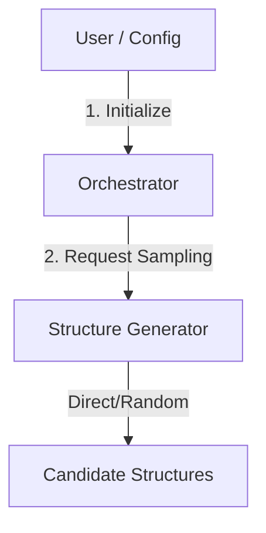

# PyAceMaker

**Automated Machine Learning Interatomic Potential Generation Pipeline**

> **Minimal DFT Cost. Maximum ACE Accuracy.**


## Overview

**PyAceMaker** is a state-of-the-art framework designed to automate the construction of high-accuracy Machine Learning Interatomic Potentials (MLIPs). By leveraging **Knowledge Distillation** from large foundation models (MACE), PyAceMaker drastically reduces the number of expensive DFT calculations required to train a robust potential.

The system orchestrates a 7-step workflow that starts from zero knowledge, explores the chemical space using uncertainty-driven active learning, creates a massive surrogate dataset via MACE-driven MD, and finally distills this knowledge into a fast, lightweight ACE (Atomic Cluster Expansion) potential with Delta Learning corrections.

## Key Features

*   **Foundation Model Distillation**: Uses pre-trained MACE models as a "Surrogate Oracle" to guide exploration.
*   **Direct Sampling**: Robust random structure generation with hard-sphere constraints to initiate the active learning loop (Cycle 01).
*   **Uncertainty-Based Active Learning**: Automatically identifies and calculates only the most informative structures.
*   **Delta Learning**: Fine-tunes the final ACE potential on sparse DFT data.
*   **Zero-Config Automation**: Run end-to-end with a validated YAML configuration file.
*   **Resilient Orchestration**: Supports state persistence and job resumption.

## Prerequisites

*   **Python**: 3.12 or higher
*   **Package Manager**: `uv` (Recommended) or `pip`
*   **Dependencies**: `mace-torch`, `pacemaker`, `ase`, `numpy`, `torch`

## Installation

1.  **Clone the repository**:
    ```bash
    git clone https://github.com/your-org/pyacemaker.git
    cd pyacemaker
    ```

2.  **Install dependencies**:
    We use `uv` for fast, reliable dependency management.
    ```bash
    uv sync
    ```

3.  **Activate the environment**:
    ```bash
    source .venv/bin/activate
    ```

## Usage

### 1. Initialization

Initialize a new project workspace. This creates the necessary directory structure and state files.

```bash
pyacemaker init --config config.yaml
```

### 2. Run Workflow Steps

Execute specific steps of the pipeline.

**Step 1: Direct Sampling**
Generates initial candidate structures (Random Packing).

```bash
pyacemaker run --step 1 --config config.yaml
```

### Example Configuration (`config.yaml`)

```yaml
project_name: "Si_Testing"
structure:
  elements: ["Si"]
  supercell_size: [2, 2, 2]
  num_structures: 10
  r_cut: 2.0
workflow:
  max_iterations: 5
  data_dir: "./data"
  potentials_dir: "./potentials"
  active_learning_dir: "./active_learning"
logging:
  level: "INFO"
# ... (see config.py for full schema)
```

## Architecture

PyAceMaker follows a "Hub-and-Spoke" architecture centered around an `Orchestrator`.



## Project Structure

```text
pyacemaker/
├── config.yaml                 # Default configuration
├── pyproject.toml              # Dependencies and Tool Config
├── src/
│   └── pyacemaker/
│       ├── main.py             # CLI Entry point
│       ├── orchestrator.py     # Main workflow controller
│       ├── domain_models/      # Pydantic Data Models (Config, State, Data)
│       ├── structure_generator/# Sampling Logic (DirectSampler)
│       └── ...
└── tests/                      # Unit and Integration Tests
```

## License

MIT License.
