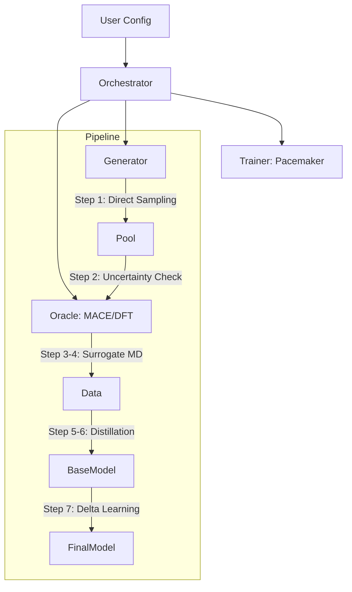

# PyAceMaker

**Adaptive Machine Learning Interatomic Potentials via MACE Knowledge Distillation**

[]()
[](https://opensource.org/licenses/MIT)
[](https://www.python.org/downloads/release/python-3110/)

## Overview
**PyAceMaker** is an automated pipeline for constructing production-ready Machine Learning Interatomic Potentials (MLIPs). It solves the "data gap" problem by using a large-scale foundation model (MACE-MP-0) as a knowledgeable surrogate. Instead of blindly running thousands of expensive DFT calculations, PyAceMaker intelligently samples the configuration space, distills knowledge from MACE, and applies a final "Delta Learning" correction to achieve DFT-level accuracy with a fraction of the cost.

## Key Features
*   **MACE Knowledge Distillation:** Leverage the power of pre-trained foundation models to guide potential generation.
*   **Active Learning:** Automatically identifies and labels only the most informative structures (High Uncertainty).
*   **Delta Learning:** Corrects systematic errors in the surrogate model using sparse DFT data.
*   **Fully Automated:** From initial structure to final `.yace` file in one command.
*   **HPC Ready:** Designed for scalability on Slurm/PBS clusters.

## Architecture



## Prerequisites
*   **Python 3.11+**
*   **uv** (Recommended for dependency management)
*   **LAMMPS** (Optional, for MD validation)
*   **VASP/QuantumEspresso** (Optional, for Real Mode DFT calculations)

## Installation

```bash
# 1. Clone the repository
git clone https://github.com/your-org/pyacemaker.git
cd pyacemaker

# 2. Install dependencies using uv
uv sync

# 3. Activate the environment
source .venv/bin/activate
```

## Usage

### Quick Start (Mock Mode)
To test the pipeline without external DFT codes or GPUs, use the Mock Mode. This runs the full logic using internal surrogate potentials.

```bash
# Run the tutorial script
export PYACEMAKER_MODE=MOCK
uv run pyacemaker run --config examples/sn2_reaction.yaml
```

### Production Run
For scientific production, configure your `config.yaml` with valid DFT settings.

```bash
# Run the full pipeline
uv run pyacemaker run --config my_system_config.yaml
```

## Development Workflow

We use a strict cycle-based development process.

### Running Tests
```bash
uv run pytest
```

### Linting
```bash
uv run ruff check .
uv run mypy .
```

## Project Structure
```text
.
├── src/pyacemaker/       # Source code
├── tests/                # Unit and Integration tests
├── dev_documents/        # System specifications and plans
├── tutorials/            # Interactive Marimo notebooks
└── pyproject.toml        # Project configuration
```

## License
MIT License
