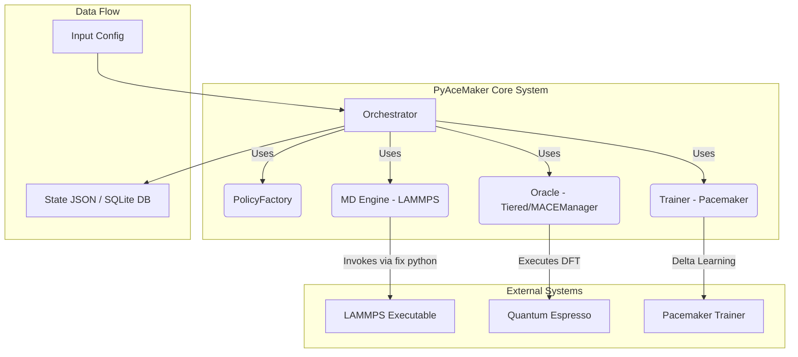

# PyAceMaker


**NextGen Hierarchical Distillation Architecture for MLIP Construction.**

## Overview

**PyAceMaker** is an automated workflow tool designed to construct robust Machine Learning Interatomic Potentials (MLIPs). Version 2.1.0 introduces the **NextGen Hierarchical Distillation Architecture with FLARE Best Practices**. It orchestrates the entire active learning loop, solving continuity, thermal noise, and scaling challenges in Molecular Dynamics (MD) simulations.

By leveraging "Master-Slave Inversion," "Intelligent Cutout & Passivation," and a foundation model (MACE), PyAceMaker minimizes high-cost DFT calculation attempts while achieving DFT-level accuracy for large-scale HPC workloads.

## Key Features

*   **Asynchronous Master-Slave MD (Seamless Resume):** LAMMPS calls Python directly (via `fix python/invoke`). This prevents breaking time continuity during halts, allowing the simulation to pause, update potentials, and resume seamlessly without rewinding.
*   **Two-Tier Uncertainty Evaluation:** Distinguishes between thermal noise (`threshold_call_dft`) and critical physical anomalies (`threshold_add_train`). This eliminates false positive halts caused by instantaneous temperature spikes.
*   **Intelligent Cutout & Auto-Passivation:** Extracts problem regions securely, freezes core atoms, relaxes buffer regions via MACE, and passivates dangling bonds (e.g., adding Hydrogen) before passing to DFT, avoiding dipole divergences and failed SCF loops.
*   **Hierarchical Distillation & Incremental Updates:** Combines foundation models (MACE-MP-0) and fast ACE training. Updates happen via delta learning with replay buffers to prevent catastrophic forgetting, keeping computation at $O(1)$.
*   **Robust Checkpointing:** Features highly granular SQLite/JSON state management and automated artifact cleanup (`.wfc`, dumps) tailored for HPC environments, easily recovering from wall-time kills.

## Architecture Overview

PyAceMaker utilizes a closed-loop system encompassing generation, MD simulation, intelligent extraction, Oracle evaluation, and MLIP training.


```mermaid
graph TD
    subgraph PyAceMaker Core System
        A[Orchestrator] -->|Uses| B(PolicyFactory)
        A -->|Uses| C(Trainer - Pacemaker)
        A -->|Uses| D(MD Engine - LAMMPS)
        A -->|Uses| E(Oracle - Tiered/MACEManager)
    end

    subgraph External Systems
        D -->|Invokes via fix python| F[LAMMPS Executable]
        E -->|Executes DFT| G[Quantum Espresso]
        C -->|Delta Learning| H[Pacemaker Trainer]
    end

    subgraph Data Flow
        I[Input Config] --> A
        A --> J[State JSON / SQLite DB]
    end
```

## Prerequisites

*   **Python**: >= 3.11
*   **Dependency Manager**: `uv`
*   **DFT Code**: Quantum Espresso (`pw.x` executable in PATH)
*   **MLIP Trainer**: Pacemaker (`pace_train`, `pace_activeset` executables in PATH)
*   **MD Engine**: LAMMPS Python Interface (`lammps` package, with `USER-PACE` support and `fix python/invoke`)
*   *(Optional)* MACE environment for foundation model inference.

## Installation & Setup

We recommend using `uv` to manage the project dependencies.

```bash
git clone https://github.com/your-org/pyacemaker.git
cd pyacemaker
uv sync
```

## Features Validated

*   **Pydantic Workflow Validation**: Robust models (e.g. `MDConfig`, `WorkflowConfig`) rigorously define input types to reject unphysical parameters early.
*   **Flexible Generator Policies**: Object-oriented exploration policies correctly yield single or complex sets of perturbed atomic structures.
*   **DFT Wrapper Resiliency**: Transient physical failures inside the Quantum Espresso `Oracle` will securely iterate over reduction/smearing strategies before gracefully bubbling errors.
*   **Streaming & Memory Caching Safety**: Large iterator operations appropriately manage O(1) structures while avoiding internal `lru_cache` memory leaks on classes.

## Usage

### Quick Start
To run the PyAceMaker orchestrator using a predefined configuration:

```bash
# Dry run to validate configuration
uv run pyacemaker --config config.yaml --dry-run

# Start the full 4-stage Hierarchical Distillation Workflow
uv run pyacemaker --config config.yaml
```

### Tutorials & User Acceptance Testing (UAT)
PyAceMaker uses `marimo` for interactive tutorials and acceptance testing.
To verify the system functionality or run tutorials:

```bash
uv run marimo run tutorials/UAT_AND_TUTORIAL.py
```

*Note: The tutorial supports a "Mock Mode" for testing without requiring a GPU or active QE/LAMMPS installation.*

## Development Workflow

This project enforces strict code quality standards using `ruff` and `mypy`.
Development occurs in structured Implementation Cycles (Cycle 01 - 05).

**Running Linters and Tests:**
```bash
# Code Quality (Ruff)
uv run ruff check .

# Type Checking (Mypy)
uv run mypy src/ tests/

# Testing (Pytest with Coverage)
uv run pytest tests/
```

## Project Structure

```text
src/pyacemaker/
├── core/               # Core business logic (Engine, Oracle, Trainer)
├── domain_models/      # Pydantic data schemas (Config, Workflow)
├── interfaces/         # External code drivers (QE, LAMMPS)
├── scenarios/          # Specialized production workflows
├── utils/              # Helper functions (Intelligent Extraction)
├── factory.py          # Dependency injection
├── orchestrator.py     # Workflow state machine
└── main.py             # CLI entry point
tests/                  # Unit and integration tests
tutorials/              # Interactive marimo notebooks & UAT
dev_documents/          # Architecture definitions and PRDs
```

## License

MIT License. See `LICENSE` for more information.
