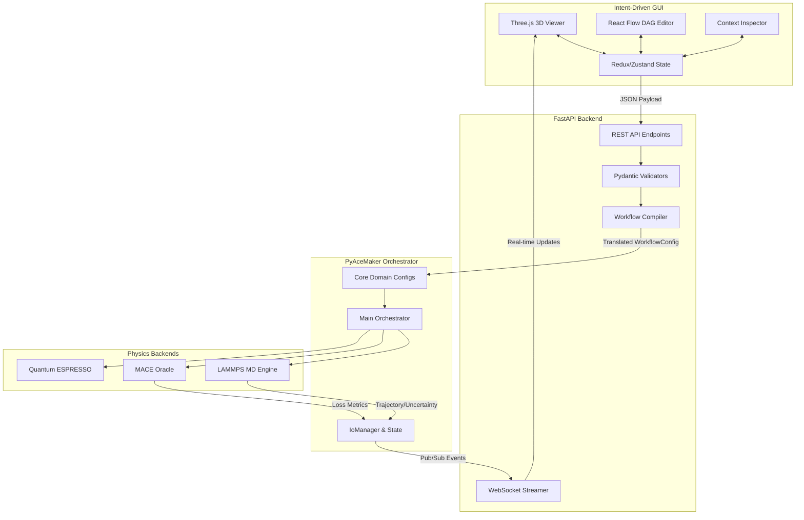

# PyAceMaker


**Next-Generation Adaptive Machine Learning Interatomic Potentials Orchestrator & GUI Platform.**

PyAceMaker entirely revolutionizes active learning for molecular dynamics. By employing a "Hierarchical Distillation" architecture featuring foundation models like MACE and highly accurate DFT computations via Quantum ESPRESSO, it solves the critical challenges of long-timescale molecular dynamics simulations.
With the introduction of the new Intent-Driven Graphical User Interface (GUI), PyAceMaker now completely abstracts complex Python/LAMMPS configurations into an intuitive, visual 3D platform, empowering non-expert engineers and experimental researchers to perform advanced materials simulations with zero manual scripting.

## Key Features

*   **Intent-Driven Visual GUI:** Construct highly complex Directed Acyclic Graph (DAG) active learning workflows and spatial tagging configurations entirely visually, completely eliminating the need for complex CUI scripting.
*   **Zero-Shot Distillation:** Generate incredibly robust baseline interatomic potentials using combinatorial structures and MACE foundation models strictly without any initial, expensive DFT calls.
*   **Two-Tier Uncertainty Thresholding:** Intelligently differentiates entirely between harmless transient thermal noise and true physical events via `TwoTierEvaluator`, completely avoiding unnecessary simulation pauses.
*   **Intelligent Cutout & Auto-Passivation:** Safely, mathematically extracts the precise epicenter of uncertainty and automatically passivates highly dangerous dangling bonds (e.g., smoothly adding fractional hydrogen) ensuring safe and remarkably reliable DFT calculations.
*   **Seamless MD Resume:** Features a robust Master-Slave inversion mechanism absolutely allowing the LAMMPS C++ engine to resume exactly, seamlessly from the halted step (perfectly preserving time, continuous coordinates, and momentum) rather than destructively resetting the entire MD loop.
*   **Incremental Delta Learning:** Intelligently mixes entirely newly generated AI surrogate data with a highly managed historical replay buffer of past interactions exactly to rapidly mathematically update potentials, fully mitigating O(N) computational bottlenecks and permanently preventing catastrophic forgetting.

## Architecture Overview

PyAceMaker employs an advanced state-machine driven orchestration model strictly using modern software design patterns. It integrates a foundational MACE AI oracle directly alongside Quantum ESPRESSO entirely to filter deep uncertainty, rigorously validating learned structural configurations strictly across several phases completely from local foundation fine-tuning entirely up to full scale, O(1) complex continuous MD resumption. The new FastAPI gateway layer ensures a strict separation of concerns, safely translating abstract visual intents into the powerful core configurations.


```mermaid
graph TD
    %% Frontend Components
    subgraph Frontend [Intent-Driven GUI]
        UI_3D[Three.js 3D Viewer]
        UI_DAG[React Flow DAG Editor]
        UI_INSP[Context Inspector]
        UI_STATE[Redux/Zustand State]
    end

    %% API Gateway Layer
    subgraph Gateway [FastAPI Backend]
        API_REST[REST API Endpoints]
        API_WS[WebSocket Streamer]
        API_VAL[Pydantic Validators]
        API_COMP[Workflow Compiler]
    end

    %% PyAceMaker Core (Existing & Additive)
    subgraph CoreEngine [PyAceMaker Orchestrator]
        CORE_ORCH[Main Orchestrator]
        CORE_CFG[Core Domain Configs]
        CORE_IO[IoManager & State]
    end

    %% Computational Backends
    subgraph Physics Backends
        BACK_LAMMPS[LAMMPS MD Engine]
        BACK_MACE[MACE Oracle]
        BACK_DFT[Quantum ESPRESSO]
    end

    %% Data Flow
    UI_3D <--> UI_STATE
    UI_DAG <--> UI_STATE
    UI_INSP <--> UI_STATE

    UI_STATE -- JSON Payload --> API_REST
    API_REST --> API_VAL
    API_VAL --> API_COMP
    API_COMP -- Translated WorkflowConfig --> CORE_CFG

    CORE_CFG --> CORE_ORCH
    CORE_ORCH --> BACK_LAMMPS
    CORE_ORCH --> BACK_MACE
    CORE_ORCH --> BACK_DFT

    BACK_LAMMPS -- Trajectory/Uncertainty --> CORE_IO
    BACK_MACE -- Loss Metrics --> CORE_IO

    CORE_IO -- Pub/Sub Events --> API_WS
    API_WS -- Real-time Updates --> UI_3D
```

## Prerequisites

*   **Python**: 3.11+
*   **Package Manager**: `uv`
*   **DFT Code**: Quantum Espresso (`pw.x` executable strictly within PATH)
*   **MLIP Trainer**: Pacemaker (`pace_train`, `pace_activeset` executables strictly within PATH)
*   **MD Engine**: LAMMPS Python Interface (`lammps` package strictly compiled with `USER-PACE` support)
*   **Containers**: Docker (strictly optional for deployment)

## Installation & Setup

1.  Clone the repository:
    ```bash
    git clone https://github.com/pyacemaker-org/pyacemaker.git
    cd pyacemaker
    ```

2.  Sync the environment precisely utilizing `uv`:
    ```bash
    uv sync
    ```

3.  Configure your environment securely:
    ```bash
    cp .env.example .env
    ```

## Usage

PyAceMaker uses a strictly validated `config.yaml` to rigidly dictate exact execution parameters (e.g., LoopStrategy, Cutouts, Thresholds). You can actively explore the highly powerful full capabilities completely through our beautifully interactive tutorial. The system can be entirely executed visually through the new GUI gateway.

### Run Interactive Tutorial
View and safely execute the entirely immersive user test scenarios exactly within a highly interactive marimo notebook interface entirely strictly inside a highly secure Mock Mode:
```bash
uv run marimo edit tutorials/UAT_AND_TUTORIAL.py
```
Or execute strictly headlessly for CI verification:
```bash
uv run python tutorials/UAT_AND_TUTORIAL.py
```

### Production Execution
```bash
# Start the visual Intent-Driven GUI gateway backend
uv run pyacemaker gui --port 8000

# Start the continuous massive active learning loop strictly with entirely hierarchical distillation fully enabled (Legacy CLI)
uv run pyacemaker --config config.yaml
```

## Development Workflow

Our highly active continuous development workflow strictly emphasizes incredibly robust testing and exactly pristine code quality strictly utilizing modern Python linters.

*   **Run Linter & Code Formatter:**
    ```bash
    uv run ruff check .
    uv run ruff format .
    ```

*   **Run Strict Static Type Checking:**
    ```bash
    uv run mypy src/ tests/
    ```

*   **Run Automated Test Suite:**
    Execute the highly comprehensive unit, deep integration, and mocked E2E test suites precisely via `pytest` to strictly completely verify structural changes:
    ```bash
    uv run pytest
    ```

Development strictly follows an entirely planned 6-cycle implementation workflow specifically designed to carefully entirely layer complex functionality entirely without tightly coupling dependencies.

## Project Structure

```text
pyacemaker/
├── src/pyacemaker/
│   ├── api/                # [NEW] FastAPI application gateway and WebSockets
│   ├── core/               # Highly strict execution orchestration (Engine, Trainer, Oracle, Validation)
│   ├── domain_models/      # Strongly typed Pydantic data schemas and visual Semantic Compiler
│   ├── interfaces/         # Robust external compute software driver adapters (LAMMPS, QE, Pacemaker)
│   ├── scenarios/          # Extremely complex "Grand Challenge" highly specialized workflow overrides
│   ├── utils/              # Spatial algorithms for semantic tagging and exact spatial math
│   └── main.py             # Main CLI application entrypoint
├── tests/                  # Highly robust isolated test suites completely explicitly ensuring architectural compliance
└── tutorials/              # Fully interactive Marimo notebooks entirely completely proving strict UAT highly explicit capabilities
```

## License

This strictly completely robust continuous orchestration completely platform is entirely licensed specifically under the permissive MIT License.