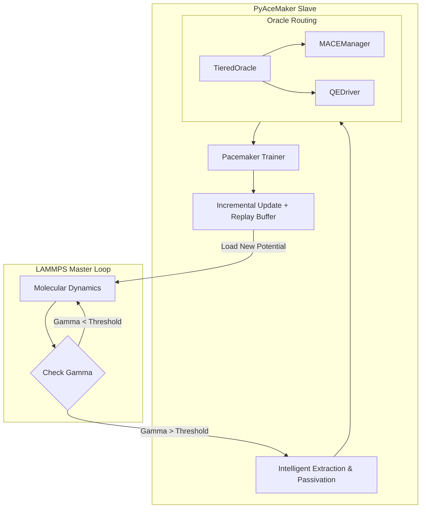

# PyAceMaker


**Next-Generation Hierarchical Distillation Architecture for Machine Learning Interatomic Potentials.**

## Overview

**PyAceMaker** (Version 2.1.0) is a cutting-edge automated workflow orchestration system designed to construct robust Machine Learning Interatomic Potentials (MLIPs). Built to overcome the limitations of traditional Active Learning loops in massive-scale Molecular Dynamics (MD), it introduces a FLARE-inspired architecture featuring Master-Slave Inversion, Two-Tier Uncertainty Evaluation, and Intelligent Cluster Extraction.

This enables researchers to perform continuous, multi-million atom MD simulations without losing physical context due to thermal noise or catastrophic structural fragmentation during training halts.

## Key Features

*   **Zero-Shot Distillation:** Generate a foundational potential using MACE-MP-0 inferences without any initial DFT calls, drastically reducing computational startup costs.
*   **Seamless MD Resume (Master-Slave Inversion):** Python is subordinated within the LAMMPS loop. This allows the system to pause MD, update the potential via Delta Learning, and seamlessly resume from the exact previous timestep, preserving time-continuity and ensemble states.
*   **Thermal Noise Resilience:** Employs a Two-Tier threshold system (`threshold_call_dft` and `threshold_add_train`) and temporal smoothing to ignore harmless thermal spikes, preventing unnecessary calculations and infinite loops.
*   **Intelligent Cluster Passivation:** When extracting highly uncertain local regions from massive periodic systems, the core is fixed, the buffer is pre-relaxed via MACE, and dangling bonds are automatically passivated. This guarantees clean SCF convergence in Quantum Espresso.
*   **Mitigation of Catastrophic Forgetting:** Replaces slow batch retraining with O(1) Incremental Delta Learning. Past weights act as initial parameters, blended with a fixed-size replay buffer to retain bulk structure knowledge.

## Architecture Overview

PyAceMaker flips the traditional control flow. Instead of Python commanding LAMMPS from the top down, the LAMMPS C++ loop acts as the Master, invoking the PyAceMaker Slave only when uncertainty thresholds are breached.


```mermaid
graph TD
    subgraph MD_Engine [LAMMPS Master Loop]
        MD[Molecular Dynamics] --> CheckUncertainty{Check Gamma}
    end

    subgraph Python_Orchestrator [PyAceMaker Slave]
        CheckUncertainty -- Gamma > Threshold --> Extract[Intelligent Extraction & Passivation]
        Extract --> Oracle[Tiered Oracle]

        subgraph Oracle [Oracle Routing]
            Tiered[TieredOracle] --> MACE[MACEManager]
            Tiered --> DFT[QEDriver]
        end

        Oracle --> Train[Pacemaker Trainer]
        Train --> Update[Incremental Update + Replay Buffer]
    end

    Update -- Load New Potential --> MD
    CheckUncertainty -- Gamma < Threshold --> MD
```

## Prerequisites

*   **Python:** >= 3.11
*   **Environment Manager:** `uv` (Recommended) or `pip`
*   **DFT Code:** Quantum Espresso (`pw.x` executable in PATH)
*   **MLIP Trainer:** Pacemaker (`pace_train`, `pace_activeset` executables in PATH)
*   **MD Engine:** LAMMPS Python Interface (`lammps` package, with `USER-PACE` and `PYTHON` support)

## Installation & Setup

1.  Clone the repository:
    ```bash
    git clone https://github.com/your-org/pyacemaker.git
    cd pyacemaker
    ```

2.  Sync dependencies using `uv`:
    ```bash
    uv sync
    ```

3.  Set up environment configuration:
    ```bash
    cp .env.example .env
    # Edit .env to set paths to MACE models, QE, and Pacemaker
    ```

## Usage

### Quick Start (Tutorial Mode)

We provide a comprehensive User Acceptance Testing (UAT) and Tutorial script utilizing `marimo`. This script runs through the Zero-Shot Distillation, Validation, and Intelligent Extraction workflows.

```bash
uv run marimo edit tutorials/UAT_AND_TUTORIAL.py
```

### Standard Execution

1.  Prepare your `config.yaml` defining your project parameters, including the new `workflow` strategies.
2.  Run PyAceMaker:

```bash
# Dry run to validate configuration schema
uv run pyacemaker --config config.yaml --dry-run

# Start the continuous Active Learning loop
uv run pyacemaker --config config.yaml
```

## Development Workflow

This project enforces strict code quality standards utilizing `ruff` and `mypy`.

*   **Run Linters:**
    ```bash
    uv run ruff check .
    uv run mypy .
    ```

*   **Run Tests:**
    Tests must be executed ensuring no side-effects occur. Use mocked drivers for unit testing.
    ```bash
    uv run pytest
    ```

### Implementation Cycles
Development is structured into 5 phases as defined in the System Architecture:
1. Core Extraction & Pre-relaxation Setup
2. Master-Slave Inversion & Two-Tier Evaluator
3. MACE Oracle Integration & Hierarchical Distillation Loop
4. Incremental Update (Delta Learning) & Seamless Resume
5. HPC Scaling & Robustness (Checkpointing)

## Project Structure

```text
src/pyacemaker/
├── core/               # Orchestrator, Generators, Tiered Oracles, and Trainers
├── domain_models/      # Strict Pydantic configuration schemas (e.g., CutoutConfig)
├── interfaces/         # External HPC Drivers (QE, LAMMPS)
└── utils/              # Stateless algorithms (Intelligent Extraction, Embedding)
```

## License

MIT License. See `LICENSE` for more information.