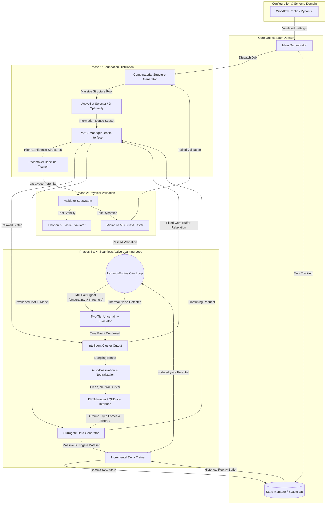

# PYACEMAKER


**Next-Generation Adaptive Machine Learning Interatomic Potentials Orchestrator.**

PyAceMaker is an advanced orchestration platform designed to automate the construction of robust Machine Learning Interatomic Potentials (MLIPs). By transitioning from traditional batch-retraining to a "Hierarchical Distillation" architecture, it solves the critical challenges of long-timescale molecular dynamics simulations. It intelligently distils general physics from foundation models (MACE) and strategically targets quantum evaluations (Quantum ESPRESSO) only when necessary, enabling the simulation of multi-million atom systems without halting due to thermal noise or suffering from catastrophic forgetting.

## Key Features

*   **Zero-Shot Distillation:** Generate robust baseline potentials using combinatorial structures and MACE foundation models without initial expensive DFT calls.
*   **Two-Tier Uncertainty Filtering:** Intelligently differentiates between harmless thermal noise and true physical events, avoiding unnecessary simulation halts and DFT evaluations.
*   **Intelligent Cutout & Auto-Passivation:** Safely extracts the epicenter of uncertainty, pre-relaxes the buffer, and automatically passivates dangling bonds (e.g., adding fractional hydrogen) to ensure safe, reliable, and electrically neutral DFT calculations.
*   **Seamless MD Resume:** Features Master-Slave inversion allowing the LAMMPS molecular dynamics engine to resume exactly from the halted step (preserving time, coordinates, and ensembles) rather than resetting the MD loop.
*   **Incremental Delta Learning:** Mixes newly generated surrogate data with a curated replay buffer of past interactions to rapidly update potentials, mitigating O(N) computational bottlenecks and preventing catastrophic forgetting.

## Architecture Overview

PyAceMaker employs a state-machine driven orchestration model using modern software design patterns. It integrates a foundational MACE oracle alongside Quantum ESPRESSO to filter uncertainty, validating learned configurations across several stages from local fine-tuning up to full scale, O(1) complex MD resumption. The entire workflow is governed by strict Pydantic schemas enforcing immutability and separating concerns.


```mermaid
graph TD
    %% Subsystems
    subgraph Config_and_Schema [Configuration & Schema Domain]
        CFG[Workflow Config / Pydantic]
    end

    subgraph Core_Orchestrator [Core Orchestrator Domain]
        ORCH[Main Orchestrator]
        STATE[(State Manager / SQLite DB)]
    end

    subgraph Phase1_Distillation [Phase 1: Foundation Distillation]
        P1_GEN[Combinatorial Structure Generator]
        P1_DIR[ActiveSet Selector / D-Optimality]
        P1_ORACLE[MACEManager Oracle Interface]
        P1_TRAIN[Pacemaker Baseline Trainer]
    end

    subgraph Phase2_Validation [Phase 2: Physical Validation]
        P2_VAL[Validator Subsystem]
        P2_PHONON[Phonon & Elastic Evaluator]
        P2_MINIMD[Miniature MD Stress Tester]
    end

    subgraph Active_Learning_Loop [Phases 3 & 4: Seamless Active Learning Loop]
        LAMMPS((LammpsEngine C++ Loop))
        EVAL[Two-Tier Uncertainty Evaluator]
        CUTOUT[Intelligent Cluster Cutout]
        PASSIVATE[Auto-Passivation & Neutralization]
        DFT[DFTManager / QEDriver Interface]
        SURR[Surrogate Data Generator]
        DELTA[Incremental Delta Trainer]
    end

    %% Phase 1 Data Flow
    CFG -->|Validated Settings| ORCH
    ORCH -->|Dispatch Job| P1_GEN
    P1_GEN -->|Massive Structure Pool| P1_DIR
    P1_DIR -->|Information-Dense Subset| P1_ORACLE
    P1_ORACLE -->|High-Confidence Structures| P1_TRAIN
    P1_TRAIN -->|base.yace Potential| P2_VAL

    %% Phase 2 Data Flow
    P2_VAL -->|Test Stability| P2_PHONON
    P2_VAL -->|Test Dynamics| P2_MINIMD
    P2_MINIMD -- Passed Validation --> LAMMPS
    P2_MINIMD -- Failed Validation --> P1_GEN

    %% Active Learning Loop Data Flow
    LAMMPS -- MD Halt Signal (Uncertainty > Threshold) --> EVAL
    EVAL -- Thermal Noise Detected --> LAMMPS
    EVAL -- True Event Confirmed --> CUTOUT
    CUTOUT -- Fixed-Core Buffer Relaxation --> P1_ORACLE
    P1_ORACLE -- Relaxed Buffer --> CUTOUT
    CUTOUT -->|Dangling Bonds| PASSIVATE
    PASSIVATE -->|Clean, Neutral Cluster| DFT
    DFT -->|Ground Truth Forces & Energy| SURR
    SURR -->|Finetuning Request| P1_ORACLE
    P1_ORACLE -- Awakened MACE Model --> SURR
    SURR -->|Massive Surrogate Dataset| DELTA
    STATE -->|Historical Replay Buffer| DELTA
    DELTA -->|updated.yace Potential| LAMMPS
    DELTA -->|Commit New State| STATE

    %% Core Dependencies
    ORCH -.->|Task Tracking| STATE
```

## Prerequisites

*   **Python**: 3.11 or higher
*   **Package Manager**: `uv`
*   **DFT Code**: Quantum ESPRESSO (`pw.x` executable accessible in PATH)
*   **MLIP Trainer**: Pacemaker (`pace_train`, `pace_activeset` executables accessible in PATH)
*   **MD Engine**: LAMMPS Python Interface (`lammps` package with `USER-PACE` support)

## Installation & Setup

We recommend using `uv` for lightning-fast dependency management and environment isolation.

```bash
# Clone the repository
git clone https://github.com/your-org/pyacemaker.git
cd pyacemaker

# Sync the environment and install dependencies using uv
uv sync
```

## Usage

PyAceMaker uses a central `config.yaml` to dictate the execution strategy (LoopStrategy, Cutouts, Thresholds).

### Run Interactive Tutorial
You can explore the full capabilities of the new architecture, including Zero-Shot Distillation and Seamless Resume, through our interactive Marimo notebook tutorial:

```bash
uv run marimo edit tutorials/UAT_AND_TUTORIAL.py
```

### Production Execution
To run the orchestration in a production HPC environment:

```bash
# Validate your configuration in dry-run mode
uv run pyacemaker --config config.yaml --dry-run

# Start the active learning hierarchical distillation loop
uv run pyacemaker --config config.yaml
```

## Development Workflow

The development of PyAceMaker follows an 8-cycle Architecture-Centric Continuous Defect Discovery (AC-CDD) methodology. Code quality is strictly enforced.

*   **Run Linter and Formatter:**
    ```bash
    uv run ruff check .
    uv run ruff format .
    ```

*   **Run Type Checking:**
    ```bash
    uv run mypy src/
    ```

*   **Run Test Suite:**
    Execute the unit, integration, and E2E test suites with `pytest`.
    ```bash
    uv run pytest tests/
    ```

## Project Structure

```text
src/pyacemaker/
├── core/               # Execution orchestration (Engine, Trainer, Oracle, Validation)
├── domain_models/      # Pydantic data schemas, workflows, and strict configuration constraints
├── interfaces/         # External compute driver adapters (LAMMPS, QE, Pacemaker)
├── scenarios/          # Complex "Grand Challenge" specialized workflow overrides
├── utils/              # Stateless helpers (Intelligent Cutout, Passivation, Embedding)
└── main.py             # CLI application entrypoint
```

## License

This project is licensed under the MIT License.
