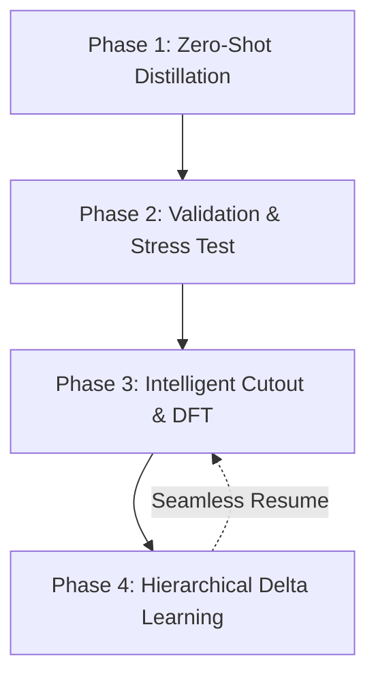

# PYACEMAKER


PYACEMAKER is an adaptive machine learning interatomic potential generator designed for High-Performance Computing (HPC) environments. It leverages a novel NextGen Hierarchical Distillation Architecture, combining foundation models (like MACE) with active learning to enable seamless, long-timescale molecular dynamics simulations of complex materials, overcoming traditional limitations like thermal noise sensitivity and catastrophic forgetting.

## Key Features

1.  **Seamless Master-Slave MD**: Inverts the control flow by having the LAMMPS C++ loop call Python. This allows the simulation to pause, update potentials, and resume without losing temporal continuity or ensemble state.
2.  **Two-Tier Uncertainty Evaluation**: Differentiates between thermal noise and genuine unknown physical configurations using dual thresholds, drastically reducing false positive halts and unnecessary Density Functional Theory (DFT) calculations.
3.  **Intelligent Cutout & Passivation**: Automatically isolates and safely extracts only the highly uncertain local atomic environments (the "epicentre") when a simulation halts, resolving surface states and dummy atoms to prevent unphysical dipole divergence during DFT processing.
4.  **Hierarchical Delta Learning**: Uses base potentials (like Lennard-Jones) and incremental updates with replay buffers to continuously train the models without recalculating everything from scratch, thereby solving catastrophic forgetting and keeping computational costs low ($O(1)$).

## Architecture Overview

PYACEMAKER orchestrates a 4-phase workflow. It starts with zero-shot distillation from foundation models to build a base potential, validates it against physical properties, and then runs MD. When the MD encounters unknown configurations, it intelligently extracts the relevant local cluster, calculates ground truth forces via DFT, and finetunes the models through hierarchical delta learning before resuming the MD seamlessly.


```mermaid
graph TD
    A[Phase 1: Zero-Shot Distillation] --> B[Phase 2: Validation & Stress Test];
    B --> C[Phase 3: Intelligent Cutout & DFT];
    C --> D[Phase 4: Hierarchical Delta Learning];
    D -.->|Seamless Resume| C;
```

## Prerequisites

*   Python 3.12+
*   `uv` (for fast Python environment and dependency management)
*   LAMMPS (compiled with Python support)
*   Quantum ESPRESSO (for DFT calculations)

## Installation & Setup

We use `uv` for managing dependencies to ensure strict reproducibility and fast environment creation.

```bash
# Clone the repository
git clone https://github.com/your-org/pyacemaker.git
cd pyacemaker

# Sync the environment and install dependencies using uv
uv sync

# Optional: set up environment variables for HPC/DFT
cp .env.example .env
```

## Usage

You can start the workflow by passing a configuration file to the main entry point:

```bash
uv run pyacemaker --config config.yaml
```

**Quick Start Tutorial:**
To verify the system's requirements and see it in action, run the user acceptance tests via Marimo:

```bash
uv run marimo edit tutorials/UAT_AND_TUTORIAL.py
```

## Development Workflow

We strictly enforce code quality, utilizing modern linters and type checkers.

*   **Run Linter**: Ensure your code meets our complexity and style guidelines.
    ```bash
    uv run ruff check .
    ```
*   **Run Type Checker**: We enforce strict type hints.
    ```bash
    uv run mypy src/ tests/
    ```
*   **Run Tests**: Execute the test suite and check coverage.
    ```bash
    uv run pytest
    ```

The development plan follows a structured, 5-cycle approach to safely extend the existing active learning loop with the NextGen features.

## Project Structure

```text
pyacemaker/
├── dev_documents/         # Architecture specifications, PRDs, UATs
├── src/                   # Source code
│   └── pyacemaker/
│       ├── core/          # Core engines, oracles, trainers, validators
│       ├── domain_models/ # Pydantic configuration schemas
│       ├── interfaces/    # External interfaces (LAMMPS, QE)
│       └── utils/         # Helpers (extraction, embedding)
├── tests/                 # Unit and integration tests
├── tutorials/             # Marimo notebooks for UAT and onboarding
├── pyproject.toml         # Project dependencies and tool configurations
└── README.md              # This file
```

## License

This project is licensed under the MIT License - see the LICENSE file for details.
