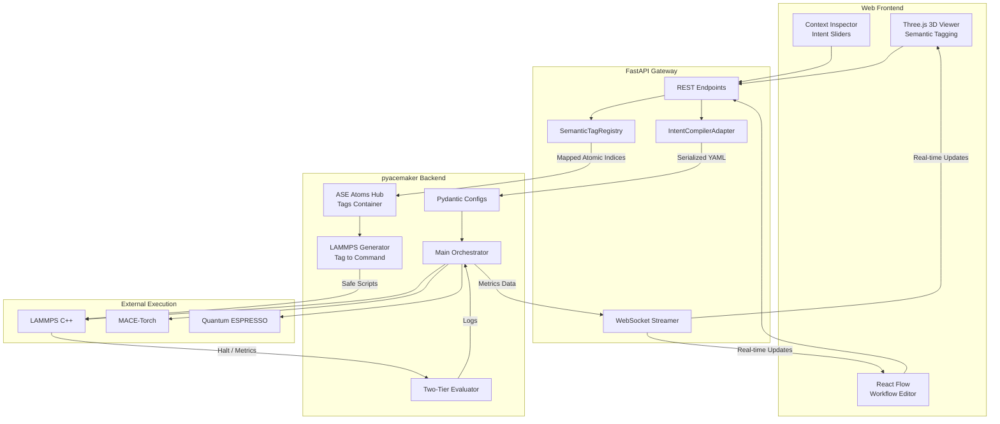

# PyAceMaker


**Next-Generation Adaptive Machine Learning Interatomic Potentials Orchestrator & GUI Platform.**

PyAceMaker fundamentally revolutionizes active learning for molecular dynamics. By employing a "Hierarchical Distillation" architecture featuring foundation models like MACE alongside highly accurate DFT computations via Quantum ESPRESSO, it solves critical challenges in long-timescale simulations. With the introduction of the new Intent-Driven GUI, PyAceMaker entirely abstracts away complex code syntaxes, empowering researchers to build incredibly complex materials workflows entirely through a visual, semantic interface via a highly robust FastAPI backend.

## Key Features

*   **Intent-Driven Visual Workflows:** A modern React/Three.js web interface allowing zero-code spatial semantic tagging (e.g., painting "Freeze" onto atoms) entirely bypassing the need to write complex text-based LAMMPS constraints.
*   **Intelligent Trade-Off Abstraction:** Eliminate manual parameter guessing. Use a single "Accuracy vs. Speed" slider, and let the backend automatically compile highly optimized non-linear configurations for MACE thresholds and DFT sampling.
*   **Run 0 Preflight Diagnostics:** Save thousands of compute hours with instant, preemptive checks that catch atomic collisions and parameter errors before long-running HPC active learning loops are even initiated.
*   **Seamless MD Resume & Active Learning:** A robust Master-Slave inversion mechanism absolutely allowing the LAMMPS C++ engine to seamlessly resume perfectly from halted steps without destructive loop resets, augmented by incremental delta learning to permanently prevent catastrophic forgetting.
*   **Zero-Shot Distillation:** Generate incredibly robust baseline interatomic potentials strictly using combinatorial structures and foundation models without expensive initial DFT calls.

## Architecture Overview

PyAceMaker strictly enforces an API-First, Client-Server architecture. High-level human intents from the modern frontend are securely translated by the Intent Compiler into strictly typed Pydantic models. These models drive the powerful Python backend, orchestrating MACE, LAMMPS, and Quantum ESPRESSO in a continuous active learning loop.


```mermaid
graph TD
    subgraph Client [Web Frontend]
        UI_3D[Three.js 3D Viewer\nSemantic Tagging]
        UI_DAG[React Flow\nWorkflow Editor]
        UI_INSP[Context Inspector\nIntent Sliders]
    end

    subgraph APILayer [FastAPI Gateway]
        API_REST[REST Endpoints]
        API_WS[WebSocket Streamer]
        COMPILER[IntentCompilerAdapter]
        TAG_REGISTRY[SemanticTagRegistry]
    end

    subgraph CoreEngine [pyacemaker Backend]
        CFG[Pydantic Configs]
        ASE[ASE Atoms Hub\nTags Container]
        LAMMPS_GEN[LAMMPS Generator\nTag to Command]
        ORCH[Main Orchestrator]
        EVAL[Two-Tier Evaluator]
    end

    subgraph Drivers [External Execution]
        LAMMPS[LAMMPS C++]
        MACE[MACE-Torch]
        QE[Quantum ESPRESSO]
    end

    %% Flow UI to API
    UI_DAG --> API_REST
    UI_INSP --> API_REST
    UI_3D --> API_REST

    %% API to Core
    API_REST --> COMPILER
    API_REST --> TAG_REGISTRY
    COMPILER -- Serialized YAML --> CFG
    TAG_REGISTRY -- Mapped Atomic Indices --> ASE

    %% Core to Drivers
    CFG --> ORCH
    ASE --> LAMMPS_GEN
    LAMMPS_GEN -- Safe Scripts --> LAMMPS
    ORCH --> LAMMPS
    ORCH --> MACE
    ORCH --> QE

    %% Telemetry Flow
    LAMMPS -- Halt / Metrics --> EVAL
    EVAL -- Logs --> ORCH
    ORCH -- Metrics Data --> API_WS
    API_WS -- Real-time Updates --> UI_3D
    API_WS -- Real-time Updates --> UI_DAG
```

## Prerequisites

*   **Python**: 3.11+
*   **Package Manager**: `uv`
*   **DFT Code**: Quantum Espresso (`pw.x` executable strictly within PATH)
*   **MLIP Trainer**: Pacemaker (`pace_train`, `pace_activeset` executables strictly within PATH)
*   **MD Engine**: LAMMPS Python Interface (`lammps` package strictly compiled with `USER-PACE` support)

## Installation & Setup

1.  Clone the repository:
    ```bash
    git clone https://github.com/pyacemaker-org/pyacemaker.git
    cd pyacemaker
    ```

2.  Sync the environment precisely utilizing `uv`:
    ```bash
    uv sync
    ```

3.  Configure your environment securely:
    ```bash
    cp .env.example .env
    ```

## Usage

PyAceMaker allows both traditional robust CLI execution via strictly validated YAML files, and entirely immersive interactive user exploration.

### Run Interactive Tutorial (UAT Validation)
Experience the power of Semantic Tagging and Intent Compilation strictly within a highly secure Mock Mode environment using our interactive Marimo notebook:
```bash
uv run marimo edit tutorials/UAT_AND_TUTORIAL.py
```
Or execute it completely headlessly for continuous integration testing:
```bash
uv run python tutorials/UAT_AND_TUTORIAL.py
```

### Production Execution
```bash
# Validate your highly complex configuration completely safely in dry-run mode (Run 0 Check)
uv run pyacemaker --config config.yaml --dry-run

# Start the continuous massive active learning loop strictly with GUI-generated configurations
uv run pyacemaker --config config.yaml
```

## Development Workflow

Our highly active continuous development workflow strictly emphasizes incredibly robust testing and exactly pristine code quality strictly utilizing modern Python linters. Development strictly follows a 6-cycle implementation plan clearly defined in our architecture documentation.

*   **Run Linter & Code Formatter:**
    ```bash
    uv run ruff check .
    uv run ruff format .
    ```

*   **Run Strict Static Type Checking:**
    ```bash
    uv run mypy src/ tests/
    ```

*   **Run Automated Test Suite:**
    Execute the highly comprehensive unit, deep integration, and mocked E2E test suites precisely via `pytest` to completely verify architectural compliance:
    ```bash
    uv run pytest
    ```

## Project Structure

```text
pyacemaker/
├── src/pyacemaker/
│   ├── api/                   # FastAPI Gateway & WebSocket Telemetry
│   ├── compilers/             # Intent Compilers & Semantic Translators
│   ├── core/                  # Highly strict execution orchestration (Engine, Trainer, Oracle)
│   ├── domain_models/         # Strongly typed Pydantic data schemas & GUI Intents
│   ├── interfaces/            # Robust external compute drivers (LAMMPS, QE)
│   └── main.py                # Main CLI entrypoint
├── tests/                     # Highly robust isolated test suites
└── tutorials/                 # Fully interactive Marimo notebooks proving UX
```

## License

This platform is licensed completely under the permissive MIT License.
