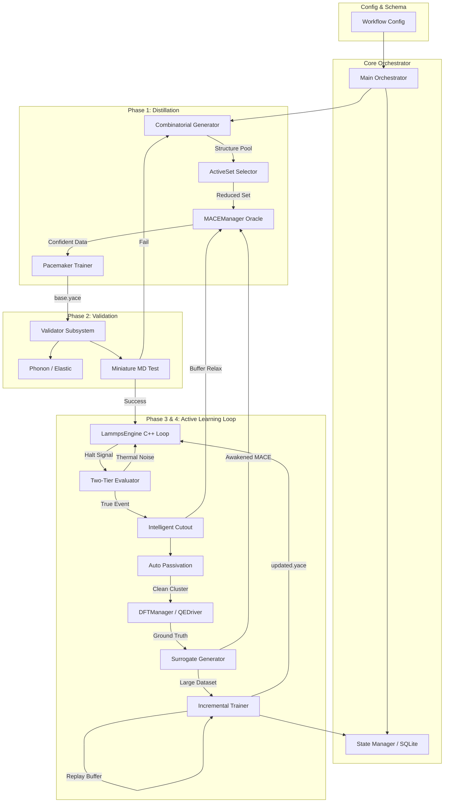

# PyAceMaker


**Next-Generation Adaptive Machine Learning Interatomic Potentials Orchestrator.**

## Overview

**PyAceMaker** is an advanced orchestration platform designed to automate the construction of robust Machine Learning Interatomic Potentials (MLIPs). It orchestrates the entire active learning loop with a "Hierarchical Distillation" architecture to solve the critical challenges of long-timescale molecular dynamics simulations. PyAceMaker seamlessly pauses MD without losing time-continuity, repairs extracted clusters by auto-passivating dangling bonds, filters thermal noise using a two-tier uncertainty system, and incrementally updates potentials to prevent catastrophic forgetting.

## Key Features

*   **Zero-Shot Distillation:** Generate robust baseline potentials using combinatorial structures and MACE foundation models without initial expensive DFT calls.
*   **Two-Tier Uncertainty Thresholding:** Differentiates between harmless thermal noise and true physical events, avoiding unnecessary pauses.
*   **Intelligent Cutout & Auto-Passivation:** Safely extracts the epicenter of uncertainty and automatically passivates dangling bonds (e.g., adding fractional hydrogen) ensuring safe and reliable DFT calculations.
*   **Seamless MD Resume:** Features Master-Slave inversion allowing LAMMPS to resume exactly from the halted step (preserving time, coordinates, and velocities) rather than resetting the MD loop.
*   **Incremental Delta Learning:** Mixes newly generated surrogate data with a replay buffer of past interactions to rapidly update potentials, mitigating O(N) computational bottlenecks and catastrophic forgetting.

## Architecture Overview

PyAceMaker employs a state-machine driven orchestration model using modern software design patterns. It integrates a foundational MACE oracle alongside Quantum Espresso to filter uncertainty, validating learned configurations across several stages from local fine-tuning up to full scale, O(1) complex MD resumption.


```mermaid
graph TD
    %% Subsystems
    subgraph Config & Schema
        CFG[Workflow Config]
    end

    subgraph Core Orchestrator
        ORCH[Main Orchestrator]
        STATE[State Manager / SQLite]
    end

    subgraph Phase 1: Distillation
        P1_GEN[Combinatorial Generator]
        P1_DIR[ActiveSet Selector]
        P1_ORACLE[MACEManager Oracle]
        P1_TRAIN[Pacemaker Trainer]
    end

    subgraph Phase 2: Validation
        P2_VAL[Validator Subsystem]
        P2_PHONON[Phonon / Elastic]
        P2_MINIMD[Miniature MD Test]
    end

    subgraph Phase 3 & 4: Active Learning Loop
        LAMMPS[LammpsEngine C++ Loop]
        EVAL[Two-Tier Evaluator]
        CUTOUT[Intelligent Cutout]
        PASSIVATE[Auto Passivation]
        DFT[DFTManager / QEDriver]
        SURR[Surrogate Generator]
        DELTA[Incremental Trainer]
    end

    %% Flow Phase 1
    CFG --> ORCH
    ORCH --> P1_GEN
    P1_GEN -- Structure Pool --> P1_DIR
    P1_DIR -- Reduced Set --> P1_ORACLE
    P1_ORACLE -- Confident Data --> P1_TRAIN
    P1_TRAIN -- base.yace --> P2_VAL

    %% Flow Phase 2
    P2_VAL --> P2_PHONON
    P2_VAL --> P2_MINIMD
    P2_MINIMD -- Success --> LAMMPS
    P2_MINIMD -- Fail --> P1_GEN

    %% Flow Phase 3 & 4
    LAMMPS -- Halt Signal --> EVAL
    EVAL -- Thermal Noise --> LAMMPS
    EVAL -- True Event --> CUTOUT
    CUTOUT -- Buffer Relax --> P1_ORACLE
    CUTOUT --> PASSIVATE
    PASSIVATE -- Clean Cluster --> DFT
    DFT -- Ground Truth --> SURR
    SURR -- Awakened MACE --> P1_ORACLE
    SURR -- Large Dataset --> DELTA
    DELTA -- Replay Buffer --> DELTA
    DELTA -- updated.yace --> LAMMPS

    %% Storage
    ORCH --> STATE
    DELTA --> STATE
```

## Prerequisites

*   **Python**: >= 3.11
*   **Package Manager**: `uv`
*   **DFT Code**: Quantum Espresso (`pw.x` executable in PATH)
*   **MLIP Trainer**: Pacemaker (`pace_train`, `pace_activeset` executables in PATH)
*   **MD Engine**: LAMMPS Python Interface (`lammps` package, with `USER-PACE` support)

## Installation & Setup

1. Clone the repository and navigate to the project directory:
   ```bash
   git clone https://github.com/your-org/pyacemaker.git
   cd pyacemaker
   ```

2. Sync dependencies using `uv`:
   ```bash
   uv sync
   ```

3. Setup environment and configuration:
   ```bash
   cp .env.example .env
   # Ensure Quantum Espresso and Pacemaker binaries are accessible via PATH.
   ```

## Usage

Define your system configurations using `config.yaml` to specify your `LoopStrategyConfig`, `CutoutConfig`, and `ActiveLearningThresholds`.

**Quick Start Example:**
```bash
# Validate your configuration in dry-run mode
uv run pyacemaker --config config.yaml --dry-run

# Start the active learning loop with hierarchical distillation enabled
uv run pyacemaker --config config.yaml
```

## Development Workflow

The project is structured through sequential Implementation Cycles. Active development emphasizes robust testing and code quality:

*   **Run Linter/Formatter:**
    ```bash
    uv run ruff check .
    ```

*   **Run Type Checking:**
    ```bash
    uv run mypy src/ tests/
    ```

*   **Run Tests:**
    Execute the unit, integration, and E2E test suites with `pytest`.
    ```bash
    uv run pytest
    ```

## Project Structure

```text
src/pyacemaker/
├── core/               # Execution orchestration (Engine, Trainer, Oracle, Validation)
├── domain_models/      # Pydantic data schemas, workflows, and strict configuration constraints
├── interfaces/         # External compute driver adapters (LAMMPS, QE, Pacemaker)
├── scenarios/          # Complex "Grand Challenge" specialized workflow overrides
├── utils/              # Tools for cluster extraction, passivation, geometry embeddings
└── main.py             # CLI application entrypoint
```

## License

This project is licensed under the MIT License.
