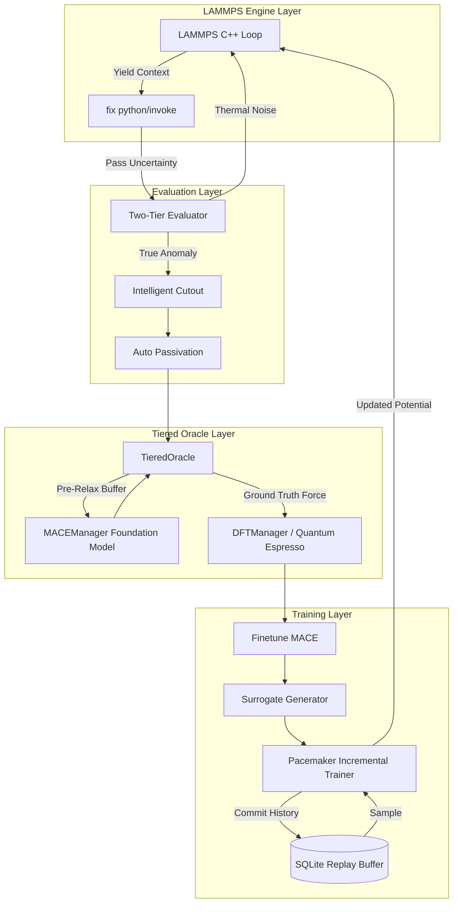

# PyAceMaker


**Next-Generation Adaptive Machine Learning Interatomic Potentials Orchestrator.**

## 1. Overview

**PyAceMaker** is an advanced orchestration platform designed to automate the construction of robust Machine Learning Interatomic Potentials (MLIPs). It orchestrates the entire active learning loop with a "Hierarchical Distillation" architecture to solve the critical challenges of long-timescale molecular dynamics simulations. By seamlessly pausing MD without losing time-continuity, intelligently extracting and passivating clusters, and employing O(1) incremental delta learning, PyAceMaker allows massive scale HPC simulations to overcome catastrophic forgetting and quantum divergence.

## 2. Key Features

*   **Zero-Shot Baseline Distillation:** Automatically generate foundational baseline potentials from a combinatorial structure pool using base foundation models like MACE, drastically reducing initial DFT cost.
*   **Two-Tier Uncertainty Thresholding:** Differentiates between harmless thermal noise and true physical events, avoiding unnecessary pauses and retraining cycles.
*   **Intelligent Cutout & Auto-Passivation:** Safely extracts the epicenter of uncertainty and automatically passivates dangling bonds (e.g., adding fractional hydrogen) and pre-relaxes the buffer zone to ensure safe and reliable DFT calculations.
*   **Seamless MD Resume via Master-Slave Inversion:** LAMMPS retains internal state memory when uncertainty hits, allowing simulations to resume exactly from the halted step (preserving time, coordinates, and velocities) rather than resetting the MD loop.
*   **Incremental Delta Learning:** Mitigates O(N) computational bottlenecks and catastrophic forgetting by mixing newly generated surrogate data with a localized replay buffer to rapidly update potentials.

## 3. Architecture Overview

PyAceMaker employs a state-machine driven orchestration model using modern software design patterns. It strictly decouples the MD engine, uncertainty evaluators, tiered oracles (MACE and DFT), and incremental trainers to ensure maximum scalability and parallelization.


```mermaid
graph TD
    subgraph LAMMPS Engine Layer
        MD[LAMMPS C++ Loop]
        INVOKE[fix python/invoke]
        MD -->|Yield Context| INVOKE
    end

    subgraph Evaluation Layer
        EVAL[Two-Tier Evaluator]
        CUTOUT[Intelligent Cutout]
        PASSIVATE[Auto Passivation]
        INVOKE -->|Pass Uncertainty| EVAL
        EVAL -->|Thermal Noise| MD
        EVAL -->|True Anomaly| CUTOUT
        CUTOUT --> PASSIVATE
    end

    subgraph Tiered Oracle Layer
        ORACLE[TieredOracle]
        MACE[MACEManager Foundation Model]
        DFT[DFTManager / Quantum Espresso]
        PASSIVATE --> ORACLE
        ORACLE -->|Pre-Relax Buffer| MACE
        MACE --> ORACLE
        ORACLE -->|Ground Truth Force| DFT
    end

    subgraph Training Layer
        AWAKEN[Finetune MACE]
        SURR[Surrogate Generator]
        TRAIN[Pacemaker Incremental Trainer]
        DB[(SQLite Replay Buffer)]

        DFT --> AWAKEN
        AWAKEN --> SURR
        SURR --> TRAIN
        DB -->|Sample| TRAIN
        TRAIN -->|Updated Potential| MD
        TRAIN -->|Commit History| DB
    end
```

## 4. Requirements

*   **Python**: 3.11+
*   **Package Manager**: `uv`
*   **DFT Code**: Quantum Espresso (`pw.x` executable in PATH)
*   **MLIP Trainer**: Pacemaker (`pace_train`, `pace_activeset` executables in PATH)
*   **MD Engine**: LAMMPS Python Interface (`lammps` package, with `USER-PACE` support)

## 5. Installation & Setup

```bash
git clone https://github.com/your-org/pyacemaker.git
cd pyacemaker
uv sync
```

## 6. Usage

PyAceMaker uses strict `config.yaml` Pydantic schemas to dictate execution.

### Run Interactive Tutorial
View and execute the user scenarios in a notebook interface:
```bash
uv run python tutorials/UAT_AND_TUTORIAL.py
```

### Production Execution
```bash
# Validate your configuration in dry-run mode
uv run pyacemaker --config config.yaml --dry-run

# Start the active learning loop with hierarchical distillation enabled
uv run pyacemaker --config config.yaml
```

## 7. Development Workflow

Active development follows a strictly phased 6-cycle approach emphasizing robust testing and code quality:

*   **Run Linter/Formatter:**
    ```bash
    uv run ruff check .
    uv run ruff format .
    ```

*   **Run Type Checking:**
    ```bash
    uv run mypy src/ tests/
    ```

*   **Run Tests:**
    Execute the unit, integration, and E2E test suites with `pytest`.
    ```bash
    uv run pytest tests/
    ```

## 8. Project Structure

```text
src/pyacemaker/
├── core/               # Execution orchestration (Engine, Trainer, Oracle, Evaluation)
├── domain_models/      # Pydantic data schemas and active learning configuration constraints
├── interfaces/         # External compute driver adapters (LAMMPS, QE, Pacemaker, MACE)
├── utils/              # Tools for intelligent cluster extraction, passivation, geometry embeddings
└── main.py             # CLI application entrypoint
```

## 9. License

This project is licensed under the MIT License.
