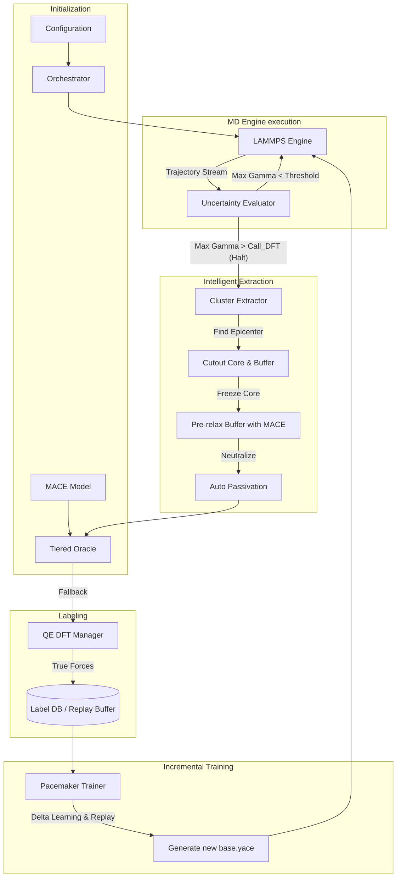

# PyAceMaker


**Adaptive Machine Learning Interatomic Potentials Construction Orchestrator.**

PyAceMaker is an automated, HPC-ready workflow tool that constructs robust Machine Learning Interatomic Potentials (MLIPs) with near-DFT accuracy at a fraction of the cost. By intelligently integrating Molecular Dynamics (MD) with Active Learning, it identifies physical scenarios where the current potential is uncertain, locally extracts and repairs those atomic environments, and incrementally fine-tunes the potential using foundation models (like MACE) and Density Functional Theory (DFT).

## Key Features

*   **Seamless MD Continuity (Master-Slave Inversion):** Pauses LAMMPS during high uncertainty, updates the potential in the background, and resumes without losing atomic coordinates or velocities—enabling the simulation of long-timescale phenomena like diffusion and phase changes.
*   **Intelligent Extraction & Auto-Passivation:** Automatically cuts out the "epicenter" of an uncertain atomic region, freezes the core, pre-relaxes the boundary using MACE, and passivates dangling bonds with dummy atoms (like H) to prevent physical divergence before calling DFT.
*   **Two-Tier Noise Filtering:** Employs distinct uncertainty thresholds to distinguish between physically safe thermal noise and genuinely unknown atomic configurations, drastically reducing false-positive calculation halts.
*   **Incremental Delta Learning:** Prevents catastrophic forgetting and maintains O(1) computational training costs by mixing a historical replay buffer with new surrogate data, fitting the ACE potential to the difference from a baseline Lennard-Jones (LJ) potential.
*   **Zero-Shot Baseline Construction:** Generates physically reasonable initial potentials without a single DFT call by utilizing foundation models to explore combinatorial phase spaces and extract high-confidence data points.

## Architecture Overview

PyAceMaker acts as a central Orchestrator that strictly separates Engine execution, Oracle validation, and Model training to ensure robust boundary management and data isolation.


```mermaid
graph TD
    subgraph Initialization
        Config[Configuration] --> Orch[Orchestrator]
        MACE[MACE Model] --> Oracle[Tiered Oracle]
    end

    subgraph MD Engine execution
        Orch --> Engine[LAMMPS Engine]
        Engine -- Trajectory Stream --> Evaluator[Uncertainty Evaluator]
        Evaluator -- "Max Gamma < Threshold" --> Engine
    end

    subgraph Intelligent Extraction
        Evaluator -- "Max Gamma > Call_DFT (Halt)" --> Extractor[Cluster Extractor]
        Extractor -- "Find Epicenter" --> Sphere[Cutout Core & Buffer]
        Sphere -- "Freeze Core" --> PreRelax[Pre-relax Buffer with MACE]
        PreRelax -- "Neutralize" --> Passivate[Auto Passivation]
    end

    subgraph Labeling
        Passivate --> Oracle
        Oracle -- "Fallback" --> DFT[QE DFT Manager]
        DFT -- "True Forces" --> LabelStore[(Label DB / Replay Buffer)]
    end

    subgraph Incremental Training
        LabelStore --> Trainer[Pacemaker Trainer]
        Trainer -- "Delta Learning & Replay" --> UpdateYace[Generate new base.yace]
        UpdateYace --> Engine
    end
```

## Prerequisites

*   **Python:** >= 3.11
*   **Package Manager:** `uv` (recommended for dependency resolution and execution)
*   **DFT Code:** Quantum Espresso (`pw.x` executable in `PATH`)
*   **MLIP Trainer:** Pacemaker (`pace_train`, `pace_activeset` executables in `PATH`)
*   **MD Engine:** LAMMPS Python Interface (`lammps` package, compiled with `USER-PACE` support)

## Installation & Setup

1.  Clone the repository:
    ```bash
    git clone https://github.com/your-org/pyacemaker.git
    cd pyacemaker
    ```

2.  Sync the environment and install dependencies using `uv`:
    ```bash
    uv sync
    ```

3.  Ensure your external executables (LAMMPS, Quantum Espresso, Pacemaker) are available in your system path.

## Usage

1.  **Configure your workspace:** Create a `config.yaml` to define your project constraints, elements, and thresholds (utilizing the NextGen `DistillationConfig`, `ActiveLearningThresholds`, etc.).

2.  **Start the Workflow:** Use `uv` to execute the pyacemaker CLI.

    ```bash
    # Run a dry-run to validate the Pydantic configuration schemas
    uv run pyacemaker --config config.yaml --dry-run

    # Start the full hierarchical active learning loop
    uv run pyacemaker --config config.yaml
    ```

## Development Workflow

This project adheres to strict type safety and complexity limits to ensure maintainable, high-quality code.

*   **Run Linter (Ruff):** Ensure your code complies with the project's strict styling and maximum complexity rules.
    ```bash
    uv run ruff check .
    uv run ruff format .
    ```

*   **Run Type Checker (Mypy):** Ensure all interfaces and configuration objects pass strict typing.
    ```bash
    uv run mypy src/ tests/
    ```

*   **Run Tests (Pytest):** Execute unit and integration tests (using mocks to bypass heavy computational tasks).
    ```bash
    uv run pytest tests/
    ```

*   **Run User Acceptance Tests (Interactive):** We utilize `marimo` for reproducible tutorial execution.
    ```bash
    uv run marimo run tutorials/UAT_AND_TUTORIAL.py
    ```

## Project Structure

```text
pyacemaker/
├── src/
│   └── pyacemaker/
│       ├── core/               # LammpsEngine, TieredOracle, PacemakerTrainer
│       ├── domain_models/      # Pydantic Configuration schemas (workflow.py, config.py)
│       ├── interfaces/         # External tool wrappers (QE, LAMMPS)
│       ├── utils/              # Intelligent cluster extraction and structure manipulation
│       ├── main.py             # CLI Entrypoint
│       └── orchestrator.py     # Main Hierarchical Distillation Loop
├── tests/                      # Unit and integration test suites
├── tutorials/                  # Interactive User Acceptance Testing scripts
└── dev_documents/              # System Architecture and PRD documentation
```

## License

MIT License. See the `LICENSE` file for details.