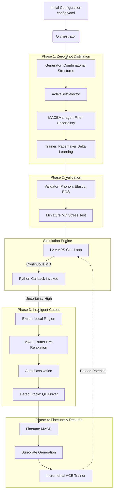

# SYSTEM ARCHITECTURE

## 1. Summary

This document details the system architecture for PYACEMAKER Version 2.1.0, codenamed "NextGen Hierarchical Distillation Architecture with FLARE Best Practices." The overarching goal is to construct a highly robust and automated workflow tool for generating Adaptive Machine Learning Interatomic Potentials (MLIPs). The key focus of this architectural evolution is resolving the physical and systemic limitations of the Phase 01 active learning loop when deployed in HPC environments for large-scale, long-timescale molecular dynamics (MD) simulations. The system embraces "Master-Slave Inversion" (embedding Python workflows inside LAMMPS callbacks) and "Intelligent Cutout & Passivation" to ensure seamless MD continuity, rigorous noise exclusion, and zero physical deterioration of quantum structures.

## 2. System Design Objectives

### 2.1. Goals
- **Seamless Continuity:** MD simulations must not revert to step zero upon potential recalculations. The system must natively pause, refine the underlying Machine Learning potential, and resume flawlessly from the exact point of interruption.
- **Robust Noise Tolerance:** Distinguish critical model uncertainty from transient thermal noise during MD simulation using dual-tier threshold strategies, minimizing false-positive DFT calls.
- **Physical Fidelity:** Automatically extract chemically localized, physically robust atomic clusters around regions of high model uncertainty for DFT evaluation. Eliminate dangling bonds and prevent divergent electronic states via automatic passivation and boundary relaxation using a foundational model (MACE).
- **Constant-Time Learning:** Adopt a delta-learning and incremental update approach (O(1) complexity) instead of retraining from scratch, preventing catastrophic forgetting while aggressively speeding up the model update cycle.
- **HPC Resilience:** Build extreme fault tolerance against node failures and external crashes by implementing task-level, fine-grained state checkpoints.

### 2.2. Constraints
- The architecture must be an additive extension. The core base classes (`BaseGenerator`, `BaseOracle`, `BaseTrainer`) defined in the `src/pyacemaker/core/` domain must remain conceptually pure. Existing modules should be reused and safely extended rather than fully rewritten.
- Code complexity must adhere strictly to Ruff rules (McCabe max complexity 10).
- Type hints must be comprehensively applied to pass strict MyPy checks.
- Zero-downtime integration: The framework must transparently switch between fast foundational models (like MACE) and highly accurate ab-initio simulations (Quantum Espresso).

### 2.3. Success Criteria
- The system correctly filters out single-step uncertainty spikes without triggering retraining (thermal noise resistance).
- MD simulations seamlessly resume their exact coordinate and velocity states after potential updates.
- The workflow correctly executes the 4-phase distillation loop (Zero-Shot Distillation, Validation, Cutout/Passivation, and Hierarchical Fine-Tuning) automatically without requiring human intervention.

## 3. System Architecture

The overarching system leverages a centralized `Orchestrator` executing a state machine, orchestrating four distinct functional domains: Generation, Oracle, Training, and Simulation.



### 3.1. Boundary Management and Separation of Concerns
- **Data Encapsulation:** All internal modules must communicate strictly via Pydantic models (e.g., configurations) or specialized data transfer objects like ASE `Atoms` enriched with custom metadata dictionaries (`info` and `arrays`).
- **Engine Isolation:** The LAMMPS runner and QE driver must not contain any business logic regarding learning strategies. They are purely execution engines wrapped by strictly typed Python interfaces.
- **Oracle Abstraction:** The `BaseOracle` interface seamlessly masks the difference between MACE (fast neural network surrogate) and Quantum Espresso (slow ab-initio physics). The rest of the system remains agnostic to the underlying evaluator.

## 4. Design Architecture

### 4.1. File Structure Overview
```
src/pyacemaker/
├── core/
│   ├── base.py                 (Existing: Core abstract interfaces)
│   ├── engine.py               (Modify: Integrate Seamless Resume)
│   ├── loop.py                 (Modify: Integrate the 4-phase loop)
│   ├── oracle.py               (Modify: Add TieredOracle, MACEManager)
│   ├── trainer.py              (Modify: Add Incremental update & MACE Finetune)
├── domain_models/
│   ├── config.py               (Modify: DistillationConfig, CutoutConfig, LoopStrategyConfig)
│   ├── data.py                 (Existing: AtomStructure wrapper)
├── utils/
│   ├── extraction.py           (Create: Intelligent Cutout, Passivation, Pre-relaxation)
```

### 4.2. Core Domain Pydantic Models

The schema extension explicitly builds upon existing configuration objects.

**`DistillationConfig`** (New in `domain_models/config.py`)
- Defines Phase 1 behavior. Integrates parameters for MACE model paths, uncertainty thresholds, and structural sampling counts.

**`ActiveLearningThresholds`** (New in `domain_models/config.py`)
- Solves thermal noise via two parameters: `threshold_call_dft` (when to halt) and `threshold_add_train` (what to learn), plus `smooth_steps` for moving-average smoothing.

**`CutoutConfig`** (New in `domain_models/config.py`)
- Governs the spatial extraction in Phase 3. Defines `core_radius` (atoms needing exact DFT) and `buffer_radius` (boundary relaxation zone).

**`LoopStrategyConfig`** (New in `domain_models/config.py`)
- Controls incremental update semantics and replay buffer sizing to prevent catastrophic forgetting.

## 5. Implementation Plan

The implementation is broken down into exactly 4 sequential development cycles.

### CYCLE01: Core Extraction & Tiered Evaluation
**Scope:** Establish the data structures for configuration and build the intelligent structure cutout module.
- Add `DistillationConfig`, `ActiveLearningThresholds`, `CutoutConfig`, and `LoopStrategyConfig` to `domain_models/config.py`.
- Create `pyacemaker/utils/extraction.py`.
- Implement spherical extraction based on `core_radius` and `buffer_radius`.
- Implement MACE-based pre-relaxation (fixing core, relaxing buffer).
- Implement auto-passivation for disconnected bonds.

### CYCLE02: Master-Slave Inversion & Seamless Resume
**Scope:** Re-architect the MD engine to support mid-simulation pauses and state preservation.
- Modify `pyacemaker/core/engine.py`.
- Integrate restart-based or callback-based logic to pause LAMMPS.
- Ensure velocity/coordinate states are preserved natively via `read_restart`.
- Implement "Soft Start" logic (Langevin thermalization) upon potential reload to prevent explosive energy spikes.

### CYCLE03: Hierarchical Distillation Loop (Phase 1 & 4)
**Scope:** Wire the advanced Oracle and Trainer logic.
- Modify `pyacemaker/core/oracle.py` to add `MACEManager` and `TieredOracle`.
- Modify `pyacemaker/core/trainer.py` to support incremental (Delta) learning with Pacemaker.
- Implement the replay buffer mechanism to maintain structural diversity.
- Implement MACE finetuning wrapper.

### CYCLE04: Orchestration & HPC Resilience
**Scope:** Tie all phases together into a unified state machine and harden the system for HPC.
- Overhaul `pyacemaker/core/loop.py` to explicitly handle the 4-phase sequence.
- Implement task-level checkpointing using a lightweight database or robust JSON handler to track execution state.
- Implement artifact cleanup routines for large `.wfc` and dump files.

## 6. Test Strategy

### General Principles
- **No Side Effects:** All tests interacting with file systems must use Python's `tempfile` modules or `pytest`'s `tmp_path` fixture.
- **Mocking External Code:** Calls to `pw.x`, `mace`, `lammps`, and `pacemaker` must be rigorously mocked using `unittest.mock` during unit tests.

### Cycle 01 Testing
- **Unit:** Test `extraction.py` by passing dummy ASE `Atoms` objects. Assert that `force_weight` arrays are correctly applied based on radius. Assert auto-passivation adds the correct element to boundary atoms.
- **Integration:** Feed a realistic bulk system (e.g., 500 atoms) and simulate an uncertainty spike. Verify the output is a stable cluster.

### Cycle 02 Testing
- **Unit:** Test configuration generation for soft-start LAMMPS runs. Ensure `fix langevin` strings are properly formatted.
- **Integration:** Run a mock MD simulation that hits a trigger, pauses, writes a restart, and cleanly resumes.

### Cycle 03 Testing
- **Unit:** Mock `MACEManager` inference outputs. Verify `TieredOracle` correctly routes requests to DFT only when `uncertainty > threshold_call_dft`.
- **Integration:** Simulate a delta learning loop iteration, verifying the replay buffer correctly appends and subsamples historical data.

### Cycle 04 Testing
- **Unit:** Test the state machine transition logic in `loop.py` via mock returns for each phase.
- **Integration:** End-to-end integration test leveraging a dummy "MockOracle" to simulate a full multi-step loop execution, verifying checkpoints are correctly written to disk.
