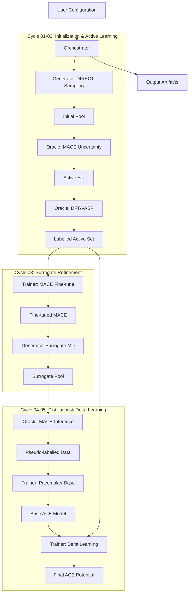

# System Architecture: MACE Knowledge Distillation Pipeline

## 1. Summary
The **pyacemaker** project is an advanced, automated pipeline designed to construct high-accuracy Machine Learning Interatomic Potentials (MLIPs) with minimal computational cost. By integrating a "MACE Knowledge Distillation" workflow, the system leverages a pre-trained, large-scale foundation model (MACE-MP-0) as a surrogate to guide the data generation and labelling process. This approach significantly reduces the reliance on expensive Density Functional Theory (DFT) calculations while ensuring that the final polynomial potential (Pacemaker/ACE) achieves near-DFT accuracy through a final "Delta Learning" stage.

The core philosophy is "Smart Sampling, Fast Labelling, and Precision Correction." Instead of brute-force random sampling, the system uses entropy maximization (DIRECT sampling) to cover the descriptor space efficiently. Instead of labelling every structure with DFT, it uses MACE's uncertainty quantification to select only the most informative configurations for ground-truth calculation (Active Learning). Finally, the system trains a lightweight, production-ready ACE potential that mimics the MACE model's generalizability but is corrected to match the specific chemical accuracy of the target system via Delta Learning.

The architecture is modular, comprised of six distinct development cycles. It separates concerns between structure generation, oracle evaluation (DFT/MACE), and model training. The system is designed to be robust, reproducible, and scalable, supporting both "Mock Mode" for rapid CI/CD testing and "Real Mode" for scientific production runs.

## 2. System Design Objectives

### 2.1. Goals
1.  **Automation:** Minimize human intervention. Ideally, the user provides only the initial structure and composition, and the system outputs a production-ready `.yace` potential file.
2.  **Efficiency:** Reduce DFT calls by at least an order of magnitude compared to traditional random sampling methods.
3.  **Accuracy:** Achieve an energy error of < 1 meV/atom and force error of < 0.05 eV/Å relative to the ground-truth DFT data.
4.  **Scalability:** Support parallel execution of DFT calculations and efficient handling of large datasets (10k+ structures).
5.  **Reproducibility:** Ensure that every step, from sampling to training, is deterministic (controlled by random seeds) and logged comprehensively.

### 2.2. Constraints
*   **Python Version:** Must run on Python 3.11+.
*   **Dependencies:** Must utilize `ase`, `mace`, `pacemaker`, and `lammps` (via Python interface) as core backends.
*   **Environment:** Must support execution in containerized environments (Docker) and HPC schedulers (Slurm) via standard interfaces.
*   **Code Quality:** Strictly typed (Mypy strict), fully tested (Pytest), and linted (Ruff).
*   **Security:** No hardcoded secrets. All API keys and paths must be managed via environment variables or secure configuration files.

### 2.3. Success Criteria
*   **Pipeline Completion:** The 7-step workflow completes successfully in both Mock and Real modes.
*   **Delta Learning Validation:** The final ACE potential shows a lower test error on DFT data than the base ACE potential trained only on MACE surrogate labels.
*   **User Experience:** A new user can run the provided tutorial (SN2 reaction) and obtain a valid potential without debugging internal errors.

## 3. System Architecture

The system follows a sequential pipeline architecture, orchestrated by a central controller (`Orchestrator`). Data flows through a series of specialized modules, each responsible for a specific stage of the MLIP construction lifecycle.

### 3.1. Components
*   **Orchestrator:** The brain of the operation. It reads the configuration, manages the state of the workflow, and invokes the appropriate modules for each step.
*   **Structure Generator:** Responsible for creating atomic configurations. It implements `BaseGenerator` and supports various strategies (Random, DIRECT, MD-based sampling).
*   **Oracle:** The source of truth. It abstracts the calculation of energy, forces, and stress. Subclasses include `VaspOracle` (DFT), `MaceOracle` (Surrogate), and `MockOracle` (Testing).
*   **Trainer:** Manages the training of ML models. It interfaces with external libraries (Pacemaker, MACE) to optimize potential parameters.
*   **Data Manager:** Handles the storage, retrieval, and format conversion (XYZ, CFG, LAMMPS-DATA) of atomic structures and their labels.

### 3.2. Data Flow
1.  **Config:** User input (`config.yaml`) -> `Orchestrator`.
2.  **Step 1:** `StructureGenerator` (DIRECT) -> `Initial Pool` (XYZ).
3.  **Step 2:** `Initial Pool` -> `MaceOracle` (Uncertainty) -> `Active Set` -> `DftOracle` -> `Labelled Active Set`.
4.  **Step 3:** `Labelled Active Set` -> `Trainer` (MACE Fine-tune) -> `Fine-tuned MACE Model`.
5.  **Step 4:** `Fine-tuned MACE Model` -> `StructureGenerator` (MD) -> `Surrogate Pool`.
6.  **Step 5:** `Surrogate Pool` -> `MaceOracle` (Inference) -> `Pseudo-labelled Dataset`.
7.  **Step 6:** `Pseudo-labelled Dataset` -> `Trainer` (Pacemaker Base) -> `Base ACE Model`.
8.  **Step 7:** `Base ACE Model` + `Labelled Active Set` -> `Trainer` (Delta Learning) -> `Final ACE Potential`.

### 3.3. Architecture Diagram



## 4. Design Architecture

The system relies on strong typing and Pydantic models to ensure data integrity across module boundaries. The file structure is organized by domain logic rather than purely technical layers.

### 4.1. File Structure

```text
src/
└── pyacemaker/
    ├── __init__.py
    ├── main.py                     # CLI Entrypoint
    ├── config.py                   # Global Configuration Loading
    ├── core/                       # Core Logic & Interfaces
    │   ├── __init__.py
    │   ├── interfaces.py           # Abstract Base Classes (Generator, Oracle, Trainer)
    │   └── orchestrator.py         # Workflow Controller
    ├── domain_models/              # Pydantic Data Models
    │   ├── __init__.py
    │   ├── config.py               # Config Schema
    │   └── data.py                 # Structure & Label Schemas
    ├── modules/                    # Implementation of Core Interfaces
    │   ├── __init__.py
    │   ├── generator.py            # DIRECT & MD Sampling
    │   ├── oracle.py               # VASP, MACE, Mock Implementations
    │   └── trainer.py              # Pacemaker & MACE Training Wrappers
    └── utils/                      # Helper Utilities
        ├── __init__.py
        ├── io.py                   # File I/O (XYZ, LAMMPS)
        └── logging.py              # Centralized Logging
```

### 4.2. Key Domain Models
*   **`PyAceConfig`**: The root configuration object, validated by Pydantic. It contains sub-configs for `DistillationConfig`, `DftConfig`, `MaceConfig`, etc.
*   **`AtomStructure`**: A wrapper around `ase.Atoms` that adds metadata fields for provenance (e.g., `source_step`), uncertainty scores, and energy/force/stress labels.
*   **`WorkflowState`**: A state object serialized to disk (e.g., `state.json`) to track the progress of the 7-step pipeline, allowing for resumability.

## 5. Implementation Plan

The development is divided into 6 sequential cycles.

*   **CYCLE01: Core Infrastructure & Domain Models**
    *   **Goal:** Establish the skeleton of the application.
    *   **Deliverables:** Pydantic models (`domain_models`), Abstract Base Classes (`core/interfaces.py`), and a functional `MockOracle` for testing. Basic CLI structure.
*   **CYCLE02: Sampling & Active Learning (Steps 1 & 2)**
    *   **Goal:** Implement the "Smart Sampling" phase.
    *   **Deliverables:** `DirectGenerator` for entropy maximization. `MaceOracle` with uncertainty output. Logic to filter structures based on uncertainty and "mock" DFT labelling.
*   **CYCLE03: Surrogate Refinement (Steps 3 & 4)**
    *   **Goal:** Make the surrogate model useful.
    *   **Deliverables:** `MaceTrainer` for fine-tuning MACE with the active set. `MdGenerator` for running MD simulations using the fine-tuned MACE model to generate surrogate data.
*   **CYCLE04: Distillation Phase (Steps 5 & 6)**
    *   **Goal:** Transfer knowledge from MACE to ACE.
    *   **Deliverables:** Bulk labelling capability in `MaceOracle`. `PacemakerTrainer` to train the base ACE potential on the pseudo-labelled data.
*   **CYCLE05: Delta Learning (Step 7)**
    *   **Goal:** Achieve final accuracy.
    *   **Deliverables:** Implementation of the Delta Learning loss function or data weighting mechanism in `PacemakerTrainer`. Integration of the DFT data into the final training loop.
*   **CYCLE06: Integration & User Experience**
    *   **Goal:** Polish the system for the end user.
    *   **Deliverables:** Full integration of the `Orchestrator`. CLI arguments for resuming/skipping steps. Comprehensive `UAT_AND_TUTORIAL.py` notebook. Final documentation.

## 6. Test Strategy

### 6.1. General Approach
Testing will happen at two levels:
1.  **Unit Tests:** For individual classes (e.g., verifying that `DirectGenerator` returns valid `ase.Atoms` objects).
2.  **Integration Tests:** For the full pipeline, running in "Mock Mode" to ensure data flows correctly between steps without crashing.

### 6.2. Cycle-Specific Strategy
*   **Cycle 01:** Test Pydantic validation (invalid configs throw errors). Test `MockOracle` returns consistent energies.
*   **Cycle 02:** Verify that `DirectGenerator` produces diverse structures. Verify that `MaceOracle` correctly identifies high-uncertainty structures (using mocked uncertainty values if needed).
*   **Cycle 03:** Test the `MaceTrainer` wrapper (mocking the actual GPU training). Test `MdGenerator` stability (does not explode).
*   **Cycle 04:** Verify `PacemakerTrainer` generates input files correctly and parses output logs.
*   **Cycle 05:** Verify that Delta Learning correctly prioritizes DFT data (check data weighting logic).
*   **Cycle 06:** End-to-end execution of `UAT_AND_TUTORIAL.py`.

### 6.3. CI/CD Requirements
*   All tests must pass `pytest --cov=src` with >80% coverage.
*   `ruff` and `mypy` must pass without errors.
