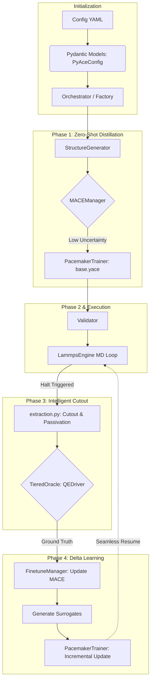

# SYSTEM ARCHITECTURE: PYACEMAKER NextGen Hierarchical Distillation

## 1. Summary
PYACEMAKER is an adaptive machine learning interatomic potential generator tailored for High-Performance Computing (HPC) environments. This document outlines the NextGen Hierarchical Distillation Architecture (Version 2.1.0), which transitions the existing active learning orchestration into a continuous, seamless, and highly robust system. By integrating best practices such as Master-Slave Inversion, Two-Tier Uncertainty Thresholds, Intelligent Cluster Cutout, and Hierarchical Delta Learning, this architecture overcomes critical bottlenecks found in Phase 01. The primary focus is extending the existing codebase safely—reusing core Pydantic models, existing utility modules, and the established orchestration framework while injecting new, highly decoupled capabilities that allow Molecular Dynamics (MD) simulations to scale up to millions of atoms without breaking time continuity or suffering from catastrophic forgetting.

## 2. System Design Objectives
The architecture aims to achieve the following overarching goals, constraints, and success criteria while adhering to a strict additive mindset:

**Additive Mindset and Legacy Integration:**
The new requirements must seamlessly extend the existing Phase 01 architecture. We will retain the foundational elements—such as `pyacemaker.domain_models` for configuration, `pyacemaker.core.oracle` for evaluations, and `pyacemaker.core.engine` for simulation execution. Instead of rewriting these from scratch, we will extend the Pydantic schemas (e.g., adding `DistillationConfig`, `ActiveLearningThresholds`, `CutoutConfig`, and `LoopStrategyConfig` to `workflow.py` and referencing them in `config.py`). We will introduce new classes that adhere to existing abstract base interfaces, such as `TieredOracle` inheriting from `BaseOracle`, and adapt the `LammpsEngine` to support callback mechanisms natively.

**Goal 1: Ensure Temporal Continuity in MD (Master-Slave Inversion)**
The primary goal is to prevent the "Time-Continuity Break." In the current system, encountering an unknown structure halts the MD and forces a restart from the initial coordinates. The new design must invert control: the LAMMPS C++ loop will drive the simulation, invoking Python callbacks (via `fix python/invoke`) to evaluate uncertainty. If the uncertainty exceeds thresholds, the MD pauses, the Python orchestrator updates the potential via Delta Learning, and the MD resumes seamlessly from the exact paused state, preserving velocities and the ensemble state. **Critical Invariant:** To prevent massive memory copying ($O(N)$) during the high-frequency callback, coordinates must be accessed via zero-copy memory views (e.g., `atoms.arrays.get('positions')`) rather than `atoms.get_positions()`.

**Goal 2: Robust Noise Rejection (Two-Tier Thresholds)**
To prevent "Thermal Noise False Positives," the architecture must implement a dual-threshold system. A `threshold_call_dft` will determine if an MD pause is necessary (requiring the spike to persist over `smooth_steps`), while a stricter `threshold_add_train` will isolate the specific atoms (the "epicentre") responsible for the uncertainty. This ensures that transient thermal vibrations do not trigger computationally expensive DFT calculations.

**Goal 3: Safe Local Cutouts (Intelligent Passivation)**
When high uncertainty is detected in a massive system, extracting the local cluster often results in "Dangling Bond / Dipole Divergence," causing DFT SCF loops to fail. The new architecture must use a `force_weight` masking strategy, extracting a core and a buffer region. Crucially, it must pre-relax the buffer using a foundation model (MACE) while freezing the core, and automatically passivate broken surface bonds with dummy atoms (e.g., fractional hydrogen) to ensure the cluster is electrically neutral and physically stable before submission to the `QEDriver`.

**Goal 4: O(1) Incremental Updates**
The system must eliminate "Sluggish Batch Retraining" which causes $O(N)$ computational explosions and catastrophic forgetting. By implementing Hierarchical Delta Learning, the `PacemakerTrainer` will mix newly acquired DFT data (and massive surrogate data generated by a fine-tuned MACE) with a fixed-size replay buffer from previous iterations. The potential will be updated incrementally from its previous state, maintaining a constant $O(1)$ training cost.

**Goal 5: O(1) Memory Streaming and Strict Validation Constraints**
The architecture mandates lazy evaluation. Iterator-based generators (like `BasePolicy.generate`) must yield structures one-by-one (`Iterator[Atoms]`) to prevent Out Of Memory (OOM) errors during the massive surrogate generation phase. Configurations must be rigorously validated using Pydantic's `@model_validator(mode="after")` to enforce complex cross-field logical rules before streaming begins.

**Success Criteria:**
1.  **Zero-Shot Initialization:** Phase 1 successfully generates a base potential (`base.yace`) using only MACE inference and Lennard-Jones Delta Learning, without invoking DFT.
2.  **No MD Resets:** Phase 4 successfully updates the potential and resumes the MD simulation without resetting the step counter, coordinates, or velocities.
3.  **100% DFT Convergence:** All intelligently cut-out clusters submitted to Quantum ESPRESSO converge successfully due to proper passivation and pre-relaxation.
4.  **HPC Resilience:** The system recovers from simulated forced terminations (`SIGKILL`) within seconds using SQLite/JSON task-level checkpointing, and `LAMMPS_SAFE_CMD_PATTERN` prevents shell injection.

## 3. System Architecture
The system follows a highly decoupled, modern Software Architecture utilizing Dependency Injection, the Repository Pattern for checkpointing, and strict Separation of Concerns to avoid "God Classes."

### 3.1 Components and Data Flow
The architecture is structured around four core phases that interact continuously during the active learning loop:

1.  **Configuration and Orchestration:** The user provides a YAML configuration mapped to Pydantic models (e.g., `PyAceConfig`). The `Orchestrator` manages the lifecycle, utilizing the `PolicyFactory` to inject dependencies.
2.  **Phase 1 (Distillation):** The `MACEManager` (Foundation Oracle) processes massive combinatorial pools generated by `StructureGenerator`, filtering them via DIRECT sampling and uncertainty thresholds. The `PacemakerTrainer` builds the initial `base.yace`.
3.  **Phase 2 & MD Engine (Execution):** The `Validator` tests the potential. If successful, the `LammpsEngine` starts the MD. It uses callbacks to evaluate structures against the `ActiveLearningThresholds`.
4.  **Phase 3 (Intelligent Cutout):** Upon a sustained halt, the `extraction.py` module isolates the epicentre, pre-relaxes the buffer via `MACEManager`, passivates the surface, and sends the clean cluster to the `TieredOracle` (which routes to `QEDriver`).
5.  **Phase 4 (Delta Learning):** The `FinetuneManager` updates MACE. MACE generates surrogate data. The `PacemakerTrainer` performs an incremental update using the replay buffer. The `LammpsEngine` resumes.

### 3.2 Boundary Management Rules
*   **Immutable Configuration:** Pydantic models (e.g., `MDConfig`, `WorkflowConfig`) are strictly immutable after instantiation. Runtime state changes (e.g., updating step counts) must be passed as explicit `kwargs` during execution, not by mutating the injected configuration object.
*   **Abstract Interfaces:** All evaluation and execution logic must strictly implement base classes (`BaseOracle`, `BaseEngine`, `BaseTrainer`). The `BasePolicy.generate` interface must use the strict signature: `def generate(self, base_structure: Atoms, config: StructureConfig, n_structures: int = 1, engine: Any | None = None, potential: str | Path | None = None) -> Iterator[Atoms]:`.
*   **Separation of State and Logic:** The state of the active learning loop (checkpoints, current step) must be managed by a dedicated `LoopState` object, decoupled from the execution logic of the `Orchestrator` or `LammpsEngine`. `BaseEngine` must implement `save_state` and `load_state`.


```mermaid
graph TD
    subgraph Initialization
        A[Config YAML] --> B(Pydantic Models: PyAceConfig)
        B --> C[Orchestrator / Factory]
    end

    subgraph Phase 1: Zero-Shot Distillation
        C --> D[StructureGenerator]
        D --> E{MACEManager}
        E -- Low Uncertainty --> F[PacemakerTrainer: base.yace]
    end

    subgraph Phase 2 & Execution
        F --> G[Validator]
        G --> H[LammpsEngine MD Loop]
    end

    subgraph Phase 3: Intelligent Cutout
        H -- Halt Triggered --> I[extraction.py: Cutout & Passivation]
        I --> J{TieredOracle: QEDriver}
    end

    subgraph Phase 4: Delta Learning
        J -- Ground Truth --> K[FinetuneManager: Update MACE]
        K --> L[Generate Surrogates]
        L --> M[PacemakerTrainer: Incremental Update]
        M -.->|Seamless Resume| H
    end
```

## 4. Design Architecture

### 4.1 File Structure Overview
The directory structure enforces a clear separation between domain models, core business logic, external interfaces, and utilities. The new requirements will extend existing modules rather than create entirely new silos.

```text
src/pyacemaker/
├── core/
│   ├── engine.py       # LammpsEngine (modified for seamless resume, save_state)
│   ├── oracle.py       # BaseOracle, DFTManager, new MACEManager & TieredOracle
│   ├── trainer.py      # BaseTrainer, PacemakerTrainer, new FinetuneManager
│   └── validator.py    # Physical validation logic
├── domain_models/      # Pydantic schemas (strictly typed, extra="forbid")
│   ├── config.py       # Main PyAceConfig
│   ├── md.py           # MDConfig
│   └── workflow.py     # WorkflowConfig (extended with new configs)
├── interfaces/
│   ├── lammps_driver.py # Validates LAMMPS_SAFE_CMD_PATTERN
│   └── qe_driver.py
└── utils/
    ├── extraction.py   # New Intelligent Cluster Cutout logic
    └── structure.py
```

### 4.2 Core Domain Pydantic Models Structure
The new architecture relies on extending `src/pyacemaker/domain_models/workflow.py` to include the new schemas, which will then be nested within the existing `WorkflowConfig`. This maintains backward compatibility while enabling NextGen features.

*   `DistillationConfig`: Controls Phase 1. Fields: `enable` (bool), `mace_model_path` (str), `uncertainty_threshold` (float), `sampling_structures_per_system` (int).
*   `ActiveLearningThresholds`: Manages the two-tier thresholds. Fields: `threshold_call_dft` (float), `threshold_add_train` (float), `smooth_steps` (int).
*   `CutoutConfig`: Controls Phase 3. Fields: `core_radius` (float), `buffer_radius` (float), `enable_pre_relaxation` (bool), `enable_passivation` (bool), `passivation_element` (str).
*   `LoopStrategyConfig`: Controls Phase 4 and Oracle routing. Fields: `use_tiered_oracle` (bool), `incremental_update` (bool), `replay_buffer_size` (int), `baseline_potential_type` (str), `thresholds` (nested `ActiveLearningThresholds`).

These new models must use `@model_validator(mode="after")` to enforce complex, cross-field logical constraints (e.g., ensuring `threshold_add_train <= threshold_call_dft` and `zbl_cut_inner < zbl_cut_outer`).

## 5. Implementation Plan

The project is decomposed into exactly five sequential implementation cycles to ensure safe, additive development.

### Cycle 01: Core Pydantic Models and Configuration Extension
**Description:** The first cycle focuses entirely on extending the domain models to support the new configuration parameters required by the NextGen architecture. This step ensures that all subsequent logic has strongly typed, validated configuration objects to rely on. We will modify `src/pyacemaker/domain_models/workflow.py` and `src/pyacemaker/domain_models/config.py`. The fundamental philosophy here is to introduce the new settings needed for the hierarchical distillation without breaking any existing test cases or any existing configurations. To do this, we will use the power of Pydantic. We will implement `DistillationConfig` which represents Phase 1 zero-shot distillation. This will include flags like `enable` (a boolean indicating if this phase is active), `mace_model_path` (a string pointing to the MACE model to use), `uncertainty_threshold` (a float setting the maximum uncertainty allowed for confident structures), and `sampling_structures_per_system` (an integer defining how many structures to sample). Next, we will introduce `ActiveLearningThresholds` to manage the two-tier thresholds. This includes `threshold_call_dft` (a float that defines the uncertainty required to actually halt the simulation and call DFT), `threshold_add_train` (a smaller float that determines which specific atoms are added to the training set), and `smooth_steps` (an integer dictating how many consecutive steps the uncertainty must be high to trigger the halt, acting as a buffer against thermal noise). For Phase 3, we will add `CutoutConfig`. This dictates the core radius (float) and buffer radius (float) for the intelligent cutout, as well as booleans to enable pre-relaxation and passivation, and a string for the passivation element (like Hydrogen). Finally, the `LoopStrategyConfig` will control Phase 4 and Oracle routing, incorporating boolean flags for using the tiered oracle and incremental updates, an integer for replay buffer size, a string for the baseline potential type, and it will nest the `ActiveLearningThresholds`. We will strictly enforce validation logic on all of these using Pydantic's `Field` and `@model_validator(mode="after")` features. We must enforce that `buffer_radius` is always strictly greater than `core_radius`, and that `threshold_add_train` <= `threshold_call_dft`. We will integrate these new models seamlessly into the existing `WorkflowConfig` structure, providing sensible defaults via `default_factory` to guarantee that if a legacy user runs the software with an old configuration file, the system will not crash but rather fall back to the basic behavior. The configuration loading logic will be updated to recursively parse these new fields from the user's `config.yaml` file, ensuring type coercion is handled properly by Pydantic. By completing this cycle first, we establish a rigid, strongly-typed contract that the rest of the implementation can trust implicitly.

### Cycle 02: Intelligent Cutout and Passivation Utilities (Phase 3 Prep)
**Description:** Before modifying the execution engines, we must build the core utility capable of performing the physically safe "Intelligent Cluster Cutout." This cycle focuses on the `src/pyacemaker/utils/extraction.py` module. The primary objective is to implement the function `extract_intelligent_cluster`, which takes a massive ASE `Atoms` object and a list of target indices (the "epicentre") and returns a small, computationally tractable, and physically stable cluster suitable for Density Functional Theory (DFT) calculations. The process starts with identifying the atoms that form the core of the cutout. We will use the ASE `neighbor_list` functionality to efficiently find all atoms within the `core_radius` of the target indices. These atoms will form the core and will be assigned a `force_weight` of 1.0. Next, we extend the search to find all atoms within the `buffer_radius`. The atoms in this outer shell, but not in the core, will form the buffer region and will be assigned a `force_weight` of 0.0. The algorithm must be optimized to handle massive structures (up to millions of atoms) efficiently. Once the cluster is identified, we must perform the crucial step of surface passivation. Extracting a cluster from a bulk material inherently severs chemical bonds. In highly polarized or ionic materials, this can lead to massive charge imbalances and dipole moment divergences, which will cause the subsequent DFT Self-Consistent Field (SCF) loop to fail to converge. We will implement the `_passivate_surface` algorithm to solve this. This algorithm will analyse the outer boundary of the extracted cluster. It will detect broken bonds by comparing the interatomic distances of the extracted atoms against their expected covalent or ionic radii, and it will take into account the electronegativity of the species involved. When a severed bond is identified, the algorithm will automatically calculate the optimal position to place a dummy atom, typically a fractional hydrogen atom, to saturate the dangling bond and neutralize the local charge. The placement will be determined by the vector of the original bond. We will add configuration options to allow the user to specify the passivation element. Finally, the utility must ensure the extracted cluster is placed within a suitable Periodic Boundary Condition (PBC) cell with an adequate vacuum layer to prevent self-interaction during the DFT calculation. The resulting `Atoms` object must contain all the necessary metadata, including the `force_weight` arrays, so that the downstream `PacemakerTrainer` knows which atomic forces to use for the update and which to ignore. The development of this module is highly decoupled from the rest of the system. We will ensure that this utility handles edge cases, such as overlapping core regions from multiple high-uncertainty atoms, gracefully merging them into a single, contiguous cutout.

### Cycle 03: Oracles and Zero-Shot Distillation (Phase 1 & Phase 3)
**Description:** This cycle focuses on implementing the Foundation Model integration and the routing logic. It covers the requirements for Phase 1 (Zero-Shot) and the decision-making part of Phase 3. The primary feature is the introduction of the `MACEManager` within `src/pyacemaker/core/oracle.py`. This class must strictly implement the existing `BaseOracle` interface with the explicit signature mandated in the architecture constraints to guarantee interoperability. The `MACEManager` will wrap the MACE foundation model (e.g., MACE-MP-0), loading the PyTorch model and managing inference execution. It must be designed to fully utilize GPU acceleration where available. Critically, the `MACEManager` must extract and return not only the predicted energy and forces but also the uncertainty ($\gamma$) associated with the prediction. In parallel, we will develop the `TieredOracle`. This class acts as a smart router or proxy. It also implements `BaseOracle` and encapsulates both a `MACEManager` and a `QEDriver` (DFT). When evaluated, the `TieredOracle` first queries the `MACEManager`. It then examines the returned uncertainty against the configured thresholds. If the uncertainty is below the threshold, it immediately returns the MACE predictions, saving immense computational resources. Only if the uncertainty exceeds the threshold does it fall back to invoking the computationally expensive `QEDriver`. Furthermore, within this cycle, we will integrate the MACE model back into the extraction utility developed in Cycle 02. We will implement the `_pre_relax_buffer` logic. When a cluster is extracted, the atoms at the boundary are often in highly strained, unnatural positions due to the severance from the bulk. Before passing this cluster to DFT, we must perform a geometry optimization (relaxation) on the buffer region. The core atoms, representing the actual physical state at the moment of the halt, must remain perfectly frozen using `ase.constraints.FixAtoms`. The `MACEManager` will be used as the calculator for this relaxation, quickly optimizing the buffer coordinates to minimize energy and relieve strain. Finally, we will orchestrate the Phase 1 Zero-Shot Distillation process. This script will utilize existing structure generators to create massive combinatorial pools of the target elements using strict `Iterator[Atoms]` for $O(1)$ memory streaming. It will then leverage the `ActiveSetSelector` to distill this massive pool down to a highly informative subset. The `MACEManager` will then evaluate this subset, filtering out any structures where it lacks confidence. The resulting high-quality dataset will be passed to the `PacemakerTrainer` to build the initial baseline potential.

### Cycle 04: Master-Slave Inversion and Seamless Resume (Phase 2 & Execution)
**Description:** This is the most critical architectural shift in the entire NextGen project. We will refactor the `LammpsEngine` to support the Master-Slave inversion, ensuring MD continuity. In previous versions, the Python orchestrator launched LAMMPS as an external subprocess, ran a simulation for a fixed number of steps, and then halted. This design inherently breaks the continuity of time and the thermodynamic ensemble, forcing the system to re-equilibrate upon every restart. The objective of this cycle is to fundamentally alter this paradigm. The `BaseEngine` interface will be modified to support a seamless `resume_from_step` parameter in its `run()` method, and must explicitly implement `save_state` and `load_state` for robust fallback capabilities. We will leverage LAMMPS's `fix python/invoke` capability. This allows the inner C++ loop of LAMMPS to periodically call back into Python space. We will inject a callback function that evaluates the current structural configuration using the active learning thresholds. As the simulation runs, LAMMPS will pass the current atomic coordinates to Python every N steps. **Critical Invariant:** Python must evaluate the uncertainty accessing coordinates directly via zero-copy `atoms.arrays.get('positions')` to prevent $O(N)$ memory copying overhead. If the uncertainty spikes above `threshold_call_dft`, Python will maintain a counter. If the spike persists for `smooth_steps` (rejecting thermal noise), the callback will signal LAMMPS to pause its execution loop. The MD state is thus frozen perfectly in time. The Python orchestrator will then take control, perform the extraction, evaluation, and Delta Learning steps. Once the potential is updated, Python will instruct LAMMPS to reload the new potential parameters dynamically. To prevent shell injection via dynamic paths, the engine configuration logic must validate against the `LAMMPS_SAFE_CMD_PATTERN`. To mitigate the energy discontinuities that inevitably occur when a potential is updated mid-simulation, we will implement a "Soft Start" mechanism. When the MD resumes, the engine will automatically insert commands to apply a strong Langevin heat bath (`fix langevin`) for a very short duration. This allows the system to gently thermalize and adapt to the new potential landscape. Furthermore, to guarantee robustness in hostile HPC environments where jobs can be killed arbitrarily due to wall-time limits, we will develop a fine-grained, task-level checkpointing system using SQLite or JSON. If the process receives a `SIGKILL`, the subsequent restart will read the checkpoint database via `load_state()`, identify exactly where it left off, and resume operation.

### Cycle 05: Hierarchical Delta Learning and Orchestration (Phase 4)
**Description:** The final cycle ties all components together, implementing the incremental update logic and finalizing the main orchestration loop. The focus here is on preventing catastrophic forgetting while maintaining a constant $O(1)$ computational cost for updates. In traditional active learning, every time new data is acquired, the model is retrained from scratch on the entire historical dataset. As the simulation progresses, the dataset grows linearly, causing the training time to explode. Furthermore, adding only high-error configurations (the epicentres) skews the training distribution, causing the model to "forget" the stable bulk configurations it learned earlier. We will solve this by implementing Hierarchical Delta Learning. First, we will implement the `FinetuneManager` in `src/pyacemaker/core/trainer.py`. This component will take the single, highly valuable ground truth force calculated by the `QEDriver` on the cut-out cluster and use it to execute a very rapid, localized update to the MACE foundation model's readout layers. This "awakens" MACE to the specific, complex physical anomaly it just encountered. Next, we use this awakened MACE as a surrogate oracle. We will generate thousands of slight variations of the halted structure (using rattle, strain, etc.) and instantly evaluate them using the fine-tuned MACE. This provides a massive, high-density dataset of the local phase space, which must be yielded via lazy evaluation (`Iterator[Atoms]`) to prevent Out Of Memory errors. Finally, we extend the `BaseTrainer` interface to explicitly mandate an `incremental_train` method and a `get_replay_buffer` method. The `PacemakerTrainer` will load the weights of the current potential. It will then be provided with the newly generated surrogate data, AND crucially, a "Replay Buffer." The Replay Buffer is a fixed-size subset of data randomly sampled from the entire history of the simulation (`training_history.extxyz`). By mixing the new anomaly data with a representative sample of historical data, we force the model to learn the new physics without forgetting the old physics. Because the total size of the training set (surrogate data + replay buffer) remains constant, the training time is strictly $O(1)$, regardless of how long the MD has been running. We will finalize the `Orchestrator` class to smoothly orchestrate this entire flow, sequencing Phase 1 through Phase 4 flawlessly. It will manage the transitions from the inverted LAMMPS engine to the extraction utilities, to the tiered oracles, and through the hierarchical training process. We will also implement a background daemon or post-processing step to manage artifacts. Massive files like Quantum ESPRESSO wavefunctions (`.wfc`) or LAMMPS trajectory dumps will be automatically compressed or deleted once they are no longer needed, preventing the system from exhausting HPC storage quotas over the course of a multi-week run.

## 6. Test Strategy

Testing must guarantee that the architectural changes do not break existing functionality and that the new features behave according to physical principles. All tests must be free of side effects, utilizing `unittest.mock` and `pytest`'s `tmp_path` fixture extensively.

### Cycle 01 Testing Strategy
The testing strategy for Cycle 01 is entirely focused on the structural integrity and validation logic of the newly introduced Pydantic models. Since these models act as the foundation for the entire NextGen architecture, their correctness is paramount. We will employ exhaustive Unit Testing methodologies. We will begin by creating tests that instantiate the `DistillationConfig`, `ActiveLearningThresholds`, `CutoutConfig`, and `LoopStrategyConfig` using perfectly valid dictionaries that represent expected use cases. We will assert that the resulting Pydantic objects contain the exact values passed in, ensuring no unintended mutation occurs during initialization. The core of this testing phase, however, relies on negative testing. We will systematically construct invalid input dictionaries to provoke `pydantic.ValidationError` exceptions. For example, we will pass negative values or zero to fields like `core_radius`, `buffer_radius`, and `uncertainty_threshold` which require strictly positive integers or floats (e.g., using `gt=0` constraints). We will explicitly test the complex, cross-field validation rules using the `@model_validator(mode="after")` paradigm. A critical test case will instantiate `ActiveLearningThresholds` with a `threshold_add_train` value that is strictly greater than `threshold_call_dft`. This is logically invalid (you cannot require a higher threshold to add to the training set than to halt the simulation) and must raise a validation error. Similarly, we will ensure that `buffer_radius` is strictly greater than `core_radius` in `CutoutConfig`. We will also verify that default values are correctly assigned when optional fields are omitted from the instantiation dictionary, simulating legacy configuration files that lack NextGen parameters. Following the unit tests, we will conduct robust Integration Tests. We will create mock `config.yaml` files within a temporary directory (using the `tmp_path` fixture) that represent full, production-like configurations incorporating all the new NextGen keys. We will invoke the configuration loading module and assert that the resulting `PyAceConfig` object correctly parses, casts types, and nests the specific sub-configurations into the `workflow` attribute without any data loss or silent failures. We will ensure that no side effects leak into the environment; no actual files should be written outside of the `tmp_path`, and no external environment variables should be mutated. This rigorous testing approach guarantees that the system is impregnable to malformed inputs from the very start. The thoroughness of these Pydantic tests is crucial because it allows the downstream business logic to safely assume the configuration is pristine, eliminating the need for redundant type checking and bounds checking within the execution loops.

### Cycle 02 Testing Strategy
The testing strategy for Cycle 02 revolves around ensuring physical correctness and algorithmic efficiency of the Intelligent Cutout and Passivation utilities. We must verify that the geometric and chemical manipulations performed by `extraction.py` adhere to reality. We will utilize Unit Tests focusing heavily on synthetic data structures. We will programmatically construct idealized `ase.Atoms` objects, such as a perfect Body-Centered Cubic (BCC) Iron supercell or a pristine Magnesium Oxide (MgO) crystal lattice. We will designate a specific central atom index as the target "epicentre" and pass it to the `extract_intelligent_cluster` function. We will then assert that the total number of atoms in the resulting cluster mathematically aligns with the expected volume of a sphere defined by the `buffer_radius`, accounting for atomic density. We will iterate through the output cluster's atoms and assert that the `force_weight` array has been applied correctly: atoms whose distance to the center is less than `core_radius` must have a weight of 1.0, while atoms between `core_radius` and `buffer_radius` must have a weight of 0.0. To validate the passivation logic, we will implement Physical Property Tests. We will extract a cluster from an ionic solid, which inherently creates a highly polarized structure due to broken ionic bonds. We will calculate the dipole moment of this raw, unpassivated cutout. We will then run the `_passivate_surface` function and re-calculate the dipole moment. The test will assert that the addition of the dummy fractional hydrogen atoms has neutralized the severed bonds, resulting in a dipole moment that is drastically reduced, approaching zero. We will also verify that the `ase.constraints.FixAtoms` constraint has been correctly applied to the core atoms by attempting a mock relaxation step and asserting that the coordinates of the `force_weight=1.0` atoms remain absolutely identical down to floating-point precision. Furthermore, we will test the edge case of multiple, proximate target indices. We will select two target atoms that are close enough that their respective core radii overlap. The test must assert that the algorithm correctly merges these spheres into a single, contiguous cutout region without duplicating atoms or creating bizarre geometric artefacts. All tests will be executed entirely in memory or utilizing the `tmp_path` fixture to ensure no residual files are left on the file system, strictly adhering to the side-effect-free testing mandate. This comprehensive physical validation ensures that the clusters passed to the costly DFT engines are mathematically stable and capable of achieving SCF convergence.

### Cycle 03 Testing Strategy
The testing strategy for Cycle 03 is designed to validate the integration interfaces and the conditional routing logic of the Oracles without requiring actual, computationally heavy PyTorch or Quantum ESPRESSO executions during the CI/CD pipeline. This requires extensive and careful use of mocking. We will begin with Unit Tests for the `MACEManager`. Since we do not want to load a multi-gigabyte foundation model during a unit test, we will use `unittest.mock.patch` to intercept the underlying PyTorch inference calls. We will provide synthetic `Atoms` objects to the `MACEManager.evaluate()` method and assert that the mocked response is correctly unpacked into energy, forces, and the critical uncertainty ($\gamma$) array. We will verify that the manager correctly implements the strictly defined `BaseOracle` signature without relying on arbitrary `**kwargs`. Next, we will rigorously test the `TieredOracle`. This requires setting up a test environment where both the `MACEManager` and the `QEDriver` are entirely mocked. We will construct a test case where the mocked `MACEManager` returns an uncertainty value strictly lower than the `threshold_call_dft` specified in the `LoopStrategyConfig`. The test must assert that the `TieredOracle` returns the MACE results immediately and that the `QEDriver` mock is never called (call count equals 0). We will then construct a complementary test case where the mocked uncertainty exceeds the threshold. Here, the test must assert that the `TieredOracle` proceeds to call the `QEDriver` mock, passing the exact same structure, and returns the ground truth DFT results. This verifies the core routing logic that saves computational cost. We will also test the `_pre_relax_buffer` functionality within the extraction utility. We will mock the `MACEManager` to act as an ASE Calculator. We will provide an extracted cluster with a strained buffer region. We will execute the pre-relaxation function and assert that the ASE optimizer was called correctly with the MACE calculator. Crucially, we will implement Constraint Tests. We will record the exact coordinates of the core atoms before the relaxation. After the mock relaxation (which might apply random displacements to the buffer atoms in the test setup), we will assert that the core coordinates are mathematically identical to their initial state, proving that the `FixAtoms` constraint was respected by the optimizer. Finally, we will test the Phase 1 Orchestration logic by mocking the structure generators and the `ActiveSetSelector`, ensuring the sequence of calls correctly distills the pool and trains the initial `base.yace` entirely through the mocked MACE interface using lazy evaluation. All these tests will ensure the complex interplay of foundation models and first-principles calculations is orchestrated perfectly without side effects.

### Cycle 04 Testing Strategy
The testing strategy for Cycle 04 focuses on validating the resilience, state management, and continuous execution capabilities of the inverted `LammpsEngine`. Because we are dealing with stateful MD simulations and file I/O operations (checkpointing), the tests must be carefully designed to avoid flakiness and side effects. We will rely heavily on Integration Tests operating within isolated `tmp_path` directories. Our primary goal is to verify the Master-Slave inversion mechanism. We will construct a miniature test scenario involving the `LammpsEngine` and a completely mocked `BaseOracle`. We will start a mock MD simulation. Using the `fix python/invoke` callback mechanism (or simulating its effect if direct LAMMPS integration is complex to mock in CI), we will dynamically manipulate the mocked Oracle to return a low uncertainty for the first 10 steps. The test must assert that the MD continues uninterrupted. Crucially, the test must verify that the callback accessed coordinates via the zero-copy memory view (`atoms.arrays.get('positions')`). On step 11, we will force the mock Oracle to return a high uncertainty that exceeds the threshold. We will maintain this high uncertainty for the duration of the `smooth_steps` configuration. The test must assert that the `LammpsEngine` correctly identifies the sustained spike, rejects it as thermal noise if it doesn't last long enough, but successfully triggers the halt command when the `smooth_steps` criterion is met. We will then verify the Seamless Resume capability. After the simulated halt, we will invoke the `LammpsEngine.run(resume_from_step=11)` method. The test must assert that the engine correctly loads the state, either from memory or from a specifically formatted `.restart` file, and that the simulation continues from step 11, rather than resetting to step 0. We will also assert that the initial commands sent to the engine upon resume include the "Soft Start" Langevin heat bath directives to ensure thermalization. To validate the robustness of the system against HPC failures, we will implement State Recovery Tests. We will initiate a mocked orchestration loop that performs several rapid iterations of surrogate generation. We will forcefully interrupt the execution by raising a synthetic `KeyboardInterrupt` or `SystemExit` deep within the loop to mimic a wall-time kill. We will then instantiate a fresh `Orchestrator` pointing to the exact same `tmp_path` working directory. The test must assert that the Orchestrator successfully reads the fine-grained SQLite or JSON checkpoint database via `load_state()`, identifies the exact step where the interruption occurred, and resumes the loop without repeating completed tasks or losing critical data. Finally, we will run security tests to guarantee that paths passed to LAMMPS are properly intercepted and verified against the `LAMMPS_SAFE_CMD_PATTERN` to prevent shell injection vectors.

### Cycle 05 Testing Strategy
The testing strategy for Cycle 05 is the culmination of the entire architectural validation, focusing on the Hierarchical Delta Learning process and the end-to-end orchestration flow. We must prove that the system can learn incrementally without suffering from catastrophic forgetting, and that the massive orchestrator coordinates all phases seamlessly. We will employ advanced Integration Tests utilizing heavily mocked components to simulate a full production run in seconds. The primary focus is the Replay Buffer Tests. We will mock the `PacemakerTrainer`'s execution command to prevent actual training. We will synthetically generate a `training_history.extxyz` file containing 10,000 dummy structures, representing a long simulation history. We will then trigger Phase 4 Delta Learning, providing a small batch of 100 newly generated surrogate structures, ensuring they are yielded lazily via an `Iterator` instead of a fully materialized list. The test will intercept the input dataset constructed by the orchestrator right before the explicit `incremental_train` method is called. We will assert that the final dataset contains exactly the 100 new surrogate structures PLUS a randomly sampled subset of structures from the history file, where the size of the subset precisely matches the `replay_buffer_size` defined in the `LoopStrategyConfig` (e.g., 500 structures). We will further assert that the total size of the training set is exactly 600, proving that the computational cost of training remains constant ($O(1)$) and does not scale linearly with the total history. This definitively validates the prevention of catastrophic forgetting. We will also test the end-to-end Orchestrator sequence in a "dry-run" mode. We will trigger the main run loop and use `unittest.mock.call` lists to assert the exact chronological sequence of operations: The `MACEManager` must be called for Phase 1 distillation; the `LammpsEngine` must be started; the callback must trigger a halt; the `extraction.py` utility must isolate the cluster; the `TieredOracle` must execute the `QEDriver` on the passivated cluster; the `FinetuneManager` must update MACE; surrogates must be generated via generators; the `PacemakerTrainer` must perform Delta Learning; and finally, the `LammpsEngine` must be called with the resume parameter. The successful sequence of these mock calls guarantees that the high-level control flow is logically sound. Finally, we will implement Artifact Cleanup Tests. We will create large dummy files simulating `.wfc` and LAMMPS dump files in the `tmp_path`. We will trigger the Phase 4 completion logic and assert that these specific large files have been either deleted or compressed into `.gz` archives, verifying that the background daemon successfully mitigates storage exhaustion risks. By completing this exhaustive testing strategy, we ensure the entire NextGen architecture is robust, mathematically sound, and ready for deployment in extreme HPC environments.
