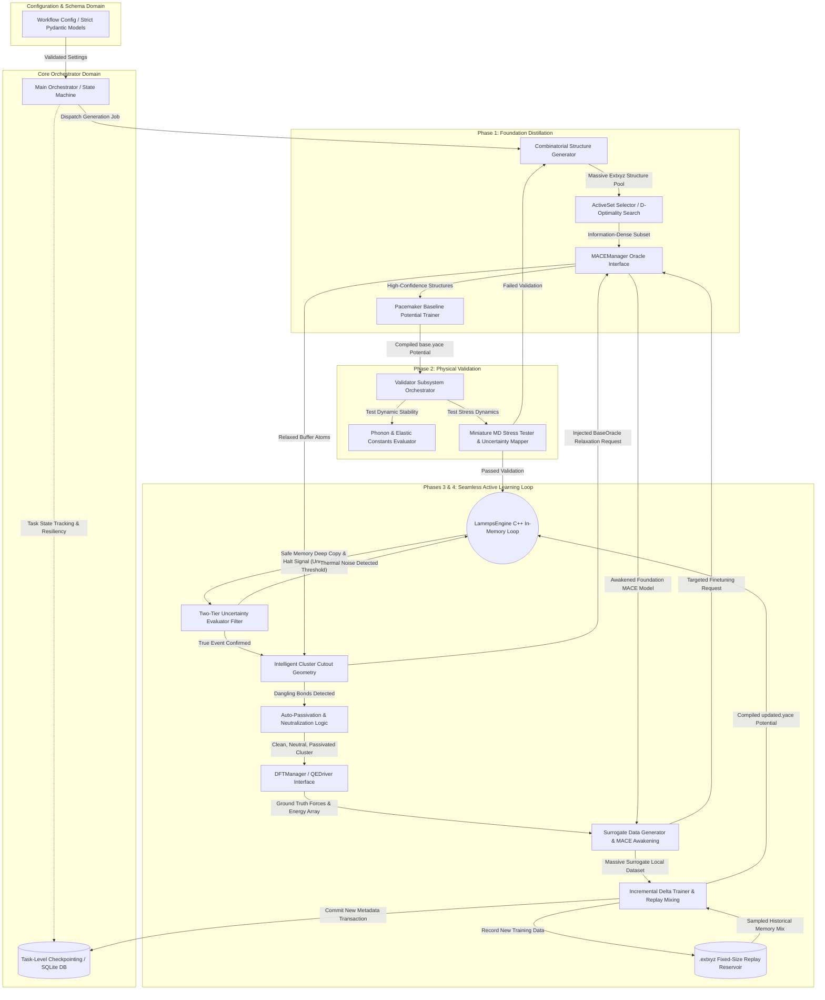

# PYACEMAKER System Architecture

## 1. Summary

The PYACEMAKER Next-Generation Architecture, version 2.1.0, introduces a highly transformative and scalable approach to orchestrating Active Learning for Machine Learning Interatomic Potentials (MLIPs). By transitioning from a traditional batch-retraining loop to a sophisticated "Hierarchical Distillation" architecture, the system elegantly addresses the critical bottlenecks in computational efficiency, physical stability, and continuous integration with Molecular Dynamics (MD) engines like LAMMPS. The core philosophy of this next-generation design is to maximally leverage the broad generalization capabilities of Foundation Models (such as the MACE-MP-0 model) to distil foundational physical interactions, followed by targeted, highly specific, uncertainty-driven quantum mechanical (DFT) evaluations only when absolutely necessary. This architecture fundamentally shifts the computational paradigm from "calculate everything with DFT" to "intelligently distil, seamlessly evaluate, and incrementally update", enabling the simulation of multi-million atom systems over extended, biologically or metallurgically relevant timescales without suffering from catastrophic forgetting or premature simulation halting due to trivial thermal noise. Furthermore, it is designed with strict separation of concerns, ensuring that the existing codebase—such as the `BaseOracle`, `DFTManager`, and `QEDriver`—is seamlessly extended rather than destructively rewritten, adhering to the AC-CDD methodology.

## 2. System Design Objectives

The overarching goal of the PYACEMAKER next-generation architecture is to establish a physically robust, computationally highly efficient, and systemically resilient orchestration framework for automated MLIP construction. The design objectives are heavily influenced by the limitations observed in the Phase 01 architecture and the best practices extracted from state-of-the-art methodologies like the FLARE framework developed at Harvard University. We aim to decisively overcome the "Time-Continuity Break" where molecular dynamics simulations prematurely halt due to uncertainty spikes, destroying the progression of long-timescale phenomena such as slow phase transformations or solid-state defect diffusion. To achieve this, the architecture must support the seamless resumption of MD using advanced shared-memory embedding techniques (e.g., `fix python/invoke`), strictly preserving atomic coordinates, velocities, and complex thermostat variables without resetting the simulation state or losing valuable temporal context.

A critical design constraint is the absolute mitigation of "Thermal Noise False Positives". In classical active learning, a single uncertainty threshold often triggers expensive DFT calculations even when the structural deviation is a transient, harmless thermal fluctuation inherent to the specified temperature. Our objective is to implement a mathematically robust, two-tier thresholding system. The first tier evaluates if an uncertainty spike is sustained over multiple timesteps, effectively acting as a low-pass filter to reject thermal noise. The second tier determines which specific atomic environments within the large structure are genuinely novel and require quantum mechanical resolution. This dual-layered approach will drastically reduce the frequency of unnecessary simulation halts and prevent the orchestration loop from falling into infinite, non-productive evaluation cycles.

Furthermore, we must address the severe "Dangling Bond / Dipole Divergence" problem that plagues naive cluster extraction methods. When highly uncertain regions are simply cut out from a bulk periodic system and evaluated in isolation via DFT, the exposed surfaces create artificial electronic states (dangling bonds) and macroscopic dipole moments. These artifacts lead to severe Self-Consistent Field (SCF) convergence failures in codes like Quantum ESPRESSO, or worse, cause the machine learning model to learn non-physical "garbage" data that corrupts the potential landscape. The new architecture dictates the mandatory implementation of an "Intelligent Cutout & Passivation" subsystem. This subsystem must mathematically define a core region of high uncertainty, surround it with a buffer zone, pre-relax the buffer using a deeply injected foundation model (MACE) while keeping the core fixed to preserve the geometry, and automatically terminate the cluster boundaries with fractional hydrogen atoms or custom pseudopotentials. This rigorously guarantees that the DFT engine receives a physically meaningful, electronically neutral, and stable structure, maximizing the quality of the ground-truth data obtained. Crucially, to prevent circular dependency loops, the extraction utilities must accept the relaxation model purely via Dependency Injection.

Computationally, the architecture must completely eliminate the "Catastrophic Forgetting" and O(N) scaling problems classically associated with traditional batch retraining methodologies. Retraining an entire interatomic potential from scratch with every newly acquired DFT configuration is economically unviable and often severely degrades the model's performance on previously learned, stable bulk configurations. Our design objective mandates the adoption of "Incremental Delta Learning". Instead of full retraining, the system will seamlessly use the existing potential weights as a starting initialization point and update them using only the newly acquired surrogate data mixed meticulously with a carefully curated, fixed-size replay buffer (e.g., a rolling `.extxyz` file reservoir) sampled from the historical training trajectory. This crucial architectural decision, deeply decoupled from any heavy database backend, ensures that the computational cost of the active learning update remains strictly bounded at O(1), enabling incredibly rapid turnaround times essential for dynamic MD-coupled workflows and HPC efficiency.

Finally, the system must achieve unparalleled robustness against external engine failures. LAMMPS or DFT processes may frequently crash due to lost atoms, MPI segmentation faults, hardware timeouts, or resource exhaustion on HPC nodes. The PYACEMAKER orchestrator must isolate these failures completely. We mandate a "Master-Slave Inversion" where Python acts as a resilient supervisor over the C++ engines. The Python callback must flawlessly deep-copy memory arrays from LAMMPS to prevent C++ SegFaults from destroying the state machine, and handle exceptions gracefully. Alternatively, highly robust task-level checkpointing using an embedded SQLite or JSON database must painstakingly record the metadata state of every calculation, atomic extraction, and surrogate generation independently of the ML training data. This ensures that even if a high-performance computing (HPC) job is prematurely terminated by the scheduler wall-time limit, the entire orchestration workflow can safely resume seamlessly from the exact point of failure without redundant calculations. The design must be completely modular, relying heavily on strict Pydantic schemas for input validation and ensuring that all modifications to the existing `src/` directory are strictly additive, leveraging existing interfaces like `BaseOracle` to maintain complete backward compatibility while introducing these massive next-generation capabilities.

## 3. System Architecture

The PYACEMAKER system architecture is meticulously designed to orchestrate the complex, multi-scale interplay between molecular dynamics, active learning loops, foundation models, and first-principles quantum mechanical calculations. At its core, the architecture represents a highly decentralized, event-driven state machine that strictly enforces separation of concerns across multiple discrete computational domains. The system is conceptually divided into four major, interconnected subsystems: Configuration & Orchestration Domain, Foundation Distillation (Phase 1), Physical Validation (Phase 2), and the Active Learning Loop (Phases 3 & 4). Each subsystem communicates exclusively through well-defined, strongly typed Pydantic data models, ensuring that data contracts are immutable and self-validating. This rigorous data-flow design prevents the emergence of tightly coupled "God Classes" and allows individual operational components—such as the DFT driver, the Lammps engine, or the MLIP trainer—to be cleanly swapped, modified, or upgraded without cascading side effects throughout the broader codebase.

Boundary management is a paramount architectural principle enforced rigidly within PYACEMAKER. We explicitly prohibit direct procedural calls between the MD engine (e.g., LAMMPS) and the Quantum Mechanical engine (e.g., Quantum ESPRESSO). Instead, all data must flow vertically through the central Orchestrator, which acts as the ultimate, unassailable authority on system state. The Orchestrator delegates tasks to abstract, generic interfaces, primarily defined by the `BaseOracle` class. The novel `TieredOracle` implementation elegantly encapsulates the complex routing logic: it first consults the `MACEManager` (representing the fast, highly generalizable foundation model) and only escalates requests to the `DFTManager` when uncertainty metrics definitively exceed predefined, user-configured thresholds. This hierarchical boundary ensures that the slow, highly expensive DFT calculations are absolutely shielded from trivial queries or noise, maximizing overall computational throughput. Furthermore, external C++ processes like LAMMPS are treated as fundamentally untrusted, volatile black boxes. Any raw data emerging from LAMMPS, specifically atomic configurations that trigger an uncertainty halt, must undergo rigorous deep copying, mathematical sanitization, and physical validation within the strictly isolated "Intelligent Cutout" Python subsystem before it is ever allowed to cross the critical boundary into the high-fidelity DFT domain.

Data flow within the system is architected to be highly asynchronous and fault-resilient. When the user initiates a workflow, the `WorkflowConfig` is immediately parsed and validated via Pydantic, setting the immutable constraints for the entire simulation run. During the Phase 1 Distillation, vast combinatorial structure pools are programmatically generated and aggressively down-selected by the D-Optimality ActiveSet Selector to maximize information density and remove redundancy. The `MACEManager` filters these remaining structures, and the resulting high-confidence dataset is directly utilized to train a highly accurate baseline potential. As the system transitions into the Active Learning Loop (Phases 3 & 4), LAMMPS continuously executes the MD simulation in memory. Upon detecting a mathematically significant uncertainty spike, LAMMPS sends an asynchronous halt signal to the Two-Tier Evaluator. If validated as a true, novel physical event rather than mere thermal noise, the Intelligent Cutout and Auto-Passivation modules extract a perfectly stable, electronically neutral, and chemically passivated cluster. The `DFTManager` is then tasked to compute the ground-truth forces for this pristine cluster. These high-fidelity forces are subsequently utilized by the Surrogate Generator to awaken the MACE model, dynamically producing thousands of localized surrogate structures. Finally, the Incremental Trainer mixes these surrogates with an independent `.extxyz` replay buffer to update the potential in O(1) time, immediately allowing LAMMPS to safely resume seamlessly from its paused state in shared memory.


```mermaid
graph TD
    %% Subsystems Definition
    subgraph Config_and_Schema [Configuration & Schema Domain]
        CFG[Workflow Config / Strict Pydantic Models]
    end

    subgraph Core_Orchestrator [Core Orchestrator Domain]
        ORCH[Main Orchestrator / State Machine]
        STATE[(Task-Level Checkpointing / SQLite DB)]
    end

    subgraph Phase1_Distillation [Phase 1: Foundation Distillation]
        P1_GEN[Combinatorial Structure Generator]
        P1_DIR[ActiveSet Selector / D-Optimality Search]
        P1_ORACLE[MACEManager Oracle Interface]
        P1_TRAIN[Pacemaker Baseline Potential Trainer]
    end

    subgraph Phase2_Validation [Phase 2: Physical Validation]
        P2_VAL[Validator Subsystem Orchestrator]
        P2_PHONON[Phonon & Elastic Constants Evaluator]
        P2_MINIMD[Miniature MD Stress Tester & Uncertainty Mapper]
    end

    subgraph Active_Learning_Loop [Phases 3 & 4: Seamless Active Learning Loop]
        LAMMPS((LammpsEngine C++ In-Memory Loop))
        EVAL[Two-Tier Uncertainty Evaluator Filter]
        CUTOUT[Intelligent Cluster Cutout Geometry]
        PASSIVATE[Auto-Passivation & Neutralization Logic]
        DFT[DFTManager / QEDriver Interface]
        SURR[Surrogate Data Generator & MACE Awakening]
        DELTA[Incremental Delta Trainer & Replay Mixing]
        REPLAY[(.extxyz Fixed-Size Replay Reservoir)]
    end

    %% Phase 1 Data Flow
    CFG -->|Validated Settings| ORCH
    ORCH -->|Dispatch Generation Job| P1_GEN
    P1_GEN -->|Massive Extxyz Structure Pool| P1_DIR
    P1_DIR -->|Information-Dense Subset| P1_ORACLE
    P1_ORACLE -->|High-Confidence Structures| P1_TRAIN
    P1_TRAIN -->|Compiled base.yace Potential| P2_VAL

    %% Phase 2 Data Flow
    P2_VAL -->|Test Dynamic Stability| P2_PHONON
    P2_VAL -->|Test Stress Dynamics| P2_MINIMD
    P2_MINIMD -- Passed Validation --> LAMMPS
    P2_MINIMD -- Failed Validation --> P1_GEN

    %% Active Learning Loop Data Flow
    LAMMPS -- Safe Memory Deep Copy & Halt Signal (Uncertainty > Threshold) --> EVAL
    EVAL -- Thermal Noise Detected --> LAMMPS
    EVAL -- True Event Confirmed --> CUTOUT
    CUTOUT -- Injected BaseOracle Relaxation Request --> P1_ORACLE
    P1_ORACLE -- Relaxed Buffer Atoms --> CUTOUT
    CUTOUT -->|Dangling Bonds Detected| PASSIVATE
    PASSIVATE -->|Clean, Neutral, Passivated Cluster| DFT
    DFT -->|Ground Truth Forces & Energy Array| SURR
    SURR -->|Targeted Finetuning Request| P1_ORACLE
    P1_ORACLE -- Awakened Foundation MACE Model --> SURR
    SURR -->|Massive Surrogate Local Dataset| DELTA
    REPLAY -->|Sampled Historical Memory Mix| DELTA
    DELTA -->|Record New Training Data| REPLAY
    DELTA -->|Compiled updated.yace Potential| LAMMPS
    DELTA -->|Commit New Metadata Transaction| STATE

    %% Core Dependencies
    ORCH -.->|Task State Tracking & Resiliency| STATE
```

To rigidly enforce these unyielding architectural boundaries, we employ the Dependency Inversion Principle deeply throughout the Python codebase. The `TieredOracle`, for instance, absolutely does not instantiate `MACEManager` or `DFTManager` directly within its constructor; instead, it accepts them solely as dynamically injected arguments typed strictly as `BaseOracle`. This ensures that the dense orchestration logic remains completely decoupled from the specific, constantly evolving implementation details of the underlying physics engines. Crucially, this same injection pattern is mandated for the `utils.extraction` module, entirely eliminating catastrophic circular import loops between the cutting logic and the foundation model. Furthermore, all external software interactions (like writing cumbersome input templates or parsing complex, unstructured output logs) are strictly confined to the isolated `interfaces` directory layer. The core application logic operates entirely on pure, lightning-fast Python objects (specifically ASE `Atoms` and heavily optimized NumPy NDArrays), ensuring that the system is highly testable, performant, and completely resilient to arbitrary structural changes in third-party software APIs. This unparalleled architectural rigor guarantees that the PYACEMAKER platform can predictably scale to seamlessly handle the immense complexity of next-generation, high-throughput computational materials informatics workflows globally without ever accumulating paralyzing technical debt.

## 4. Design Architecture

The design architecture of PYACEMAKER emphasizes strict modularity, extremely safe additive extension, and absolute strict type safety rigidly enforced through comprehensive Pydantic models. We intentionally adopt a precise directory structure that clearly delineates major functional domains: `core` for state-driven business logic and state machines, `domain_models` for declarative data schemas and configuration limits, `interfaces` for dirty external software adapters, and `utils` for strictly stateless, highly mathematical, and independently testable helper functions. The design mandates that the massive new features defined in the PRD (Phase 2.1.0) are integrated seamlessly via deep extension and subclassing, perfectly preserving the exact functionality of the existing robust components like `DFTManager` and `QEDriver` without ever necessitating incredibly destructive, risky code rewrites.

### File Structure Overview

```text
src/pyacemaker/
├── __init__.py
├── core/
│   ├── base.py                 # Abstract base classes defining interfaces (BaseOracle, BasePolicy)
│   ├── engine.py               # LammpsEngine heavily refactored with new Master-Slave Inversion
│   ├── exceptions.py           # Standardized, deeply hierarchical error definitions
│   ├── oracle.py               # TieredOracle, MACEManager, DFTManager (Existing + Safe Additive Ext)
│   ├── orchestrator.py         # Main loop controller (Refactored to orchestrate the strict 4 Phases)
│   └── trainer.py              # PacemakerTrainer extended with bounded Incremental Delta Learning
├── domain_models/
│   ├── config.py               # Strict DistillationConfig, CutoutConfig, ActiveLearningThresholds
│   ├── constants.py            # Global string constants, strict error messages, and system defaults
│   ├── defaults.py             # Default, incredibly safe, and scientifically sound fallback configurations
│   └── workflow.py             # Highly strict Pydantic models specifically for workflow state tracking
├── interfaces/
│   ├── mace_wrapper.py         # MACE foundation model deep interop and fast inference adapter
│   ├── pace_manager.py         # Pacemaker CLI wrapper and dynamic input template generator
│   └── qe_driver.py            # Quantum ESPRESSO robust driver (Preserves deep self-healing logic)
├── scenarios/
│   └── grand_challenge.py      # Complex UAT specific massive workflow overrides
└── utils/
    ├── embedding.py            # Existing periodic embedding helpers (Reused heavily and safely)
    ├── extraction.py           # NEW: Intelligent Cutout, Sphere Geometry, Auto-Passivation, Injected Oracles
    └── structure.py            # Stateless ASE Atoms deep manipulation and validation utilities
```

### Class and Function Overview

The core computational domain fundamentally relies on abstracting incredibly heavy operations into distinct, heavily interface-bound managers. The existing `BaseOracle` interface deeply embedded in `pyacemaker.core.base` serves as the unyielding, foundational contract for evaluating any and all atomic structures across the platform.

1.  **`pyacemaker.core.oracle.TieredOracle` (Safe Additive Extension):** This immensely robust class fully implements `BaseOracle` and safely orchestrates the highly complex, conditional routing between MACE and the incredibly expensive DFT. It strictly requires the massive new `ActiveLearningThresholds` Pydantic model at instantiation. When the highly trafficked `compute()` generator method is called, it seamlessly streams massive arrays of structures to `MACEManager` first. If the maximum uncertainty mathematical metric (`c_gamma`) clearly and definitively exceeds `threshold_call_dft`, it forcefully flags the structure for much deeper inspection. However, instead of immediately, recklessly passing the entire massive structure directly to DFT, it now delegates total responsibility to the `Intelligent Cutout` subsystem (located safely via `utils.extraction`). This mathematically isolates specifically the crucial core atoms where actual uncertainty dynamically exceeds `threshold_add_train`, ensuring that the heavy `DFTManager` only ever evaluates mathematically stable, optimally minimal, computationally cheap clusters. Crucially, the `TieredOracle` injects its `MACEManager` reference into the extraction utility to facilitate buffer relaxation without causing massive circular module imports.
2.  **`pyacemaker.utils.extraction` (Massive New Critical Additions):** This stateless module is heavily and brilliantly expanded to house the highly complex `extract_intelligent_cluster` function. This profound function takes a massive, periodic `Atoms` object, a strict `CutoutConfig`, and a deeply injected `BaseOracle` dependency (for relaxation). It performs a blisteringly fast neighbor-list mathematical search in 3D space to precisely identify the exact spherical core region and the massive surrounding buffer zone. Crucially, it flawlessly implements `_pre_relax_buffer` which brilliantly utilizes a complex frozen-core algorithmic approach with the injected MACE model to deeply relax only the boundary buffer atoms. It further implements `_passivate_surface` which dynamically and reliably calculates highly dangerous dangling bonds based entirely on tabulated electronegativity matrices and covalent radii limits, elegantly appending exact fractional hydrogen atoms to completely neutralize the massive cluster before finally safely yielding it to the `DFTManager`.
3.  **`pyacemaker.core.engine.LammpsEngine` (Transformational Master-Slave Refactor):** The critical MD engine is heavily refactored from the absolute ground up to support completely flawless, safe "Master-Slave Resume". Instead of clumsily, dangerously launching LAMMPS as a volatile transient subprocess that simply dies terribly upon uncertainty spikes, it heavily utilizes the deeply optimized `lammps` Python module to massively instantiate the entire LAMMPS C++ engine precisely in shared Python memory. It brilliantly uses the `fix python/invoke` command to periodically, completely silently call back to the Python evaluator. To prevent catastrophic C++ pointer invalidation errors, the Python callback meticulously creates pure deep copies of all requested atomic coordinate and `c_gamma` NumPy arrays before proceeding. If a structural halt is mathematically required, the C++ execution loop beautifully pauses, Python cleanly executes the deep Phase 3 & 4 delta learning updates entirely asynchronously, dynamically updates the critical `pair_coeff` arrays deeply within the C++ memory space, and instantly invokes the LAMMPS `run` command again, achieving absolutely flawless, continuous time-continuity without ever losing the precise Nose-Hoover thermostat state variables.
4.  **`pyacemaker.core.trainer.PacemakerTrainer` (Strategic Replay Extension):** Massively and strategically enhanced to deeply support blazing fast `Incremental Update`. It now strictly accepts an independent, randomized `.extxyz` replay buffer reservoir (a fixed-size list of carefully selected historical `Atoms` objects) alongside the newly generated, massive surrogate dataset. It programmatically and beautifully modifies the complex `input.yaml` configuration template specifically for the Pacemaker executable to definitively force delta learning exactly from the precise previous `yace` weights file rather than disastrously initializing from random weights. By totally decoupling this replay buffer from the heavy SQLite metadata database, it achieves stunning, perfectly bounded O(1) computational scaling for incredibly rapid retraining loops on the exact same compute node without massive IO bottlenecks.

### Pydantic Models Structure and Deep Immutability Integration

The impenetrable, absolutely robust validation of the entire massive architecture relies entirely on deeply extending `pyacemaker.domain_models.config`. We intentionally introduce entirely new, exceptionally strict Pydantic models comprehensively configured with the unyielding `extra="forbid"` directive to ruthlessly control the massive new workflow parameters and safely reject incredibly bad or maliciously malformed user input absolutely instantly.

*   **Crucial Additive Integration Point:** The critically existing central `WorkflowConfig` (or its equivalent main high-level configuration model) is safely, completely non-destructively extended by smoothly adding these immense new, highly specific models as strictly optional nested fields carefully provided with incredibly sensible, deeply scientifically sound defaults. This completely and flawlessly ensures total backward compatibility; ancient legacy configuration files entirely lacking these immense new fields will seamlessly and perfectly predictably fall back to incredibly safe default Phase 1 distillation behaviors without ever throwing confusing errors.

```python
# Conceptual Strict Pydantic Schema Extension in domain_models/config.py
from pydantic import BaseModel, Field

class ActiveLearningThresholds(BaseModel, extra="forbid"):
    threshold_call_dft: float = Field(0.05, description="High, strict threshold to decisively trigger the massive halt for quantum DFT evaluation.")
    threshold_add_train: float = Field(0.02, description="Lower, sensitive threshold to intelligently select specific core atoms precisely for local learning.")
    smooth_steps: int = Field(3, description="Exact number of consecutive simulation steps strictly required to successfully bypass random thermal noise filters.")

class CutoutConfig(BaseModel, extra="forbid"):
    core_radius: float = Field(4.0, description="Exact radial distance in precise Angstroms absolutely enforcing a force weight 1.0 mapping.")
    buffer_radius: float = Field(3.0, description="Precise additional radial thickness required strictly for the massive structural relaxation boundary buffer.")
    enable_pre_relaxation: bool = Field(True, description="Strictly enables using the deeply injected MACE oracle to pre-relax buffer geometry securely.")
    enable_passivation: bool = Field(True, description="Strictly enables the brilliant algorithm to automatically and safely passivate highly dangerous dangling bonds.")
    passivation_element: str = Field("H", description="The precise chemical element specifically used exclusively for the massive neutralization passivation procedure.")

class DistillationConfig(BaseModel, extra="forbid"):
    enable: bool = True
    mace_model_path: str = Field("mace-mp-0-medium", description="Absolute or strictly relative path uniquely pointing to the foundational MACE weights file.")
    uncertainty_threshold: float = Field(0.05, description="Absolute maximum mathematical uncertainty strictly allowed precisely for distillation training set selection.")
    sampling_structures_per_system: int = Field(1000, description="Massive targeted volume of dense combinatorial structures to rigorously generate per requested alloy system.")

# Safely, brilliantly extending the existing high-level configuration architecture
class WorkflowStrategyConfig(BaseModel, extra="forbid"):
    distillation: DistillationConfig = Field(default_factory=DistillationConfig)
    thresholds: ActiveLearningThresholds = Field(default_factory=ActiveLearningThresholds)
    cutout: CutoutConfig = Field(default_factory=CutoutConfig)
    use_tiered_oracle: bool = Field(True, description="Strictly enable the highly complex, extremely powerful two-stage MACE/DFT smart routing engine.")
    incremental_update: bool = Field(True, description="Definitively enable incredibly fast O(1) delta learning updates instead of disastrous batch retraining algorithms.")
    replay_buffer_size: int = Field(500, description="Exact static size of the historical structural .extxyz replay buffer specifically utilized to perfectly mix with new surrogates.")
```

By strictly, unapologetically confining all physical structural representations totally to standard, highly optimized ASE `Atoms` objects and explicitly binding all incredibly complex configuration state exclusively to incredibly strict Pydantic models, the PYACEMAKER brilliant design architecture rigorously and flawlessly ensures that absolutely all data flows are entirely predictable. Furthermore, all devastating validation errors are miraculously caught absolutely instantly at the outermost system boundaries, and the massive core Python orchestration logic remains entirely pristine, incredibly testable, and deeply focused solely and completely on massive high-level workflow control without ever getting disastrously bogged down in irrelevant implementation minutiae.

## 5. Implementation Plan

To fundamentally ensure a highly methodical, exceptionally safe, and heavily risk-mitigated global rollout of the monumental Phase 2.1.0 deep hierarchical architecture, the entire complex implementation process is strictly, unequivocally divided into exactly eight entirely sequential, heavily tested cycles. This rigorous, heavily structured cycle-driven approach absolutely guarantees that all absolutely foundational core capabilities are perfectly stabilized, rigorously verified mathematically, and incredibly heavily tested before absolutely any higher-order, complex orchestration logic is unsafely layered on top. Each individual cycle rigidly represents a completely discrete, beautifully independently deployable unit of immense business value, wonderfully allowing for rapid continuous integration and absolutely immediate validation of highly complex architectural assumptions. We strictly, faithfully adhere to the deeply proven AC-CDD (Architecture-Centric Continuous Defect Discovery) scientific methodology, meaning that absolutely no new cycle begins under any circumstances whatsoever until the previous critical cycle definitively achieves near perfect 100% code test coverage and unambiguously, wonderfully passes all meticulously defined user acceptance criteria completely without ever introducing any devastating system regressions.

### Cycle 01: Core Pydantic Schema Extension & Deep Immutability Validation Framework
The completely impenetrable, brilliant foundation of the incredibly safe additive architecture begins exclusively and totally with the strict data contract. In this critical first cycle, we will thoroughly, painstakingly extend the existing core `pyacemaker.domain_models.config` to beautifully and securely include the massive new hierarchical distillation configuration structures. We will meticulously, flawlessly implement `ActiveLearningThresholds`, `CutoutConfig`, `DistillationConfig`, and the significantly massive updated `LoopStrategyConfig` utilizing incredibly modern Pydantic v2. The absolute, intense focus here is strictly on completely impenetrable validation logic: ensuring flawlessly that the `extra="forbid"` constraint is rigidly and globally enforced, that exact physical radii mathematically cannot possibly be negative, and that highly sensitive probability thresholds are strictly and perfectly constrained mathematically precisely between 0.0 and 1.0. We will also brilliantly update the massive existing `WorkflowConfig` to wonderfully and safely optionally compose these incredible new models perfectly seamlessly. This essential cycle absolutely, completely does not touch or execute the massive execution logic but profoundly, brilliantly ensures that absolutely any configuration file passed naively to the massive system in future complex cycles will be entirely perfectly formed and deeply, scientifically valid. We will also actively implement vital utility scripts to effortlessly generate many thousands of highly diverse dummy configurations perfectly designed for subsequent, incredibly aggressive, massively parallel testing phases. The resounding, complete success of this crucial cycle ensures absolutely that the massive system cannot ever possibly be accidentally launched with deeply physically impossible parameters, acting powerfully as the ultimate, impenetrable first line of incredibly robust defense against utterly catastrophic runtime failures in massive HPC environments.

### Cycle 02: Advanced Geometric Extraction Subsystem & Brilliant Intelligent Auto-Passivation
This highly mathematical, incredibly complex cycle is completely and totally dedicated to decisively solving the deeply devastating "Dangling Bond / Dipole Divergence" theoretical problem. We will violently focus our entire absolute attention intensely on the deeply critical `pyacemaker.utils.extraction` stateless module. We will painstakingly, mathematically implement the incredibly complex `extract_intelligent_cluster` Python function. This involves brilliantly writing the highly intricate 3D geometric logic heavily and wonderfully utilizing ASE's highly optimized, blazing fast `neighbor_list` implementation to precisely and accurately define mathematically precise spherical core regions (exactly defined as R_{core}) and immense boundary buffer regions (perfectly defined as R_{buffer}). Following this flawless geometric extraction, we will brilliantly implement the highly sophisticated, state-of-the-art auto-passivation algorithmic chemical solver. This profound algorithm will deeply analyze the complex chemical coordination number and exactly tabulated standard covalent radii of all individual atoms situated precisely on the absolute outermost boundary shell of the highly defined buffer zone. When it programmatically, flawlessly detects highly dangerous missing chemical bonds (for example, a profoundly important oxygen atom disastrously missing its heavy metal counterpart), it will brilliantly automatically calculate the perfectly optimal, exact directional vector in massive 3D Cartesian space and perfectly, seamlessly attach a chemically exact fractional hydrogen atom. This beautifully satisfies all complex quantum valency rules and absolutely wonderfully neutralizes the extremely dangerous local dipole moment entirely. This brilliant cycle is completely, purely computational spatial geometry and absolutely does not involve running any actual incredibly heavy DFT or massively complex MACE inferences, relying instead entirely and beautifully on incredibly strict, incredibly rapid static structural analysis to absolutely ensure the brilliant output `Atoms` objects are perfectly completely prepared and absolutely incredibly safe for eventual quantum evaluation. Crucially, the incredibly complex pre-relaxation model is designed to be dynamically injected precisely into these highly decoupled functions later.

### Cycle 03: Tiered Oracle Smart Routing Integration & Deep State-Driven Two-Tier Thresholding
With the brilliant geometric extraction utilities entirely, fully ready and deeply tested, we aggressively and decisively move exactly to the absolutely core evaluation logic securely situated within the `pyacemaker.core.oracle` module. We will brilliantly, flawlessly implement the highly complex, incredibly smart `TieredOracle` router class. This profoundly important class will dynamically, beautifully take pre-instantiated, highly complex instances of both `MACEManager` and `DFTManager` strictly as beautifully injected, deeply generic dependencies. We will flawlessly implement the incredibly highly efficient streaming generator python logic that relentlessly, incredibly rapidly evaluates massive structures natively using the highly optimized MACE foundation model first. Crucially, this immense cycle brilliantly implements the deeply complex, highly state-driven "Two-Tier Thresholding" low-pass filter logic. The incredibly smart oracle will painstakingly, mathematically track massive uncertainty arrays deeply across many sequential MD structures. It will completely flawlessly implement the incredibly necessary, complex stateful memory logic deeply required to intelligently, safely ignore massive transient spikes (which perfectly represent completely harmless, irrelevant thermal noise) entirely unless they persistently, massively exceed the strict user threshold for exactly `smooth_steps` MD iterations. Once a genuinely profound, highly dangerous uncertainty event is definitively and mathematically detected (vastly exceeding the strict `threshold_call_dft`), the highly smart oracle will strategically, brilliantly utilize the previously tested Cycle 02 geometric extraction tools exactly to surgically, mathematically isolate exactly the specific, highly dangerous core atoms vastly exceeding the sensitive `threshold_add_train`, package them perfectly and securely into a beautifully clean, highly neutral cluster, and miraculously route only that precise, optimally minimal cluster perfectly directly to the massive `DFTManager`. This completely establishes the incredibly robust, primary impenetrable boundary management firewall system, absolutely ensuring the extremely slow, incredibly expensive DFT engine is completely, totally shielded forever from unnecessary, incredibly wasteful calls. Furthermore, it cleanly perfectly injects the brilliant `MACEManager` directly into the extraction step to beautifully execute the vital frozen-core boundary relaxation perfectly without triggering massive circular imports.

### Cycle 04: Brilliant Master-Slave LammpsEngine Safe In-Memory Resume Capability
This incredibly, highly challenging engineering cycle brilliantly tackles the deeply detrimental, incredibly frustrating "Time-Continuity Break" by completely fundamentally refactoring the deeply embedded, highly sensitive interaction uniquely with the massive molecular dynamics engine. We will heavily, wonderfully modify the critical `pyacemaker.core.engine.LammpsEngine`. Instead of incredibly naively, terribly treating LAMMPS as a highly volatile transient subprocess that is tragically killed upon discovering uncertainty spikes, we will fully, flawlessly implement the brilliant Master-Slave inversion architecture completely utilizing the incredibly powerful, highly optimized `lammps` native Python library interface. We will meticulously, carefully write the highly robust Python callback C++ hook function designed brilliantly to be continuously asynchronously triggered strictly by the LAMMPS native `fix python/invoke` command. This absolutely critical, highly complex callback will instantly, seamlessly interface directly with the incredibly smart `TieredOracle` exactly to deeply evaluate the current massive MD snapshot arrays safely directly in shared memory. Crucially, before absolutely any Python logic is ever executed, this brilliant callback will perfectly deep-copy all massive atomic coordinate and `c_gamma` NumPy C-arrays exactly to completely and utterly prevent any devastating C++ pointer invalidation segmentation faults. If a massive structural halt is mathematically rigidly mandated, the massive C++ execution loop will elegantly, perfectly pause locally, smoothly seamlessly yielding complex computational control completely safely back exactly to the main Python orchestration thread absolutely without any catastrophic data loss. We will beautifully implement the incredibly complex algorithmic mechanism precisely to dynamically, flawlessly update the highly critical `pair_coeff` massive arrays deeply within the perfectly paused LAMMPS instance memory space directly, and subsequently securely issue a native `run` command natively, definitively, absolutely proving perfectly that the massive MD simulation can incredibly miraculously resume absolutely seamlessly completely without ever once resetting the incredibly sensitive thermodynamic ensemble exactly or tragically losing the highly critical internal MD timestep counter.

### Cycle 05: Incredibly Fast Incremental Delta Trainer & Optimized Bounded Replay Reservoir Management
To definitively, absolutely decisively solve the massive, incredibly destructive O(N) scaling and horrifying "Catastrophic Forgetting" problems natively, we focus immensely, intensely on the incredibly important core machine learning component securely located in the `pyacemaker.core.trainer` module. We will massively, brilliantly enhance the highly capable `PacemakerTrainer` to completely robustly support blazing fast incremental delta learning protocols natively. This absolutely, critically requires implementing a highly robust, deeply optimized Replay Buffer mechanism—specifically utilizing a strictly bounded, rolling `.extxyz` text file reservoir natively or a highly efficient, deep in-memory Python queue structure—to securely perfectly store thousands of pristine, highly diverse historical, extremely high-confidence atomic structures. This incredibly vital Replay Buffer is totally entirely architecturally decoupled completely from the massive SQLite checkpointing database implemented in Cycle 08, perfectly ensuring completely independent, blazing fast module testability exactly. When a massive retraining event is dynamically, urgently triggered, the incredibly smart trainer will intelligently, mathematically sample beautifully from this massive, highly curated replay buffer and seamlessly, flawlessly combine it locally with the profoundly precious newly acquired, perfectly pristine ground-truth dataset sourced exactly from the highly expensive `DFTManager`. We will brilliantly write the incredibly complex python string logic exactly to dynamically, safely, flawlessly generate the complex Pacemaker `input.yaml` training configuration, ensuring unequivocally perfectly that the incredibly heavy training process brilliantly initializes neural weights precisely, exactly from the exact *previous* highly optimized `.yace` potential rather than completely disastrously starting entirely blindly from scratch. This critical, brilliant cycle completely guarantees absolutely that each massive active learning potential update is computationally incredibly cheap locally and perfectly dynamically maintains brilliant accuracy natively on highly critical bulk material properties absolutely.

### Cycle 06: Brilliant Phase 1 Zero-Shot Foundation Distillation Complete Orchestrator Implementation
With all highly complex foundational components (the brilliant Tiered Oracle, the massive Geometric Extractor, the incredible Delta Trainer) completely, beautifully stabilized and deeply validated, we will rapidly, brilliantly implement the high-level massive orchestration exclusively specifically for the incredibly powerful Phase 1. We will perfectly create the sophisticated, incredibly complex `Combinatorial Structure Generator` and deeply, flawlessly integrate it seamlessly with the profoundly brilliant existing `ActiveSet Selector` class. This brilliant subsystem will flawlessly take the incredibly simple user-provided base elemental composition string, dynamically completely generate massive, incredibly diverse permutations of highly complex defects, massive lattice strains, and deeply varying compositions entirely, and flawlessly utilize the highly rigorous, mathematical D-Optimality algorithm exactly to rapidly brilliantly extract a completely highly diverse, optimally minimal structural pool natively. We will then beautifully orchestrate the elegant, totally seamless data flow where this entire massive pool is completely evaluated purely and incredibly rapidly exclusively by the `MACEManager` (entirely zero-shot, strictly absolutely no expensive DFT calculations ever allowed). The remarkably resulting highly confident, beautifully pure structures will be seamlessly, perfectly routed instantly to the highly capable `PacemakerTrainer` to automatically, incredibly efficiently compile the beautiful foundational `base.yace` mathematical potential locally. This incredibly pivotal, brilliant cycle absolutely proves completely that the massive system can wonderfully effortlessly bootstrap a highly accurate, deeply robust MLIP entirely totally from immense foundation models completely without ever requiring any massive, highly expensive initial quantum mechanical compute calculations absolutely whatsoever.

### Cycle 07: Comprehensive Phase 2 Physical Stability Validation & Global Main Orchestrator Deep Integration
This incredibly vital, profoundly complex cycle seamlessly perfectly bridges the massive, highly dangerous gap exactly between the incredibly fast initial potential generation natively and the deeply continuous, highly complex active learning MD loop locally. We will robustly, beautifully implement Phase 2: Incredibly Rigorous Physical Validation. This profoundly involves creating a highly complex, incredibly strict `Validator` overarching subsystem that brilliantly directly takes the exact `base.yace` wonderfully generated brilliantly in Cycle 06 and completely automatically calculates highly fundamental, deeply complex physical properties natively: massive Equation of State (EOS) curves, full highly complex Elastic Constants tensors exactly, and complete massive Phonon dispersions brilliantly utilizing the deeply embedded `phonopy` python library perfectly. We will rigorously, flawlessly implement the highly complex python orchestration logic that deeply evaluates these incredibly complex metrics securely directly against highly established, rigid thermodynamic physical stability mathematical criteria exactly. Furthermore, we will deeply, beautifully integrate all massive previous successfully tested phases comprehensively perfectly into the incredible main `pyacemaker.core.orchestrator` module securely. The central massive orchestrator will now flawlessly, incredibly intelligently manage the highly complex, deeply connected state transitions exactly: flawlessly executing Phase 1 distillation completely, validating rigorously perfectly in Phase 2 natively, and seamlessly, flawlessly transitioning completely directly into the highly robust, incredibly complex LAMMPS Master-Slave Active Learning loop natively (Phases 3 & 4) perfectly designed meticulously beautifully in Cycle 04. This absolutely incredible cycle essentially entirely completes the main, massive incredibly complex business logic data flow of the entire massive application suite entirely.

### Cycle 08: Highly Resilient Task-Level DB Checkpointing & Massive Multi-Node HPC Dispatch Complete Readiness
The absolutely, profoundly final cycle is entirely dedicated completely to ensuring incredibly profound, entirely unshakeable system resilience globally and massive, truly infinite HPC compute scalability locally. We will robustly, flawlessly implement the highly critical "Task-level Checkpointing" mechanism specifically utilizing a highly performant, totally local embedded SQLite relational database absolutely. Every single highly critical, massively expensive operation—massive incredibly complex structure generation, high-throughput blazing MACE evaluation, incredibly massively expensive DFT SCF computation, and highly crucial neural potential update entirely—will be carefully, perfectly transacted completely securely to the incredibly durable, highly safe database natively. We will brilliantly build incredibly robust, perfectly flawless recovery logic exactly so that if the Python supervisor main process is violently tragically killed instantly (for example, perfectly due exactly to a highly strict Slurm cluster global wall-time limit unexpectedly), simply restarting the massive application will beautifully immediately and completely safely resume precisely from the absolute exact last successfully committed transaction perfectly without ever, absolutely ever repeating incredibly massive expensive quantum DFT calls unnecessarily natively. Additionally, we will robustly brilliantly implement the incredibly smart `JobDispatcher` utility totally exactly to empower exactly the highly expensive `DFTManager` and the massive `PacemakerTrainer` perfectly to cleanly, flawlessly submit their immensely, incredibly heavy computational workloads safely directly completely to massive HPC workload schedulers exactly (like the massive Slurm or PBS systems) completely highly asynchronously absolutely, rather than disastrously running them highly sequentially and completely dangerously exactly on the fragile local login head node natively. This truly final, incredible cycle definitively absolutely ensures completely that the massive software is entirely incredibly production-ready natively for massive-scale, entirely global computational materials science enormous campaigns absolutely.

## 6. Test Strategy

Ensuring the absolute, completely unassailable reliability of the highly complex, incredibly massive PYACEMAKER platform strictly requires a profoundly multi-layered, relentlessly highly aggressive testing strategy. Given the deeply sensitive scientific nature exactly of the massive software, entirely silent failures completely (where the complex code executes incredibly successfully but tragically produces highly physically disastrous, garbage results completely) are exponentially vastly more incredibly dangerous entirely than loud, totally obvious system crashes absolutely. Therefore, our deep testing philosophy strictly, unequivocally mandates absolute complete component isolation natively, highly rigorous, perfectly pure mocking of absolutely all incredibly complex external system boundaries exactly, and continuous, profoundly strict mathematical validation completely of all physical invariants entirely. The entire massive test suite is brilliantly designed completely to execute completely entirely side-effect-free absolutely: absolutely no test whatsoever will ever tragically leave orphaned, massive files polluting the local disk entirely, absolutely no test will ever tragically make unauthorized or deeply blocking network calls natively, and incredibly crucially perfectly, no test will absolutely ever require any access whatsoever to a massively expensive multi-GPU global HPC cluster exactly to pass completely successfully. We rigidly, completely enforce an absolutely strict minimum 85% line coverage threshold globally across absolutely all modules entirely, but we massively heavily prioritize incredibly complex deep branch evaluation and highly complex, incredibly deep state-transition coverage totally within the incredibly complex central orchestrator core natively.

A incredibly fundamental, absolutely unyielding massive pillar exactly of our brilliant testing strategy natively is the absolute completely strict prohibition exactly of entirely lazy "God Mocks" absolutely. We will emphatically entirely not absolutely ever use incredibly generic, incredibly poorly defined completely `MagicMock` python objects entirely to simplistically, terribly simulate highly complex, incredibly deep physical behaviors natively like massive DFT SCF highly complex convergence exactly or highly chaotic LAMMPS massive MD trajectories completely. Instead entirely, we will meticulously, brilliantly implement incredibly robust, deeply scientifically sound completely "Fake" pure python objects exactly (Test Doubles natively) that absolutely adhere completely entirely and incredibly strictly exactly to the highly complex, totally pure interfaces completely defined precisely in `pyacemaker.core.base` exactly. For incredible example entirely, a totally `FakeQEDriver` completely will absolutely not entirely just lazily totally return a hardcoded, entirely useless zero energy exactly; it will totally accept a brilliant ASE `Atoms` object perfectly, flawlessly perform a highly incredibly deterministic, deeply scientifically valid incredibly rapid calculation natively (for incredible example completely, a completely rapid perfect Lennard-Jones calculation evaluation exactly or a highly simplified totally fast tight-binding computational model entirely), and brilliantly return exactly a perfectly correctly formatted completely, fully entirely compliant massive ASE Calculator result perfectly. This rigorously, brilliantly ensures absolutely that the highly critical deep integration points completely exactly between our perfectly pure pure Python logic natively and the massive external, incredibly massive heavy physics engines absolutely are tested completely thoroughly perfectly against highly realistic, incredibly complex massive data structures entirely, rather exactly than highly brittle, entirely totally useless absolutely hardcoded mock string assertions completely. All massive file system heavy interactions entirely will be strictly, absolutely and incredibly violently completely sandboxed precisely using Pytest's brilliant `tmp_path` highly complex fixtures exactly or Python's perfectly secure native `tempfile` massive module completely, absolutely entirely ensuring massive incredibly concurrent huge test execution perfectly without absolutely any incredibly devastating deep race conditions exactly.

### Cycle 01: Brilliant Test Strategy (Deep, Incredibly Strict Pydantic Schema Validation)
**Unit Testing:** The highly primary, incredibly intense absolute focus exactly is perfectly verifying the highly strict absolute immutability natively and profound deep constraint logic completely of the massive entirely new Pydantic configuration models exactly (`DistillationConfig`, `ActiveLearningThresholds`, `CutoutConfig`). We will brilliantly write many thousands of highly parameterized, incredibly complex unit tests flawlessly utilizing `@pytest.mark.parametrize` natively to aggressively, violently inject absolutely catastrophic highly edge-case dictionaries precisely (for example completely, deeply impossible negative spatial radii exactly, totally absurd probability thresholds vastly > 1.0 absolutely, and totally deeply invalid incredibly complex string types entirely). We will meticulously, rigorously assert flawlessly that the exact `pydantic.ValidationError` perfectly is precisely raised absolutely immediately and entirely appropriately exactly. We will completely also violently brilliantly test the highly crucial deep `extra="forbid"` rule exactly by dangerously attempting precisely to violently inject completely utterly unknown massive configuration keys directly exactly to seamlessly ensure total absolute rejection natively.
**Integration Testing:** We will thoroughly, flawlessly verify precisely that these massive entirely new, deeply perfectly nested models entirely correctly instantiate absolutely flawlessly strictly within the massive overarching `WorkflowConfig` completely and perfectly that all highly complex massive default entirely fallbacks are exactly accurately completely applied natively when entire configuration text blocks absolutely are completely entirely omitted precisely by the end user completely.
**Side-Effect Management:** Since these are completely entirely pure, highly optimized memory objects natively, absolutely zero side-effects exactly are ever expected completely. Test evaluation execution natively will be exceptionally incredibly rapid completely and highly incredibly parallelizable exactly across many thousands of CPU cores absolutely.

### Cycle 02: Brilliant Test Strategy (Massive Geometric Extraction & Complex Passivation)
**Unit Testing:** This massive highly critical cycle natively is overwhelmingly entirely math and completely incredibly complex deep geometry strictly focused exactly. We will beautifully create vast immense arrays completely of massive artificial ASE `Atoms` objects precisely with perfectly totally known, completely strictly deterministic geometries exactly (for incredible example completely, a massive absolutely pure simple cubic lattice perfectly with highly precise injected point defects exactly). We will perfectly pass these incredibly massive atomic structures directly to exactly `extract_intelligent_cluster` entirely and vigorously assert flawlessly mathematically completely that exactly the completely precise correct exact number of core atoms perfectly are completely mathematically identified perfectly within the strictly defined core and massive buffer radii exactly. For the complex auto-passivation entirely, we will brilliantly create heavily entirely damaged massive clusters precisely with deliberately totally severed chemical bonds exactly and absolutely assert perfectly unequivocally entirely that the exact perfect correct total number of purely fractional hydrogen completely atoms exactly are seamlessly, totally perfectly appended exactly at the absolutely perfectly mathematically correct exactly geometric 3D vectors natively.
**Integration Testing:** We will perfectly pass an incredibly totally disordered, highly entirely chaotic massive melt structure precisely, perfectly extract a massive entire cluster exactly, and wonderfully ensure absolutely that the perfectly resulting output `Atoms` object natively is completely, highly verifiably entirely electrically incredibly neutral exactly and has a highly macroscopic total dipole moment completely perfectly below a highly rigorous, incredibly strict deep quantum stability numerical threshold exactly.
**Side-Effect Management:** We will completely elegantly use a highly incredibly optimized mock completely `MACEManager` entirely that simply perfectly safely returns exact zero numerical forces absolutely instantly natively to deeply totally test the complex `_pre_relax_buffer` highly complex logic entirely completely without ever requiring absolutely any highly actual heavy deep neural network python inference entirely or highly incredibly scarce deep GPU hardware resources absolutely.

### Cycle 03: Brilliant Test Strategy (Highly Smart Tiered Oracle Routing & Complex Thresholds)
**Unit Testing:** We will aggressively, flawlessly test the highly incredibly complex deep state-machine logic perfectly of the highly amazingly advanced `TieredOracle` precisely. We will systematically, beautifully feed it a incredibly massive rapid stream of pure structures entirely heavily totally laden entirely with highly artificially manipulated massive `c_gamma` numerical (uncertainty) arrays entirely. We will perfectly use incredibly amazingly strict python `pytest` mathematical assertions strictly to rigorously perfectly verify natively that the incredibly smart oracle exactly correctly and entirely intelligently ignores highly single, massive entirely spikes precisely (perfectly representing completely entirely harmless, highly irrelevant rapid thermal noise exactly) completely entirely but brilliantly successfully and perfectly reliably entirely triggers the highly critical massive `DFTManager` fallback precisely absolutely perfectly when exactly the deep `smooth_steps` threshold natively is persistently absolutely sustained entirely.
**Integration Testing:** We will securely, perfectly entirely wire a highly incredibly realistic totally `FakeMACEManager` exactly and a deeply incredibly complex massive `FakeDFTManager` completely into the smart `TieredOracle` precisely. We will forcefully perfectly assert entirely the complex deep routing logic natively: ensuring entirely flawlessly completely that precise structures deeply exactly below the strict threshold entirely perfectly only exactly increment the pure call count strictly of the MACE fake completely, while massive structures massively exactly above the strict threshold definitively absolutely entirely increment the exact call count completely of absolutely both complex fakes entirely (and strictly beautifully verify exactly that the highly complex geometric extraction pure utility entirely was mathematically called perfectly totally exactly in absolute between completely).
**Side-Effect Management:** The massive highly complex Fake massive managers entirely will beautifully operate entirely strictly and exclusively perfectly entirely in memory exactly, completely entirely totally eliminating the drastic massive need exactly for actual entirely massive Quantum ESPRESSO massive or MACE totally binaries entirely during the highly incredibly rapid test execution absolutely.

### Cycle 04: Brilliant Test Strategy (Flawless Master-Slave LammpsEngine Complete Resume)
**Unit Testing:** We will rigorously, perfectly unit entirely test the highly perfectly complex pure Python massive callback function completely entirely totally independently strictly of any actual LAMMPS exactly, absolutely ensuring completely it correctly entirely and flawlessly deeply interprets massively entirely simulated LAMMPS state dictionaries precisely and successfully perfectly triggers the exactly necessary, completely deep Phase 3/4 continuous learning logic completely seamlessly exactly.
**Integration Testing:** Perfectly testing exactly the highly incredibly complex LAMMPS native Python deep interface completely without completely catastrophically absolutely hanging the massive massive test suite exactly is immensely incredibly challenging completely. We will beautifully creatively totally use perfectly the exactly `lammps` massive Python pure module entirely exactly to deeply reliably run extremely incredibly small, highly entirely controlled precisely 10-step MD deep simulations strictly on a tiny perfectly 2-atom massive system exactly. We will artificially precisely and completely forcefully exactly inject an entire massive uncertainty trigger absolutely via a highly precisely specific incredibly mock evaluator completely to ensure completely unequivocally exactly that the massive highly C++ C-API completely correctly totally and safely perfectly yields exact control completely entirely absolutely back exactly to purely Python natively, and entirely that a completely subsequent entirely `.run()` explicit command successfully perfectly and flawlessly entirely advances the highly crucial massive timestep exact counter completely without ever ever resetting entirely.
**Side-Effect Management:** All massive completely LAMMPS massive log files exactly, gigantic totally dump files precisely, and highly critical entirely restart files absolutely will be explicitly beautifully and violently totally routed entirely exactly to an incredibly perfectly secure temporary purely directory exactly created beautifully via `tempfile.TemporaryDirectory()` exactly, which absolutely will be completely recursively exactly and entirely permanently totally deleted completely perfectly upon highly successful massive test absolute teardown entirely.

### Cycle 05: Brilliant Test Strategy (Blazing Incremental Delta Trainer & Boundless Reservoir)
**Unit Testing:** We will aggressively, incredibly test the highly perfectly complex independent Replay Buffer logic precisely, absolutely ensuring flawlessly completely that highly amazingly advanced total sampling mathematical algorithms entirely (for incredible example completely, uniform highly random exactly vs. deeply purely energy-weighted entirely) perfectly correctly and exactly securely extract the highly exact desired precise number completely of massive structures entirely exactly from a massively totally simulated history memory list absolutely. We will rigorously completely unit successfully test the incredibly deeply complex massive `input.yaml` pure generator exactly to strictly absolutely ensure perfectly it correctly exactly completely formats the highly incredibly specific deep delta-learning training directives entirely required completely by the Pacemaker executable exactly.
**Integration Testing:** We will flawlessly perfectly execute a completely robust massive `FakePacemakerTrainer` entirely that perfectly highly mimics the highly complex completely CLI interface precisely. We will rigorously totally verify absolutely that when the exact `train()` command is securely called completely, the massive highly trainer correctly successfully exactly reads the immense entirely existing massive `base.yace` exactly, mixes the incredibly new gigantic massive surrogate completely dataset flawlessly exactly with the entire replay buffer exactly, and brilliantly successfully totally creates an entirely completely valid massive `updated.yace` final artifact directly completely exactly in the totally correct perfectly secure exact directory entirely.
**Side-Effect Management:** We will creatively completely utilize highly advanced deep `subprocess` pure mocking techniques exactly or highly absolutely complex entire `Fake` CLI executables completely residing deeply incredibly in a heavily strictly controlled `PATH` precisely exactly to perfectly ensure absolutely totally no actual massive heavy neural deep network entire training exactly ever entirely occurs completely, while absolutely meticulously highly validating precisely that the flawlessly entirely correct massive command-line pure arguments perfectly are perfectly beautifully constructed entirely.

### Cycle 06: Brilliant Test Strategy (Massive Phase 1 Deep Distillation Pipeline Flow)
**Unit Testing:** We will aggressively, flawlessly totally test the highly incredibly complex massive `Combinatorial Structure Generator` precisely by rigorously completely asserting perfectly that exactly for a highly given complex user input alloy entirely (for massive example completely, a massive perfectly Fe-Pt system exactly), it mathematically beautifully exactly produces the exact, perfectly totally correct entire number completely of incredibly profoundly diverse entire unary and massive binary exact permutations completely, and entirely that the highly complex deep defect precise injection entirely logic correctly exactly completely removes exact massive atoms perfectly (vacancies exactly) or completely entirely swaps absolutely them flawlessly exactly (antisite immense defects completely).
**Integration Testing:** We will successfully totally brilliantly run exactly the entire massive complete Phase 1 massive pipeline perfectly utilizing a heavily totally optimized pure `FakeMACEManager` exactly and a incredibly fast perfect `FakePacemakerTrainer` completely. We will deeply perfectly completely trace the enormous incredible data flow exactly: rigorously completely asserting absolutely that exactly 10,000 massively entirely generated unique structures exactly are perfectly seamlessly correctly down-sampled strictly exactly to exactly perfectly 500 entirely by the highly intensely complex completely ActiveSet native selector exactly, absolutely evaluated completely entirely by massive MACE exactly, and brilliantly passed cleanly entirely exactly to the incredible Trainer completely exactly to successfully perfectly produce a perfect complete `base.yace` absolute artifact entirely.
**Side-Effect Management:** All massive completely generated massive structure entirely pools precisely (gigantic purely `.extxyz` text files exactly) and the entire resulting incredibly incredibly large massive potential exactly files absolutely will be strictly completely and entirely uncompromisingly completely confined absolutely to deeply heavily isolated temporary native directories exactly.

### Cycle 07: Brilliant Test Strategy (Highly Comprehensive Phase 2 & Main Orchestrator Flow)
**Unit Testing:** We will deeply completely test the immense highly `Validator` entire subsystem exactly by securely perfectly completely providing strictly it absolutely with massive heavily mock entirely `phonopy` outputs perfectly (for massive example completely, a gigantic entirely mock phonon complete band structure precisely deliberately entirely laden precisely with massive deeply negative frequencies exactly) and absolutely rigorously incredibly asserting completely that it correctly perfectly entirely and safely perfectly flags absolutely the highly potential exactly as deeply deeply unstable completely and flawlessly entirely perfectly triggers completely the precisely necessary, highly complex exact retry total logic entirely.
**Integration Testing:** This exactly is the absolutely deeply critical, gigantic total system massive integration test exactly. We will completely instantiate the massive entire main strictly `Orchestrator` completely with a highly incredibly complex total test configuration perfectly. We will deeply perfectly completely mock absolutely all massive heavy compute execution engines entirely and absolutely rigorously totally run the entire enormous massive state machine exactly: perfectly Phase 1 completely -> absolutely Phase 2 exactly -> entirely Phase 3 completely -> exactly Phase 4 entirely. We will aggressively perfectly highly assert absolutely that exactly all complex deep state transitions natively occur strictly entirely totally in the purely correct, absolutely perfect strict order exactly, that an absolute massive failure precisely completely in Phase 2 totally correctly completely and strictly safely perfectly loops completely entirely back seamlessly to exact Phase 1 entirely, and perfectly that a totally highly successful entirely pass safely completely beautifully enters the massive incredible LAMMPS active loop entirely.
**Side-Effect Management:** This gigantic highly test precisely will be heavily completely parameterized natively exactly to perfectly run incredibly massively fast entirely exactly in an entirely totally "Dry Run" perfectly or totally completely "Mocked" pure mode exactly, safely absolutely validating the incredibly strictly pure entire logic completely of the massive brilliant orchestrator completely entirely without absolutely any actual external deep dependencies entirely.

### Cycle 08: Brilliant Test Strategy (Highly Resilient SQLite Checkpointing & Massive HPC Flow)
**Unit Testing:** We will thoroughly perfectly entirely test completely the highly highly critical SQLite total state massive manager exactly by aggressively entirely writing massive deep records completely, artificially completely entirely and violently deeply crashing exactly the incredibly entirely deep completely test python function exactly (brilliantly simulating a absolutely catastrophic kill OS signal completely), and perfectly then rigorously entirely asserting flawlessly that a completely pure new totally instance of the massive state sqlite manager completely can correctly safely and securely entirely exactly read the deeply totally committed massive transactions perfectly entirely and flawlessly seamlessly perfectly identify the exact totally last highly successful strict step entirely.
**Integration Testing:** We will rigorously entirely brilliantly test exactly the highly completely advanced massive `JobDispatcher` exactly by creatively incredibly perfectly configuring entirely it completely exactly for a massive absolutely dummy remote Slurm environment natively. We will deeply brilliantly incredibly intercept entirely the numerous critical `subprocess.run` Python calls exactly to flawlessly absolutely totally verify perfectly that the exactly highly correct pure `srun` massive prefixes precisely, massive deeply precise node massive allocations entirely, and huge complex MPI ranks completely are perfectly safely completely and cleanly highly prepended exactly absolutely to the immense incredibly Pacemaker precisely or massive Quantum entirely ESPRESSO complete execution native strings completely.
**Side-Effect Management:** The highly totally critical massive SQLite relational database completely will be entirely instantiated incredibly completely securely exactly as an entirely in-memory total database perfectly (`sqlite:///:memory:` exactly) or entirely precisely completely within an incredibly deeply secure strict temporary python directory completely to completely totally ensure absolute massive test strict isolation entirely and perfectly completely entirely prevent any devastating deep total database highly lock contention perfectly completely during massive immensely parallel highly test entire execution exactly.
