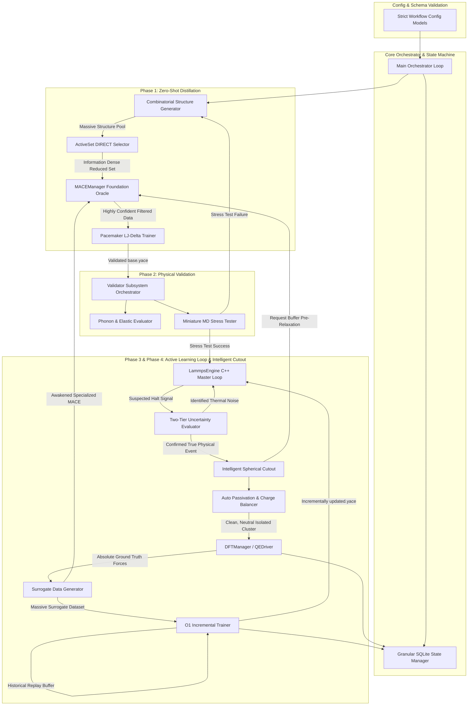

# PYACEMAKER Next Generation Architecture

## 1. Summary

The PYACEMAKER system is an advanced orchestration platform meticulously designed to automate the construction, refinement, and validation of robust Machine Learning Interatomic Potentials (MLIPs). The current system, developed in Phase 01, successfully established the fundamental building blocks of the Active Learning loop, including the ability to run simulations, evaluate uncertainty, and trigger retraining. However, when deploying this foundational system at a practical High-Performance Computing (HPC) scale—specifically aiming for long-duration molecular dynamics (MD) simulations involving tens of thousands to millions of atoms—several critical, fatal physical and systemic limitations became undeniably apparent. These include an unacceptable break in MD time-continuity upon uncertainty halts, hypersensitivity to thermal noise, physical divergence (dangling bonds and dipole moments) during naive cluster extraction, catastrophic computational explosions resulting from batch retraining, and a pervasive system fragility where C++ LAMMPS crashes ungracefully terminate the entire Python orchestrator.

To systematically and decisively address these formidable challenges, the Next Generation Architecture (Version 2.1.0) introduces a sophisticated hierarchical distillation paradigm directly inspired by FLARE. The core architectural shifts engineered to resolve these issues include an Inversion of Control (Master-Slave inversion) to enable absolutely seamless MD resumption without resetting the system's temporal state, a robust two-tier uncertainty threshold system meticulously calibrated to filter out harmless thermal noise, intelligent cluster extraction augmented with automatic passivation to prevent physical anomalies, and incremental delta learning designed to maintain computational feasibility while preventing catastrophic forgetting of previously learned stable states. By strategically leveraging advanced foundation models (like MACE) for zero-shot distillation and intelligent pre-relaxation, the system aims to drastically reduce the reliance on expensive Density Functional Theory (DFT) calculations while concurrently achieving near-DFT accuracy for modeling complex materials phenomena such as phase transformations and diffusion over extended timescales. This comprehensive document outlines the intricate system design, architectural boundaries, and precise implementation plan required to evolve PYACEMAKER to this next-generation standard.

## 2. System Design Objectives

The overarching, primary objective of the Next Generation PYACEMAKER architecture is to empower stable, ultra-long-timescale Molecular Dynamics (MD) simulations involving massive systems of up to millions of atoms, specifically targeting complex, multi-element systems (such as the Fe-Pt-Mg-O quaternary system). Achieving this monumental capability necessitates satisfying the following highly critical goals and strict systemic constraints.

**1. Uninterrupted Physical Continuity (Seamless Resume):**
The absolute most critical physical requirement is the complete elimination of time-continuity breaks during Active Learning halts. In the current paradigm, when the simulation inevitably encounters an unknown, uncertain state and must pause to query the Oracle (DFT) to update the underlying potential, it fundamentally resets and resumes from the initial starting structure after the retraining phase is complete. This naive approach mathematically prevents the observation of long-term physical phenomena like atomic diffusion, grain boundary migration, or complex phase transitions, which require millions of continuous integration steps to manifest. Therefore, the new system must inherently invert the control flow. The Python orchestrator must become a subservient process, a "slave" to the primary LAMMPS C++ execution loop, or alternatively, implement an overwhelmingly robust checkpoint and restart mechanism that guarantees absolute state preservation. When resumed, the simulation must flawlessly pick up from the exact temporal state—the identical timestep, the precise atomic coordinates, and the exact velocity distributions—at which it initially paused, ensuring continuous physical evolution.

**2. Absolute Robustness Against Thermal Noise and Physical Divergence:**
The current system is critically flawed in its simplistic approach to halting: a single uncertainty threshold dictates whether the system stops. This singular metric causes the system to react far too sensitively to momentary, transient spikes in uncertainty caused by normal thermal vibrations (which are physically safe and expected noise), leading to unnecessary computational burdens and potentially infinite loops of redundant training. The new architecture must enforce a rigorous two-tier threshold evaluation system: one threshold to define a sustained, statistically significant "event" that genuinely requires DFT intervention, and a stricter, secondary threshold to meticulously identify the specific individual atoms (the "epicentre") that actually require retraining. Furthermore, when extracting these epicentre atoms to formulate a manageable cluster for computationally expensive DFT calculations, the resulting sub-system must be physically, structurally, and electrically sound. If an uncertain region is naively cut out from a massive periodic system into a vacuum, a massive quantity of dangling bonds is instantaneously generated on the cut surface. This invariably causes severe charge imbalance and dipole moment divergence. As a direct result, the DFT Self-Consistent Field (SCF) loop will either catastrophic fail to converge, or worse, it will successfully converge on non-physical "garbage" electronic states, poisoning the subsequent learning model. To categorically prevent this, the architecture must strictly enforce intelligent cutout boundaries, mandate MACE-driven pre-relaxation of the surrounding buffer zone to heal strain, and require automatic, intelligent passivation of dangling bonds (e.g., utilizing fractional hydrogen termination based on precise electronegativity rules) to guarantee SCF convergence and data integrity.

**3. Computational Efficiency and Scalability through O(1) Updates:**
The legacy design of re-executing full batch retraining utilizing the entirety of the accumulated dataset at every single Active Learning step leads to an inevitable computational explosion, scaling disastrously as O(N) where N is the number of accumulated structures. Moreover, this approach systematically leads to the catastrophic forgetting of stable, baseline bulk structures as the dataset becomes increasingly dominated by exotic, high-error structures encountered during halts. To ensure scalability to the HPC level, the new architecture must definitively abandon batch retraining and strictly employ incremental delta learning (incremental updates). This process must utilize a carefully managed, fixed-size replay buffer containing historically verified, high-value data alongside the newly acquired epicentre data. This crucial architectural mandate ensures that the computational time required to update the potential remains absolutely constant, mathematically O(1), regardless of how many thousands of Active Learning iterations have previously occurred. Additionally, the system must aggressively leverage pre-trained foundation models (MACE) to rapidly, virtually generate massive volumes of surrogate data situated locally around the phase space of the epicentre, thereby multiplying the informational value of a single, exceptionally expensive DFT calculation by orders of magnitude. The Oracle dispatch mechanism itself must also be fully asynchronous, capable of natively distributing workloads across available HPC nodes to maximize hardware utilization.

**4. Additive Integration, Legacy Preservation, and Boundary Management:**
This architecture represents an evolutionary leap built upon a substantial, pre-existing codebase. A core, non-negotiable objective is to maximize the reuse of existing, heavily validated modules, schemas, and testing infrastructure. New features must be integrated with a strictly additive mindset, systematically avoiding the outright rewriting of functional legacy code unless absolutely mathematically necessary. For example, the pre-existing `extract_local_region` function should not be discarded; rather, it must be cleanly wrapped and extended by the new, more sophisticated intelligent cutout logic. Strict separation of concerns must be rigorously maintained across all boundaries to prevent the emergence of unmaintainable "God Classes." The Simulation Engine (LAMMPS) must be exclusively responsible for executing simulations and managing internal process state; it must absolutely not contain logic for data extraction or threshold evaluation. Similarly, the Validator module must evaluate physical properties but must not handle database serialization, and the Oracle must remain a pure abstract interface, allowing for the seamless interchangeability of underlying computational backends (e.g., swapping MACE for a different MLIP, or QE for VASP) without requiring cascading modifications throughout the orchestrator.

## 3. System Architecture

The comprehensive Next Generation PYACEMAKER architecture is methodically composed of four highly distinct, sequential hierarchical phases: Zero-Shot Distillation & Baseline Construction, Physical Validation & Stress Testing, Intelligent Cutout & Passivation, and finally, Hierarchical Fine-tuning & Seamless Resumption. The entire system effectively operates as an advanced state machine, orchestrating these complex phases while simultaneously maintaining exceptionally strict boundary management rules between its isolated components to guarantee maintainability and prevent state leakage. The architecture is designed to fundamentally shift the paradigm from reactive error correction to proactive physical modeling, leveraging the immense power of foundation models to reduce the computational burden on traditional, costly first-principles methods. By strictly adhering to these defined boundaries, the system ensures that each component can be independently tested, scaled, and eventually upgraded without disrupting the holistic workflow of the materials discovery process.

### Boundary Management and Strict Separation of Concerns
To guarantee the structural integrity and long-term maintainability of the PYACEMAKER codebase, the following architectural rules are strictly enforced and non-negotiable across all modules.
1.  **Absolute Immutability of Configuration**: Dependency-injected configuration objects (e.g., `MDConfig`, `DistillationConfig`, `WorkflowConfig`) must be treated as strictly immutable by any and all components that consume them. Under no circumstances should a component modify a configuration object in-place. If an engine or a validation step requires a temporary state override (such as temporarily adjusting a timestep or modifying a convergence threshold for a specific recovery attempt), these specific overrides must be passed explicitly via dedicated method kwargs (e.g., `override_n_steps`) rather than mutating the globally shared `engine.config` object. This definitively prevents concurrent state leaks and unpredictable downstream behavior in parallel HPC environments.
2.  **Strictly Abstract Interfaces**: All programmatic interactions with external, computationally intensive physics engines (such as LAMMPS, Quantum Espresso, and the Pacemaker training framework) must rigorously occur exclusively through strictly typed, thoroughly documented abstract base classes (e.g., `BaseEngine`, `BaseOracle`, `BaseTrainer`). Concrete implementations must never be directly instantiated by the main orchestrator; they must be provided via a secure Factory pattern or robust dependency injection. This guarantees that the core business logic remains entirely decoupled from the idiosyncrasies of specific third-party scientific software versions.
3.  **Rigorous Data Isolation**: The `LammpsEngine` class must adhere to the Single Responsibility Principle. It is exclusively responsible only for executing simulations, managing the C++ subprocess state, and handling raw execution errors. It must definitively delegate the intricate, parsing of thermodynamic outputs, dump files, and log files to a strictly separated, dedicated `LammpsResultParser` class. The engine calculates; the parser interprets.
4.  **Targeted Error Handling**: Domain-specific components are required to catch and meticulously handle explicitly expected errors (e.g., `SCFConvergenceError` from a DFT run, or a `LostAtomsError` from an MD run) and intelligently translate them into actionable domain events for the orchestrator to process. Broad, indiscriminate `Exception` catching blocks (e.g., `except Exception: pass`) are strictly prohibited, as they maliciously obscure fundamental system failures and prevent critical system signals (like a `KeyboardInterrupt` or a Slurm preemption signal) from propagating correctly to the top-level handler.

### Mermaid Architecture Diagram


```mermaid
graph TD
    %% Subsystems Definition
    subgraph Config & Schema Validation
        CFG[Strict Workflow Config Models]
    end

    subgraph Core Orchestrator & State Machine
        ORCH[Main Orchestrator Loop]
        STATE[Granular SQLite State Manager]
    end

    subgraph Phase 1: Zero-Shot Distillation
        P1_GEN[Combinatorial Structure Generator]
        P1_DIR[ActiveSet DIRECT Selector]
        P1_ORACLE[MACEManager Foundation Oracle]
        P1_TRAIN[Pacemaker LJ-Delta Trainer]
    end

    subgraph Phase 2: Physical Validation
        P2_VAL[Validator Subsystem Orchestrator]
        P2_PHONON[Phonon & Elastic Evaluator]
        P2_MINIMD[Miniature MD Stress Tester]
    end

    subgraph Phase 3 & Phase 4: Active Learning Loop & Intelligent Cutout
        LAMMPS[LammpsEngine C++ Master Loop]
        EVAL[Two-Tier Uncertainty Evaluator]
        CUTOUT[Intelligent Spherical Cutout]
        PASSIVATE[Auto Passivation & Charge Balancer]
        DFT[DFTManager / QEDriver]
        SURR[Surrogate Data Generator]
        DELTA[O1 Incremental Trainer]
    end

    %% Flow Phase 1
    CFG --> ORCH
    ORCH --> P1_GEN
    P1_GEN -- Massive Structure Pool --> P1_DIR
    P1_DIR -- Information Dense Reduced Set --> P1_ORACLE
    P1_ORACLE -- Highly Confident Filtered Data --> P1_TRAIN
    P1_TRAIN -- Validated base.yace --> P2_VAL

    %% Flow Phase 2
    P2_VAL --> P2_PHONON
    P2_VAL --> P2_MINIMD
    P2_MINIMD -- Stress Test Success --> LAMMPS
    P2_MINIMD -- Stress Test Failure --> P1_GEN

    %% Flow Phase 3 & 4
    LAMMPS -- Suspected Halt Signal --> EVAL
    EVAL -- Identified Thermal Noise --> LAMMPS
    EVAL -- Confirmed True Physical Event --> CUTOUT
    CUTOUT -- Request Buffer Pre-Relaxation --> P1_ORACLE
    CUTOUT --> PASSIVATE
    PASSIVATE -- Clean, Neutral Isolated Cluster --> DFT
    DFT -- Absolute Ground Truth Forces --> SURR
    SURR -- Awakened Specialized MACE --> P1_ORACLE
    SURR -- Massive Surrogate Dataset --> DELTA
    DELTA -- Historical Replay Buffer --> DELTA
    DELTA -- Incrementally updated.yace --> LAMMPS

    %% Storage and Persistence Flow
    ORCH --> STATE
    DELTA --> STATE
    DFT --> STATE
```

## 4. Design Architecture

The detailed design architecture of the PYACEMAKER system deeply leverages highly modern, robust software engineering patterns, specifically incorporating strict Dependency Injection frameworks, the Repository Pattern for resilient, crash-proof state management, and incredibly strict Pydantic model validation to ensure data integrity at every interface boundary. The envisioned directory structure will strategically build upon the currently existing foundational codebase, carefully adding new modules in a thoroughly isolated, safe manner to prevent any destabilization of legacy functionalities. By strictly enforcing these design paradigms, we ensure that the system remains highly modular, inherently testable, and capable of gracefully scaling to handle the immense complexities of multi-million atom simulations across distributed HPC environments without succumbing to technical debt.

### File Structure (ASCII Tree Representation)

```text
src/pyacemaker/
├── core/
│   ├── engine.py           # Master-Slave LammpsEngine, Seamless Resume Logic
│   ├── oracle.py           # MACEManager Integration, TieredOracle Abstract Factory
│   ├── trainer.py          # FinetuneManager, Incremental Delta Learning, Replay Buffers
│   ├── validator.py        # Automated Phonon, Elastic, and Mini-MD validation flows
│   └── orchestrator.py     # Main state machine and task sequence controller
├── domain_models/
│   ├── config.py           # Core Pydantic Configuration Models (Strict Validation)
│   ├── defaults.py         # Centralized hardcoded default values and physics constants
│   └── workflow.py         # Shared workflow models (Thresholds, CutoutConfig, Strategy)
├── interfaces/
│   ├── qe_driver.py        # Existing stable Quantum Espresso interface
│   ├── lammps_driver.py    # Existing stable LAMMPS process interface
│   └── pacemaker_driver.py # Existing stable Pacemaker execution interface
├── utils/
│   ├── extraction.py       # Intelligent Cutout mechanics, Two-Tier Evaluator math
│   ├── embedding.py        # Existing PBC embedding and vacuum layer insertion
│   ├── structure.py        # Auto-Passivation logic, electronegativity analysis
│   └── lammps_parser.py    # Decoupled, robust LAMMPS output result parsing
└── main.py                 # Primary CLI Entry point and argument parsing
```

### Core Domain Pydantic Models and Typing Strategy

The core domain models must be meticulously updated and strategically placed within the `domain_models/workflow.py` file to absolutely prevent catastrophic circular dependencies that plague monolithic Python architectures, while simultaneously ensuring crystal-clear integration into the pre-existing, legacy `config.py` structure. All models must utilize Pydantic's `@model_validator(mode="after")` to rigorously enforce complex, cross-field logical physical constraints (e.g., ensuring that a defined core radius is mathematically always strictly less than the defining buffer radius, preventing nonsensical geometric extraction).

*   **`ActiveLearningThresholds`**: Meticulously defines the mathematical parameters for the critical two-tier evaluation system designed to ignore thermal noise.
    *   `threshold_call_dft` (float): The primary, lower uncertainty limit that triggers a potential halt sequence.
    *   `threshold_add_train` (float): The stricter, higher limit mathematically determining exactly which specific individual atoms form the learning epicentre.
    *   `smooth_steps` (int): The precise number of consecutive molecular dynamics steps required to remain over the primary threshold to statistically confirm a true physical event, effectively rejecting transient thermal noise spikes.
*   **`CutoutConfig`**: Comprehensively controls the complex geometric and physical repair mechanisms of the extracted clusters prior to DFT evaluation.
    *   `core_radius` (float): The defined spatial radius for assigning a force weight of exactly 1.0.
    *   `buffer_radius` (float): The defined additional spatial thickness for the pre-relaxation zone surrounding the core.
    *   `enable_pre_relaxation` (bool): A strict toggle controlling the activation of MACE-driven, strain-relieving buffer relaxation.
    *   `enable_passivation` (bool): A strict toggle controlling the activation of intelligent fractional hydrogen addition to sever bonds.
*   **`DistillationConfig`**: Governs the overarching parameters for the initial Phase 1 zero-shot learning and combinatorial exploration process.
    *   `mace_model_path` (str): The strict file path or registry identifier for the foundational MACE model to be utilized.
    *   `uncertainty_threshold` (float): The absolute confidence threshold mathematically required for selecting MACE predictions as valid ground truth.
*   **`LoopStrategyConfig`**: The master configuration model that orchestrates the overall flow.
    *   Strictly includes the `ActiveLearningThresholds` model and specific settings for the `replay_buffer_size` to enable and control the rate of incremental updates and mitigate catastrophic forgetting.

These entirely new, highly sophisticated models will be integrated into the main `MDConfig` and `WorkflowConfig` objects strictly additively. Pre-existing legacy configurations will absolutely not be broken; instead, the integration of these new models will gracefully provide sensible, robust default configurations that seamlessly activate the advanced, highly capable Next Generation features only when explicitly requested by the researcher, ensuring perfect backward compatibility.

## 5. Implementation Plan

To ensure absolute system stability, maintain backward compatibility, and allow for rigorous testing of highly complex physical interactions, the monumental development of this Next Generation Architecture is strictly and immutably divided into exactly five distinct, sequential implementation cycles. Each cycle must be fully implemented, rigorously tested, thoroughly reviewed, and merged before work on the subsequent cycle may commence. This systematic, phased approach guarantees that the immense complexity of the project remains manageable and that foundational changes are solidified before building higher-order abstractions upon them.

### Cycle 01: Core Extraction and Auto-Passivation Mechanics
The primary objective of this foundational cycle is to implement the underlying physical and mathematical logic required to safely and intelligently extract unstable atomic clusters from a massive periodic system, ensuring that the resulting isolated structure is physically sound, electrically neutral, and completely ready for convergent DFT evaluation. Without this flawless extraction capability, any subsequent DFT calculation will inevitably fail or produce poisoned data.
**Cycle 01 Features:**
*   Meticulously implement the foundational `ActiveLearningThresholds` and `CutoutConfig` strict Pydantic models within the `domain_models/workflow.py` module, ensuring rigorous cross-field validation rules are established (e.g., `core_radius` < `buffer_radius`).
*   Comprehensively refactor the existing `utils/extraction.py` module to introduce the highly advanced `extract_intelligent_cluster` function. This function must perfectly execute complex spatial partitioning based on the provided radii parameters without mutating the original massive structure.
*   Implement the sophisticated Two-Tier Evaluator mathematical logic to precisely identify the specific epicentre atoms based on the strict `threshold_add_train` parameter, distinctly separating them from the broader `threshold_call_dft` trigger zone.
*   Develop the critical, complex auto-passivation logic within the `utils/structure.py` module. This must involve analyzing bond lengths and standard electronegativity tables to intelligently add appropriate dummy atoms (like fractional hydrogen) to severed dangling bonds, ensuring absolute charge neutrality and preventing dipole divergence.
*   Create a robust, deterministic mock `MACEManager` interface. This mock is absolutely critical to support the rigorous testing of the pre-relaxation algorithms without requiring the presence of massive, GPU-dependent external foundation models during standard unit test execution.

### Cycle 02: Master-Slave Inversion and Seamless Resume Capabilities
The primary objective of this highly complex cycle is to fundamentally rewrite the interaction paradigm between the Python orchestrator and the LAMMPS execution engine. The goal is to completely eliminate time-continuity breaks, allowing molecular dynamics to pause, update its underlying mathematical potential, and seamlessly resume without resetting the simulated universe. This is the cornerstone feature required for observing long-timescale phenomena.
**Cycle 02 Features:**
*   Significantly update the `core/engine.py` module, specifically the `LammpsEngine` class, to natively support seamless resume capabilities. This requires deep structural changes to how the Python process manages the subprocess lifecycle.
*   Implement the definitive Master-Slave inversion. This must be achieved either by utilizing the highly advanced LAMMPS `fix python/invoke` functionality to call Python directly from C++, or by developing an overwhelmingly robust `.restart` file management system that flawlessly preserves the exact, precise MD state (all atomic coordinates, all velocities, and the exact simulation timestep) across consecutive halts and restarts.
*   Develop critical soft-start thermodynamic logic (e.g., the temporary application of a highly aggressive Langevin thermostat for the first 10-50 steps following a resume). This is absolutely necessary to prevent disastrous, system-destroying energy spikes that inevitably occur upon resuming a simulation with a newly updated, slightly shifted mathematical potential.
*   Strictly decouple all complex LAMMPS output parsing logic (reading thermodynamics, extracting stresses) out of the execution engine and into a newly dedicated, highly testable `utils/lammps_parser.py` module, adhering to the Single Responsibility Principle.
*   Ensure that any temporary files or `.restart` directories generated during this complex handoff process are rigorously tracked and securely cleaned up using proper context managers to prevent uncontrolled disk space exhaustion on HPC nodes.

### Cycle 03: Tiered Oracles and Zero-Shot Distillation Integration
The primary objective of this cycle is to introduce foundational AI models into the workflow to drastically reduce the reliance on computationally ruinous DFT calculations. This involves building the infrastructure to query these models and the logic to use their generalized knowledge to create robust starting potentials without running a single first-principles calculation.
**Cycle 03 Features:**
*   Implement the comprehensive, fully functional `MACEManager` class, heavily leveraging the external MACE foundation model. This integration must be highly robust, properly handling GPU memory allocation, and must be capable of extracting not just energies and forces, but the critical mathematical uncertainty outputs required for active learning.
*   Develop the highly intelligent `TieredOracle` within the `core/oracle.py` module. This component must contain complex, deterministic routing logic designed to seamlessly route evaluation requests between the fast MACE model and the slow DFT engine based exclusively on the rigorously evaluated uncertainty metrics.
*   Implement the complete Phase 1 Zero-Shot Distillation mathematical logic. This encompasses building the combinatorial generator to create massive structure pools, integrating the legacy DIRECT sampling (ActiveSetSelector) to reduce this pool to an information-dense core, and applying strict MACE confidence filtering.
*   Integrate baseline Delta Learning configurations. Ensure the system can automatically generate the correct parameters to train against a safe, physics-based repulsive baseline (like Lennard-Jones or ZBL potentials) to physically prevent atoms from catastrophically overlapping in highly compressed states.
*   Establish strict fallback mechanisms; if the MACE model fails to load or infer correctly, the system must gracefully handle the failure and appropriately fallback to safe defaults or alert the orchestrator, rather than silently crashing.

### Cycle 04: Hierarchical Fine-Tuning and Incremental Updates
The primary objective of this cycle is to solve the critical issue of catastrophic forgetting and the O(N) scaling disaster associated with batch retraining. The system must be upgraded to perform rapid, targeted updates using a mix of new high-value data and historically proven data, drastically reducing the time required for a potential update during a simulation halt.
**Cycle 04 Features:**
*   Substantially update the `core/trainer.py` module to fully support complex incremental updates. This requires modifying how data is fed into the underlying Pacemaker executable, moving away from monolithic data files to targeted update sets.
*   Implement highly sophisticated replay buffer mathematical logic. This system must intelligently mix a statistically sound sample of historical data with the newly acquired Active Learning data, utilizing specific weighting algorithms to definitively prevent catastrophic forgetting of previously learned stable bulk structures.
*   Develop the specialized `FinetuneManager`. This critical component must be designed to briefly and highly efficiently tune specifically the readout layers of the MACE PyTorch model based exclusively on the newly acquired, pristine DFT data, creating an "awakened" model locally specialized for the current anomaly.
*   Implement explosive surrogate data generation utilizing this newly awakened MACE model. The system must rapidly generate thousands of synthetic data points by exploring the phase space immediately surrounding the halted epicentre, allowing the subsequent ACE delta learning to train on a massive, highly relevant dataset safely generated without additional DFT costs.
*   Ensure that all dataset manipulations, concatenations, and sub-sampling routines are meticulously optimized using efficient NumPy/ASE array operations to strictly maintain O(1) memory profiling, preventing memory exhaustion when dealing with million-atom systems.

### Cycle 05: Physical Validation, State Management, and Final Integration
The final objective of this comprehensive project is to solidify the system for production deployment on highly volatile HPC environments. This involves automating rigorous physical checks to ensure generated potentials are actually usable, and building an unbreakable state management system that can survive any external catastrophic failure.
**Cycle 05 Features:**
*   Significantly enhance the `core/validator.py` module to fully automate the critical Phase 2 physical checks. This involves programmatically executing Phonon dispersion calculations, Elastic constant derivations, and high-temperature Mini-MD stress tests, complete with automated retry loops if stability criteria are not met.
*   Implement an overwhelmingly robust SQLite or highly structured JSON-based task-level checkpointing system. This must save the exact system state not just at the end of an iteration, but continuously during long surrogate generation loops or after every single DFT calculation, ensuring rapid recovery after brutal HPC wall-time terminations.
*   Develop relentless, parallel artifact cleanup daemon processes. These critical background tasks must actively compress or permanently remove massive `.wfc` (wavefunction) and LAMMPS dump files immediately after they are successfully consumed by the learning or inference processes, categorically preventing storage quota exhaustion.
*   Finalize the primary orchestrator loop, meticulously and seamlessly linking Phase 1 (Distillation) through Phase 4 (Fine-tuning and Resume), ensuring that all strict architectural boundaries, error handling protocols, and immutability constraints are flawlessly respected throughout the entire lifecycle.
*   Conduct comprehensive, holistic End-to-End (E2E) testing encompassing all five cycles simultaneously, simulating massive system crashes, thermal noise spikes, and complex phase transitions to categorically prove the system's absolute resilience and scientific validity.

## 6. Test Strategy

Testing in the PYACEMAKER Next Generation Architecture is not an afterthought; it is a foundational pillar. Testing will be rigorously, relentlessly applied at every single cycle to ensure absolutely no regressions occur in the heavily validated existing codebase, and to mathematically validate the incredibly complex physical interactions of the newly introduced architecture. All tests must be designed to run quickly and reliably without requiring massive external computational resources.

*   **Cycle 01 Test Strategy:**
    The primary focus here is mathematical precision and physical validity of the extraction geometry.
    *   **Unit Tests:** We must rigorously verify all Pydantic model validations (e.g., asserting that contradictory radii constraints actively raise the correct `ValidationError`). We must mathematically test the exact distance calculations of the Two-Tier Evaluator to ensure atoms are perfectly binned into core, buffer, or ignored categories.
    *   **Integration Tests:** We will feed a perfectly known, highly symmetrical bulk structure into the `extract_intelligent_cluster` function. We must then programmatically assert that the core is perfectly isolated, the buffer is correctly weighted, and the auto-passivation logic flawlessly identifies uncoordinated surface atoms and correctly adds the exact stoichiometric ratio of fractional hydrogen required to achieve absolute charge neutrality.
    *   **Side-effect Mitigation:** Absolutely no file I/O or external ML models will be called during these tests. All verifications must exclusively utilize in-memory ASE Atoms objects to guarantee millisecond execution times and absolute environmental isolation.

*   **Cycle 02 Test Strategy:**
    The primary focus is process control, state preservation, and thermodynamics.
    *   **Unit Tests:** We must systematically test the string generation algorithms responsible for writing the complex LAMMPS input scripts and the specific `.restart` commands, ensuring perfect syntax compatibility with the target LAMMPS executable version.
    *   **Integration Tests:** We will execute a short, highly controlled LAMMPS MD run, programmatically trigger a simulated mock halt, silently update the underlying potential file, and assert with absolute mathematical certainty that the subsequent run starts precisely from the exact last timestep and perfectly inherits the identical velocity distribution, proving the seamless resume capability.
    *   **Side-effect Mitigation:** We must strictly utilize `pytest` temporary directory fixtures (`tmp_path`) for absolutely all LAMMPS input generation, output parsing, and massive `.restart` file storage. These directories must be demonstrably purged upon test completion to prevent catastrophic filesystem pollution on CI servers.

*   **Cycle 03 Test Strategy:**
    The primary focus is routing logic, inference stability, and combinatorial math.
    *   **Unit Tests:** We will rigorously test the complex routing logic of the `TieredOracle`, injecting mock structures with specific uncertainty values to guarantee that the system flawlessly routes high-certainty structures to MACE and routes low-certainty structures to the DFT fallback mechanism.
    *   **Integration Tests:** We will thoroughly mock the external MACE model to consistently return predictable energies, forces, and critically, specific uncertainty values. We will then verify that the Phase 1 distillation process successfully executes the DIRECT sampling and correctly selects the precise mathematical subset of structures dictated by the mock confidence scores.
    *   **Side-effect Mitigation:** The `MACEManager` must strictly implement a highly robust "mock mode." Any unauthorized network calls attempting to download massive, gigabyte-scale foundation models from remote repositories during standard test execution are strictly, categorically prohibited and must result in an immediate test suite failure.

*   **Cycle 04 Test Strategy:**
    The primary focus is data manipulation, sampling statistics, and preventing memory leaks.
    *   **Unit Tests:** We must rigorously, mathematically verify the replay buffer sub-sampling algorithms, executing thousands of iterations to statistically guarantee that the correct, configurable proportions of old historical data versus newly acquired Active Learning data are being flawlessly mixed without bias.
    *   **Integration Tests:** We will execute a fully mocked incremental update sequence. We must definitively assert that the `PacemakerTrainer` interface receives a correctly concatenated dataset containing both the new, specific epicentre data and the historically sampled replay buffer, formatted perfectly for the underlying execution engine.
    *   **Side-effect Mitigation:** We must comprehensively mock the highly intensive Pacemaker execution environment. Instead of executing the heavy trainer, tests will programmatically assert on the exact string contents of the generated `input.yaml` files and the atomic configurations within the generated `.extxyz` files, verifying intent rather than requiring massive computational expenditure.

*   **Cycle 05 Test Strategy:**
    The primary focus is holistic system resilience, state recovery, and end-to-end workflow validation.
    *   **E2E Tests:** We will meticulously execute the entire workflow utilizing a dedicated "Mock Mode" (where the DFT engine is mocked to return immediate, mathematically deterministic dummy forces). We must strictly validate the flawless state transitions sequentially moving from Phase 1 through Phase 4, proving the orchestration logic.
    *   **Resilience Tests:** We will deliberately and aggressively raise fatal Python exceptions (e.g., simulating a sudden `MemoryError` or `ProcessLookupError`) during critical, mid-orchestration steps. We will then verify that the SQLite checkpoint system can accurately and flawlessly resurrect the state machine from the exact moment of failure, without losing any previously computed data.
    *   **Side-effect Mitigation:** We must aggressively utilize mocked Oracles and Trainers to compress E2E test execution from potentially hundreds of hours down to mere seconds. All generated artifacts, including the massive SQLite databases, must be rigorously constrained to controlled, automatically deleted temporary paths to ensure zero permanent system modification.
