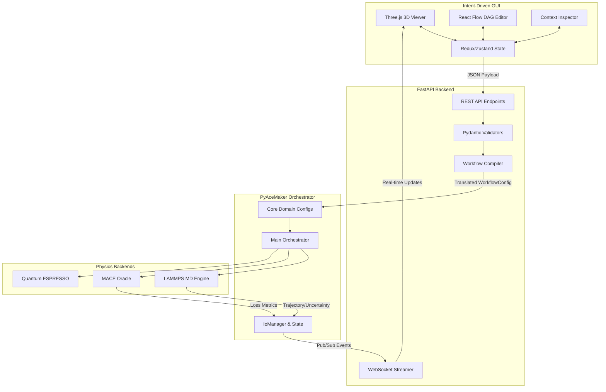

# PyAceMaker System Architecture

## Summary
The PyAceMaker Next-Generation Adaptive Machine Learning Interatomic Potentials Orchestrator integrates the adaptive-mlip core engine with a sophisticated, user-friendly Intent-Driven Graphical User Interface (GUI). This new architecture completely revolutionizes active learning workflows for complex molecular dynamics by introducing a modern, highly interactive visual platform designed specifically to alleviate the cognitive load traditionally imposed on non-expert engineers and researchers. The overarching goal is to transform the existing powerful Python backend, which orchestrates massive Density Functional Theory (DFT) computations, intelligent cutout algorithms, and seamless LAMMPS simulation state resumption, into a highly robust and visually intuitive application. By adopting a strictly decoupled React.js and Three.js frontend alongside a highly asynchronous FastAPI gateway, the system seamlessly abstracts complex text-based configurations (e.g., LAMMPS region tagging, hyperparameter optimization) into intuitive graphical interactions like 3D spatial painting, intelligent slider controls (Accuracy vs. Speed), and node-based Direct Acyclic Graph (DAG) construction. This document precisely specifies the architectural blueprint ensuring maximum reuse of existing PyAceMaker domain models, strictly enforced separation of concerns, and an entirely additive evolution of the codebase. It details how the visual intents are translated into physical simulations securely and efficiently.

## System Design Objectives
The primary design objectives of the PyAceMaker visual platform heavily revolve around robustly fulfilling the "Core Philosophy" of the adaptive-mlip Intent-Driven GUI framework. Our highest priority is to completely liberate materials scientists and process engineers from the traditional "leaky abstractions" associated with complex Command Line Interface (CUI) script generation. This requires entirely eliminating the necessity for users to directly manipulate abstract variables such as learning rates, explicit LAMMPS `fix gcmc` command arguments, or text-based spatial coordinate parameters. Instead, the user interface will strictly operate using domain-specific semantics—capturing the target material, the desired physical property, and the available computational budget. This abstraction is not merely cosmetic; it represents a fundamental shift in how computational materials science is performed, moving from script-based execution to intent-based orchestration.

To achieve this paradigm shift safely, the architecture must guarantee a strict Separation of Concerns (SoC) between the visual representation layer and the underlying physical execution engines. We achieve this by establishing a highly resilient API gateway utilizing FastAPI, effectively isolating the React.js and Three.js frontend from the Python and C++ computational backend. This API gateway fundamentally relies on strictly typed Pydantic schemas, inheriting and safely extending the existing `pyacemaker.domain_models` structure, to completely validate all incoming visual configuration payloads before they ever interact with the calculation orchestrator. This validation layer acts as an Anti-Corruption Layer, ensuring that no malformed intent can crash the underlying physics engines.

Furthermore, the system must handle highly asynchronous, long-running processes gracefully. Active learning loops and deep DFT validations operate on timescales of hours or days; therefore, the architecture must incorporate a real-time, bi-directional communication protocol via WebSockets. This ensures the 3D visualization components can actively stream and render the exact physical state, atomic uncertainties, and phase transformations in real-time, providing immediate, mathematically sound visual feedback to the user without blocking the underlying orchestrator. This real-time capability builds trust in the Machine Learning Interatomic Potential (MLIP) by rendering the AI's internal uncertainty metrics directly onto the 3D atomic structure.

Finally, the system design mandates an entirely "Additive Mindset." We will meticulously preserve all existing tested logic within `src/pyacemaker/core` and `interfaces`, specifically utilizing dependency injection and adapter patterns to bridge the new FastAPI endpoints directly into the existing Orchestrator and State Manager. This zero-regression objective is paramount, guaranteeing that previous configurations, tests, and CLI functionalities remain entirely functional and utterly secure throughout the evolution of the platform. The new GUI features are an optional layer that enhances, rather than replaces, the existing capabilities. This additive approach ensures a smooth transition for existing power users while dramatically lowering the barrier to entry for newcomers.

## System Architecture
The PyAceMaker graphical system strictly employs a distributed, service-oriented architecture specifically engineered to handle complex materials science simulations. At its core, the system securely decouples the complex orchestration of Quantum ESPRESSO, MACE MLIPs, and LAMMPS into a highly scalable backend, whilst completely abstracting user interactions into a highly responsive web interface. The frontend, constructed entirely with React.js and Three.js, is organized into a tri-pane layout explicitly designed for visual semantic tagging, DAG workflow editing, and real-time context-aware inspection. All interactions are deeply serialized into robust JSON payloads and safely transmitted to the backend layer. The architecture dictates that the frontend remains completely stateless regarding the physics simulation; it acts solely as a sophisticated visualization and intent-gathering terminal.

The crucial intermediary layer is the FastAPI Gateway. This gateway actively acts as the sole entry point to the computational logic. It performs completely rigorous validation on all incoming Intent-Driven configurations strictly utilizing extensively validated Pydantic models. Once validated, this gateway actively translates these semantic representations into the deeply complex internal `WorkflowConfig` structures native to PyAceMaker. Furthermore, the gateway manages secure, asynchronous WebSocket connections, actively establishing a real-time data pipeline explicitly utilizing a robust Publisher-Subscriber mechanism directly wired into the existing PyAceMaker `logger` and `IoManager`. This allows entirely streaming atomic trajectories, localized uncertainty metrics, and active learning trigger events directly into the Three.js 3D viewer for immediate, highly visual analysis. The FastAPI gateway is designed to scale horizontally if deployed in a cloud environment, managing multiple concurrent users assembling complex workflows simultaneously.

Behind the FastAPI gateway resides the completely unmodified, deeply tested PyAceMaker Core Orchestrator. The Core Orchestrator entirely retains its authority over the intricate State Machine, actively managing the Hierarchical Distillation processes, Intelligent Cutout executions, and Seamless MD Resumptions. We strictly introduce the `FastAPIRunner` and the `WorkflowCompiler` explicitly as adapter components. The `WorkflowCompiler` is mathematically responsible for translating the visual DAG and Accuracy-Speed slider inputs into the highly rigid, deeply structured `pyacemaker.domain_models.config` schemas. This specifically ensures that the deeply complex interactions between the MACE oracle, the Two-Tier Evaluator, and the DFT drivers remain completely isolated from the vagaries of frontend state management.


```mermaid
graph TD
    %% Frontend Components
    subgraph Frontend [Intent-Driven GUI]
        UI_3D[Three.js 3D Viewer]
        UI_DAG[React Flow DAG Editor]
        UI_INSP[Context Inspector]
        UI_STATE[Redux/Zustand State]
    end

    %% API Gateway Layer
    subgraph Gateway [FastAPI Backend]
        API_REST[REST API Endpoints]
        API_WS[WebSocket Streamer]
        API_VAL[Pydantic Validators]
        API_COMP[Workflow Compiler]
    end

    %% PyAceMaker Core (Existing & Additive)
    subgraph CoreEngine [PyAceMaker Orchestrator]
        CORE_ORCH[Main Orchestrator]
        CORE_CFG[Core Domain Configs]
        CORE_IO[IoManager & State]
    end

    %% Computational Backends
    subgraph Physics Backends
        BACK_LAMMPS[LAMMPS MD Engine]
        BACK_MACE[MACE Oracle]
        BACK_DFT[Quantum ESPRESSO]
    end

    %% Data Flow
    UI_3D <--> UI_STATE
    UI_DAG <--> UI_STATE
    UI_INSP <--> UI_STATE

    UI_STATE -- JSON Payload --> API_REST
    API_REST --> API_VAL
    API_VAL --> API_COMP
    API_COMP -- Translated WorkflowConfig --> CORE_CFG

    CORE_CFG --> CORE_ORCH
    CORE_ORCH --> BACK_LAMMPS
    CORE_ORCH --> BACK_MACE
    CORE_ORCH --> BACK_DFT

    BACK_LAMMPS -- Trajectory/Uncertainty --> CORE_IO
    BACK_MACE -- Loss Metrics --> CORE_IO

    CORE_IO -- Pub/Sub Events --> API_WS
    API_WS -- Real-time Updates --> UI_3D
```

A critical architectural rule established here is the strict enforcement of unidirectional data flow and clear boundaries. The `WorkflowCompiler` serves as an Anti-Corruption Layer. It ensures that no concepts native to the React frontend (like Canvas X/Y coordinates or node styling information) ever pollute the `WorkflowConfig` payload that the physics orchestrator consumes. The orchestrator must remain entirely oblivious to the existence of a graphical user interface. Conversely, the frontend should not require deep knowledge of LAMMPS syntax or Quantum ESPRESSO pseudopotential formats. The API Gateway acts as the sole translator, holding the mapping logic required to convert intent into execution and execution state back into visualization. This modularity ensures that PyAceMaker can continually evolve its internal physics drivers without breaking the web interface, and vice-versa. The architecture also provisions for robust preflight diagnostics, ensuring that any compiled workflow undergoes a simulated `run 0` initialization to catch structural collisions or syntax errors before committing heavy GPU or CPU resources to the active learning loop.

## Design Architecture
The architectural design heavily leverages exactly defined Pydantic schemas to strictly enforce domain invariants across the entire boundary between the user interface and the computational engine. The structure requires extending the existing configuration models precisely without mutating their deeply validated core mechanics. We introduce a new `pyacemaker.domain_models.gui_schema` module which specifically acts as the strict Anti-Corruption Layer (ACL) against arbitrary front-end data inputs.

```text
src/pyacemaker/
├── api/                       # [NEW] FastAPI Application Boundary
│   ├── routes/                # [NEW] REST and WebSocket endpoints
│   ├── dependencies.py        # [NEW] Dependency injection (DB, Orchestrator)
│   └── server.py              # [NEW] Uvicorn application entrypoint
├── core/
│   ├── orchestrator.py        # [EXISTING] Minor additive hooks for async Pub/Sub
│   ├── evaluator.py           # [EXISTING] Evaluates trajectories
│   ├── ...
├── domain_models/
│   ├── config.py              # [EXISTING] Core workflow definitions
│   ├── gui_schema.py          # [NEW] Intent-Driven payload schemas
│   └── compiler.py            # [NEW] Translates gui_schema -> config
├── interfaces/
│   ├── lammps_driver.py       # [EXISTING] Unmodified execution layer
│   └── ...
└── main.py                    # [EXISTING] CLI entrypoint (Additive update for 'gui' command)
```

The `gui_schema.py` defines critical representations like `IntentRequest`, `DagNode`, and `SpatialRegion`. The `SpatialRegion` model entirely abstracts the concept of LAMMPS groupings. It precisely requires mathematical bounding boxes (e.g., Z-min, Z-max) and explicitly semantic tags (e.g., 'fixed', 'thermostat', 'active'), which the `compiler.py` mathematically translates into standard ASE tags and subsequently into validated LAMMPS `region`, `group`, and `fix setforce` commands. The definition of these spatial regions must strictly constrain inputs to floating-point numbers to prevent command injection vulnerabilities during script generation.

The `IntentRequest` model securely encapsulates the completely abstract "Accuracy vs Speed" slider (integer 1-10), which the compiler intelligently expands into highly specific hyperparameter configurations, strictly mapping scalar values to non-linear pre-calculated thresholds for `candidate_threshold`, learning rates, and active learning interval steps. This explicit separation completely ensures backward compatibility; CLI users can still inject highly detailed `config.yaml` files, whilst GUI users interact purely with the safely restricted, mathematically guaranteed `gui_schema.py` representation layer.

Furthermore, the design of the `gui_schema` enforces strict enumeration for Node Types (e.g., `NodeType.INITIAL_STRUCTURE`, `NodeType.ACTIVE_LEARNING`). This allows the Semantic Compiler to utilize a robust Factory Pattern, routing the translation of each specific node to a dedicated, isolated sub-compiler function. This design prevents the creation of a monolithic "God Class" compiler and ensures that adding new visual node types in the future is a simple matter of defining a new sub-compiler, adhering closely to the Open-Closed Principle of solid software design. The schemas are configured with `extra="forbid"` to ensure that any unrecognized keys sent by the frontend are immediately rejected with a 422 Unprocessable Entity error, protecting the backend from unexpected data pollution.

## Implementation Plan
The integration of the Intent-Driven GUI platform is rigorously divided exactly into 6 highly distinct, entirely sequential development cycles. This specific decomposition entirely guarantees stability and provides extremely manageable Pull Requests for architectural review. Each cycle is designed to be independently verifiable, adding a distinct layer of capability without breaking the foundational functionality established in previous cycles.

*   **Cycle 01: Establish the Foundation API**. We will construct the FastAPI application, routing scaffolding, and the Pydantic `gui_schema` models. We secure the initial REST endpoints specifically designed for receiving and strictly validating incoming DAG and Intent configurations. This cycle focuses purely on receiving and validating JSON, without attempting any complex physical translations. It sets up the CORS policies, error handlers, and dependency injection framework. The implementation will begin by creating the `src/pyacemaker/api` directory structure. Within this, the `server.py` file will instantiate the FastAPI application object. We will heavily utilize Python's `asyncio` framework to ensure the endpoints are non-blocking. The core deliverable is the `gui_schema.py` file within `domain_models`. This file will contain the `IntentRequest` Pydantic model, which must use `ConfigDict(extra="forbid", strict=True)` to act as the Anti-Corruption Layer. We will define the `NodeType` enumeration containing values like `INITIAL_STRUCTURE` and `ACTIVE_LEARNING_LOOP`. We will also implement a `@model_validator` on the `IntentRequest` that performs a topological sort using Kahn's algorithm to guarantee the provided nodes and edges form a valid Directed Acyclic Graph (DAG) without cycles. The `api/routes/workflows.py` file will expose a `POST /api/v1/intent/compile` endpoint that accepts this payload, relying entirely on FastAPI's dependency injection to handle the 422 Unprocessable Entity error generation if the payload violates the schema. Finally, we will update the `main.py` entrypoint using `argparse` to add a `gui` subcommand that launches the Uvicorn server, ensuring legacy CLI operations remain perfectly functional. This cycle establishes the fortified perimeter of the new architecture.
*   **Cycle 02: The Semantic Compiler**. We meticulously build the `compiler.py` layer, establishing the complex mathematical mappings required to completely flawlessly translate `gui_schema.py` representations directly into the deeply nested `pyacemaker.domain_models.config.WorkflowConfig` structures completely without triggering regressions. This cycle implements the topological sorting of the DAG and the injection of intelligent default parameters for missing physics configurations. The implementation begins in `src/pyacemaker/domain_models/compiler.py`. We will design the `SemanticCompiler` class using a Factory Pattern. The class will ingest the validated `IntentRequest` from Cycle 01. It will iterate through the topologically sorted nodes. For an `INITIAL_STRUCTURE` node, it will instantiate a `LammpsDriverConfig` and a `QEDriverConfig`, populating them with sensible defaults (e.g., setting the LAMMPS boundary conditions to `p p p` and the Quantum ESPRESSO convergence threshold to `1e-6`). The most critical part of this implementation is the fallback mechanism: the compiler must identify the chemical elements present in the initial structure and cross-reference them against an internal dictionary to select the appropriate pseudopotential files and empirical pair styles automatically. When encountering an `ACTIVE_LEARNING_LOOP` node, the compiler will instantiate the `TwoTierEvaluatorConfig` and `TrainerConfig`. It must assemble these individual component configs into the final, massive `WorkflowConfig` hierarchy. The `POST /api/v1/intent/compile` endpoint will be updated to invoke this compiler. If the compiler encounters a physically impossible sequence (e.g., active learning before structure definition), it will raise a custom `CompilerError`, which the API will catch and translate into a 400 Bad Request, returning the specific logical contradiction to the React frontend. This cycle provides the intelligence of the system.
*   **Cycle 03: Spatial Tagging and ASE Integration**. We entirely implement the backend translation logic for 3D visual tagging. This strictly ensures that z-axis sliders and bounding boxes generated by the UI are rigorously converted into robust ASE tag attributes and ultimately highly secure, completely valid LAMMPS region/group script commands. This cycle introduces the complex geometry math required to intersect bounding boxes with atomic coordinate arrays. The implementation requires extending `gui_schema.py` to include a `SpatialRegion` Pydantic model, capturing `x_min`, `x_max`, `y_min`, `y_max`, `z_min`, `z_max` floats, and an `action` enum (e.g., `FREEZE`, `THERMOSTAT`). We will create a new utility module at `src/pyacemaker/utils/spatial.py`. This module will contain pure functions that take an `ase.Atoms` object and a list of `SpatialRegion` models. The core logic will utilize heavily vectorized Numpy operations—specifically `np.logical_and` applied across the coordinate axes—to rapidly generate boolean masks identifying which atoms fall inside the user's drawn bounding boxes. These boolean masks will then be converted into unique positive integers and assigned to the `ase.Atoms.set_tags()` property. The implementation must include a deterministic conflict resolution strategy: if a user draws overlapping boxes with conflicting actions (e.g., FREEZE vs THERMOSTAT), the spatial module must assign the tag based on a strict priority hierarchy to avoid ambiguous physics. Finally, the Semantic Compiler from Cycle 02 will be updated to consume these integer tags, dynamically generating the exact LAMMPS `region` and `group` string commands, and appending the corresponding `fix setforce 0.0 0.0 0.0` or `fix langevin` strings into the `LammpsDriverConfig.custom_fixes` array, securely bridging visual intent with C++ execution.
*   **Cycle 04: Real-time Telemetry and WebSockets**. We explicitly integrate `asyncio` Pub/Sub mechanisms entirely within the existing PyAceMaker `IoManager`. We establish robust, high-performance WebSocket endpoints directly streaming trajectory frames, scalar loss metrics, and highly specific atomic uncertainty values for live visualization. This transforms the static simulation into a dynamic, observable process. The implementation starts by modifying `src/pyacemaker/logger.py` and `core/io_manager.py`. We will introduce a thread-safe `asyncio.Queue` into the `IoManager`. The `write_trajectory` method, which currently writes to XYZ files, will be augmented to also construct a minimal dictionary containing atomic coordinates, forces, and the MACE variance arrays (if present), and push it onto this queue. We must implement a "drop-oldest" policy on this queue using `queue.get_nowait()` to prevent out-of-memory errors if the LAMMPS producer thread outpaces the WebSocket consumer. We will define new Pydantic schemas in `telemetry_schema.py` to serialize these frames compactly, ensuring Numpy arrays are converted to standard lists. Next, we will create `src/pyacemaker/api/routes/telemetry.py`. This module will define a FastAPI `@router.websocket("/stream")` endpoint. The implementation will manage a global set of active WebSocket connection objects. We will use FastAPI lifecycle events (`@app.on_event("startup")`) to launch a background `asyncio.Task` that continuously consumes from the `IoManager` queue and broadcasts the JSON payloads to all clients in the active set concurrently using `asyncio.gather`. Crucially, the WebSocket endpoint must wrap the `send_json` call in a `try...except WebSocketDisconnect` block to gracefully handle clients closing their browsers, removing them from the active set without crashing the broadcast loop or the underlying PyAceMaker orchestrator.
*   **Cycle 05: The Accuracy vs. Speed Orchestration Engine**. We rigorously establish the mathematical heuristics mapping the single 1-10 slider integer to complex parameter grids (e.g., modifying `MDConfig.soft_start_steps` and `thresholds`). We ensure this dynamically impacts the state machine completely seamlessly. This cycle involves defining the non-linear scaling functions that control the aggressiveness of the active learning loop based on user intent. The implementation begins in a new module, `src/pyacemaker/domain_models/heuristics.py`. This module will expose a central function, `get_heuristics(slider_value: int) -> dict`. Internally, we will implement specific, isolated scaling functions for each parameter. For example, the `candidate_threshold` (which triggers DFT calls) must be scaled logarithmically; a slider value of 10 (Maximum Accuracy) should produce a threshold of `0.01 eV/atom`, while a value of 1 (Speed) should produce `0.2 eV/atom`. The integration timestep will be scaled linearly, from `0.5 fs` at accuracy 10 to `3.0 fs` at accuracy 1. The implementation must strictly enforce safety bounds using Python's `min()` and `max()` functions to guarantee the scaling algorithms never produce physically impossible values (like a negative timestep). Next, we will update the Semantic Compiler. The compiler will invoke the heuristics engine using the slider value extracted from the `IntentRequest`. The most critical implementation step is the priority merging algorithm. The compiler must merge the heuristically generated default dictionary with any manual overrides the user provided in the "Advanced Settings" payload. It must utilize a deep dictionary merge utility to ensure that user overrides (e.g., explicitly setting `ecutwfc=60`) take absolute precedence over the heuristic defaults, ensuring the platform remains flexible for expert users while providing safe abstraction for beginners.
*   **Cycle 06: Automated Preflight Diagnostics**. We rigorously engineer the "Run 0 Validation" mechanisms. We completely ensure that newly compiled configurations undergo a safe, instantaneous, mathematically isolated initialization phase to strictly prevent structural collisions and deeply complex script errors before committing full compute resources. This cycle implements the `StructuralValidator` and `LammpsSyntaxValidator` to protect the user from costly runtime failures. The implementation involves creating `src/pyacemaker/core/preflight.py`. We will define a `DiagnosticReport` Pydantic model to aggregate errors and warnings. We will implement the `StructuralValidator` using `scipy.spatial.distance.pdist` to calculate the pairwise distance matrix of the initial `ase.Atoms` object efficiently in C. The Python logic will filter this matrix; if any interatomic distance is less than 0.5 Angstroms, it will append a critical error to the report identifying the colliding atomic indices. We will implement the `DependencyValidator` using `os.path.exists()` to synchronously check the filesystem for requested pseudopotential (`.UPF`) and MACE model (`.model`) files. The most complex implementation is the `LammpsSyntaxValidator`. It will instantiate a local `lammps.lammps` Python object. It will extract the generated LAMMPS script from the `WorkflowConfig`, append a `run 0` command, and execute it via `lmp.commands_string()`. This execution must be wrapped in a broad `try...except Exception` block. If the LAMMPS C++ core throws an error due to invalid syntax or an unrecognized fix style, the Python wrapper will catch the `LAMMPSException`, extract the error message, and append it to the diagnostic report, preventing the FastAPI server from crashing. Finally, the `/api/v1/intent/compile` endpoint will be updated to invoke the preflight module immediately after semantic compilation. If the resulting report contains any errors, the API will return a 400 Bad Request with the JSON report, allowing the React frontend to display actionable warnings directly on the visual DAG nodes.

## Test Strategy
The testing methodology strictly enforces the isolation of the new API boundaries and thoroughly protects the deeply integrated execution engines from mock-induced failures. We utilize a combination of fast unit tests for pure functions and comprehensive integration tests for end-to-end API workflows. The strategy heavily relies on Pytest fixtures to provide deterministic environments.

*   **Cycle 01**: Extensively utilize `pytest` alongside `httpx.AsyncClient` to strictly test the FastAPI endpoint routing. We completely validate all `gui_schema` Pydantic models explicitly checking edge cases to ensure rigid data encapsulation. We will write unit tests in `tests/unit/test_gui_schema.py` that intentionally inject floating-point numbers where integers are expected, testing the strict type-casting rules. We will construct cyclical DAG topologies (Node A -> Node B -> Node A) and assert that the Pydantic `@model_validator` correctly executes the topological sort and raises a specific `ValidationError` identifying the cycle. Integration tests in `tests/integration/test_api_endpoints.py` will spin up the Uvicorn server in-memory using `TestClient` and send perfectly formed JSON payloads, asserting that the endpoint returns HTTP 200 OK and properly validates the CORS headers. We will also send massive (50MB) JSON payloads to verify the ASGI server's request size limits behave correctly, ensuring the API cannot be easily subjected to denial-of-service memory exhaustion attacks.
*   **Cycle 02**: Deep integration testing of the `compiler.py`. We actively inject mathematically diverse JSON configurations and strictly assert that the generated `WorkflowConfig` perfectly matches known, entirely valid structural states. Unit tests in `tests/unit/test_compiler.py` will verify the Factory Pattern. We will pass an `IntentRequest` containing only an `INITIAL_STRUCTURE` node and assert the compiler correctly injects the default Quantum ESPRESSO convergence criteria (`1e-6`) and LAMMPS boundary conditions. We will write explicit tests for unsupported topologies, asserting that branching parallel execution intents raise a custom `CompilerError` with a clear, human-readable message. Integration tests will submit an end-to-end payload via the `httpx.AsyncClient`, verifying that the API endpoint catches the `CompilerError` and correctly translates it into an HTTP 400 Bad Request, ensuring the React frontend receives an actionable error structure rather than an opaque 500 Internal Server Error stack trace.
*   **Cycle 03**: Fully utilize real `ase.Atoms` objects within `pytest`. We precisely verify that bounding box inputs explicitly correctly modify specific atomic indices entirely without utilizing any `MagicMock` constructs. Unit tests in `tests/unit/test_spatial.py` will instantiate a 10x10x10 simple cubic lattice of Copper. We will pass a `SpatialRegion` bounding box that exactly cuts the lattice in half along the Z-axis. We will assert that the returned Numpy integer array contains exactly 500 atoms tagged with `1` and 500 atoms tagged with `0`. We will explicitly test boundary conditions, placing atoms exactly on the bounding plane (e.g., Z=5.0) and asserting the inclusive/exclusive logic behaves deterministically. We will also test the conflict resolution strategy by passing overlapping `FREEZE` and `THERMOSTAT` regions, asserting the higher priority tag overwrites the lower priority tag. Integration tests will pass the full visual JSON payload and assert the final compiled `WorkflowConfig` contains the specific `region my_reg block` and `group my_group region my_reg` string commands, proving the mathematical output was successfully serialized into valid LAMMPS syntax.
*   **Cycle 04**: Asynchronous WebSocket testing using dedicated `async` test client fixtures. We strictly simulate the injection of thousands of trajectory frames into the `IoManager` and completely verify the precise, ordered receipt of messages on the client side perfectly ensuring thread safety. Unit tests in `tests/unit/test_telemetry_pubsub.py` will use `pytest-asyncio`. We will use a `ThreadPoolExecutor` to simulate the LAMMPS engine, rapidly pushing 1000 mock `ase.Atoms` frames into the thread-safe `asyncio.Queue`. Concurrently, an `async` consumer task will pop the frames. We will assert that all 1000 frames are received sequentially without deadlocking or raising `queue.Empty` prematurely. We will also test the downsampling logic, asserting that a `stream_interval` of 10 only pushes 100 frames to the queue. Integration tests will utilize the `fastapi.testclient.TestClient` with WebSocket context managers. We will establish a connection to `/api/v1/telemetry/stream`. We will then mock the PyAceMaker orchestrator to emit a "high uncertainty event" indicating a required DFT call. We will assert the test client instantly receives the non-downsampled JSON payload containing the `variances` array. We will then simulate a harsh network dropout by closing the test socket ungracefully, asserting the FastAPI broadcasting loop catches the `WebSocketDisconnect` exception, cleans up the connection registry, and does not crash the server process.
*   **Cycle 05**: Rigorously analyze the output of the slider parameter generation logic. We actively test extreme edge cases (slider=1, slider=10) and entirely ensure that the generated internal thresholds fall exactly within the mathematically defined safe bounds for Active Learning configurations. Unit tests in `tests/unit/test_heuristics.py` will iterate through the integers 1 to 10. For each integer, we will call the scaling functions and assert the output arrays. We will strictly assert that the generated `candidate_threshold` is monotonically decreasing (becoming stricter) as the slider approaches 10. We will assert the clamping logic: if the formula calculates a timestep of 5.0 fs for slider value 1, the test will assert the output is firmly clamped to 3.0 fs. We will assert that passing an invalid float (e.g., 5.5) or out-of-bounds integer (e.g., 11) raises a `ValueError`. Integration tests will submit full JSON payloads to the `/api/v1/intent/compile` endpoint. We will test the manual override priority logic. We will submit a payload with the slider set to 5, but include a manual JSON override setting `ecutwfc: 80.0`. The test will recursively inspect the returned `WorkflowConfig` JSON and explicitly assert that `ecutwfc` is exactly 80.0, proving the compiler successfully merged the user's explicit request over the heuristically generated defaults.
*   **Cycle 06**: Deep, real-world execution testing utilizing functional dummy configurations. We entirely execute the Preflight diagnostic entirely using the real underlying drivers running purely on tiny, perfectly safe `ase` structures to definitively prove that structural collisions are accurately caught entirely before actual MD simulation execution. Unit tests in `tests/unit/test_preflight.py` will target the `StructuralValidator`. We will construct an `ase.Atoms` object where two atoms share identical coordinates. We will assert the validator returns a `DiagnosticReport` containing an error specifying the exact atomic indices of the collision. We will mock `os.path.exists` to return `False` and assert the `DependencyValidator` generates a missing file error. The most critical test will target the `LammpsSyntaxValidator`. We will mock the `lammps.lammps` object. We will inject a malformed script string containing `fix 1 all typo`. We will configure the mock to raise a `LAMMPSException`. We will assert the Python wrapper successfully catches this exception, prevents a crash, and appends the exact LAMMPS error string to the diagnostic report. Integration tests will send a full, valid intent payload to the API. We will assert the endpoint returns a 200 OK with a clean diagnostic report. We will then send a payload referencing a non-existent pseudopotential path. We will assert the endpoint intercepts the preflight failure and returns a 400 Bad Request, confirming the diagnostic pipeline acts as a robust gatekeeper for the active learning execution engine.