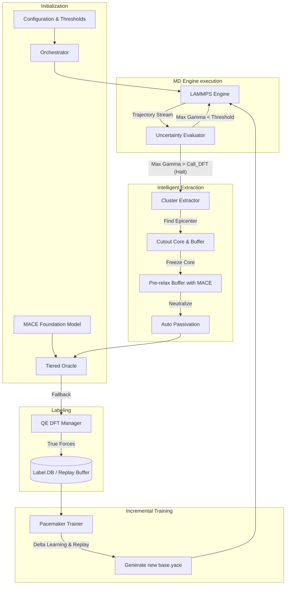

# System Architecture

## 1. Summary

The PyAceMaker NextGen Hierarchical Distillation Architecture (Version 2.1.0) is a major upgrade to the existing Active Learning pipeline for constructing Machine Learning Interatomic Potentials (MLIPs). The system evolves from a basic orchestration tool into a highly robust, HPC-ready system capable of managing millions of atoms in long-timescale Molecular Dynamics (MD) simulations. It aims to solve critical bottlenecks found in Phase 01: continuity breaks during MD halts, hyper-sensitivity to thermal noise, physical divergence when extracting local atomic clusters, catastrophic forgetting during retraining, and process fragility when interacting with underlying C++ engines like LAMMPS. To achieve this, PyAceMaker integrates FLARE-inspired paradigms such as Master-Slave inversion for seamless MD continuation, a two-tier uncertainty evaluation threshold, intelligent local cluster extraction with passivation, and incremental delta learning for fast model updates. This document defines the structural blueprint, ensuring strict separation of concerns, robust boundary management, and an evolutionary integration path that maximizes the reuse of existing components while introducing new capabilities safely. This system relies heavily on separating the concerns of structure exploration, electronic structure calculations, and machine learning model training into distinct, highly decoupled modules.

## 2. System Design Objectives

The core objectives of the PyAceMaker NextGen Architecture are to enable extreme-scale simulations and automated potential construction without the fragility typically associated with coupled ML/MD workflows. We must achieve these goals while strictly adhering to the architectural principles of separation of concerns, single responsibility, and dependency inversion. The system must be robust, scalable, and physically sound in all its operations, ensuring that the resulting machine learning potentials are both accurate and reliable for long-term production use in advanced materials research.

**1. Seamless Molecular Dynamics Continuity (Master-Slave Inversion):**
The traditional approach of having a Python orchestrator drive LAMMPS via external shell commands leads to severe synchronization issues, state loss when a calculation halts, and immense overhead in data transfer. The new objective is to fundamentally invert this control flow. The LAMMPS C++ execution loop will run continuously, acting as the master process. It will occasionally invoke a Python callback (via `fix python/invoke`) to evaluate the current uncertainty of the system using the fast foundation model. If the uncertainty is high, the simulation pauses its integration natively, updates the potential in the background through the orchestrator, reloads the coefficients, and resumes without ever losing atomic coordinates, velocities, or thermostat state. This ensures that long-timescale phenomena like phase transformations, grain boundary migration, or complex defect diffusion are not artificially interrupted or reset by retraining events.

**2. Thermal Noise Resilience (Two-Tier Thresholds):**
A single threshold for uncertainty evaluation often leads to catastrophic false positives triggered by normal, physically safe thermal vibrations. This causes the system to halt needlessly, wasting immense computational resources on redundant DFT calculations. The objective is to decouple the halt criteria from the extraction criteria. We introduce a robust Two-Tier Threshold system. The `threshold_call_dft` is a higher threshold that must be sustained over several consecutive steps to determine if a full halt and Density Functional Theory (DFT) calculation are truly necessary. Conversely, the `threshold_add_train` is a lower threshold used purely to identify the specific atoms whose local environments need to be added to the training set once a halt is triggered. This drastically reduces unnecessary computational overhead and prevents the infinite loop of retraining on thermal noise.

**3. Physical Robustness in Local Extraction (Intelligent Cutout & Passivation):**
When a highly uncertain region is discovered within a massive MD cell (e.g., a million atoms), extracting it directly into a vacuum creates severe physical artifacts. It introduces numerous dangling bonds at the cut surfaces, causing massive charge imbalances and dipole moment divergence. This inevitably causes the subsequent DFT calculation's Self-Consistent Field (SCF) loop to fail entirely, or worse, forces the model to learn unphysical "garbage" electronic states. The objective is to intelligently extract the "epicenter" of uncertainty alongside a substantial buffer region. The core atoms are strictly frozen, the buffer is pre-relaxed using the foundational MACE model to remove extraction strain, and the surface is automatically passivated using dummy atoms (e.g., fractional hydrogen) to maintain perfect charge neutrality before any expensive DFT calculation occurs.

**4. O(1) Training Cost and Memory Management (Incremental Updates):**
Retraining the machine learning potential from scratch on all historical data at every single halt leads to a rapid computational explosion. Furthermore, constantly appending highly distorted error structures to the dataset degrades the model's accuracy on stable bulk structures—a phenomenon known as catastrophic forgetting. The system must implement robust delta learning strategies (fitting to the difference from a physical baseline like a Lennard-Jones or ZBL potential) and incremental updates. This involves fine-tuning from the previous potential state while mixing in a carefully curated replay buffer of historical data. This ensures that the cost of updating the potential remains strictly constant O(1), regardless of how long the simulation runs or how much data is accumulated.

**5. HPC Resilience and Scale (Robust State Management):**
The system must be absolutely fault-tolerant in volatile High-Performance Computing (HPC) environments. If a massive parallel job hits a strict wall-time limit, or if a compute node catastrophically crashes, the system must not lose days of progress. Fine-grained checkpointing using SQLite or robust JSON databases is strictly required to meticulously save the system state after every single micro-task (e.g., after one surrogate generation, or one DFT step). Furthermore, the system must aggressively clean up massive computational artifacts (like Quantum Espresso `.wfc` wavefunction files or massive LAMMPS trajectory dumps) to prevent catastrophic storage exhaustion on shared HPC filesystems, while running independent calculation tasks asynchronously using modern dispatcher patterns.

## 3. System Architecture

The architecture relies on strict boundary management to separate orchestration, calculation, and learning logic. The system uses a centralized `Orchestrator` that delegates tasks to specialized Managers (`OracleManager`, `EngineManager`, `TrainerManager`). This ensures that the orchestrator itself remains lightweight and purely focused on workflow transitions, while the heavy lifting is handled by dedicated, highly cohesive modules.

**Boundary Management and Separation of Concerns:**
1.  **Data Isolation:** Data flows in a strictly unidirectional manner during the Active Learning loop to prevent state corruption. The MD Engine produces continuous atomic trajectory streams. The Oracle Evaluator assesses these streams and generates labeled data when necessary. The Trainer consumes these labels to produce an updated interatomic potential. The Engine then consumes the new potential. Modules absolutely do not share internal state variables; they communicate strictly through standardized, immutable `Atoms` objects and explicitly passed, validated Pydantic configuration objects.
2.  **Dependency Injection:** External dependencies and heavy computational drivers (LAMMPS, Quantum Espresso, MACE, Pacemaker) are completely abstracted behind robust `BaseEngine`, `BaseOracle`, and `BaseTrainer` abstract interfaces. The core logic in the orchestrator is blissfully unaware of which specific tool is currently running underneath, knowing only the rigid contract it must fulfill. This allows for seamless swapping of underlying physics engines without touching the orchestration logic.
3.  **Additive Extension:** Existing modules within the `src/pyacemaker/` directory, such as `utils.extraction` and `core.oracle`, must be extended via subclassing or adding new pure functions. Existing legacy workflows must remain fully functional; new NextGen features are explicitly enabled via specific flags within the strictly typed configuration models. We must never break the existing API contract for Phase 01 users.

### Mermaid Diagram


```mermaid
graph TD
    subgraph Initialization
        Config[Configuration & Thresholds] --> Orch[Orchestrator]
        MACE[MACE Foundation Model] --> Oracle[Tiered Oracle]
    end

    subgraph MD Engine execution
        Orch --> Engine[LAMMPS Engine]
        Engine -- Trajectory Stream --> Evaluator[Uncertainty Evaluator]
        Evaluator -- "Max Gamma < Threshold" --> Engine
    end

    subgraph Intelligent Extraction
        Evaluator -- "Max Gamma > Call_DFT (Halt)" --> Extractor[Cluster Extractor]
        Extractor -- "Find Epicenter" --> Sphere[Cutout Core & Buffer]
        Sphere -- "Freeze Core" --> PreRelax[Pre-relax Buffer with MACE]
        PreRelax -- "Neutralize" --> Passivate[Auto Passivation]
    end

    subgraph Labeling
        Passivate --> Oracle
        Oracle -- "Fallback" --> DFT[QE DFT Manager]
        DFT -- "True Forces" --> LabelStore[(Label DB / Replay Buffer)]
    end

    subgraph Incremental Training
        LabelStore --> Trainer[Pacemaker Trainer]
        Trainer -- "Delta Learning & Replay" --> UpdateYace[Generate new base.yace]
        UpdateYace --> Engine
    end
```

## 4. Design Architecture

The design explicitly ensures that complex domain concepts are codified as robust, strictly typed Pydantic models. This guarantees complete type safety and profound configuration validation at the absolute boundaries of the system before any expensive execution begins. We heavily employ a "functional core, imperative shell" design pattern to ensure that complex physics operations (like cluster extraction, surface passivation, and neighbor list generation) are isolated as pure functions, making them easily testable without spinning up massive, slow engine environments.

### File Structure (Ascii Tree)

```text
src/pyacemaker/
├── core/
│   ├── engine.py       # LammpsEngine, Seamless Resume logic, C++ callbacks
│   ├── oracle.py       # TieredOracle, MACEManager, DFTManager, Retry logic
│   └── trainer.py      # PacemakerTrainer, FinetuneManager, Delta Learning
├── domain_models/
│   ├── config.py       # Main configuration entry points, Project defaults
│   └── workflow.py     # DistillationConfig, ActiveLearningThresholds, CutoutConfig, LoopStrategyConfig
├── utils/
│   ├── extraction.py   # extract_intelligent_cluster, _pre_relax_buffer, _passivate_surface
│   └── structure.py    # General Atoms manipulation, Cell standardizations
├── orchestrator.py     # Hierarchical Distillation Loop coordination state machine
└── main.py             # CLI entry point and environment setup
```

### Core Domain Pydantic Models Structure and Typing

The system introduces several new, highly specific Pydantic models within `src/pyacemaker/domain_models/workflow.py` to handle the intricate needs of the NextGen architecture. These models are meticulously designed to be imported safely by other modules (like `config.py` and `md.py`) without causing circular dependencies or Pydantic rebuild errors. They leverage rigorous field validators to enforce cross-parameter logical consistency.

*   `DistillationConfig`: Configures Phase 1 (Zero-Shot Distillation) operations. Contains critical parameters like `enable` (bool), `mace_model_path` (str), `uncertainty_threshold` (float), and `sampling_structures_per_system` (int). It integrates directly into the main `WorkflowConfig` hierarchy.
*   `ActiveLearningThresholds`: Defines the complex two-tier evaluation logic. Contains `threshold_call_dft` (float) for halting the engine, `threshold_add_train` (float) for atomic selection, and `smooth_steps` (int) to buffer against thermal noise. This entirely replaces the outdated single-threshold logic in existing engine configurations. A model validator strictly enforces that `threshold_add_train < threshold_call_dft`.
*   `CutoutConfig`: Defines the precise physical parameters for intelligent local extraction. Contains `core_radius` (float), `buffer_radius` (float), `enable_pre_relaxation` (bool), and `enable_passivation` (bool), along with `passivation_element` (str, typically "H" or a fractional pseudopotential).
*   `LoopStrategyConfig`: Configures the overarching active learning loop state machine strategy. Contains `use_tiered_oracle` (bool), `incremental_update` (bool), `replay_buffer_size` (int), and `baseline_potential_type` (str, e.g., "LJ", "ZBL").

These new configuration objects are safely composed into the master `ProjectConfig` object, extending the existing validation schemas seamlessly. By using modern Pydantic features, we guarantee that the simulation environment is perfectly sound before a single compute cycle is spent.

## 5. Implementation Plan

The project is decomposed into exactly 5 sequential cycles to ensure stable integration, rigorous testing, and continuous delivery of architectural milestones. Each cycle builds strictly upon the verified foundation of the previous one.

**Cycle 01: Domain Models and Zero-Shot Distillation Infrastructure**
The primary goal of this initial cycle is to establish the fundamental data structures and implement Phase 1 of the grand workflow. We will meticulously define the new Pydantic models (`DistillationConfig`, `ActiveLearningThresholds`, `CutoutConfig`, `LoopStrategyConfig`) in `workflow.py` and integrate them into the main configuration schema without breaking existing imports. We will then architect the `MACEManager` within `core.oracle`, allowing PyAceMaker to efficiently query the MACE foundation model for energies, forces, and uncertainties utilizing GPU acceleration where available. Finally, we will implement the zero-shot distillation logic: generating highly diverse structural pools (including defects and immense strains) and using MACE to rigorously filter confident structures to create an initial, robust baseline potential without ever calling the expensive DFT engine. This establishes the foundation of the system.

**Cycle 02: Tiered Oracle and Intelligent Cluster Extraction**
This cycle focuses heavily on the Phase 3 logic, specifically the physical soundness of the system. We will implement the `TieredOracle` which acts as a smart router, sending requests first to the fast MACE model, and only falling back to the massive DFT engine if the inferred uncertainty is exceedingly high. The most critical component developed here is the `utils.extraction.extract_intelligent_cluster` pure function. We will build the complex geometric logic to take a massive MD snapshot, identify high-uncertainty atoms based on the new two-tier thresholds, extract a spherical core and buffer region based on precise neighbor lists, apply strict ASE constraints to freeze the core, use MACE to gently relax the buffer, and finally passivate the surface using electronegativity-matched dummy atoms. This cycle ensures we can consistently create physically stable, charge-neutral cutouts ready for quantum calculations.

**Cycle 03: Incremental Delta Learning and Training Upgrades**
This cycle implements the complex Phase 4 learning logic to prevent catastrophic forgetting. We will substantially upgrade the `PacemakerTrainer` within `core.trainer` to support true incremental updates. Instead of naively rebuilding the massive dataset from scratch, the trainer will intelligently load previous neural network parameters and mix the newly acquired DFT data with a specified `replay_buffer_size` randomly drawn from historical data sets. We will also implement the automated generation of complex `input.yaml` configurations that strictly enforce Delta Learning against a baseline physical potential (e.g., Lennard-Jones) to maintain short-range repulsion safety. Additionally, we will introduce the `FinetuneManager` to handle light, extremely fast fine-tuning of the MACE foundation model's readout layers.

**Cycle 04: Master-Slave Inversion and Seamless Engine Resume**
This cycle tackles the most difficult system integration task: Phase 3/4 integration with the LAMMPS C++ engine. We will completely overhaul the `LammpsEngine` execution model to support continuous integration. Instead of launching standard Python subprocesses that disastrously lose their memory state on exit, we will implement the Master-Slave resume logic. This will involve mastering LAMMPS `fix python/invoke` capabilities natively, or building hyper-robust `.restart` binary file management to ensure that when the MD loop halts due to high uncertainty, it can perfectly resume its precise trajectory, specific atomic velocities, and exact thermostat state mere milliseconds after the machine learning potential is updated in the background. We will implement the two-tier uncertainty evaluation directly within the engine's high-speed monitoring loop to prevent thermal noise false positives.

**Cycle 05: Hierarchical Loop Orchestration and HPC Robustness**
The final, culminating cycle integrates all previously built components into the complete, automated Phase 1-4 workflow within `orchestrator.py`. The active learning loop will now seamlessly and continuously flow through Distillation, Validation, Cutout, and Finetuning phases without human intervention. Furthermore, we will rigorously implement the required HPC robustness features. This includes fine-grained Task-level Checkpointing using local JSON or SQLite stores to absolutely guarantee survival against random cluster node crashes. We will also implement background Artifact Cleanup daemon processes to aggressively manage and compress massive files like Quantum Espresso wavefunctions, ensuring the workflow never blocks the main execution thread or exhausts the shared HPC storage quotas.

## 6. Test Strategy

Testing must verify the physical and computational validity of the new architecture without relying on live, expensive external calls during Continuous Integration (CI) runs. All tests must be absolutely free of side effects, heavily utilizing temporary directories (`tmp_path`) for I/O and intelligent mocks for heavy quantum calculations to ensure tests run in milliseconds.

**Cycle 01: Domain Models and Zero-Shot Distillation Infrastructure**
*   **Unit Tests:** We will strictly validate all new Pydantic models. We will rigorously test custom field validators (e.g., explicitly ensuring `threshold_add_train < threshold_call_dft` raises standard Pydantic validation errors when violated). We will verify that the `MACEManager` correctly formats inputs for the MACE API and handles missing optional dependencies gracefully without crashing.
*   **Integration Tests:** We will mock the MACE model response and verify that the complex zero-shot distillation loop correctly generates structures, filters them strictly based on the mocked uncertainty arrays, and successfully initiates a Pacemaker training task with the correct, filtered dataset.

**Cycle 02: Tiered Oracle and Intelligent Cluster Extraction**
*   **Unit Tests:** We will thoroughly and exhaustively test the pure `extract_intelligent_cluster` function using predefined, small `Atoms` objects with known periodic boundaries. We will strictly assert that the core atoms are correctly tagged with the `force_weight=1.0` array and are perfectly frozen (`ase.constraints.FixAtoms`), while buffer atoms are tagged `force_weight=0.0`. We will verify that surface passivation adds the exact correct number of neutralizing atoms based on valency rules.
*   **Integration Tests:** We will meticulously test the `TieredOracle` routing state machine logic. We will verify it immediately returns mocked MACE results when uncertainty is artificially set low, and correctly delegates to the mocked `DFTManager` when uncertainty intentionally exceeds the strict upper threshold.

**Cycle 03: Incremental Delta Learning and Training Upgrades**
*   **Unit Tests:** We will test the complex `PacemakerTrainer` YAML configuration generation logic. We will parse the output string and ensure the generated `input.yaml` correctly specifies all required incremental learning flags, replay buffer sizes, and baseline potential parameters without syntax errors.
*   **Integration Tests:** We will mock the external `pace_train` execution call. We will provide a mock active dataset and a simulated historical replay buffer, and assert that the trainer correctly concatenates them, handles file I/O safely in a temporary directory, and initiates the training command with the absolute correct bash arguments and environment variables.

**Cycle 04: Master-Slave Inversion and Seamless Engine Resume**
*   **Unit Tests:** We will rigorously test the two-tier threshold evaluation mathematical logic. We will input mock Numpy arrays of uncertainties containing sudden high spikes (simulating thermal noise) alongside sustained high values, strictly verifying that halt signals only trigger on sustained values above `threshold_call_dft`, ignoring the isolated spikes entirely.
*   **Integration Tests:** We will create a minimal, fast-executing LAMMPS script using a mock LJ potential. We will assert that after an intentional, programmatic halt, the engine class can be restarted using the exact saved state (coordinates, velocities, box dimensions) from the precise point of interruption, verifying the output thermodynamic energy profile for mathematical continuity.

**Cycle 05: Hierarchical Loop Orchestration and HPC Robustness**
*   **Integration Tests:** We will run a complete, entirely mocked end-to-end orchestration loop. We will verify the massive state machine correctly and safely transitions through Phase 1 to Phase 4, checking all internal state flags.
*   **E2E Tests:** We will aggressively test the checkpointing system. We will manually trigger a `RuntimeError` mid-loop to simulate a crash, instantiate a completely new orchestrator instance, and verify it resumes perfectly from the exact last completed micro-task rather than restarting from the beginning. We will test artifact cleanup logic by ensuring dummy large files are affirmatively deleted from the filesystem after task completion.