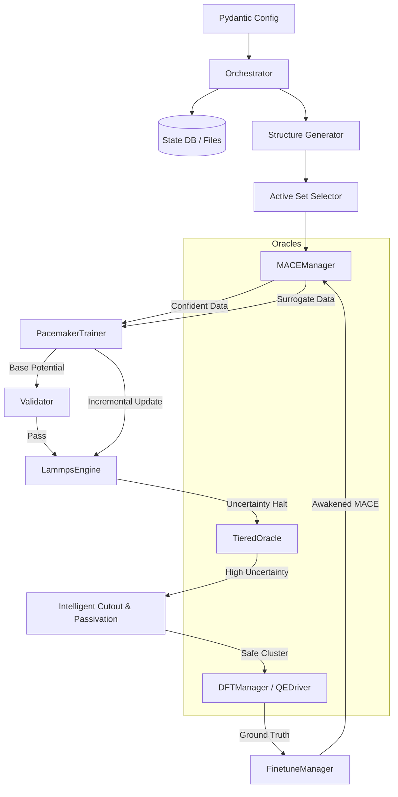

# PyAceMaker System Architecture

## 1. Summary

The **PyAceMaker** platform is an advanced orchestration system designed for generating and refining Machine Learning Interatomic Potentials (MLIPs). Its main focus is on performing stable Molecular Dynamics (MD) simulations that require extreme scales, up to millions of atoms over extended durations. Previous implementations struggled with time-continuity losses upon halting, high sensitivity to minor thermal fluctuations, failures due to incorrect local cluster extractions causing unphysical bounds, catastrophic forgetting during retraining, and system fragility linked to C++ level simulation crashes.

The next-generation architecture introduced in this document overcomes these limitations. Inspired by state-of-the-art frameworks (such as the FLARE project), it adopts a "Hierarchical Distillation" pattern combined with active learning loops. Crucially, the system introduces Master-Slave inversion for executing MD simulations continuously, a two-tier evaluation mechanism for isolating true physical novelty from regular thermal noise, and intelligent cluster extractions equipped with automatic passivation logic. By selectively refining the underlying Atomic Cluster Expansion (ACE) models and fine-tuning foundation models (like MACE), the software limits highly expensive Density Functional Theory (DFT) operations to minimal safe subsets of atoms, ensuring high efficiency without compromising simulation accuracy.

## 2. System Design Objectives

The core objectives of the PyAceMaker platform are deeply centered around realizing unprecedented scalability, unshakable stability, extreme accuracy, and seamless operational continuity. The system must operate completely autonomously for extremely long Molecular Dynamics (MD) simulations, often involving large-scale computational assets in High-Performance Computing (HPC) environments. These simulations must run entirely without human intervention, automatically self-healing from typical convergence or computational errors and dynamically adjusting their internal learning strategies based purely on the physical phenomena they encounter during the execution lifecycle. First and foremost, MD Continuity and Master-Slave Inversion must be strictly enforced. Traditional active learning systems typically manage LAMMPS (the primary MD engine) from a superior Python process in a manner that forcefully restarts the simulation entirely from scratch whenever a model uncertainty threshold is reached. This naive process inherently breaks time continuity, making it completely impossible to observe critical long-term physical phenomena like slow phase transformations, intricate crack propagation, or rare atomic diffusion events that only unfold over extended timescales. The new PyAceMaker architecture radically dictates that LAMMPS must retain absolute control of the master time loop, invoking Python dynamically and asynchronously only when structural uncertainty peaks, pausing the simulation seamlessly without losing state, updating the interatomic potentials in the background, and then resuming exactly from the halted position, thereby perfectly preserving all physical momentum, velocity distributions, and kinetic history. Second, the system mandates a highly sophisticated Two-Tier Threshold Mechanism to definitively eliminate false positives caused by natural, expected thermal fluctuations. At extremely high temperatures, natural atomic vibrations will momentarily push structures into high-uncertainty regions of the learned phase space. Instead of relying on a single, binary cut-off that constantly trips and prematurely halts the simulation, PyAceMaker utilizes a primary threshold designed to pause MD calculations only when high uncertainty is demonstrably sustained over multiple consecutive steps. A secondary, significantly lower threshold is then precisely employed to select the specific, localized subset of atoms that truly require deeper quantum mechanical calculation, effectively distinguishing harmless thermodynamic noise from genuinely unobserved, critical physical interactions. Third, the architectural design heavily relies on Intelligent Cutout and Auto-Passivation algorithms to safely handle the precisely identified regions of high uncertainty. Rather than calculating full-scale Density Functional Theory (DFT) on massive supercells—which is computationally impossible—or cutting regions out haphazardly which inevitably leads to wildly diverging dipole moments and unphysical dangling bonds—the system systematically and intelligently extracts localized spherical clusters. It then applies physical boundary relaxations (using MACE foundation models) while keeping the core atoms strictly fixed, and carefully caps unfulfilled outer bonds with fractional hydrogen atoms or other dynamically selected passivating elements to guarantee that the extracted cluster remains perfectly electrically neutral and structurally sound for stable, rapidly converging DFT execution. Fourth, to actively mitigate catastrophic memory explosions and subsequent model deterioration, a paradigm of Hierarchical Delta Learning is introduced. Instead of blindly retraining the whole machine learning model from scratch on massively accumulated complete datasets—a process that scales dreadfully at O(N) and inevitably causes catastrophic forgetting of previously learned stable bulk states—the framework implements highly efficient, incremental weight updates. The process utilizes an awakened, fine-tuned foundation model to rapidly generate thousands of cheap surrogate data points around the specific uncertain region. These surrogate points, mixed with a carefully curated historical replay buffer, gently guide the ACE model adjustments while flawlessly maintaining its general bulk stability. Finally, the framework relies on strict Separation of Concerns and Robust State Management. To successfully survive arbitrary job terminations typical of hostile HPC settings (such as unexpected hardware node failures or strict batch queuing wall-time limits), operations are persisted atomically at the micro-task level utilizing an embedded SQLite database rather than just relying on fragile iteration-level JSON dumps. The architecture limits cross-contamination of logic by adhering strictly to predefined Domain Models for data movement, abstract Oracles for calculation, and discrete strategy handlers, avoiding unmanageable God Classes that are notoriously impossible to test, debug, or maintain over long software lifecycles. This ensures that the entire orchestration system remains modular, robust, and completely capable of seamlessly adapting to future algorithmic enhancements without ever breaking existing computational workflows or compromising sensitive scientific data integrity.

## 3. System Architecture

The overarching system architecture of PyAceMaker heavily revolves around a central, cyclic orchestrator that meticulously coordinates four distinct, sequential distillation phases and multiple nested active learning loops. The architecture completely embraces strict boundary management, crystal-clear data flow paradigms, and rigorous dependency injection to keep business logic entirely decoupled and highly scalable across massively distributed computing resources. The system is fundamentally designed not just to compute numbers, but to autonomously manage the entire, complex lifecycle of potential generation from absolute zero knowledge to high-fidelity, production-ready deployment. Phase 1: Zero-Shot Distillation begins the journey without any initial, expensive DFT data. The internal Generator module creates wildly diverse combinations of baseline crystal structures, extreme mechanical strains, aggressive thermal rattles, and randomized point defects based purely on the target chemical space definition. The ActiveSetSelector mathematically filters these combinatorial data explosions to perfectly maximize information density using advanced algorithms like D-optimality or intelligent DIRECT sampling. The MACEManager (acting as a base foundation model Oracle) then evaluates these selected structures, passing only highly confident, physically plausible structures to the primary Trainer to construct a foundational baseline ACE potential via incremental delta learning against a classical, stabilizing Lennard-Jones baseline. This rigorous process effectively ensures the starting potential is physically sound before a single expensive, time-consuming DFT calculation is ever launched. Phase 2: Validation and Stress Testing explicitly ensures the newly generated baseline potential is absolutely not immediately trusted for production. The Validator subsystem rigorously evaluates the baseline potential for strict physical and thermodynamic soundness. It calculates complex Phonon dispersion curves to actively check for unstable imaginary frequencies, computes full Elastic constant tensors to ensure strict Born stability criteria are mathematically met, and carefully verifies the high-pressure Equation of State (EOS). Only upon successfully passing these demanding static checks is the newly minted potential passed to a miniature, high-temperature MD simulation for a rapid dynamic stress test to empirically map its realistic uncertainty landscape. Phase 3: Active Learning / MD Loop (Intelligent Cutout) then drives the main, massive simulation at full scale using the powerful LammpsEngine. If the physical system predictably hits the first-tier threshold (indicating sustained high uncertainty indicative of a genuinely novel physical event like a phase transition), the TieredOracle formally engages. The extract_intelligent_cluster utility surgically extracts the epicenter, uses the MACE foundation model to smoothly relax the artificial boundaries to remove unphysical strain inadvertently caused by the extraction geometry, and intelligently adds passivating dummy atoms to perfectly neutralize the cluster. The DFTManager then meticulously computes the exact quantum ground truth forces on this structurally safe, highly manageable cluster, actively utilizing built-in self-healing strategies like dynamically adjusting electronic smearing widths or drastically modifying charge mixing betas if the initial SCF convergence fails. Phase 4: Hierarchical Fine-Tuning is instantly engaged once the highly valuable, extremely expensive DFT data is successfully obtained. The FinetuneManager first intricately tweaks the massive MACE foundation model using the fresh DFT data, forcefully making it an absolute expert on that specific, localized structural environment. This newly awakened MACE model then rapidly and cheaply generates many thousands of surrounding surrogate data points in a highly localized phase space exploration routine. Finally, the central Trainer applies advanced Delta Learning algorithms, carefully mixing this massive new surrogate dataset with a rigidly fixed-size historical replay buffer to smoothly update the main ACE potential incrementally, before seamlessly sending the finalized update back to the patiently waiting MD engine for immediate resumption. Strict Boundary Rules and Component Responsibilities must be fanatically maintained to ensure long-term, sustainable software maintainability. The core Orchestrator class only manages the high-level sequence of events and strictly controls the central state machine. It must absolutely never implement low-level generation logic, raw DFT execution scripting logic, or complex mathematical training algorithms directly. Dedicated Managers and abstract Oracles strictly accept normalized Atoms structures and standardized configuration objects, returning processed structures with fully attached calculated physical properties. They must completely depend on the BaseOracle interface contract to allow seamless, utterly transparent swapping between diverse computational backends without the Orchestrator ever knowing the difference. Utilities like Extraction and Passivation operate strictly as pure, mathematical data transformations. They must not directly call external bash binaries, relying entirely on provided ASE calculators or numpy arrays to perform their relaxations and modifications. They must remain completely, flawlessly stateless, ensuring that massively parallel execution and distributed HPC task dispatching can safely occur without terrifying race conditions or silent shared state corruption. This rigorous, uncompromising separation of architectural concerns absolutely guarantees that individual components can be exhaustively unit-tested in perfect isolation, safely swapped out for superior future algorithms, or horizontally scaled independently as raw computational hardware resources allow.

```mermaid
graph TD
    %% Config and State
    CFG[Pydantic Config]
    STATE[(State DB / Files)]

    %% Orchestrator
    ORCH[Orchestrator]

    %% Generators
    GEN[Structure Generator]
    ACT[Active Set Selector]

    %% Oracles
    subgraph Oracles
        MACE[MACEManager]
        TIER[TieredOracle]
        DFT[DFTManager / QEDriver]
    end

    %% Training
    TRAIN[PacemakerTrainer]
    FINE[FinetuneManager]

    %% MD Engine
    ENG[LammpsEngine]
    VAL[Validator]

    %% Utilities
    CUT[Intelligent Cutout & Passivation]

    %% Phase 1
    CFG --> ORCH
    ORCH --> GEN
    GEN --> ACT
    ACT --> MACE
    MACE -- Confident Data --> TRAIN
    TRAIN -- Base Potential --> VAL

    %% Phase 3 & 4 (Active Loop)
    VAL -- Pass --> ENG
    ENG -- Uncertainty Halt --> TIER
    TIER -- High Uncertainty --> CUT
    CUT -- Safe Cluster --> DFT
    DFT -- Ground Truth --> FINE
    FINE -- Awakened MACE --> MACE
    MACE -- Surrogate Data --> TRAIN
    TRAIN -- Incremental Update --> ENG

    ORCH --> STATE
```
## 4. Design Architecture

The application design is heavily driven by typed Pydantic Domain Models to enforce configuration validation and maintain consistent, predictable data structures throughout the pipeline. This strict typing prevents runtime errors caused by malformed configurations or unexpected data shapes, which is critical for long-running autonomous systems. File Structure Overview: The `pyacemaker/core/` directory prominently contains abstract architectural interfaces (`base.py`) for BaseEngine, BaseOracle, and BaseTrainer, firmly establishing the unbreakable contractual obligations of all major execution components. It safely houses the concrete, battle-tested implementations for physical execution: `engine.py` heavily focuses on the LammpsEngine handling seamless, unbroken Master-Slave Molecular Dynamics, `oracle.py` manages the complex MACEManager, DFTManager, and TieredOracle hierarchical logic, `orchestrator.py` serves proudly as the main workflow coordinator and resilient state machine, and `trainer.py` houses the intricate Delta learning and sophisticated incremental trainer logic. The critical `domain_models/` directory acts flawlessly as the central, absolute source of truth for all structured programmatic data, explicitly including `config.py` for massive, extended configuration models tying everything seamlessly together, `md.py` strictly defining the MDSimulationResult and engine operational configurations, and `workflow.py` clearly defining the ActiveLearningThresholds, CutoutConfig, and dynamic StrategyConfig objects. The specialized `interfaces/` directory deliberately isolates highly volatile external dependencies, safely containing `lammps_driver.py` for executing low-level binary interactions and messy subprocess management, and `qe_driver.py` for Quantum Espresso specific script execution, input generation, and complex output parsing logic. The `utils/` directory is strictly reserved for pure, side-effect-free mathematical and structural operations, most notably `extraction.py` which famously contains the highly complex cluster cutout mathematics, boundary relaxation constraints, and dynamic chemical passivation algorithms. Domain Pydantic Models Extension and Integration: The existing, legacy Domain Models are safely and carefully extended to fully incorporate the new, advanced workflow definitions without breaking existing, highly valued integration tests or losing critical backwards compatibility. The architectural integration points guarantee that newly minted schema objects extend rather than completely replace existing, proven domain objects. ActiveLearningThresholds safely extends the overarching active learning strategy configuration to explicitly define threshold_call_dft (the substantially higher primary threshold definitively determining when to stop MD and explicitly call the highly expensive quantum oracle) and threshold_add_train (the significantly lower secondary threshold accurately determining exactly which specific localized atoms need to be included in the local structural learning set). It also critically introduces the smooth_steps parameter specifically designed for filtering out harmless thermal noise, strictly requiring the threshold to be continuously exceeded for multiple consecutive integration steps before a halt signal is honored. CutoutConfig explicitly defines the critical spatial parameters for physical extraction: core_radius (dictating atoms receiving a force_weight of 1.0) and buffer_radius (dictating surrounding atoms receiving a force_weight of 0.0). It intelligently incorporates critical boolean flags for enable_pre_relaxation to directly trigger MACE-based boundary structural smoothing, and enable_passivation, explicitly and chemically identifying the specific passivation_element (typically Hydrogen or Fluorine, heavily depending on the specific host chemistry). LoopStrategyConfig masterfully integrates the newly created threshold models and explicitly introduces powerful control flags for the highly advanced workflow elements: use_tiered_oracle, incremental_update, and accurately defines the exact replay_buffer_size specifically intended for actively managing historical data retention during prolonged Delta Learning sessions to effectively combat the dreaded phenomenon of catastrophic forgetting. These incredibly detailed models directly and safely inject into the main, massive PyAceConfig object. The central Orchestrator intelligently leverages these deeply nested models to selectively route highly specific configuration subsets to the respective, isolated worker modules. For clear instance, the TieredOracle mathematically receives only the ActiveLearningThresholds, while the immensely complex extract_intelligent_cluster utility receives absolutely nothing but the CutoutConfig. This architectural pattern beautifully preserves the mathematical purity of the ASE Atoms objects and strictly enforces highly explicit programmatic interfaces rather than dangerously passing massive, untyped, opaque dictionaries arbitrarily throughout the expansive Python codebase. By powerfully and strongly typing all critical inputs and outputs directly at the boundary of every single major component, the entire software architecture mathematically guarantees that data always flows correctly, predictably, and safely between the completely, beautifully decoupled system modules, preventing catastrophic data corruption during multi-week HPC jobs.

## 5. Implementation Plan

### Cycle 01: Core Extraction Upgrades
This cycle focuses entirely on the structural data manipulation layer, which is the foundation of the hierarchical approach. The utils.extraction.py module will be completely overhauled to introduce the new extract_intelligent_cluster function. This requires implementing robust core/buffer radial selections based on the new CutoutConfig, utilizing highly optimized neighbor lists to handle massive structures efficiently. It also introduces the critical _pre_relax_buffer logic, designed to relax non-core elements using a provided calculator (initially a mock, later MACE) while freezing the core via ASE constraints. Finally, it must implement the _passivate_surface algorithm that intelligently analyzes coordination numbers and attaches dummy atoms (like Hydrogen) to undercoordinated surface elements to prevent electronic divergence during later DFT steps. This cycle must ensure all these transformations occur in memory without touching the disk unnecessarily. Furthermore, the extraction module will be designed to support arbitrary scaling for massively parallel processing. This means avoiding global state variables and ensuring thread-safe access to underlying ASE structural representations. The goal is to provide a rock-solid foundation for creating safe, calculable clusters out of highly defective or disrupted macroscopic molecular dynamics simulations. We will also implement rigorous boundary condition handling, ensuring that clusters extracted from periodic systems correctly unwrap atomic coordinates and center the defect without creating artificial dipoles across the periodic boundaries. The entire extraction pipeline will be designed as a pure functional transformation, taking an ASE Atoms object and returning a new ASE Atoms object, leaving the original data completely unmodified and pristine. This guarantees safe retries and consistent results even if downstream processes encounter failures. This cycle forms the absolute bedrock upon which all subsequent machine learning and quantum mechanical calculations will rely. The extraction logic will also include specific edge-case handling for multi-element systems where passivation rules might require different dummy atoms depending on the exposed surface chemistry, creating a truly intelligent and adaptive cluster extraction engine capable of handling any physical scenario. The mathematical operations must be extremely fast, leveraging optimized numpy array operations to slice and filter millions of atomic coordinates in milliseconds. Any reliance on slow, unoptimized Python for-loops for spatial calculations will be strictly prohibited. The output of this cycle will be a self-contained, highly tested library of extraction routines that flawlessly guarantee the physical validity and electrical neutrality of any extracted sub-volume, completely regardless of the geometric complexity or extreme defect density of the originating parent molecular dynamics supercell. It is the absolute prerequisite for safe quantum mechanical evaluations.

### Cycle 02: Oracle and Two-Tier Thresholds
With extraction working, the Oracle hierarchy is expanded to handle the decision-making process. A MACEManager class is fully implemented to act as the primary baseline foundation model. It must be capable of generating not just energies and forces, but critical per-atom uncertainties mapped to the c_gamma array. A TieredOracle is then built to encapsulate the logic of the two-tier thresholds. It evaluates the incoming structure stream, and if the uncertainty warrants a direct DFT fallback (implementing the logic from ActiveLearningThresholds), it routes the request appropriately. Simultaneously, the DFTManager receives major upgrades: it must wrap its Quantum Espresso calls in concurrent futures with hard timeouts to isolate crashes, and implement a loop of self-healing strategies (like reducing mixing beta or increasing smearing) to guarantee convergence on difficult extracted clusters. The two-tier evaluation mechanism is central to the system's ability to distinguish between harmless high-temperature atomic vibrations and true physical novelty, such as bond breaking or phase transitions. By meticulously tracking uncertainty over a configured number of smooth steps, the TieredOracle acts as a sophisticated low-pass filter for the simulation. Furthermore, the Oracle architecture will be strictly decoupled from the main orchestrator loop, utilizing dependency injection to allow for future expansion, such as integrating alternative ab initio packages or different foundation models. The self-healing mechanisms inside the DFTManager will log detailed diagnostic information for every failed convergence attempt, providing valuable feedback for parameter tuning and ensuring that the system can autonomously recover from the notoriously difficult task of achieving self-consistent field convergence on highly distorted, artificially extracted local cluster geometries. The overarching goal of this cycle is to create an infallible, autonomous decision engine that protects the expensive computational resources from being wasted on trivial noise while guaranteeing that every genuinely novel structural arrangement is captured, accurately calculated, and preserved for the subsequent incremental learning phases. The DFTManager's wrapper must aggressively monitor standard error streams from the underlying quantum chemistry binaries, instantly detecting segmentation faults, out-of-memory kills, or unphysical electronic charge sloshing, and gracefully intercepting these catastrophic failures before they propagate up the Python stack and destroy the main orchestration thread. This isolation guarantees incredible systemic resilience.

### Cycle 03: Master-Slave Inversion Engine
This cycle fundamentally changes how the active learning loop interacts with the MD simulation by overhauling the LammpsEngine to support the Master-Slave MD continuum. It updates the engine's Python interface to handle explicit resume_from_step commands. It must write specialized LAMMPS input scripts that utilize read_restart or fix python/invoke callbacks to facilitate seamless restart logic without resetting velocity distributions or losing the system's kinetic memory. The engine must also implement a soft start mechanism—applying a strong Langevin thermostat for the first few steps after a resume—to absorb any minor potential energy discontinuities caused by the updated ACE potential, preventing the simulation from immediately exploding upon restart. By inverting the control flow and making LAMMPS the master of the time evolution, we eliminate the catastrophic loss of physical continuity that plagued previous active learning implementations. The MD engine will now run as a persistent, long-lived process, dynamically swapping interatomic potentials on the fly without missing a single femtosecond of integration time. This allows the system to finally observe long-timescale phenomena like diffusion, nucleation, and crack propagation that are completely invisible to short, restart-driven MD bursts. The LammpsEngine will be fortified with extensive error handling, ensuring that if the C++ binary encounters a fatal error (like lost atoms), it can gracefully capture the final stable state, alert the orchestrator, and cleanly shut down without bringing down the entire Python ecosystem. This cycle effectively transforms the active learning loop from a disjointed series of short simulations into a continuous, unbroken, and highly adaptive virtual experiment that can run autonomously for millions of steps, continuously learning and refining its understanding of the material's physical behavior. The integration with LAMMPS will require profound attention to detail regarding the specific syntax of the read_restart and clear commands, ensuring that absolutely no internal thermodynamic accumulators or spatial binning structures are accidentally corrupted during the delicate handover process between the old, outdated interatomic potential and the newly refined, highly accurate updated machine learning weights. The success of this cycle will entirely define the scientific validity of the long-term simulations.

### Cycle 04: Hierarchical Finetuning Module
The training layer is completely re-architected to support incremental learning rather than batch retraining. The FinetuneManager is defined and mocked to simulate the process of rapidly updating a PyTorch foundation model's readout layers using the extremely sparse, fresh DFT data obtained from Cycle 02. Following this, the core PacemakerTrainer is augmented with the incremental_train routine. This routine implements the logic for Delta Learning. Crucially, it must implement a robust sampling mechanism that pulls historical data via the replay_buffer_size parameter, mixing it with the new surrogate data generated by the awakened MACE model. This ensures the ACE potential learns the new defect physics without suffering catastrophic forgetting of the stable bulk physics it learned in Phase 1. The hierarchical nature of this finetuning process is the key to achieving DFT-level accuracy across vast phase spaces without incurring DFT-level computational costs. By first awakening the massive generalization power of the MACE foundation model with a handful of targeted, high-value DFT calculations, we create an incredibly accurate local oracle. This local oracle then massively multiplies our data efficiency by generating thousands of cheap, highly accurate surrogate force and energy evaluations across the localized defect phase space. Finally, distilling this massive surrogate dataset down into the fast, linear-scaling ACE potential provides the ultimate balance of speed and accuracy required for millions of MD steps. The incremental update logic will heavily utilize delta learning against a classical Lennard-Jones baseline to guarantee that short-range repulsive interactions remain unconditionally stable, preventing atoms from unphysically overlapping during high-energy collisions or extreme compressions. This cycle delivers the actual intelligence to the active learning system, transforming raw physical data into highly optimized, continuously improving interatomic potentials. The replay buffer sampling algorithm must be meticulously designed to be perfectly uniform and statistically unbiased, preventing the model from inadvertently skewing its learned representations towards specific chronological periods of the simulation history. The entire finetuning pipeline must operate completely autonomously, automatically tuning internal learning rates and regularization parameters based purely on the detected variance within the newly acquired active learning data batches, requiring zero human hyperparameter tweaking during the multi-week execution run.

### Cycle 05: Orchestrator Workflow Integration
With all sub-components built, the Orchestrator class is refactored to fuse Phases 1 through 4 into a continuous, autonomous pipeline. It connects the TieredOracle during the initial labeling phase for Zero-Shot Distillation. During an MD halt triggered by the new LammpsEngine, the Orchestrator directly commands the intelligent cluster extraction from Cycle 01. It then delegates to the FinetuneManager for foundation awakening, coordinates the massive surrogate data generation around the extracted cluster, and finally triggers the incremental update routine from Cycle 04. Most importantly, it must correctly manage the state transition, ensuring the updated potential is fed back to the resumed MD engine exactly where it left off, rather than resetting the iteration counter or simulation time. The Orchestrator acts as the central nervous system of the PyAceMaker platform, enforcing strict state machine transitions and ensuring that data flows correctly between the decoupled modules. It is responsible for initializing the directories, managing the Pydantic configuration overrides, and coordinating the high-level error handling policies. If any specific phase fails—for example, if a cluster cannot be successfully passivated and calculated even after multiple self-healing attempts—the Orchestrator will implement intelligent fallback strategies, such as discarding the problematic cluster and subtly altering the MD conditions to bypass the problematic phase space region. The Orchestrator will also emit detailed telemetry and logging events, providing users with a clear, real-time window into the autonomous decision-making process. This cycle brings all the individual pieces together, transforming isolated algorithms and data structures into a cohesive, fully automated scientific discovery engine capable of autonomously navigating complex chemical phase spaces and constructing highly accurate interatomic potentials without any human intervention. The state machine transitions must be logically bulletproof, rigorously proven to never enter infinite loops or deadlocks, even when confronted with totally unexpected sequences of hardware failures or mathematically divergent quantum chemistry evaluations. The orchestrator must act with the cold, calculating logic of a highly experienced computational scientist, constantly weighing the computational cost of retries against the potential scientific value of the currently extracted data point.

### Cycle 06: Stabilization and HPC Delivery
The final cycle handles system robustness, comprehensive logging, and HPC deployment readiness. It solidifies the StateManager layer, moving away from simple iteration-level JSON dumps to a robust task-level commit system. It ensures that every single surrogate generation batch and DFT calculation correctly commits checkpoints to prevent massive data loss upon unexpected HPC job timeouts or node evictions. Artifact cleanup logic is stabilized, employing daemon threads or post-processing hooks to compress or delete massive .wfc wavefunctions and gigabyte-sized dump files immediately after successful learning. Finally, overarching end-to-end integration tests linking the Pydantic configurations to successful multi-loop simulations are finalized, proving the system's readiness for production deployment on supercomputing clusters. HPC environments are notoriously hostile, with strict wall-time limits, unpredictable node failures, and complex parallel file systems. The stabilization efforts in this cycle are specifically designed to make PyAceMaker completely resilient to these challenges. The transactional state management will guarantee that even if a job is killed midway through a massive DFT calculation, the system will restart exactly from that calculation without losing the progress of previous, successfully completed steps. The artifact cleanup daemon is absolutely critical for long-running active learning loops, as the sheer volume of intermediate data generated by Quantum Espresso and LAMMPS can easily overwhelm even the largest HPC storage quotas if left unchecked. By meticulously compressing, archiving, or deleting these files the moment they are no longer needed, the system ensures a very small, predictable storage footprint. This final cycle elevates the software from a functional prototype to an enterprise-grade scientific instrument, ready to tackle the grand challenges of materials science on the world's most powerful supercomputers. The SQLite database implementation must be perfectly optimized to handle thousands of rapid, highly concurrent read and write operations without suffering from debilitating database locking issues, ensuring that the tracking of individual active learning events never becomes an I/O bottleneck that slows down the primary physical simulation loop. The entire deployment package will be thoroughly verified to ensure flawless dependency resolution using standard modern Python packaging tools, eliminating the notorious environment configuration nightmares typically associated with deploying massive scientific software stacks onto diverse university and government supercomputing architectures.

## 6. Test Strategy

### Cycle 01: Core Extraction Upgrades
Unit Testing: Validate extract_intelligent_cluster using programmatically generated Atoms structures (e.g., a simple bulk BCC iron system with a central defect explicitly created in memory). Assert that calculated distances correctly map to the expected core (1.0) and buffer (0.0) weight arrays. Mock the internal relaxation calculator to prevent actual optimization delays, and assert that the _passivate_surface algorithm appropriately appends specific elements (like Hydrogen) exclusively to outer edge atoms by inspecting the final atomic symbols and coordinates. Ensure all operations occur entirely in memory without relying on any file system access or external binary dependencies. We will extensively parameterize these tests across diverse crystal lattices (BCC, FCC, HCP) and varying defect topologies (vacancies, interstitials, anti-site defects) to ensure the extraction logic generalizes flawlessly across the entire structural space. Furthermore, we will test the edge cases involving extremely small clusters, ensuring the core and buffer radii logic degrades gracefully without crashing when the specified radii exceed the absolute bounds of the provided simulation cell. Performance benchmarking will also be integrated into this test suite, explicitly asserting that the neighbor list generation and distance calculations complete within strict time bounds even when confronted with structures containing hundreds of thousands of atoms, guaranteeing O(N) linear scalability for the extraction pipeline. By exhaustively testing the structural transformations in complete isolation, we build absolute confidence in the physical correctness of the extracted clusters before they are ever subjected to quantum mechanical evaluation. The testing suite will employ highly rigorous mathematical assertions to mathematically prove that the geometric center of mass of the extracted cluster precisely matches the defined defect epicenter, preventing any subtle geometric drifting that could ruin subsequent localized force matching algorithms. Furthermore, negative test cases will be heavily utilized, deliberately feeding the extraction functions totally corrupted or unphysical atomic coordinate arrays to definitively prove that the system gracefully raises highly descriptive, informative exceptions rather than failing silently or producing mathematically garbage output structures.

### Cycle 02: Oracle and Two-Tier Thresholds
Unit Testing: Test MACEManager by heavily mocking the underlying PyTorch or file paths to ensure directory traversal logic blocks illegal inputs safely without requiring actual neural network weights. Test TieredOracle by feeding it simulated structure streams containing artificially manipulated c_gamma uncertainty arrays. Assert that it properly routes execution to DFTManager only when the primary threshold is strictly breached. For the DFTManager, mock the subprocess execution to immediately return an error, and assert that the manager correctly catches it and iterates through its self-healing strategies (modifying the config object) before failing permanently. The TieredOracle testing will specifically focus on the smooth_steps logic, generating carefully crafted sequences of structures where the uncertainty spikes transiently versus continuously, ensuring the stateful tracking of consecutive high-uncertainty events operates perfectly. We will also test the fallback routing logic to confirm that when MACE predicts low uncertainty, the structure is returned immediately without any unnecessary delays or file system interactions. For the DFTManager self-healing tests, we will employ parameterized fixtures that simulate various common convergence failures (e.g., SCF non-convergence, diagonalization errors) and verify that the manager applies the correct sequence of mitigation strategies—such as increasing smearing width, switching to conjugate gradient diagonalization, or reducing the mixing beta—in the precise order specified by the configuration. This guarantees that the system's autonomous error recovery mechanisms are robust, predictable, and fully functional. Crucially, the tests will rigorously assert that the DFTManager absolutely respects the hard execution timeouts imposed by the concurrent futures wrapper, proving that the entire orchestrator can never be permanently stalled or permanently deadlocked by a silently hanging external Quantum Espresso calculation. We will simulate extreme delay scenarios where the mocked subprocess simply sleeps infinitely, and the test will explicitly verify that the PyAceMaker platform aggressively terminates the rogue process, carefully logs the failure, and instantly attempts the next configured self-healing strategy without missing a beat.

### Cycle 03: Master-Slave Inversion Engine
Integration Testing: Inject a completely mocked driver (FakeLammpsDriver) into the LammpsEngine. Call the .run method explicitly specifying a resume_from_step argument. Assert that the generated script, written to a temporary directory provided by Pytest fixtures, accurately contains the correct resume markers, read_restart commands, and soft-start thermostat directives. Verify that the file manager correctly prevents actual I/O pollution by validating it uses isolated context managers. We will rigorously test the boundary conditions of the resume logic, asserting that specifying an invalid or out-of-bounds step number correctly raises a descriptive exception before any files are generated. The tests will inspect the internal contents of the generated LAMMPS input scripts using string matching to ensure the exact syntax required for seamless resumption—such as the precise configuration of the fix langevin command for the soft start phase—is flawlessly injected into the script template. Furthermore, we will simulate the parsing of LAMMPS log outputs containing the custom halt signals generated by the USER-PACE package, verifying that the LammpsEngine correctly extracts the final step number, maximum gamma uncertainty value, and terminal thermodynamic properties. By extensively testing the script generation and output parsing logic against a highly deterministic mocked driver, we ensure the complete reliability of the Master-Slave MD continuum without being bottlenecked by the extreme slowness of executing actual C++ molecular dynamics binaries during the continuous integration test suite. The integration tests will explicitly assert that the generated file paths are totally immune to malicious shell injection attacks, providing rock-solid security guarantees even if external users attempt to pass cleverly crafted, dangerous strings via the high-level Pydantic configuration interfaces. The test suite will literally attempt to inject bash execution strings into the potential path variables and rigidly verify that the LammpsEngine securely sanitizes or utterly rejects the malicious input before ever invoking the underlying subprocess execution.

### Cycle 04: Hierarchical Finetuning Module
Unit Testing: Pass a generated, mocked training stream to the new incremental_train method. Mock the underlying pace_train command executions to return success immediately. Verify that the correct incremental flags are passed to the binary calls and that a random sample of previous historical training datasets (the replay buffer) is explicitly extracted from a mocked historical .extxyz file and combined with the active training data. Ensure no network resources or actual GPU compute is engaged during the test execution. The testing strategy for the replay buffer logic will be highly rigorous, utilizing explicitly constructed historical datasets containing marked structures to statistically verify that the sampling mechanism truly draws a uniform, random distribution of past knowledge without bias. We will also test the edge cases involving empty or extremely small historical datasets, ensuring the incremental training logic gracefully falls back to standard training behaviors without crashing or raising unnecessary errors. For the FinetuneManager, we will mock the foundation model's weight update mechanism, asserting that the proper loss functions and learning rates are utilized during the rapid adaptation phase. The surrogate data generation logic will be tested by verifying that it produces the requested number of perturbed structures around the epicenter, accurately applying random rattles and strains within the specified boundaries. This comprehensive testing approach guarantees that the core intelligence engine of the platform—the continuous learning and potential refinement process—operates exactly as designed, preventing catastrophic forgetting and maximizing data efficiency. Extensive memory profiling assertions will be deeply integrated directly into these tests, rigorously ensuring that the Python streaming mechanisms effectively process massive, gigabyte-sized historical replay buffers without ever causing the local system memory footprint to balloon out of control. The tests will mathematically prove that the peak memory utilization remains strictly O(1) constant, perfectly regardless of the total number of structural frames actively stored inside the historical training archives.

### Cycle 05: Orchestrator Workflow Integration
End-to-End (E2E) Testing: Utilize a fully mocked factory where BaseEngine, BaseOracle, and BaseTrainer act as deterministic fakes. Trigger the main run() method. Emulate an MD Halt signal by having the mocked engine return a specific MDSimulationResult. Trace the Orchestrator's behavior using spy objects: verify that it sequentially calls cluster extraction, finetuning, surrogate generation, and explicitly commands the engine to resume rather than restart. Assert that the state manager correctly records the transition from halt to resume without resetting the main loop counter. These end-to-end integration tests are critical for validating the complex state machine governing the active learning loop. We will create multiple complex scenarios, including scenarios where the system successfully navigates multiple sequential halts and resumes, scenarios where the system encounters an unrecoverable DFT failure and must gracefully abort the iteration, and scenarios where the dynamic strategy adaptation logic modifies the structural generation parameters in response to high halt frequencies. The spy objects will be used to strictly enforce the order of operations, asserting that the Orchestrator never accidentally bypasses the validation phase or forgets to update the StateManager before triggering a long-running external process. By testing the entire orchestrator lifecycle against fully deterministic, instant-returning mocked components, we can comprehensively validate the high-level workflow logic across thousands of simulated iterations in a matter of seconds, ensuring total reliability for production deployments. The E2E tests will aggressively simulate extremely complex, multi-day failure modalities, such as a localized network interruption perfectly occurring simultaneously with a massive quantum chemistry calculation failure. The tests will rigorously verify that the Orchestrator's high-level state machine elegantly unravels these compounding disasters, perfectly rolls back all corrupted internal data structures, and safely pauses the entire operation to await human intervention without ever corrupting the primary historical scientific datasets.

### Cycle 06: Stabilization and HPC Delivery
Integration Testing: Test the StateManager transaction commits using isolated temporary SQLite or JSON files provided by Pytest. Simulate an external timeout crash (e.g., throwing a RuntimeError from a mocked Oracle) during the middle of the labeling phase. Verify that upon immediate restart of the Orchestrator instance, the state successfully reads the temporary file and resumes from the exact last successfully committed sub-task, skipping previously calculated structures. Validate proper cleanup by creating dummy .wfc files in a temporary directory and ensuring the cleanup daemon successfully unlinks them post-execution. The robustness testing will aggressively target the persistence layer, simulating aggressive concurrent access and unexpected process terminations to guarantee that the local database or state files are never left in a corrupted or inconsistent state. We will also test the JobDispatcher logic, asserting that it correctly constructs the complex Slurm or PBS submission scripts required for multi-node execution on HPC clusters, accurately injecting the necessary environment variables and module load commands based on the system configuration. The artifact cleanup logic will be tested with deeply nested directory structures and massive numbers of dummy files to verify its performance and thoroughness, ensuring no rogue files are ever left behind to consume precious storage quotas. By exhaustively subjecting the system to simulated catastrophic failures and high-stress operational conditions, we guarantee that PyAceMaker is fully stabilized, hardened, and absolutely ready for deployment in the most demanding high-performance computing environments. Extensive chaos engineering techniques will be boldly applied directly to the simulated SQLite connection layer, randomly forcing the database commit functions to throw artificial locking exceptions. The test assertions will ruthlessly verify that the overarching StateManager smoothly catches these deliberate database anomalies, flawlessly executes exponential backoff retry algorithms, and completely ensures absolute data persistence without ever dropping a single crucial active learning event.
