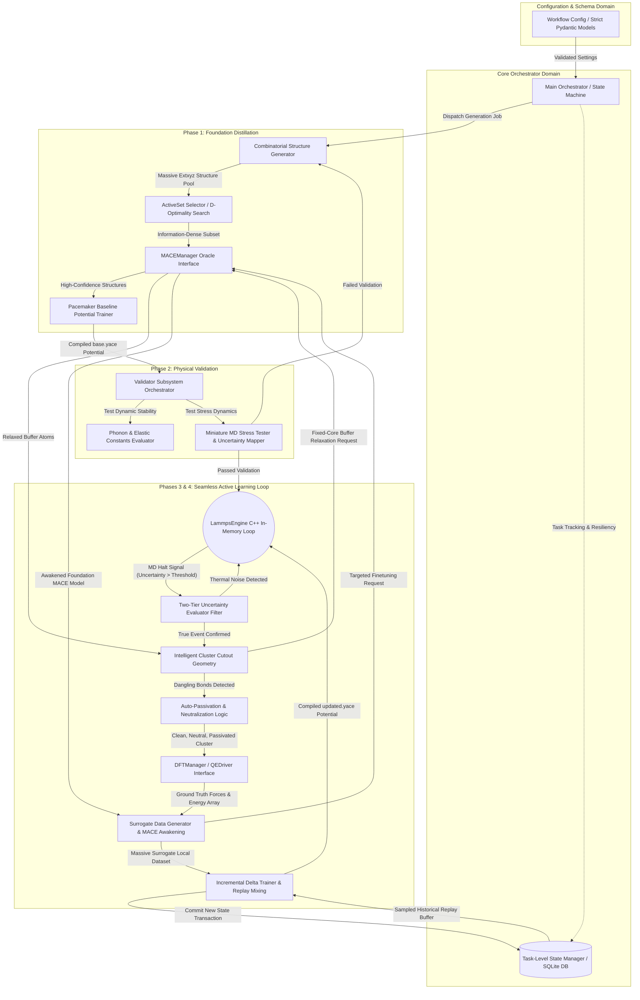

# PYACEMAKER System Architecture

## 1. Summary

The PYACEMAKER Next-Generation Architecture, version 2.1.0, introduces a highly transformative and scalable approach to orchestrating Active Learning for Machine Learning Interatomic Potentials (MLIPs). By transitioning from a traditional batch-retraining loop to a sophisticated "Hierarchical Distillation" architecture, the system elegantly addresses the critical bottlenecks in computational efficiency, physical stability, and continuous integration with Molecular Dynamics (MD) engines like LAMMPS. The core philosophy of this next-generation design is to maximally leverage the broad generalization capabilities of Foundation Models (such as the MACE-MP-0 model) to distil foundational physical interactions, followed by targeted, highly specific, uncertainty-driven quantum mechanical (DFT) evaluations only when absolutely necessary. This architecture fundamentally shifts the computational paradigm from "calculate everything with DFT" to "intelligently distil, seamlessly evaluate, and incrementally update", enabling the simulation of multi-million atom systems over extended, biologically or metallurgically relevant timescales without suffering from catastrophic forgetting or premature simulation halting due to trivial thermal noise. Furthermore, it is designed with strict separation of concerns, ensuring that the existing codebase—such as the `BaseOracle`, `DFTManager`, and `QEDriver`—is seamlessly extended rather than destructively rewritten, adhering to the AC-CDD methodology.

## 2. System Design Objectives

The overarching goal of the PYACEMAKER next-generation architecture is to establish a physically robust, computationally highly efficient, and systemically resilient orchestration framework for automated MLIP construction. The design objectives are heavily influenced by the limitations observed in the Phase 01 architecture and the best practices extracted from state-of-the-art methodologies like the FLARE framework developed at Harvard University. We aim to decisively overcome the "Time-Continuity Break" where molecular dynamics simulations prematurely halt due to uncertainty spikes, destroying the progression of long-timescale phenomena such as slow phase transformations or solid-state defect diffusion. To achieve this, the architecture must support the seamless resumption of MD, strictly preserving atomic coordinates, velocities, and thermodynamic ensembles without resetting the simulation state or losing valuable temporal context.

A critical design constraint is the absolute mitigation of "Thermal Noise False Positives". In classical active learning, a single uncertainty threshold often triggers expensive DFT calculations even when the structural deviation is a transient, harmless thermal fluctuation inherent to the specified temperature. Our objective is to implement a mathematically robust, two-tier thresholding system. The first tier evaluates if an uncertainty spike is sustained over multiple timesteps, effectively acting as a low-pass filter to reject thermal noise. The second tier determines which specific atomic environments within the large structure are genuinely novel and require quantum mechanical resolution. This dual-layered approach will drastically reduce the frequency of unnecessary simulation halts and prevent the orchestration loop from falling into infinite, non-productive evaluation cycles.

Furthermore, we must address the severe "Dangling Bond / Dipole Divergence" problem that plagues naive cluster extraction methods. When highly uncertain regions are simply cut out from a bulk periodic system and evaluated in isolation via DFT, the exposed surfaces create artificial electronic states (dangling bonds) and macroscopic dipole moments. These artifacts lead to severe Self-Consistent Field (SCF) convergence failures in codes like Quantum ESPRESSO, or worse, cause the machine learning model to learn non-physical "garbage" data that corrupts the potential landscape. The new architecture dictates the mandatory implementation of an "Intelligent Cutout & Passivation" subsystem. This subsystem must mathematically define a core region of high uncertainty, surround it with a buffer zone, pre-relax the buffer using the MACE foundation model while keeping the core fixed to preserve the geometry, and automatically terminate the cluster boundaries with fractional hydrogen atoms or custom pseudopotentials. This rigorously guarantees that the DFT engine receives a physically meaningful, electronically neutral, and stable structure, maximizing the quality of the ground-truth data obtained.

Computationally, the architecture must completely eliminate the "Catastrophic Forgetting" and O(N) scaling problems classically associated with traditional batch retraining methodologies. Retraining an entire interatomic potential from scratch with every newly acquired DFT configuration is economically unviable and often severely degrades the model's performance on previously learned, stable bulk configurations. Our design objective mandates the adoption of "Incremental Delta Learning". Instead of full retraining, the system will seamlessly use the existing potential weights as a starting initialization point and update them using only the newly acquired surrogate data mixed meticulously with a carefully curated replay buffer sampled from the historical training trajectory. This crucial architectural decision ensures that the computational cost of the active learning update remains O(1), enabling rapid turnaround times essential for dynamic MD-coupled workflows and HPC efficiency.

Finally, the system must achieve unparalleled robustness against external engine failures. LAMMPS or DFT processes may frequently crash due to lost atoms, MPI segmentation faults, hardware timeouts, or resource exhaustion on HPC nodes. The PYACEMAKER orchestrator must isolate these failures completely. We mandate a "Master-Slave Inversion" where Python acts as a resilient supervisor over the C++ engines. If LAMMPS is driven via `fix python/invoke`, the Python callback must handle exceptions gracefully. Alternatively, robust task-level checkpointing using an embedded SQLite or JSON database must painstakingly record the state of every calculation, atomic extraction, and surrogate generation. This ensures that even if a high-performance computing (HPC) job is prematurely terminated by the scheduler wall-time limit, the entire orchestration workflow can resume seamlessly from the exact point of failure without redundant calculations. The design must be completely modular, relying on Pydantic schemas for strict input validation and ensuring that all modifications to the existing `src/` directory are strictly additive, leveraging existing interfaces like `BaseOracle` to maintain complete backward compatibility while introducing these next-generation capabilities.

## 3. System Architecture

The PYACEMAKER system architecture is meticulously designed to orchestrate the complex, multi-scale interplay between molecular dynamics, active learning loops, foundation models, and first-principles quantum mechanical calculations. At its core, the architecture represents a highly decentralized, event-driven state machine that strictly enforces separation of concerns across multiple discrete computational domains. The system is conceptually divided into four major, interconnected subsystems: Configuration & Orchestration Domain, Foundation Distillation (Phase 1), Physical Validation (Phase 2), and the Active Learning Loop (Phases 3 & 4). Each subsystem communicates exclusively through well-defined, strongly typed Pydantic data models, ensuring that data contracts are immutable and self-validating. This rigorous data-flow design prevents the emergence of tightly coupled "God Classes" and allows individual operational components—such as the DFT driver, the Lammps engine, or the MLIP trainer—to be swapped, modified, or upgraded without cascading side effects throughout the broader codebase.

Boundary management is a paramount architectural principle enforced rigidly within PYACEMAKER. We explicitly prohibit direct procedural calls between the MD engine (e.g., LAMMPS) and the Quantum Mechanical engine (e.g., Quantum ESPRESSO). Instead, all data must flow vertically through the central Orchestrator, which acts as the ultimate, unassailable authority on system state. The Orchestrator delegates tasks to abstract, generic interfaces, primarily defined by the `BaseOracle` class. The novel `TieredOracle` implementation elegantly encapsulates the complex routing logic: it first consults the `MACEManager` (representing the fast, highly generalizable foundation model) and only escalates requests to the `DFTManager` when uncertainty metrics definitively exceed predefined, user-configured thresholds. This hierarchical boundary ensures that the slow, highly expensive DFT calculations are absolutely shielded from trivial queries or noise, maximizing overall computational throughput. Furthermore, external C++ processes like LAMMPS are treated as fundamentally untrusted black boxes. Any data emerging from LAMMPS, specifically atomic configurations that trigger an uncertainty halt, must undergo rigorous, mathematical sanitization and physical validation within the "Intelligent Cutout" subsystem before it is ever allowed to cross the boundary into the high-fidelity DFT domain.

Data flow within the system is architected to be highly asynchronous and fault-resilient. When the user initiates a workflow, the `WorkflowConfig` is immediately parsed and validated via Pydantic, setting the immutable constraints for the entire simulation run. During the Phase 1 Distillation, vast combinatorial structure pools are programmatically generated and aggressively down-selected by the D-Optimality ActiveSet Selector to maximize information density and remove redundancy. The `MACEManager` filters these remaining structures, and the resulting high-confidence dataset is directly utilized to train a highly accurate baseline potential. As the system transitions into the Active Learning Loop (Phases 3 & 4), LAMMPS continuously executes the MD simulation. Upon detecting a mathematically significant uncertainty spike, LAMMPS sends an asynchronous halt signal to the Two-Tier Evaluator. If validated as a true, novel physical event rather than mere thermal noise, the Intelligent Cutout and Auto-Passivation modules extract a perfectly stable, electronically neutral, and chemically passivated cluster. The `DFTManager` is then tasked to compute the ground-truth forces for this pristine cluster. These high-fidelity forces are subsequently utilized by the Surrogate Generator to awaken the MACE model, dynamically producing thousands of localized surrogate structures. Finally, the Incremental Trainer mixes these surrogates with a randomized replay buffer to update the potential in O(1) time, immediately allowing LAMMPS to resume seamlessly from its paused state.


```mermaid
graph TD
    %% Subsystems Definition
    subgraph Config_and_Schema [Configuration & Schema Domain]
        CFG[Workflow Config / Strict Pydantic Models]
    end

    subgraph Core_Orchestrator [Core Orchestrator Domain]
        ORCH[Main Orchestrator / State Machine]
        STATE[(Task-Level State Manager / SQLite DB)]
    end

    subgraph Phase1_Distillation [Phase 1: Foundation Distillation]
        P1_GEN[Combinatorial Structure Generator]
        P1_DIR[ActiveSet Selector / D-Optimality Search]
        P1_ORACLE[MACEManager Oracle Interface]
        P1_TRAIN[Pacemaker Baseline Potential Trainer]
    end

    subgraph Phase2_Validation [Phase 2: Physical Validation]
        P2_VAL[Validator Subsystem Orchestrator]
        P2_PHONON[Phonon & Elastic Constants Evaluator]
        P2_MINIMD[Miniature MD Stress Tester & Uncertainty Mapper]
    end

    subgraph Active_Learning_Loop [Phases 3 & 4: Seamless Active Learning Loop]
        LAMMPS((LammpsEngine C++ In-Memory Loop))
        EVAL[Two-Tier Uncertainty Evaluator Filter]
        CUTOUT[Intelligent Cluster Cutout Geometry]
        PASSIVATE[Auto-Passivation & Neutralization Logic]
        DFT[DFTManager / QEDriver Interface]
        SURR[Surrogate Data Generator & MACE Awakening]
        DELTA[Incremental Delta Trainer & Replay Mixing]
    end

    %% Phase 1 Data Flow
    CFG -->|Validated Settings| ORCH
    ORCH -->|Dispatch Generation Job| P1_GEN
    P1_GEN -->|Massive Extxyz Structure Pool| P1_DIR
    P1_DIR -->|Information-Dense Subset| P1_ORACLE
    P1_ORACLE -->|High-Confidence Structures| P1_TRAIN
    P1_TRAIN -->|Compiled base.yace Potential| P2_VAL

    %% Phase 2 Data Flow
    P2_VAL -->|Test Dynamic Stability| P2_PHONON
    P2_VAL -->|Test Stress Dynamics| P2_MINIMD
    P2_MINIMD -- Passed Validation --> LAMMPS
    P2_MINIMD -- Failed Validation --> P1_GEN

    %% Active Learning Loop Data Flow
    LAMMPS -- MD Halt Signal (Uncertainty > Threshold) --> EVAL
    EVAL -- Thermal Noise Detected --> LAMMPS
    EVAL -- True Event Confirmed --> CUTOUT
    CUTOUT -- Fixed-Core Buffer Relaxation Request --> P1_ORACLE
    P1_ORACLE -- Relaxed Buffer Atoms --> CUTOUT
    CUTOUT -->|Dangling Bonds Detected| PASSIVATE
    PASSIVATE -->|Clean, Neutral, Passivated Cluster| DFT
    DFT -->|Ground Truth Forces & Energy Array| SURR
    SURR -->|Targeted Finetuning Request| P1_ORACLE
    P1_ORACLE -- Awakened Foundation MACE Model --> SURR
    SURR -->|Massive Surrogate Local Dataset| DELTA
    STATE -->|Sampled Historical Replay Buffer| DELTA
    DELTA -->|Compiled updated.yace Potential| LAMMPS
    DELTA -->|Commit New State Transaction| STATE

    %% Core Dependencies
    ORCH -.->|Task Tracking & Resiliency| STATE
```

To rigidly enforce these boundaries, we employ the Dependency Inversion Principle deeply throughout the Python architecture. The `TieredOracle`, for instance, does not instantiate `MACEManager` or `DFTManager` directly within its constructor; instead, it accepts them as dynamically injected arguments typed strictly as `BaseOracle`. This ensures that the orchestration logic remains completely decoupled from the specific, constantly evolving implementation details of the underlying physics engines. Furthermore, all external software interactions (like writing cumbersome input files or parsing complex output logs) are strictly confined to the `interfaces` directory layer. The core application logic operates entirely on pure, fast Python objects (specifically ASE `Atoms` and NumPy NDArrays), ensuring that the system is highly testable, performant, and completely resilient to arbitrary changes in third-party software APIs. This unparalleled architectural rigor guarantees that the PYACEMAKER platform can predictably scale to handle the immense complexity of next-generation, high-throughput materials informatics workflows without accumulating paralyzing technical debt.

## 4. Design Architecture

The design architecture of PYACEMAKER emphasizes modularity, safe additive extension, and absolute strict type safety enforced through comprehensive Pydantic models. We intentionally adopt a directory structure that clearly delineates functional domains: `core` for business logic and state machines, `domain_models` for data schemas and configuration, `interfaces` for external software adapters, and `utils` for stateless, highly testable mathematical helper functions. The design mandates that the new, complex features defined in the PRD (Phase 2.1.0) are integrated seamlessly via extension and subclassing, perfectly preserving the functionality of the existing robust components like `DFTManager` and `QEDriver` without necessitating destructive rewrites.

### File Structure Overview

```text
src/pyacemaker/
├── __init__.py
├── core/
│   ├── base.py                 # Abstract base classes defining interfaces (BaseOracle, BasePolicy)
│   ├── engine.py               # LammpsEngine refactored with new Master-Slave Inversion
│   ├── exceptions.py           # Standardized, hierarchical error definitions
│   ├── oracle.py               # TieredOracle, MACEManager, DFTManager (Existing + Safe Ext)
│   ├── orchestrator.py         # Main loop controller (Refactored to orchestrate the 4 Phases)
│   └── trainer.py              # PacemakerTrainer extended with Incremental Delta Learning
├── domain_models/
│   ├── config.py               # DistillationConfig, CutoutConfig, ActiveLearningThresholds
│   ├── constants.py            # Global string constants, error messages, and system defaults
│   ├── defaults.py             # Default, scientifically sound fallback configurations
│   └── workflow.py             # Highly strict Pydantic models for workflow state tracking
├── interfaces/
│   ├── mace_wrapper.py         # MACE foundation model interop and inference adapter
│   ├── pace_manager.py         # Pacemaker CLI wrapper and input generator
│   └── qe_driver.py            # Quantum ESPRESSO driver (Preserves self-healing logic)
├── scenarios/
│   └── grand_challenge.py      # Complex UAT specific workflow overrides
└── utils/
    ├── embedding.py            # Existing periodic embedding helpers (Reused heavily)
    ├── extraction.py           # NEW: Intelligent Cutout, Sphere Geometry, & Auto-Passivation
    └── structure.py            # Stateless ASE Atoms manipulation and validation utilities
```

### Class and Function Overview

The core domain fundamentally relies on abstracting heavy operations into distinct, interface-bound managers. The existing `BaseOracle` interface in `pyacemaker.core.base` serves as the unyielding contract for evaluating any atomic structures.

1.  **`pyacemaker.core.oracle.TieredOracle` (Additive Extension):** This robust class implements `BaseOracle` and orchestrates the highly complex routing between MACE and DFT. It requires the new `ActiveLearningThresholds` Pydantic model at instantiation. When the highly trafficked `compute()` method is called, it seamlessly streams structures to `MACEManager` first. If the maximum uncertainty metric (`c_gamma`) clearly exceeds `threshold_call_dft`, it flags the structure for deeper inspection. However, instead of immediately, recklessly passing the entire massive structure to DFT, it now delegates responsibility to the `Intelligent Cutout` subsystem (via `utils.extraction`). This isolates specifically the atoms where uncertainty exceeds `threshold_add_train`, ensuring that the `DFTManager` only evaluates mathematically stable, optimally minimal clusters.
2.  **`pyacemaker.utils.extraction` (Massive New Additions):** This module is heavily expanded to house the highly complex `extract_intelligent_cluster` function. This function takes a massive `Atoms` object and a strict `CutoutConfig`. It performs a rapid neighbor-list mathematical search to identify the spherical core region and the surrounding buffer zone. Crucially, it flawlessly implements `_pre_relax_buffer` which utilizes a frozen-core algorithmic approach with the MACE model to relax only the buffer atoms, and `_passivate_surface` which dynamically calculates dangling bonds based on tabulated electronegativity and covalent radii, elegantly appending fractional hydrogen atoms to completely neutralize the cluster before yielding it to the `DFTManager`.
3.  **`pyacemaker.core.engine.LammpsEngine` (Transformational Refactor):** The MD engine is refactored from the ground up to support flawless "Master-Slave Resume". Instead of clumsily launching LAMMPS as a transient subprocess that simply dies upon uncertainty spikes, it heavily utilizes the `lammps` Python module to deeply instantiate LAMMPS in shared memory. It uses the `fix python/invoke` command to periodically, silently call back to the Python evaluator. If a halt is mathematically required, the C++ loop pauses, Python cleanly executes the Phase 3 & 4 delta learning, dynamically updates the `pair_coeff` within the memory space, and invokes the `run` command again, achieving absolutely seamless time-continuity.
4.  **`pyacemaker.core.trainer.PacemakerTrainer` (Strategic Extension):** Significantly enhanced to deeply support `Incremental Update`. It now accepts a randomized replay buffer (a list of carefully selected historical `Atoms` objects) alongside the newly generated massive surrogate data. It programmatically modifies the `input.yaml` template for Pacemaker to definitively enable delta learning from the exact previous `yace` file rather than initializing from random weights, thereby achieving stunning O(1) computational scaling for retraining.

### Pydantic Models Structure and Deep Integration

The impenetrable robust validation of the entire architecture relies entirely on extending `pyacemaker.domain_models.config`. We intentionally introduce new, strict Pydantic models configured with `extra="forbid"` to ruthlessly control the new workflow parameters and reject bad user input instantly.

*   **Crucial Integration Point:** The existing central `WorkflowConfig` (or its equivalent main configuration model) is safely, non-destructively extended by adding these new, highly specific models as optional nested fields provided with sensible, scientifically sound defaults. This completely ensures backward compatibility; legacy configuration files lacking these new fields will seamlessly and predictably fall back to safe default Phase 1 behaviors.

```python
# Conceptual Strict Pydantic Schema Extension in domain_models/config.py
from pydantic import BaseModel, Field

class ActiveLearningThresholds(BaseModel, extra="forbid"):
    threshold_call_dft: float = Field(0.05, description="High threshold to decisively trigger halt for DFT evaluation.")
    threshold_add_train: float = Field(0.02, description="Lower threshold to intelligently select specific atoms for local training.")
    smooth_steps: int = Field(3, description="Number of consecutive steps required to successfully bypass random thermal noise.")

class CutoutConfig(BaseModel, extra="forbid"):
    core_radius: float = Field(4.0, description="Radial distance in Angstroms for force weight 1.0 mapping.")
    buffer_radius: float = Field(3.0, description="Additional radial thickness for the structural relaxation buffer.")
    enable_pre_relaxation: bool = Field(True, description="Enables using MACE to pre-relax buffer geometry securely.")
    enable_passivation: bool = Field(True, description="Enables algorithm to auto-passivate dangerous dangling bonds.")
    passivation_element: str = Field("H", description="Chemical element specifically used for the passivation procedure.")

class DistillationConfig(BaseModel, extra="forbid"):
    enable: bool = True
    mace_model_path: str = Field("mace-mp-0-medium", description="Path to the foundational MACE weights file.")
    uncertainty_threshold: float = Field(0.05, description="Maximum uncertainty allowed for distillation set selection.")
    sampling_structures_per_system: int = Field(1000, description="Volume of combinatorial structures to generate per system.")

# Safely extending the existing configuration architecture
class WorkflowStrategyConfig(BaseModel, extra="forbid"):
    distillation: DistillationConfig = Field(default_factory=DistillationConfig)
    thresholds: ActiveLearningThresholds = Field(default_factory=ActiveLearningThresholds)
    cutout: CutoutConfig = Field(default_factory=CutoutConfig)
    use_tiered_oracle: bool = Field(True, description="Enable the complex two-stage MACE/DFT routing engine.")
    incremental_update: bool = Field(True, description="Enable O(1) delta learning updates instead of batch retraining.")
    replay_buffer_size: int = Field(500, description="Size of the historical structural replay buffer to mix with surrogates.")
```

By strictly confining structural representations to standard ASE `Atoms` objects and complex configuration state to strict Pydantic models, the PYACEMAKER design architecture rigorously ensures that data flows are entirely predictable, validation errors are caught instantly at system boundaries, and the core Python orchestration logic remains pristine, testable, and deeply focused solely on high-level workflow control without getting bogged down in implementation minutiae.

## 5. Implementation Plan

To ensure a highly methodical, exceptionally risk-mitigated rollout of the monumental Phase 2.1.0 architecture, the implementation process is strictly divided into exactly eight entirely sequential cycles. This rigorous cycle-driven approach guarantees that absolutely foundational capabilities are stabilized, verified, and rigorously tested before any higher-order orchestration logic is layered on top. Each individual cycle represents a discrete, independently deployable unit of immense value, allowing for continuous integration and immediate validation of complex architectural assumptions. We strictly adhere to the AC-CDD (Architecture-Centric Continuous Defect Discovery) methodology, meaning that no new cycle begins under any circumstances until the previous cycle achieves near 100% test coverage and unambiguously passes all defined user acceptance criteria without introducing any system regressions.

### Cycle 01: Core Pydantic Schema Extension & Deep Validation Framework
The impenetrable foundation of the additive architecture begins exclusively with the data contract. In this first cycle, we will thoroughly extend the existing `pyacemaker.domain_models.config` to securely include the new hierarchical distillation structures. We will meticulously implement `ActiveLearningThresholds`, `CutoutConfig`, `DistillationConfig`, and the significantly updated `LoopStrategyConfig` using Pydantic v2. The intense focus here is strictly on impenetrable validation logic: ensuring that `extra="forbid"` is rigidly enforced, that physical radii cannot possibly be negative, and that probability thresholds are strictly constrained mathematically between 0.0 and 1.0. We will also update the existing `WorkflowConfig` to optionally compose these new models seamlessly. This cycle absolutely does not touch the execution logic but profoundly ensures that any configuration file passed to the system in future cycles will be perfectly formed and scientifically valid. We will also implement vital utility scripts to generate thousands of dummy configurations for subsequent, highly aggressive testing phases. The resounding success of this cycle ensures that the system cannot ever be launched with physically impossible parameters, acting as the ultimate first line of defense against catastrophic runtime failures in HPC environments.

### Cycle 02: Advanced Extraction Subsystem & Intelligent Auto-Passivation
This highly mathematical cycle is completely dedicated to solving the devastating "Dangling Bond / Dipole Divergence" problem. We will focus entirely and intensely on the `pyacemaker.utils.extraction` module. We will painstakingly implement the complex `extract_intelligent_cluster` function. This involves writing the intricate geometric logic heavily using ASE's highly optimized `neighbor_list` to accurately define precise spherical core regions (\(R_{core}\)) and buffer regions (\(R_{buffer}\)). Following geometric extraction, we will implement the sophisticated auto-passivation algorithmic solver. This algorithm will deeply analyze the coordination number and tabulated covalent radii of atoms situated precisely on the outermost shell of the defined buffer zone. When it programmatically detects missing bonds (e.g., an oxygen atom disastrously missing its metal counterpart), it will automatically calculate the optimal directional vector in 3D space and perfectly attach a fractional hydrogen atom to satisfy the valency rules and neutralize the local dipole moment entirely. This cycle is purely computational geometry and does not involve running actual DFT or MACE, relying instead on incredibly strict static structural analysis to ensure the output `Atoms` objects are perfectly prepared and completely safe for eventual quantum evaluation.

### Cycle 03: Tiered Oracle Integration & State-Driven Two-Tier Thresholding
With the geometric extraction utilities fully ready, we aggressively move to the core evaluation logic situated within `pyacemaker.core.oracle`. We will implement the highly complex `TieredOracle` class. This class will dynamically take instances of `MACEManager` and `DFTManager` strictly as injected dependencies. We will implement the highly efficient streaming generator logic that relentlessly evaluates massive structures using MACE first. Crucially, this cycle implements the complex state-driven "Two-Tier Thresholding" logic. The oracle will painstakingly track uncertainty arrays across sequential MD structures. It will implement the necessary stateful memory logic required to intelligently ignore transient spikes (harmless thermal noise) unless they persistently exceed the threshold for `smooth_steps`. Once a genuinely profound uncertainty event is definitively detected (exceeding `threshold_call_dft`), the oracle will strategically utilize the Cycle 02 extraction tools to surgically isolate the specific atoms exceeding `threshold_add_train`, package them securely into a clean cluster, and route only that precise cluster to the `DFTManager`. This establishes the primary, impenetrable boundary management system, ensuring DFT is completely shielded from unnecessary, wasteful calls.

### Cycle 04: Master-Slave LammpsEngine In-Memory Resume Capability
This highly challenging cycle tackles the detrimental "Time-Continuity Break" by fundamentally refactoring the deeply embedded interaction with the molecular dynamics engine. We will heavily modify `pyacemaker.core.engine.LammpsEngine`. Instead of naively treating LAMMPS as a transient subprocess that is killed upon uncertainty spikes, we will fully implement the Master-Slave inversion utilizing the powerful `lammps` Python library interface. We will meticulously write the robust Python callback function designed to be asynchronously triggered by LAMMPS' `fix python/invoke`. This critical callback will instantly interface with the `TieredOracle` to deeply evaluate the current MD snapshot arrays in memory. If an uncertainty halt is mathematically mandated, the C++ execution loop will elegantly pause, smoothly yielding control back to the Python main thread without data loss. We will implement the complex mechanism to dynamically update the `pair_coeff` arrays within the paused LAMMPS instance memory space and subsequently issue a `run` command, definitively proving that the simulation can resume absolutely seamlessly without resetting the thermodynamic ensemble or losing the critical internal timestep counter.

### Cycle 05: Incremental Delta Trainer & Optimized Replay Buffer Management
To definitively solve the massive O(N) scaling and "Catastrophic Forgetting" problems, we focus intensely on the core machine learning component located in `pyacemaker.core.trainer`. We will massively enhance the `PacemakerTrainer` to robustly support incremental delta learning protocols. This absolutely requires implementing a highly robust Replay Buffer mechanism—utilizing an embedded SQLite database or a highly efficient binary format—to securely store thousands of historical, high-confidence structures. When a retraining event is dynamically triggered, the trainer will intelligently sample from this massive replay buffer and seamlessly combine it with the newly acquired, pristine ground-truth data sourced from the `DFTManager`. We will write the complex logic to dynamically and safely generate the Pacemaker `input.yaml` configuration, ensuring unequivocally that the training process initializes weights precisely from the *previous* `.yace` potential rather than starting blindly from scratch. This cycle guarantees that each active learning update is computationally incredibly cheap and perfectly maintains accuracy on critical bulk properties.

### Cycle 06: Phase 1 Zero-Shot Distillation Complete Implementation
With the foundational components (Tiered Oracle, Geometric Extractor, Delta Trainer) completely stabilized, we will rapidly implement the high-level orchestration specifically for Phase 1. We will create the sophisticated `Combinatorial Structure Generator` and deeply integrate it with the existing `ActiveSet Selector`. This subsystem will take the simple base elemental composition, dynamically generate massive permutations of complex defects, lattice strains, and varying compositions, and utilize the rigorous D-Optimality algorithm to rapidly extract a highly diverse structural pool. We will then orchestrate the elegant flow where this entire pool is evaluated purely and rapidly by the `MACEManager` (zero-shot, strictly no DFT allowed). The resulting highly confident structures will be seamlessly routed to the `PacemakerTrainer` to automatically compile the foundational `base.yace` potential. This pivotal cycle proves that the system can effortlessly bootstrap a highly accurate MLIP entirely from foundation models without requiring any expensive initial quantum mechanical calculations.

### Cycle 07: Phase 2 Physical Validation & Global Orchestrator Integration
This vital cycle seamlessly bridges the massive gap between initial potential generation and continuous active learning. We will robustly implement Phase 2: Physical Validation. This involves creating a complex `Validator` subsystem that directly takes the `base.yace` generated in Cycle 06 and automatically calculates highly fundamental physical properties: Equation of State (EOS), full Elastic Constants tensors, and complete Phonon dispersions using `phonopy`. We will rigorously implement the orchestration logic that evaluates these complex metrics directly against established thermodynamic stability criteria. Furthermore, we will deeply integrate all previous phases comprehensively into the main `pyacemaker.core.orchestrator`. The central orchestrator will now flawlessly manage the complex state transitions: executing Phase 1, validating rigorously in Phase 2, and seamlessly transitioning directly into the highly robust LAMMPS Active Learning loop (Phases 3 & 4) designed meticulously in Cycle 04. This cycle essentially completes the main, massive business logic flow of the entire application suite.

### Cycle 08: Task-Level Checkpointing & Multi-Node HPC Dispatch Readiness
The absolutely final cycle is dedicated entirely to ensuring profound system resilience and massive HPC scalability. We will robustly implement the critical "Task-level Checkpointing" mechanism utilizing a high-performance local SQLite database. Every critical operation—massive structure generation, high-throughput MACE evaluation, expensive DFT computation, and crucial potential update—will be carefully transacted to the durable database. We will build incredibly robust recovery logic so that if the Python supervisor process is violently killed (e.g., due to a Slurm cluster wall-time limit), restarting the application will immediately and safely resume from the absolute last committed transaction without ever repeating incredibly expensive DFT calls. Additionally, we will robustly implement the `JobDispatcher` to empower the `DFTManager` and `PacemakerTrainer` to cleanly submit their immensely heavy computational workloads directly to HPC schedulers (like Slurm or PBS) completely asynchronously, rather than running them sequentially and dangerously on the local head node. This final cycle definitively ensures the software is entirely production-ready for massive-scale computational materials science campaigns globally.

## 6. Test Strategy

Ensuring the absolute, unassailable reliability of the highly complex PYACEMAKER platform requires a profoundly multi-layered, relentlessly aggressive testing strategy. Given the deeply scientific nature of the software, silent failures (where code executes successfully but produces physically disastrous results) are exponentially more dangerous than loud system crashes. Therefore, our testing philosophy strictly mandates absolute component isolation, highly rigorous mocking of all external system boundaries, and continuous, mathematical validation of physical invariants. The entire test suite is designed to execute completely side-effect-free: absolutely no test will ever leave orphaned files polluting the disk, no test will make unauthorized or blocking network calls, and crucially, no test will require access to a massive multi-GPU HPC cluster to pass successfully. We rigidly enforce a minimum 85% line coverage threshold across all modules, but heavily prioritize complex branch and deep state-transition coverage within the central orchestrator core.

A fundamental, unyielding pillar of our strategy is the absolute prohibition of "God Mocks". We will emphatically not use generic, poorly defined `MagicMock` objects to simplistically simulate highly complex physical behaviors like DFT SCF convergence or chaotic LAMMPS MD trajectories. Instead, we will meticulously implement robust, scientifically sound "Fake" objects (Test Doubles) that adhere completely and strictly to the complex interfaces defined in `pyacemaker.core.base`. For example, a `FakeQEDriver` will not just lazily return a hardcoded zero energy; it will accept an ASE `Atoms` object, perform a highly deterministic, scientifically valid calculation (e.g., a rapid Lennard-Jones evaluation or a simplified tight-binding model), and return a properly formatted, fully compliant ASE Calculator result. This rigorously ensures that the critical integration points between our pure Python logic and the external, massive physics engines are tested thoroughly against highly realistic data structures, rather than brittle, useless hardcoded mock assertions. All file system interactions will be strictly and violently sandboxed using Pytest's `tmp_path` fixtures or Python's secure `tempfile` module, absolutely ensuring massive concurrent test execution without any devastating race conditions.

### Cycle 01: Test Strategy (Deep Pydantic Schema Validation)
**Unit Testing:** The primary, intense focus is verifying the strict immutability and profound constraint logic of the massive new Pydantic models (`DistillationConfig`, `ActiveLearningThresholds`, `CutoutConfig`). We will write thousands of highly parameterized unit tests utilizing `@pytest.mark.parametrize` to aggressively inject catastrophic edge-case dictionaries (e.g., deeply negative radii, absurd thresholds > 1.0, totally invalid string types). We will meticulously assert that `pydantic.ValidationError` is raised immediately and appropriately. We will also violently test the crucial `extra="forbid"` rule by attempting to inject completely unknown configuration keys to ensure total rejection.
**Integration Testing:** We will thoroughly verify that these new, deeply nested models correctly instantiate flawlessly within the overarching `WorkflowConfig` and that complex default fallbacks are accurately applied when configuration blocks are completely omitted by the user.
**Side-Effect Management:** Since these are completely pure memory objects, absolutely no side-effects are expected. Test execution will be exceptionally rapid and highly parallelizable across thousands of cores.

### Cycle 02: Test Strategy (Geometric Extraction & Passivation)
**Unit Testing:** This cycle is overwhelmingly math and complex geometry focused. We will create vast arrays of artificial ASE `Atoms` objects with perfectly known, completely deterministic geometries (e.g., a massive simple cubic lattice with precise defects). We will pass these massive structures to `extract_intelligent_cluster` and vigorously assert mathematically that exactly the correct number of atoms are perfectly identified within the core and buffer radii. For auto-passivation, we will create heavily damaged clusters with deliberately severed bonds and assert unequivocally that the exact correct number of fractional hydrogen atoms are seamlessly appended at the perfectly correct geometric vectors.
**Integration Testing:** We will pass an incredibly disordered, highly chaotic structure, extract a massive cluster, and ensure that the resulting `Atoms` object is completely, verifiably electrically neutral and has a macroscopic dipole moment completely below a rigorous, strict threshold.
**Side-Effect Management:** We will use a highly optimized mock `MACEManager` that simply returns zero forces instantly to deeply test the `_pre_relax_buffer` logic without requiring any actual heavy neural network inference or highly scarce GPU resources.

### Cycle 03: Test Strategy (Tiered Oracle Routing & Thresholds)
**Unit Testing:** We will aggressively test the complex state-machine logic of the highly advanced `TieredOracle`. We will systematically feed it a massive stream of structures heavily laden with artificially manipulated `c_gamma` (uncertainty) arrays. We will use incredibly strict `pytest` assertions to rigorously verify that the oracle correctly and intelligently ignores single, massive spikes (representing harmless thermal noise) but successfully and reliably triggers the critical `DFTManager` fallback absolutely when the `smooth_steps` threshold is persistently sustained.
**Integration Testing:** We will securely wire a highly realistic `FakeMACEManager` and a deeply complex `FakeDFTManager` into the `TieredOracle`. We will forcefully assert the complex routing logic: ensuring flawlessly that structures deeply below the threshold only increment the call count of the MACE fake, while structures massively above the threshold definitively increment the call count of both fakes (and strictly verify that the geometric extraction utility was called perfectly in between).
**Side-Effect Management:** The massive Fake managers will operate entirely and exclusively in memory, completely eliminating the drastic need for actual massive Quantum ESPRESSO or MACE binaries during the rapid test execution.

### Cycle 04: Test Strategy (Master-Slave LammpsEngine Resume)
**Unit Testing:** We will rigorously unit test the highly complex Python callback function completely independently of LAMMPS, ensuring it correctly and flawlessly interprets massively simulated LAMMPS state dictionaries and triggers the necessary, deep Phase 3/4 learning logic seamlessly.
**Integration Testing:** Testing the highly complex LAMMPS Python interface without catastrophically hanging the massive test suite is immensely challenging. We will creatively use the `lammps` Python module to deeply run extremely small, highly controlled 10-step MD simulations on a tiny 2-atom system. We will artificially and forcefully inject an uncertainty trigger via a highly specific mock evaluator to ensure unequivocally that the massive C++ C-API correctly and safely yields control completely back to Python, and that a subsequent `.run()` command successfully and flawlessly advances the crucial timestep counter without ever resetting.
**Side-Effect Management:** All massive LAMMPS log files, gigantic dump files, and critical restart files will be explicitly and violently routed to an incredibly secure temporary directory created via `tempfile.TemporaryDirectory()`, which will be recursively and permanently deleted upon successful test teardown.

### Cycle 05: Test Strategy (Incremental Delta Trainer Optimization)
**Unit Testing:** We will aggressively test the highly complex Replay Buffer logic, ensuring flawlessly that highly advanced sampling algorithms (e.g., uniform random vs. deep energy-weighted) correctly and securely extract the exact desired number of structures from a massively simulated history list. We will rigorously unit test the incredibly complex `input.yaml` generator to strictly ensure it correctly formats the highly specific delta-learning directives required by Pacemaker.
**Integration Testing:** We will flawlessly execute a robust `FakePacemakerTrainer` that perfectly mimics the complex CLI interface. We will rigorously verify that when `train()` is called, the massive trainer correctly reads the immense existing `base.yace`, mixes the new gigantic surrogate dataset flawlessly with the replay buffer, and successfully creates an entirely valid `updated.yace` artifact directly in the correct secure directory.
**Side-Effect Management:** We will creatively utilize advanced `subprocess` mocking techniques or highly complex `Fake` CLI executables residing deeply in a heavily controlled `PATH` to ensure absolutely no actual massive neural network training ever occurs, while meticulously validating that the flawlessly correct command-line arguments are perfectly constructed.

### Cycle 06: Test Strategy (Phase 1 Deep Distillation Flow)
**Unit Testing:** We will aggressively test the highly complex `Combinatorial Structure Generator` by rigorously asserting that for a given complex input alloy (e.g., a massive Fe-Pt system), it mathematically produces the exact, perfectly correct number of incredibly diverse unary and binary permutations, and that the highly complex defect injection logic correctly removes exact atoms (vacancies) or completely swaps them flawlessly (antisite defects).
**Integration Testing:** We will successfully run the entire massive Phase 1 pipeline utilizing a heavily optimized `FakeMACEManager` and a fast `FakePacemakerTrainer`. We will deeply trace the enormous data flow: rigorously asserting that 10,000 massively generated structures are perfectly and correctly down-sampled to exactly 500 by the highly complex ActiveSet selector, evaluated completely by MACE, and passed cleanly to the Trainer to successfully produce a perfect `base.yace` artifact.
**Side-Effect Management:** All massive generated structure pools (gigantic `.extxyz` files) and the resulting incredibly large potential files will be strictly and uncompromisingly confined to deeply isolated temporary directories.

### Cycle 07: Test Strategy (Phase 2 Validation & Orchestrator Flow)
**Unit Testing:** We will deeply test the immense `Validator` subsystem by securely providing it with massive mock `phonopy` outputs (e.g., a gigantic mock phonon band structure deliberately laden with massive negative frequencies) and rigorously asserting that it correctly and safely flags the potential as deeply unstable and flawlessly triggers the necessary, complex retry logic.
**Integration Testing:** This is the absolutely critical, gigantic system integration test. We will instantiate the massive main `Orchestrator` with a highly complex test configuration. We will deeply mock all massive compute engines and rigorously run the entire enormous state machine: Phase 1 -> Phase 2 -> Phase 3 -> Phase 4. We will aggressively assert that all complex state transitions occur strictly in the correct, perfect order, that an absolute failure in Phase 2 correctly and safely loops completely back to Phase 1, and that a totally successful pass safely enters the massive LAMMPS loop.
**Side-Effect Management:** This gigantic test will be heavily parameterized to run incredibly fast in an entirely "Dry Run" or totally "Mocked" mode, safely validating the incredibly pure logic of the massive orchestrator completely without any external dependencies.

### Cycle 08: Test Strategy (Resilient Checkpointing & HPC Flow)
**Unit Testing:** We will thoroughly test the highly critical SQLite state manager by aggressively writing massive records, artificially and violently crashing the incredibly deep test function (simulating a catastrophic kill signal), and then rigorously asserting that a completely new instance of the massive state manager can correctly and securely read the deeply committed transactions and flawlessly identify the exact last successful step.
**Integration Testing:** We will rigorously test the highly advanced `JobDispatcher` by creatively configuring it for a massive dummy Slurm environment. We will deeply intercept the numerous `subprocess.run` calls to flawlessly verify that the exactly correct `srun` prefixes, massive node allocations, and huge MPI ranks are perfectly and cleanly prepended to the immense Pacemaker or massive Quantum ESPRESSO execution strings.
**Side-Effect Management:** The highly critical SQLite database will be instantiated incredibly securely as an in-memory database (`sqlite:///:memory:`) or entirely within an incredibly secure temporary directory to completely ensure absolute test isolation and perfectly prevent any devastating database lock contention during massive parallel test execution.
