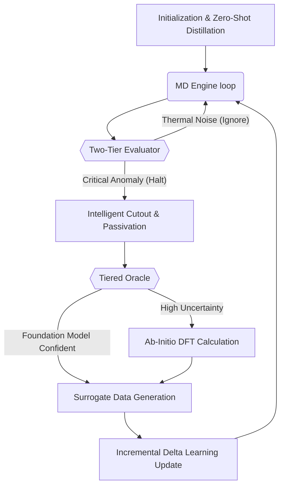

# SYSTEM ARCHITECTURE

## 1. Summary
The PyAceMaker project is evolving towards a modern, scalable "Hierarchical Distillation" architecture. The primary objective is to facilitate extremely long and physically continuous Molecular Dynamics (MD) simulations involving millions of atoms, specifically targeting complex phenomena like phase transformations, diffusion, and collision cascades in HPC environments. The existing orchestration loops have provided a solid foundation, but they face limitations related to thermal noise hypersensitivity, physical disruption during isolated cluster cutouts (dangling bonds and dipole divergence), and catastrophic forgetting during batch retraining.

The new NextGen architecture introduces several fundamental paradigm shifts inspired by best practices from advanced active learning frameworks like FLARE. It implements a Master-Slave Inversion, embedding the Python active learning logic inside the MD engine's execution loop (e.g., using LAMMPS `fix python/invoke`) to enable seamless pausing and resuming without breaking time continuity. Furthermore, it separates the uncertainty thresholds into a Two-Tier Evaluation system, explicitly distinguishing between triggering a Halt and selecting specific atoms for learning. Finally, it leverages Foundation Models (such as MACE) for Zero-Shot Distillation, intelligent structure passivation before DFT calculation, and rapid, local incremental Delta Learning to maintain constant computational cost scaling.

By reusing existing orchestrators, factories, and extraction utilities and extending them with targeted enhancements, the system ensures a non-destructive integration. The boundary management strictly separates the physical MD execution from the machine learning inference and data management domains.

---

## 2. System Design Objectives

The system design objectives for the NextGen Hierarchical Distillation Architecture are formulated to address the critical limitations of the previous implementation phase while establishing a robust foundation for extreme-scale, long-timescale molecular dynamics simulations. The overarching goal is to achieve an intelligent, self-driving simulation framework that seamlessly bridges the gap between the speed of empirical potentials and the accuracy of ab-initio quantum mechanical calculations. This section details the specific goals, the rigorous constraints imposed upon the development process, and the definitive success criteria that will dictate the project's completion.

### Primary Goals

First and foremost, the architecture must guarantee **Uninterrupted Molecular Dynamics (Time-Continuity)**. In the previous iteration, whenever the active learning loop detected a high-uncertainty event and triggered a halt to retrain the potential, the subsequent MD simulation was forced to restart from the initial configuration (time zero). This "Time-Continuity Break" was a fatal flaw for studying long-timescale phenomena such as slow diffusion processes, complex phase transformations, or cascading collision events. The new system must ensure that when a simulation is halted for potential refinement, it can immediately resume from the exact same phase space. This means preserving not only the atomic coordinates and lattice vectors but also the precise atomic velocities, thermostat states, and ensemble distributions. By implementing a Master-Slave Inversion paradigm, where the MD engine dictates the flow of time and Python simply acts as an intelligent supervisor invoked periodically, we can achieve true time-continuity.

Secondly, the system requires **Robust Noise Filtering**. Molecular dynamics is inherently noisy due to thermal fluctuations. Previously, a single global uncertainty threshold was used to trigger a halt. This resulted in "Thermal Noise False Positives," where momentary, physically safe spikes in atomic forces caused the system to halt needlessly, leading to endless loops of redundant DFT calculations and zero forward progress in simulation time. The new architecture introduces a "Two-Tier Threshold" system. It explicitly separates the condition for pausing the simulation (`threshold_call_dft`) from the condition for selecting which specific atoms require new training data (`threshold_add_train`). Furthermore, it requires the upper threshold to be breached for several consecutive steps (`smooth_steps`) before a halt is officially declared, effectively filtering out transient thermal noise while remaining hyper-vigilant for genuine physical anomalies.

Thirdly, ensuring **Physical Integrity During Extraction** is paramount. When an anomaly is confirmed, the system must extract a localized cluster of atoms around the "epicenter" (the atoms with the highest uncertainty) to be sent to the DFT solver for ground-truth force evaluation. In the past, simply carving a cluster out of a bulk material and placing it in a vacuum created massive physical disruptions, particularly at the cut boundaries. These abrupt boundaries generated enormous numbers of dangling bonds, leading to severe charge imbalances and dipole moment divergences. Consequently, the DFT Self-Consistent Field (SCF) loops would frequently fail to converge, or worse, they would converge to non-physical "garbage" electronic states, which were then fed back into the training loop, corrupting the potential. The NextGen architecture solves this through "Intelligent Cutout & Passivation." Before any cluster reaches the DFT solver, its boundaries are pre-relaxed using the highly generalized knowledge of a Foundation Model (MACE), while the core atoms remain strictly frozen. Following this, the system automatically analyzes the electronegativity and bonding radii of the exposed surface atoms and passivates the dangling bonds by algorithmically attaching dummy atoms (such as fractional hydrogen). This ensures that the DFT solver receives a clean, electrically neutral, and physically stable miniature system.

Fourthly, the architecture must deliver **O(1) Learning Scalability**. The Phase 01 system relied on "Batch Retraining," meaning that every time new data was acquired, the entire historical dataset was reloaded into memory, and the machine learning potential was trained from scratch. This approach is computationally disastrous. As the simulation progresses and the dataset grows, the time required for each retraining cycle explodes logarithmically, eventually stalling the entire pipeline. Furthermore, continually adding structures representing rare, high-energy anomalies often caused the model to "forget" the low-energy, stable bulk configurations—a phenomenon known as catastrophic forgetting. The new system mandates an "Incremental Update" or "Delta Learning" strategy. By utilizing a randomized, fixed-size replay buffer of historical data mixed with the newly acquired local surrogate data, and by initializing the training process with the weights of the immediately preceding potential, the computational cost of updating the model remains strictly constant, O(1), regardless of how many millions of steps the simulation has run.

Finally, the system introduces **Zero-Shot Baseline Generation**. The most significant bottleneck in any active learning workflow is the sheer cost of the initial DFT calculations required to train a baseline potential from scratch. By maximizing the use of pre-trained Foundation Models like MACE-MP-0, which possess a broad, generalized understanding of "universal chemistry," we can perform "Zero-Shot Distillation." The system explores a massive combinatorial space of the target elements, filters the generated structures using the Foundation Model's own internal uncertainty metrics, and trains a highly robust initial ACE potential entirely using Foundation Model inferences. This approach drastically reduces the initial cold-start computational burden, requiring zero DFT calls before the first MD step is taken.

### Constraints

To ensure the resulting software is maintainable, secure, and scientifically rigorous, several strict constraints govern the implementation phase.

The most critical constraint is the **Zero Tolerance for Mocks** policy in production code. The system must use real, fully implemented logic for all functional algorithms, calculations, and API interactions. The use of dummy implementations, `pass` statements, or simple `print()` logging to simulate complex processing is strictly prohibited. Mocking is restricted exclusively to testing environments, and even then, only when simulating external dependencies that are unavailable during Continuous Integration (CI), such as HPC job schedulers or proprietary, licensed DFT software binaries. If an environment issue arises (e.g., a missing library), the solution is to properly install the dependency, not to mock the calling function.

Secondly, the development process must adhere to the principle of **Existing Codebase Preservation**. The current `src/pyacemaker` directory represents a significant investment in stable, validated logic. Modifications to this directory must be additive and evolutionary. Existing core modules, such as the `Orchestrator`, `DirectoryManager`, and the various Pydantic configuration models, should be extended through safe mechanisms like subclassing, adding new optional configuration fields, or utilizing the Strategy Pattern. Completely rewriting existing files or introducing breaking changes to established APIs without a compelling, documented architectural reason is prohibited. The new features must perfectly coexist with the established architecture.

Thirdly, the project enforces **Strict Type Safety**. All new Python code must be meticulously type-hinted and must pass strict type checking using `mypy`. The `pyproject.toml` configuration enforces `strict = true`, and any circumvention of the type checker (such as using `# type: ignore` without extreme justification or relying heavily on `Any`) is considered a failure of design. Duck typing, while a feature of Python, is heavily discouraged at the boundaries between major modules (e.g., between the `Orchestrator` and the `TieredOracle`) to ensure contract enforcement and prevent runtime crashes deep within computationally expensive HPC jobs.

Finally, the system must guarantee **Secure Command Execution**. The active learning loop frequently interacts with external system commands, ranging from launching MPI-parallelized LAMMPS instances to executing Quantum ESPRESSO via bash scripts. Any interface dealing with subprocess execution must employ robust shell injection prevention mechanisms. This includes utilizing explicit, restrictive allowlists for command tokens and employing strict regex-based blocklists to explicitly reject dangerous shell metacharacters (such as `;`, `&`, `|`, `` ` ``, `$`, `<`, `>`, `
`, `
`). Even when `shell=False` is used in Python's `subprocess` module, arguments must be sanitized to prevent malicious or accidental command chaining.

### Success Criteria

The ultimate success of the NextGen architecture is defined by the following measurable criteria:

1.  **End-to-End Autonomous Execution:** The orchestrator must successfully execute a full MD cycle without human intervention. It must autonomously detect a valid physical anomaly (one that surpasses both tiers of the uncertainty thresholds for the required number of consecutive steps, ignoring injected thermal noise), accurately extract the cluster, pre-relax and passivate the boundaries, route the structure to the simulated DFT solver, update the potential via incremental learning, and seamlessly resume the MD simulation from the exact halted phase space.
2.  **Code Quality and Test Coverage:** All newly developed and modified components must pass strict static type checking (`mypy`). The test suite must achieve an overall code coverage of at least 90%, with specific emphasis on testing edge cases in the extraction logic and the state machine of the Two-Tier Evaluator. All tests must run deterministically without side effects on the host file system.
3.  **O(1) Scalability Verification:** The system logs and profiling outputs must explicitly demonstrate that the time required for the training phase during the Nth halt is statistically equivalent to the time required during the first halt. The training history logs must confirm that the system is utilizing the incremental update strategy with a randomized replay buffer, rather than reloading the entire, ever-growing historical dataset into memory at once.

---

## 3. System Architecture

The architecture of the PyAceMaker NextGen system is built upon a foundation of strict separation of concerns, ensuring that the computationally intensive physical simulations (Molecular Dynamics) are distinctly isolated from the machine learning orchestration, data management, and the ab-initio quantum mechanical calculation layers. This modular design heavily utilizes Dependency Injection (DI) and the Strategy Pattern, allowing the system to flexibly switch between different computational oracles, training methodologies, and structural exploration policies without requiring modifications to the core control loop. This flexibility is vital for adapting the software to various HPC environments and differing scientific requirements.

At the heart of the system is the concept of "Master-Slave Inversion." In traditional active learning workflows, a Python script (the Master) iteratively calls an external MD binary (the Slave) for short bursts, analyzes the output trajectory, and then decides whether to continue or retrain. This approach inherently breaks the continuity of time and momentum within the simulation. The NextGen architecture reverses this relationship. The MD engine, running highly optimized C++ code (e.g., LAMMPS), becomes the Master of time. The Python-based active learning logic is injected directly into the MD execution loop as a Slave process, invoked periodically (e.g., using LAMMPS `fix python/invoke` or frequent custom callback hooks). This paradigm shift allows the simulation to run continuously at maximum speed, pausing only exactly when an anomaly is detected, and resuming flawlessly from the exact same phase space (atomic coordinates, velocities, forces, and internal thermostat states) once the machine learning potential has been refined.

### Core Components and Responsibilities

The system is decomposed into several interacting, highly specialized manager classes, each responsible for a distinct phase of the Hierarchical Distillation workflow.

1.  **The Orchestrator (`pyacemaker.core.orchestrator.Orchestrator`):**
    This component serves as the central nervous system of the entire workflow. It is responsible for parsing the initial configuration, establishing the active learning directory structures, initializing all the required operational modules via the `ModuleFactory`, and managing the high-level state machine of the active learning loop. In the NextGen architecture, the Orchestrator has been significantly upgraded to support the seamless resume logic. It no longer treats an MD execution as a black box that simply returns an exit code. Instead, it expects the `MDEngine` to return a detailed `MDResult` object containing specific checkpoint markers, the exact step number of the halt, and the specific atomic indices that triggered the anomaly. It coordinates the complex sequence of events following a halt: invoking the `IntelligentExtractor`, routing data to the `TieredOracle`, requesting the `PacemakerTrainer` to perform an incremental update, and finally instructing the `MDEngine` to resume the simulation.

2.  **The MD Engine (`pyacemaker.core.engine`):**
    The `MDEngine` is the executor of the physical simulation. Under the new Master-Slave Inversion paradigm, it is the primary driver of the simulation timeline. It encapsulates the interaction with the underlying molecular dynamics software (typically LAMMPS). The engine is responsible for constructing the necessary input scripts, handling process isolation to prevent C++ level crashes (like 'Lost atoms') from bringing down the main Python orchestrator, and managing the `fix python/invoke` interface. Crucially, the engine is also responsible for executing the "Soft Start" procedure. When an MD simulation resumes after a potential has been updated via delta learning, the subtle changes in the energy landscape can cause instantaneous, unphysical spikes in temperature as the atoms adjust to the new forces. The engine automatically applies a strong Langevin thermostat (a heat bath) for a predefined, brief number of initial steps upon resumption to safely thermalize the system before returning control to the target thermodynamic ensemble (e.g., NVE or NPT).

3.  **The Tiered Oracle (`pyacemaker.core.oracle.TieredOracle`):**
    The Oracle layer serves as the decision-making gateway for assigning ground-truth labels (energies, forces, stresses) to atomic structures. The `TieredOracle` implements the core "Hierarchical Distillation" concept. When the Orchestrator requests labels for a set of structures, the `TieredOracle` does not immediately dispatch them to the computationally expensive DFT solver. Instead, it first queries the Foundation Model (MACE) via the `MACEManager`. It evaluates the uncertainty metric returned by the Foundation Model for each structure. Only if the uncertainty exceeds a predefined critical threshold does the `TieredOracle` route the specific, problematic structure to the highly accurate but immensely costly `DFTManager`. For structures where the Foundation Model is highly confident, the `TieredOracle` accepts the Foundation Model's inference as the "ground truth," drastically reducing the overall computational cost of the active learning loop while maintaining accuracy.

4.  **Intelligent Extractor (`pyacemaker.utils.extraction`):**
    When the Two-Tier Evaluator within the MD Engine detects a genuine physical anomaly and triggers a halt, the Orchestrator invokes the `IntelligentExtractor`. This module's sole responsibility is to isolate the "epicenter" of the uncertainty from the massive, millions-of-atoms bulk simulation and prepare a mathematically clean, physically stable miniature structure for the `TieredOracle` to evaluate. The extractor applies a sophisticated core/buffer weighting system based on predefined radii (`core_radius` and `buffer_radius`). It utilizes `ase.constraints.FixAtoms` to strictly freeze the coordinates of the core atoms (which contain the crucial, unknown physics that triggered the halt). It then temporarily attaches a MACE calculator to perform a rapid LBFGS energy minimization strictly on the buffer atoms, relieving the immense strain caused by severing the cluster from the bulk. Finally, it analyzes the electronegativity of the newly exposed surface atoms and automatically passivates the dangling bonds by attaching dummy atoms (like fractional hydrogen) to ensure the cluster is electrically neutral and lacks divergent dipole moments, guaranteeing SCF convergence in the subsequent DFT calculation.

5.  **Trainer (`pyacemaker.core.trainer.PacemakerTrainer`):**
    The Trainer module is responsible for updating the weights of the Machine Learning Interatomic Potential (MLIP), specifically the ACE potential. To satisfy the requirement for O(1) Learning Scalability, the `PacemakerTrainer` utilizes an `IncrementalStrategy`. It completely discards the previous methodology of batch training on the entire historical dataset. Instead, when a halt occurs and new DFT data is acquired for the core of the extracted cluster, the trainer first triggers a `FinetuneManager` to briefly update the final readout layers of the Foundation Model, effectively "awakening" it to the specific local physics of the anomaly. The awakened Foundation Model is then used to explosively generate thousands of "surrogate" data points representing slight perturbations around the halt configuration. The `PacemakerTrainer` then initializes the ACE optimization routines using the weights of the immediately preceding potential, and trains *only* on the combined dataset consisting of the anchor DFT truth, the newly generated surrogate data, and a small, randomly sampled subset of the historical data (the replay buffer). This ensures rapid convergence and prevents catastrophic forgetting.

### Boundary Management and Interfaces

The architecture strictly enforces boundary management to prevent tight coupling and ensure that individual components can be tested and upgraded in isolation.

-   **Domain Models (`pyacemaker.domain_models`):** The domain models act as the absolute, immutable contract between all components in the system. They dictate the structure of all configurations, state representations, and data transfer objects. All domain models are implemented using Pydantic, ensuring that any data passing between major modules is strictly validated for type correctness, value constraints, and presence of required fields before processing begins. This prevents silent failures deep within the calculation pipeline.
-   **Interfaces (`pyacemaker.interfaces`):** The `interfaces` directory contains the modules responsible for communicating with the outside world. This includes executing external subprocesses (like the `QEDriver` for Quantum ESPRESSO or the `LAMMPSDriver`), reading and writing complex proprietary file formats, and interacting with the HPC job scheduler. These are the *only* modules in the architecture permitted to interact directly with the operating system's execution layer or the filesystem outside of the specifically designated active learning working directories. By isolating these interactions, the core logic of the orchestrator, oracle, and trainer can remain pure, predictable, and easily testable using Python-native representations.

### Data Flow Overview

The following Mermaid diagram illustrates the high-level data flow and decision routing within the NextGen Hierarchical Distillation architecture.


```mermaid
graph TD
    A[Initialization & Zero-Shot Distillation] --> B(MD Engine loop)
    B --> C{{Two-Tier Evaluator}}
    C -- "Thermal Noise (Ignore)" --> B
    C -- "Critical Anomaly (Halt)" --> D[Intelligent Cutout & Passivation]
    D --> E{{Tiered Oracle}}
    E -- "Foundation Model Confident" --> F[Surrogate Data Generation]
    E -- "High Uncertainty" --> G[Ab-Initio DFT Calculation]
    G --> F
    F --> H[Incremental Delta Learning Update]
    H --> B
```

---

## 4. Design Architecture

The detailed design architecture maps the conceptual components defined in the System Architecture to the concrete realities of the Python codebase. It specifies the required directory structures, the crucial extensions to the existing Pydantic domain models, and the precise type signatures for the critical algorithms. The design strictly leverages modern Python 3.12+ features, comprehensive type hinting (`mypy --strict`), and robust Pydantic data validation to ensure execution safety in highly variable HPC environments. A primary directive of this design is backward compatibility; existing data structures must be extended, not broken, to ensure the new active learning paradigms integrate smoothly.

### Directory Structure

The project follows a standard, modular Python layout, with clear delineations between core logic, domain definitions, external interfaces, and functional utilities. The new components fit naturally into this existing schema.

```text
pyacemaker/
├── core/
│   ├── engine/           # MD Engine interfaces (Upgraded for fix python/invoke integration)
│   ├── oracle/           # Contains MACEManager, DFTManager, and the routing TieredOracle
│   ├── trainer/          # Incremental PacemakerTrainer and the new FinetuneManager
│   ├── active_set.py     # DIRECT sampling strategies for maximizing information density
│   └── orchestrator.py   # The main loop controller, heavily refactored for seamless resume
├── domain_models/
│   ├── config.py         # The root PyAceConfig, extended with Distillation, Cutout, and Threshold models
│   ├── md.py             # MD State configurations, updated to hold precise resume step markers
│   ├── structure.py      # Context definitions for Exploration policies
│   └── validation.py     # Configurations for automated physical stress testing
├── interfaces/
│   └── qe_driver.py      # Secure, injection-proof subprocess executor for Quantum ESPRESSO
└── utils/
    ├── extraction.py     # The complex logic for Intelligent Cutout, MACE Pre-relaxation, and Auto-Passivation
    └── embedding.py      # PBC embedding utilities for placing clusters back into vacuums safely
```

### Domain Model Extensions

The existing configuration schema, rooted in `PyAceConfig` located within `pyacemaker.domain_models.config`, must be carefully extended. It needs to encompass the complex new requirements of the NextGen architecture without invalidating legacy configuration files used in earlier phases of the project. This is achieved by introducing new nested Pydantic models with sensible defaults.

1.  **`ActiveLearningThresholds`**:
    This is a vital new Pydantic model designed to codify the "Two-Tier Evaluator" logic inspired by the FLARE architecture. It explicitly defines the separation of duties regarding uncertainty.
    *   `threshold_call_dft`: A `float` representing the absolute upper limit of acceptable uncertainty. If any atom in the simulation exceeds this value for the required number of steps, the MD engine must halt.
    *   `threshold_add_train`: A `float` representing the lower limit of uncertainty. Once a halt is triggered, any atom whose uncertainty exceeds *this* lower threshold is designated as part of the "epicenter" and will be included in the training set extraction. This allows the system to gather comprehensive local data even if only a single atom triggered the actual halt.
    *   `smooth_steps`: An `int` defining the noise filter. It dictates the number of consecutive MD simulation steps that the `threshold_call_dft` must be breached before a halt is officially declared. This is the primary defense against thermal noise false positives.

2.  **`CutoutConfig`**:
    This Pydantic model governs the precise geometric and chemical rules used by the `IntelligentExtractor` when preparing a cluster for DFT evaluation.
    *   `core_radius`: A `float` defining the primary region of interest around the epicenter atoms. Atoms within this radius are assigned a force weight of 1.0 during training and are strictly frozen during the pre-relaxation phase.
    *   `buffer_radius`: A `float` defining the secondary relaxation zone extending beyond the core. Atoms within this region are assigned a force weight of 0.0, but their coordinates are allowed to relax under the guidance of the Foundation Model to relieve boundary strain.
    *   `enable_pre_relaxation`: A `bool` flag that activates the MACE-based LBFGS geometry optimization on the buffer atoms prior to DFT.
    *   `passivation_element`: A string (ideally constrained by a `Literal` type, e.g., `Literal["H", "F"]`) defining the specific element used to automatically terminate dangling bonds on the exterior surface of the buffer region.

3.  **`DistillationConfig`**:
    This model manages the initialization parameters for Phase 1, the Zero-Shot Distillation process.
    *   `mace_model_path`: A strictly validated string path pointing to the `.model` file of the pre-trained Foundation Model (e.g., MACE-MP-0-medium) stored locally on the HPC filesystem.
    *   `uncertainty_threshold`: A `float` representing the strict confidence limit required for a zero-shot structure to be accepted into the baseline training set without any DFT verification.
    *   `sampling_structures_per_system`: An `int` defining the total volume of the combinatorial structure pool generated during the initial exploration phase before active set selection is applied.

### Class Definitions and Algorithmic Interactions

The core functional requirements are satisfied by implementing specific logic within new or heavily modified class structures, adhering strictly to the defined type signatures.

-   **`extract_intelligent_cluster(structure: Atoms, target_atoms: List[int], config: CutoutConfig) -> Atoms`**:
    This function, residing in `utils.extraction`, is arguably the most critical and complex mathematical operation in the codebase. It accepts the massive (potentially millions of atoms) halted MD structure as an ASE `Atoms` object and a list of integers representing the indices of the "epicenter" atoms (those exceeding `threshold_add_train`). It must perform the following sequence of operations:
    1.  Utilize highly optimized ASE neighbor lists to extract a spherical subset of atoms encompassing both the `core_radius` and the `buffer_radius` extending from the target atoms.
    2.  Apply an `ase.constraints.FixAtoms` constraint exclusively to the atoms located within the `core_radius`.
    3.  If `enable_pre_relaxation` is true, temporarily attach a local instance of a MACE calculator (or a `FakeMACECalculator` during unit testing) to the isolated cluster and execute an LBFGS energy minimization. Due to the constraint applied in step 2, only the buffer atoms will move, relieving the artificial boundary strain created by the cutout process.
    4.  Execute a custom passivation algorithm. This algorithm must analyze the distance matrix of the outermost buffer atoms, compare them against known covalent bonding radii for the given elements, identify missing coordination vectors, and programmatically generate and append new dummy atoms (e.g., fractional Hydrogen) along those vectors to electrically neutralize the cluster and eliminate divergent dipole moments. The function returns the final, perfectly conditioned, vacuum-embedded `Atoms` object ready for DFT.

-   **`class TieredOracle(BaseOracle)`**:
    This class orchestrates the routing logic. It implements the standard `compute(self, structures: Iterator[Atoms]) -> Iterator[Atoms]` interface mandated by the `BaseOracle` abstract base class. Internally, it instantiates and maintains references to both a `MACEManager` and a `DFTManager`. As the iterator yields structures, the `TieredOracle` first passes them to the `MACEManager` for a rapid inference pass. It inspects the resulting uncertainty array. If the uncertainty of the structure is below the threshold, it yields the MACE-labeled structure directly. If the uncertainty exceeds the threshold, the `TieredOracle` intercepts the structure, dispatches it to the `DFTManager` for a rigorous ab-initio calculation, awaits the result, updates the structure's `calc` attribute with the ground truth energies and forces, and then yields it. This complex routing must happen transparently to the calling Orchestrator.

-   **`class TwoTierEvaluator`**:
    This class is an injected dependency for the MD Engine. It maintains internal state (specifically, a counter for consecutive threshold breaches). During the MD simulation loop (e.g., inside the `fix python/invoke` callback), it receives the current uncertainty array for all atoms in the simulation box. It evaluates this array against `threshold_call_dft`. If breached, it increments its internal counter. If the counter reaches `smooth_steps`, it throws a specific `MDHaltInterrupt` exception, containing the step number and the indices of the atoms exceeding `threshold_add_train`. If the array does not breach the threshold, the counter resets to zero, effectively filtering out thermal noise spikes.

---

## 5. Implementation Plan

The development and integration of the NextGen architecture are meticulously divided into exactly six distinct, sequential implementation cycles. Each cycle is designed to deliver a specific, fully testable increment of the overall system, ensuring that stability is maintained and continuous validation can occur throughout the development process. This phased approach minimizes risk and allows for course correction based on test results at the end of each cycle.

### Cycle 01: Domain Model Expansion & Zero-Shot Distillation Preparation
**Objective:** The primary objective of this initial cycle is to radically expand the foundational data structures and configuration schemas required for the entire NextGen architecture. It focuses heavily on Pydantic schema validation and enforcing strict type safety across the application boundary. Furthermore, it implements the underlying logic scaffolding for the Phase 1 Zero-Shot Distillation strategy without directly invoking the heavy AI models.
**Detailed Tasks:**
1. **Extend Base Configurations:** We must introduce several new, deeply nested Pydantic models within `domain_models/config.py`. This includes the creation of `DistillationConfig`, `ActiveLearningThresholds`, `CutoutConfig`, and a specialized `LoopStrategyConfig`. These models are not mere dataclasses; they must incorporate advanced Pydantic field validators to ensure physical impossibilities (like a negative cutoff radius) are rejected immediately at the parsing stage.
2. **Implement Guardrails and Validators:** We will utilize Pydantic's `@model_validator` decorator to enforce complex, cross-field logical boundaries. For instance, the system must mathematically guarantee that the `buffer_radius` is always strictly greater than or equal to the `core_radius` defined within the `CutoutConfig`. It must also ensure that the `threshold_call_dft` is strictly greater than the `threshold_add_train` within the `ActiveLearningThresholds`. Clear, context-aware error messages must be generated for any validation failures to aid the end-user.
3. **Refactor Orchestrator Bootstrapping:** The initialization sequence of the `Orchestrator` class requires modification to securely parse, deserialize, and validate these new YAML configuration files. The system must be engineered to gracefully handle legacy configuration files by applying carefully considered default values for all new, optional fields, ensuring backward compatibility.
4. **Develop the MACEManager Interface:** We will create the structural framework for the `MACEManager` interface. This class must correctly inherit from the `BaseOracle` abstract base class to ensure polymorphic compatibility with existing code. The API contract will be strictly defined, detailing exactly how the manager will accept file paths to massive `.model` files and how it will unpack and return uncertainty metric arrays alongside standard energy and force tensors. While the intricate PyTorch/MACE neural network integration logic will not be fully realized in this first cycle, the structural interface and type signatures must be definitively locked in to permit parallel, unblocked development of dependent downstream modules.

### Cycle 02: Intelligent Extraction & Auto-Passivation
**Objective:** This cycle confronts the most significant physical challenge of the Phase 3 architecture: engineering the complex geometric and chemical algorithms absolutely necessary for the safe, physically sound extraction of localized atomic clusters from massive, fully periodic Molecular Dynamics supercells. The overarching goal is to completely eradicate the catastrophic dipole divergences and subsequent Quantum ESPRESSO SCF convergence failures that plagued earlier versions.
**Detailed Tasks:**
1. **Architect Spherical Clipping Logic:** The `utils/extraction.py` module requires a complete architectural overhaul. We must implement highly optimized, vectorized spherical clipping logic. This involves utilizing advanced `ase.neighborlist` constructions to rapidly identify all contiguous atoms falling within the explicitly defined user parameters for `core_radius` and `buffer_radius`, radiating outward from the designated target epicenter atoms.
2. **Implement Force Weight Arrays:** We will engineer the logic to dynamically generate and append a custom `force_weight` array directly into the extracted ASE `Atoms` object. This array acts as a mask during the later machine learning training phase, strictly assigning a weight of 1.0 to the highly uncertain core atoms while assigning a 0.0 weight to the dynamically added buffer and passivation atoms.
3. **Develop the Pre-Relaxation Algorithm:** This step is computationally intricate. We must programmatically construct and apply an `ase.constraints.FixAtoms` constraint to explicitly lock the coordinates of all atoms residing within the inner core region. Subsequently, the system must temporarily instantiate a localized MACE calculator (leveraging the path provided in the `DistillationConfig`) and seamlessly attach it to the isolated cluster. We will then execute an `ase.optimize.LBFGS` minimization routine. Because of the previously applied constraints, the mathematical optimizer will only adjust the positions of the buffer atoms, effectively relieving the severe, artificial boundary strain created by the sudden geometric cutout process.
4. **Engineer the Auto-Passivation Logic:** We will write the sophisticated chemical logic required to automatically detect and repair unbound surface atoms. This algorithm must compute a full distance matrix for the outermost shell of the extracted buffer atoms. It must then compare these computed distances against established standard covalent bonding radii for the specific elemental species present. Upon identifying missing coordination vectors (dangling bonds), the system must programmatically calculate the optimal geometric coordinates and append new dummy atoms (e.g., fractional Hydrogen) along those exact vectors. This process electrically neutralizes the cluster, completely eliminating the divergent dipole moments that crash ab-initio solvers.

### Cycle 03: The Two-Tier Evaluator & Noise Filtering
**Objective:** The primary objective of Cycle 03 is to design, implement, and rigorously test the stateful, highly intelligent evaluation logic that serves as the system's primary defense mechanism against inherent thermodynamic noise. This component is solely responsible for deciding exactly when the massive, parallelized MD engine should halt its execution to demand a potential refinement.
**Detailed Tasks:**
1. **Architect the Evaluator Class:** We will develop a entirely new, highly isolated Python class designated as the `TwoTierEvaluator`. This class is specifically designed to be injected directly into the high-frequency execution loop of the MD engine. Crucially, this class must be explicitly stateful; it requires internal memory variables to track its ongoing status across thousands, or potentially millions, of consecutive molecular dynamics timesteps.
2. **Implement the Smooth Steps State Machine:** The core mathematical logic of this evaluator revolves around tracking consecutive, sustained breaches of the upper `threshold_call_dft` limit. At every timestep, if the maximum recorded uncertainty within the entire simulation box exceeds this hard threshold, an internal, synchronized counter must increment. Conversely, if the maximum uncertainty suddenly drops back below the threshold, the counter must instantly reset to zero. Only when this internal counter reaches the precise `smooth_steps` integer value defined in the user's configuration does the evaluator definitively signal that a genuine, physical anomaly is occurring, effectively filtering out instantaneous thermal spikes.
3. **Identify the Epicenter:** Immediately after a valid halt condition is signaled, the evaluator must perform a secondary, highly focused pass over the current uncertainty array. During this pass, it must identify and record the specific integer indices of all atoms whose individual uncertainty metric exceeds the secondary, lower `threshold_add_train` limit. These specific indices represent the precise "epicenter" of the physical event and must be securely packaged into the halt signal payload for downstream processing.
4. **Establish the Interrupt Protocol:** We must define a clean, highly robust method for the `TwoTierEvaluator` to communicate its halt signal back to the controlling MD Engine process. This is typically achieved by architecting and throwing a specialized custom exception (e.g., `MDHaltInterrupt`). This exception object must be capable of containing the gathered contextual data, specifically the current exact step number and the array of epicenter indices, allowing the MD Engine to catch the exception, process the payload, and orchestrate a graceful shutdown procedure.

### Cycle 04: Master-Slave MD Engine Integration (Seamless Resume)
**Objective:** Cycle 04 is dedicated to fundamentally refactoring the critical interface bridging the Python orchestration layer and the physical C++ simulation engine (typically LAMMPS). The objective is to fully support the Master-Slave Inversion paradigm, enabling true, unbroken time-continuous execution and the flawless, seamless resuming of simulations immediately following a machine learning potential update.
**Detailed Tasks:**
1. **Refactor the Engine Interface:** The core `pyacemaker.core.engine` interface requires a complete paradigm rewrite. It must transition away from the legacy model where Python repeatedly launches short, independent, isolated MD runs in a loop. Instead, it must move to a model where Python launches a single, potentially infinite MD run and securely injects the `TwoTierEvaluator` logic via high-frequency callbacks (for example, utilizing the LAMMPS `fix python/invoke` command architecture, or by implementing robust process isolation and complex `read_restart` file parsing if tight C++ memory coupling is unavailable or unstable in the specific target HPC environment).
2. **Handle the Halt Exception:** The engine layer must be engineered to securely catch the `MDHaltInterrupt` exception thrown by the injected `TwoTierEvaluator`. Upon catching this signal, it must safely pause the ongoing simulation, instruct the LAMMPS binary to immediately write a precise, uncorrupted binary restart file (`write_restart`), and subsequently return a highly detailed `MDResult` domain object back to the main Orchestrator. This object must contain the absolute file paths to the newly generated restart files alongside the critical epicenter atomic indices.
3. **Engineer the Soft Start Mechanism:** This task addresses a vital physical requirement for continuous simulations. When the Orchestrator commands the engine to finally resume the simulation utilizing a newly updated and slightly modified ML potential, the engine must automatically intercept and modify the LAMMPS input script. It must programmatically insert specific commands to apply a strong Langevin thermostat (acting as a massive heat bath) for a brief, highly configurable number of initial timesteps. This procedure safely and rapidly thermalizes any instantaneous, unnatural energy discontinuities caused by the abruptly shifting potential energy landscape, ensuring the system remains stable before smoothly returning control back to the originally targeted NVE or NPT thermodynamic ensemble.
4. **Harden Subprocess Execution:** The entire integration logic must be highly defensive against the unpredictable complexities of external, MPI-parallelized subprocess execution. The engine must rigorously sanitize any dynamically generated LAMMPS command input scripts to absolutely prevent accidental command injection vulnerabilities or subtle syntax errors. Furthermore, the logic surrounding the execution of the `read_restart` command must explicitly anticipate and handle complex edge cases where the massive binary restart file might be corrupted or only partially written to disk due to intense filesystem contention on parallel HPC storage systems like Lustre.

### Cycle 05: Hierarchical Delta Learning & Replay Buffers
**Objective:** The primary goal of Cycle 05 is to fully implement Phase 4 of the architectural workflow: the O(1) incremental training methodology. This methodology is specifically designed to completely eradicate the twin problems of catastrophic forgetting and the severe computational bottlenecks associated with traditional, naive batch retraining on ever-expanding historical datasets.
**Detailed Tasks:**
1. **Enhance the PacemakerTrainer:** The interface of the `PacemakerTrainer` class must be significantly updated to natively accept the precise file path to the previously active ML potential. It must dynamically construct the complex configuration files (specifically `input.yaml` for the underlying ACE framework) required to explicitly instruct the underlying Fortran/C++ optimization routines to initialize their tensor weights directly from this previous potential file, rather than starting from a random initialization state or relying on a static, unchanging baseline.
2. **Engineer Replay Buffer Streaming:** We must develop a highly robust, extremely memory-efficient algorithm to stream the massive historical training data file (`training_history.extxyz`). This algorithm must iterate sequentially through the potentially gigabyte-sized file without ever loading its entire contents into system RAM simultaneously (e.g., by utilizing Python's `itertools.islice` or similar advanced streaming, lazy-loading techniques). It must randomly sample a strictly fixed-size subset of historical structural configurations (the exact size defined by the user's `replay_buffer_size` parameter), and materialize only that exceedingly small subset into a new, active training array.
3. **Develop Surrogate Generation Logic:** We must implement the sophisticated mathematical logic required to fully utilize the briefly awakened Foundation Model. Taking the finalized, ground-truth-labeled core cluster returned from the `TieredOracle`, the system must programmatically generate thousands of slight, physically plausible structural perturbations. This involves applying random atomic rattling vectors and minor lattice strain tensors. The system will then use the Foundation Model to rapidly infer the corresponding energies and forces for these newly generated "surrogate" structures, mapping the local phase space.
4. **Amalgamate the Training Dataset:** We will write the complex data routing logic necessary to efficiently combine the three distinct data streams (the newly acquired anchor DFT truth data, the massive pool of newly generated surrogate data, and the carefully sampled history replay buffer) into a single, cohesive, unified training dataset. This combined dataset is then seamlessly passed to the `PacemakerTrainer` to execute the highly targeted delta update. This cycle represents the crucial evolutionary leap that transforms the framework from a small-scale, proof-of-concept research tool into a production-ready, infinitely scalable HPC engine capable of exploring massive, complex phase spaces autonomously.

### Cycle 06: Final Orchestration, Validation, and HPC Hardening
**Objective:** The final implementation cycle ties all of the preceding phases and complex modules together into a singular, cohesive, self-driving execution loop. Furthermore, it ensures the strict physical validity of the generated ML potentials and relentlessly hardens the entire system architecture against the harsh, unpredictable realities of execution within massive supercomputing HPC environments.
**Detailed Tasks:**
1. **Refactor the Orchestrator Loop:** The central `Orchestrator`'s `run()` method must be completely and meticulously refactored. It must flawlessly and deterministically sequence the complex state transitions: Phase 1 (Zero-Shot Initialization) -> Enter the Continuous MD Loop -> Catch the asynchronous Halt Interrupt -> Execute Phase 3 (Intelligent Cutout) -> Execute Phase 4 (Delta Learning) -> Seamlessly Resume the MD Loop. It must handle the complex, strict type-safe passing of Pydantic domain models and absolute file paths between these highly isolated software components without dropping references.
2. **Implement the Physical Validator:** We must develop the automated physical stress testing suite encapsulated within the `Validator` class. This class must be engineered to interact seamlessly with external, specialized scientific tools (such as Phonopy) to automatically calculate the stringent Born stability criteria (via elastic constants) and compute the full phonon dispersion curves (specifically checking for the presence of unstable imaginary frequencies) for every newly generated potential. If a candidate potential fails these crucial physical sanity checks, the Orchestrator must be explicitly programmed to automatically reject it, rollback the state, and attempt a different, pre-configured refinement strategy.
3. **Deploy Task-Level Checkpointing:** HPC jobs are frequently and abruptly killed due to strict cluster wall-time limits. To survive this, the Orchestrator must implement a fine-grained, highly resilient task-level checkpointing system. It should utilize a local, embedded SQLite database or an atomic, append-only JSON log file to continuously record the exact sub-step of the workflow it is currently executing (e.g., "Extracting cluster for step 5000", "Awaiting DFT convergence on cluster 5"). When the job is eventually re-submitted to the queue by the HPC scheduler, the Orchestrator must automatically parse this log and resume execution from the exact point of interruption, rather than disastrously restarting the entire computationally expensive iteration from the beginning.
4. **Execute Final Quality Assurance:** Perform a comprehensive, repository-wide code cleanup. We will execute strict `mypy` type hinting verification across the entire codebase to ensure zero dynamic typing leaks. We must ensure that all docstrings, inline comments, and architectural diagrams perfectly match the finalized, merged implementations, and rigorously verify that the executable `USER_TEST_SCENARIO.md` script accurately and flawlessly reflects the final, compiled system behavior. This final cycle transforms a disparate collection of highly advanced machine learning algorithms into a singular, cohesive, autonomous scientific instrument ready for immediate deployment on supercomputers worldwide.

---

## 6. Test Strategy

Testing is an absolute, uncompromising requirement for the PyAceMaker NextGen architecture. Given the inherent complexity of distributed scientific computations, the high potential for subtle, silent physical errors in coordinate transformations, and the mandate for robust, completely autonomous execution on massive, heterogeneous HPC clusters, a highly comprehensive, multi-layered testing strategy is absolutely essential. All six implementation cycles mandate extremely high unit test coverage (exceeding 90%) and demand strict isolation between components. To adhere strictly to the "Zero Tolerance for Mocks" policy regarding production execution code, the test suite must rely heavily on sophisticated Test Doubles (specifically "Fakes") that mathematically mimic the complex behavior of external dependencies without actually executing their heavy underlying binaries, rather than relying on overly broad, unverified `MagicMock` patching which frequently hides critical interface and type errors.

### Cycle 01: Domain Models Test Strategy
The testing strategy for the first cycle focuses entirely on data integrity, strict type safety, and the meticulous, exhaustive validation of the newly introduced Pydantic configuration schemas. Since the domain models form the absolute bedrock contract of the entire system architecture, their validation logic must be completely bulletproof. The primary mechanism for ensuring high code quality in this initial phase is strict static analysis. We will leverage `mypy --strict` to enforce comprehensive, uncompromising type hinting across the entirety of the `domain_models` package. Any deviation from strict typing, such as the use of the `Any` type or missing function return types, will be configured to cause the CI/CD pipeline to fail immediately and loudly. Beyond static analysis, the pytest unit test suite will exhaustively and aggressively target the custom Pydantic `@model_validator` methods. We will create vast arrays of synthetic, intentionally malformed YAML configuration dictionaries. These test dictionaries will contain insidious edge cases such as negative values for physical radii parameters, string values where integers are explicitly expected, invalid or non-existent elemental symbols defined for the passivation logic, and highly contradictory active learning thresholds (e.g., setting the `add_train` threshold to a numerically higher value than the `call_dft` threshold, breaking the two-tier logic). The `pytest` framework will be employed to strictly `assert` that a `pydantic.ValidationError` is explicitly and immediately raised for every single invalid configuration permutation. This guarantees mathematically that the Orchestrator will never, under any circumstances, initialize with a physically absurd or logically broken state. Furthermore, we will implement high-level integration tests to verify the `PyAceConfig` parser's ability to seamlessly ingest complex, deeply nested YAML structures containing typical, dynamic HPC environment variables (like `${SLURM_JOB_ID}`) embedded within string fields, ensuring the system can operate smoothly and natively within diverse supercomputing cluster environments. A critical, non-negotiable constraint for this cycle's testing is absolute side-effect prevention. Because domain models define data structures and not physical execution logic, these tests must run entirely in memory. They must not write temporary files to disk, initiate mock network requests, or spawn background subprocesses. This ensures the test suite executes in mere milliseconds, providing immediate, highly parallelizable feedback to developers and maintaining the extreme agility required during the initial architectural definition phase.

### Cycle 02: Extraction Test Strategy
Testing the extraction module is highly complex, as it requires verifying intricate 3D geometric algorithms and physical chemical passivation logic without incurring the massive computational overhead of loading multi-gigabyte PyTorch Foundation Models or spinning up actual C++ MD engines during standard, rapid continuous integration runs. The unit tests will focus relentlessly on mathematical correctness and boundary precision. We will programmatically generate massive synthetic `ase.Atoms` objects residing entirely in memory, representing perfectly known, defect-free crystal structures, such as a simple cubic or a Face-Centered Cubic (FCC) lattice spanning tens of thousands of atoms. These massive synthetic structures will be passed directly to the `extract_intelligent_cluster` function along with rigorously defined `core_radius` and `buffer_radius` floating-point parameters. We will then programmatically calculate the expected number of extracted atoms using standard spherical geometry formulas and strictly `assert` that the function's internal neighbor-list implementation returns a cluster containing the exact, mathematically precise number of atoms, proving the spatial clipping logic is flawless. Integration testing will shift focus to the chemical viability of the `_passivate_surface` algorithm. We will dynamically inject a specialized cluster explicitly containing known, easily identifiable dangling bonds (e.g., a severed Silicon or Magnesium Oxide crystal plane). The test suite will iterate over the resulting passivated `Atoms` object to rigorously verify that the correct number of dummy Hydrogen atoms were appended at the appropriate, physically meaningful geometric coordinates relative to the exposed surface atoms. We will mathematically assert that the total formal charge of the resulting cluster is strictly neutral and compute the overall dipole moment vector to ensure its magnitude falls well within acceptable tolerances necessary for immediate SCF convergence in standard DFT codes. To strictly satisfy the "Zero Tolerance for Mocks" constraint while maintaining high test execution speed, we will implement highly specialized Test Doubles, specifically Fakes. For testing the `_pre_relax_buffer` logic, we will strictly prohibit loading a real MACE `.model` file. Instead, we will architect a dedicated `FakeMACECalculator` class that correctly inherits from the standard `ase.calculators.calculator.Calculator` base class. When its internal `get_forces()` method is invoked by the ASE optimizer, this Fake will instantly return predictable, hardcoded NumPy force vectors (for instance, directing all buffer atoms straight towards the mathematical center of mass of the cluster) rather than performing actual, expensive neural network tensor inference. This methodology guarantees complete, rigorous logical coverage of the complex relaxation constraint algorithms (`FixAtoms`) while remaining entirely isolated from the severe complexities, dependency hell, and specific GPU hardware requirements of the actual PyTorch backend.

### Cycle 03: Evaluator Test Strategy
The `TwoTierEvaluator` is a complex, explicitly stateful mathematical component whose internal logic directly dictates the high-level execution flow of the entire massive simulation loop. Its testing strategy must therefore prioritize exhaustive state machine verification and statistical robustness under highly variable, simulated thermodynamic noise conditions. The unit test suite for this component will completely avoid utilizing any data generated from real, physical MD runs. Instead, we will construct elaborate, precisely controlled sequences of synthetic NumPy arrays representing hypothetical atomic uncertainties across hundreds of consecutive, simulated timesteps. For example, we will generate a test sequence that perfectly mimics background thermal noise (values hovering randomly around 0.02), immediately followed by a sudden, massive spike (0.08) that drops back down on the very next step (simulating a harmless false positive), followed later by a sustained, physical elevation (0.07 holding steady for five consecutive steps). We will feed this entire synthetic time series into the evaluator instance step-by-step and strictly `assert` that its internal `smooth_steps` counter increments correctly, resets instantly upon the false positive, and only explicitly throws the `MDHaltInterrupt` exception when the exact, pre-programmed sustained criteria are met. This guarantees mathematically that the noise filtering logic functions perfectly under any condition. Furthermore, we must rigorously test the evaluator's concurrency and thread safety. In highly advanced, distributed HPC environments, uncertainty arrays might be delivered asynchronously and out-of-order from different MPI ranks of the underlying parallelized MD engine. We will use Python's built-in `threading` library to simultaneously inject conflicting uncertainty arrays into a shared, singleton instance of the `TwoTierEvaluator` and heavily `assert` that race conditions do not corrupt the internal counters, ensuring deterministic, reproducible halting behavior regardless of the underlying MPI communication latency or jitter. To strictly prevent side effects and maintain execution speed, these tests must remain entirely computational in nature. The evaluator will be instantiated solely in memory, fed pre-calculated NumPy arrays, and its resulting internal state variables or raised exceptions will be asserted. Absolutely no file system I/O, LAMMPS binary execution, or network socket communication is permitted during the execution of these specific tests, ensuring they run at maximum theoretical speed and provide irrefutable, mathematical proof of the state machine's logical correctness.

### Cycle 04: MD Integration Test Strategy
The testing strategy for the core engine integration cycle is widely considered the most challenging aspect of the project, as it requires verifying complex, asynchronous interactions with an external, highly parallelized C++ binary (LAMMPS) and managing extremely fragile file system I/O operations without actually running the massive physical simulations. The unit tests will meticulously and exhaustively examine the internal generation of the LAMMPS input scripts. We will programmatically invoke the `Engine.run()` method and strictly capture the dynamically generated command strings before they are sent to the shell. Using complex regex patterns or explicit string matching, we will rigidly `assert` the presence, correct ordering, and exact formatting of the crucial `read_restart` commands, the `write_restart` triggers, and the newly implemented "Soft Start" Langevin thermostat commands, verifying that the physical thermalization parameters perfectly match the user's defined `MDConfig` schema. Integration testing in this cycle must focus entirely on subprocess resilience and automated error recovery. We will simulate catastrophic, sudden LAMMPS crashes by deliberately and programmatically raising `subprocess.CalledProcessError` exceptions deep within the engine's lowest execution layer. The test must definitively `assert` that the Orchestrator's high-level `try/except` block structures successfully intercept the failure, immediately capture the last known valid state representation from the `DirectoryManager`, and cleanly exit the active learning loop without generating a cryptic, unhandled Python traceback. Furthermore, we must aggressively test the file system contention handling. When LAMMPS is instructed to halt, it will rapidly dump massive, multi-gigabyte binary restart files to parallel storage systems (like Lustre or GPFS), which the Python orchestrator script must then immediately attempt to move or read. We will heavily utilize multithreading to simulate aggressive, concurrent access attempts to dummy restart files on the disk, explicitly asserting that the orchestrator employs robust file locking algorithms or sophisticated retry mechanisms (e.g., exponential backoff) to gracefully handle the inevitable `FileNotFoundError` or `PermissionError` spikes that occur in these environments. To ensure strict environmental isolation and total side-effect prevention, we will exclusively utilize the Pytest `tmp_path` fixture for all script generation and mock file writing tests. We will employ `unittest.mock.patch` strictly and exclusively on the final `subprocess.run` OS call, configuring the mock object to instantly return synthetic `stdout` strings and predefined integer exit codes (e.g., 0 for a simulated success, 1 for a simulated crash) without ever actually executing a real C++ binary on the host system. This ensures the tests are entirely deterministic and leave absolutely zero pollution in the developer's local workspace.

### Cycle 05: Training Test Strategy
The testing strategy for the Hierarchical Delta Learning cycle focuses intensely on verifying the deep mathematical integrity of the massive dataset manipulation routines and the precise, flawless implementation of the highly complex O(1) sampling algorithms. The unit tests must rigorously and statistically evaluate the replay buffer sampling logic. We will programmatically generate a massive mock history file (`training_history.extxyz`) directly onto the isolated `tmp_path` fixture. This mock file will contain hundreds of thousands of dummy structural frames, each uniquely tagged with a specific identifier representing its relative "age" in the simulation timeline. We will execute the streaming sampling function and mathematically `assert` that the output list of structures perfectly matches the exact integer size configured in the `replay_buffer_size` variable. Crucially, we will perform a rigorous statistical chi-squared test on the sampled identifiers to mathematically prove that the algorithm samples uniformly across the entire length of the history file, ensuring the absolute absence of recency bias and guaranteeing mathematically the protection against catastrophic forgetting. Integration tests will heavily verify the complex, multi-layered configuration generation required by the external `PacemakerTrainer` binary. We will execute the preparation methods and use the standard `pyyaml` library to deeply parse the resulting generated `input.yaml` file. We will programmatically `assert` that the configuration correctly and securely points to the newly generated combined dataset paths and, most importantly, that it explicitly defines the vital `initial_potential` key, pointing precisely to the exact `.yace` file generated during the immediately preceding iteration, definitively proving that the incremental update mechanism is correctly engaged. For the surrogate data generation testing, we will provide a perfectly optimized, symmetric synthetic cluster to the function, apply the randomized rattling and strain perturbation matrices, and programmatically `assert` that the maximum calculated displacement vector of any single atom in the resulting surrogate structures strictly obeys a physically realistic, hard-coded upper bound (e.g., never exceeding exactly 0.5 Angstroms), guaranteeing mathematically that the generated training data remains strictly within the local phase space of the physical anomaly. All massive data generation, file writing, and file reading during these specific tests must be strictly and absolutely confined to `tempfile.NamedTemporaryFile` instances or the managed Pytest `tmp_path`, guaranteeing that the operating system automatically and securely eradicates all intermediate `.extxyz`, `.yaml`, and `.yace` files the very millisecond the test suite completes, ensuring absolute side-effect prevention across the CI environment.

### Cycle 06: Orchestration Test Strategy
The final testing cycle must definitively prove that the entire, massively complex system functions flawlessly as a singular, cohesive, and highly autonomous scientific instrument. The integration tests will execute a comprehensive, high-speed "Dry Run" of the full, end-to-end active learning loop. To accomplish this without taking hours of expensive compute time, we will inject highly sophisticated Test Doubles (Fakes) for all heavy computational components: a `FakeGenerator` that rapidly yields simple two-atom structures, a `FakeOracle` that immediately returns random but perfectly formatted NumPy energy arrays and force tensors, and a `FakeTrainer` that instantly creates a dummy `.yace` potential file on disk. We will execute the main `Orchestrator.run()` method and strictly `assert` programmatically that the internal state machine successfully transitions through Phase 1 (Zero-Shot Initialization), Phase 2 (Validation), Phase 3 (Cutout), and Phase 4 (Delta Learning) in perfect, uninterrupted sequence, correctly passing the highly complex Pydantic domain models and absolute directory paths between the isolated software components without raising any integration errors or deep type mismatches. The End-to-End (E2E) validation phase will rigorously and aggressively test the system's ability to survive catastrophic, unpredicted hardware failures. We will initiate the Orchestrator Dry Run, and utilizing a separate, parallel daemon thread, we will explicitly inject a harsh `SystemExit` exception or send a raw `SIGKILL` signal directly to the Python process precisely while it is executing a specific, delicate sub-step (e.g., during the middle of the complex "Cutout" phase file I/O). We will then programmatically re-launch the Orchestrator executable, pointing it explicitly to the exact same working directory. The test must read the resulting terminal logs and internal state variables and explicitly `assert` that the Orchestrator immediately detects the interrupted state via its embedded SQLite or JSON task-level checkpoint file, cleanly skips all previously completed phases, and resumes execution identically from the very beginning of the "Cutout" phase, proving the flawless, robust operation of the checkpointing system. Furthermore, we will rigorously test the `Validator` class by deliberately feeding it known "Bad Potentials" that the injected `FakeOracle` is explicitly programmed to reject (e.g., yielding non-physical forces that mathematically result in highly imaginary phonon frequencies) and `assert` that the Orchestrator correctly intercepts the generated "FAILED" validation report and initiates the appropriate, pre-configured fallback strategy. All dry runs and E2E recovery tests must operate exclusively and totally within the securely isolated sandbox of the `tmp_path` fixture to ensure absolutely that no orphaned databases, massive temporary directories, or dummy machine learning potentials are ever left behind on the host HPC filesystem.
