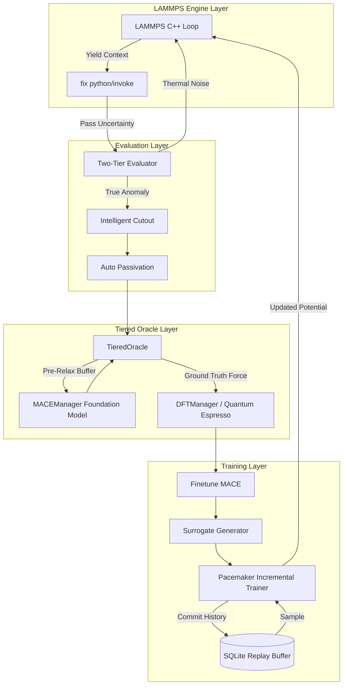

# System Architecture for PyAceMaker

## 1. Summary
PyAceMaker is an advanced orchestration platform designed to automate the construction of robust Machine Learning Interatomic Potentials (MLIPs). The system orchestrates an Active Learning loop with a "Hierarchical Distillation" architecture to solve the critical challenges of long-timescale molecular dynamics simulations. By integrating a foundational MACE oracle alongside Quantum Espresso to filter uncertainty, the system seamlessly pauses MD without losing time-continuity, repairs extracted clusters by auto-passivating dangling bonds, filters thermal noise using a two-tier uncertainty system, and incrementally updates potentials to prevent catastrophic forgetting. The new requirements build upon the existing capabilities in a strictly additive manner, preserving the established core logic while radically expanding its robustness and scale.

## 2. System Design Objectives

The fundamental objective of the PyAceMaker Next-Generation architecture is to achieve scalable, highly reliable molecular dynamics (MD) simulations capable of reaching timescales and system sizes previously impossible due to catastrophic halts and quantum mechanical divergence. Traditional active learning loops suffer from several critical physical and system constraints that this design aims to decisively overcome. Firstly, the "Time-Continuity Break" issue occurs when the simulation halts due to high uncertainty, forcing the MD to restart from the initial structure after retraining. This completely prevents the observation of long-timescale physical phenomena such as phase transformations or complex diffusion mechanisms. The new objective is to maintain perfect continuity, allowing simulations to pause, update the underlying potential, and resume seamlessly from the exact moment of interruption.

Secondly, the system must overcome "Thermal Noise False Positives." In conventional setups, a single uncertainty threshold governs the halting of the simulation. This makes the system overly sensitive to thermal vibrations—momentary spikes in uncertainty that represent physically harmless noise rather than genuine extrapolation. By establishing a robust two-tier evaluation system, the architecture will mathematically separate benign thermal fluctuations from true structural anomalies that require expensive density functional theory (DFT) validation, thereby drastically reducing unnecessary computational overhead and infinite retraining loops.

Thirdly, the objective addresses "Dangling Bond and Dipole Divergence," a severe limitation in local cluster extraction. When highly uncertain local regions are aggressively excised from a massive bulk simulation and placed into a vacuum for DFT evaluation, the resulting cut surfaces are plagued by unphysical dangling bonds. This leads to massive charge imbalances and dipole moment divergences, which inevitably cause the DFT self-consistent field (SCF) cycles to fail or, worse, to converge on non-physical electronic states (garbage data). The design goal is to strictly enforce "Intelligent Cluster Extraction and Auto-Passivation." This means not just cutting out a region, but meticulously repairing it—automatically passivating cut bonds (e.g., using fractional hydrogen) and relaxing the buffer layers using foundation models (like MACE) before any DFT calculation is attempted. This guarantees that the Quantum Espresso driver only ever sees physically sound, neutrally charged, and structurally relaxed sub-systems.

Fourthly, the system must eradicate "Catastrophic Forgetting and Retraining Bottlenecks." Historically, active learning loops perform full batch retraining upon encountering new structures, which incurs O(N) computational costs that explode over time, while simultaneously degrading the accuracy of previously learned stable bulk structures. The new design mandate is to enforce "Incremental Delta Learning." By utilizing past training history as a replay buffer and leveraging fast surrogate data generation, the system will update the potential in O(1) time complexity, preserving the core stability of the potential while rapidly adapting to new local environments.

Finally, the system must be highly fault-tolerant in High-Performance Computing (HPC) environments. C++ level crashes in LAMMPS must not bring down the Python orchestrator. The architecture will employ robust, task-level checkpointing using an embedded database (like SQLite) to ensure that every expensive calculation is preserved, allowing the system to instantly recover from Slurm wall-time terminations or unexpected node failures without losing progress. All these objectives must be achieved additively; the existing Pydantic configurations, modular drivers, and testing harnesses will be elegantly extended rather than rewritten, ensuring maximum reuse of the current investment.

## 3. System Architecture

The architecture of PyAceMaker revolves around a "Hierarchical Distillation" and "Master-Slave Inversion" paradigm, ensuring that molecular dynamics remains the primary driver of time, while Python-based orchestration and heavy quantum mechanics computations operate asynchronously to support it. The system is composed of several strictly decoupled layers: the Engine Layer, the Evaluation Layer, the Oracle Layer, and the Training Layer.

The Engine Layer is responsible for executing the molecular dynamics simulation. In this new paradigm, we invert the traditional control flow. Instead of Python repeatedly launching short MD runs and checking the output, the LAMMPS C++ loop acts as the master timekeeper. It utilizes the `fix python/invoke` capability to periodically yield execution context to the Python evaluation layer without breaking the internal state of the simulation. If a true structural anomaly is detected, LAMMPS enters a paused state, retaining all atomic coordinates, velocities, and thermodynamic ensembles in memory (or safely dumping a restart file as a robust fallback), while the rest of the orchestration pipeline executes. This ensures perfect time continuity upon resumption.

The Evaluation Layer acts as the gatekeeper. It implements the two-tier uncertainty thresholding. When the engine reports high uncertainty, this layer evaluates whether the spike is merely thermal noise (by checking if the threshold was exceeded for multiple consecutive steps) or a genuine unknown configuration. If it is a true event, the Evaluation Layer triggers the Intelligent Cutout component. This component is strictly responsible for extracting the spatial region of interest, applying a core/buffer force weighting scheme, and immediately passing the raw cluster to the Auto-Passivation module to heal dangling bonds.

The Oracle Layer is a tiered system designed to minimize expensive computations. It consists of the `TieredOracle`, which delegates to either the `MACEManager` (a lightweight, GPU-accelerated foundation model) or the `DFTManager` (Quantum Espresso). When a cluster is extracted, it is first passed to the `MACEManager` for a pre-relaxation of the buffer zone, holding the core fixed. Only when the cluster is physically stabilized is it passed to the `DFTManager` to acquire ground truth forces and energies for the highly uncertain core atoms. The separation of concerns here is absolute: the Oracles know nothing about the MD engine or the extraction logic; they simply receive an `Atoms` object and return calculated properties.

The Training Layer handles the updating of the MLIP. Upon receiving new ground truth data from the DFT oracle, it first fine-tunes the MACE model to awaken it to the specific local chemistry. It then uses this awakened MACE to rapidly generate a cloud of surrogate data around the failed configuration. Finally, the `PacemakerTrainer` combines this surrogate data, the single ground truth DFT calculation, and a sampled replay buffer from the historical SQLite state manager to perform an incremental delta learning update. The newly generated potential is then dynamically reloaded by the LAMMPS engine, and the simulation resumes.

**Rules on Boundary Management and Separation of Concerns:**
1. **Immutability of State:** The `Atoms` objects passed between layers must be treated as immutable by the receivers unless explicitly returned as a new object (e.g., from relaxation). No silent state mutations are permitted.
2. **Abstract Interfaces:** The core orchestrator must only interact with Oracles through the `BaseOracle` interface. It must never directly instantiate a `DFTManager` or `MACEManager`.
3. **No Domain Leakage:** The extraction and passivation utilities must not contain any ML or DFT logic; they purely manipulate geometric and chemical properties based on distance and electronegativity.
4. **Configuration Isolation:** All external commands and paths must be injected via Pydantic configuration models; no hardcoded environment variables or paths are allowed in the business logic.


```mermaid
graph TD
    subgraph LAMMPS Engine Layer
        MD[LAMMPS C++ Loop]
        INVOKE[fix python/invoke]
        MD -->|Yield Context| INVOKE
    end

    subgraph Evaluation Layer
        EVAL[Two-Tier Evaluator]
        CUTOUT[Intelligent Cutout]
        PASSIVATE[Auto Passivation]
        INVOKE -->|Pass Uncertainty| EVAL
        EVAL -->|Thermal Noise| MD
        EVAL -->|True Anomaly| CUTOUT
        CUTOUT --> PASSIVATE
    end

    subgraph Tiered Oracle Layer
        ORACLE[TieredOracle]
        MACE[MACEManager Foundation Model]
        DFT[DFTManager / Quantum Espresso]
        PASSIVATE --> ORACLE
        ORACLE -->|Pre-Relax Buffer| MACE
        MACE --> ORACLE
        ORACLE -->|Ground Truth Force| DFT
    end

    subgraph Training Layer
        AWAKEN[Finetune MACE]
        SURR[Surrogate Generator]
        TRAIN[Pacemaker Incremental Trainer]
        DB[(SQLite Replay Buffer)]

        DFT --> AWAKEN
        AWAKEN --> SURR
        SURR --> TRAIN
        DB -->|Sample| TRAIN
        TRAIN -->|Updated Potential| MD
        TRAIN -->|Commit History| DB
    end
```

## 4. Design Architecture

The structural organization of the PyAceMaker repository reflects the strict separation of concerns mandated by the architecture. The `src/pyacemaker/` directory houses the domain logic, configurations, external interfaces, and orchestration utilities. The additive approach ensures that new features seamlessly integrate with existing base classes and utility modules.

```text
src/pyacemaker/
├── core/
│   ├── engine.py       # LAMMPS execution, Seamless Resume, Master-Slave inversion
│   ├── oracle.py       # BaseOracle, TieredOracle, MACEManager, DFTManager
│   └── trainer.py      # PacemakerTrainer, FinetuneManager, Replay Buffer Logic
├── domain_models/
│   ├── config.py       # PyAceConfig master schema
│   ├── dft.py          # DFT Config
│   ├── md.py           # MD Config
│   ├── training.py     # Training Config
│   ├── extraction.py   # NEW: CutoutConfig, ActiveLearningThresholds
│   └── workflow.py     # DistillationConfig, LoopStrategyConfig
├── interfaces/
│   ├── lammps_driver.py# Subprocess or C++ wrapper for LAMMPS
│   ├── qe_driver.py    # Quantum Espresso generation/execution
│   └── mace_driver.py  # NEW: Wrapper for MACE execution
├── utils/
│   ├── extraction.py   # extract_intelligent_cluster, _passivate_surface
│   ├── embedding.py    # PBC setup and vacuum padding
│   └── structure.py    # Generic ASE manipulation
└── main.py             # CLI Entrypoint
```

**Core Domain Pydantic Models Structure and Typing:**
The configuration schema relies heavily on Pydantic models to ensure absolute type safety and runtime validation. The existing `PyAceConfig` acts as the root object, aggregating smaller, specific configuration models. To support the Next-Generation architecture, we will non-destructively extend the configuration space.

New models to be introduced:
- `ActiveLearningThresholds(BaseModel)`: Captures the two-tier evaluation logic. Fields include `threshold_call_dft` (float), `threshold_add_train` (float), and `smooth_steps` (int) to dictate the consecutive steps required to ignore thermal noise.
- `CutoutConfig(BaseModel)`: Dictates spatial extraction parameters. Fields include `core_radius` (float) for the primary extraction zone, `buffer_radius` (float) for the pre-relaxation zone, `enable_pre_relaxation` (bool), and `enable_passivation` (bool) with `passivation_element` (str, default "H").
- `DistillationConfig(BaseModel)`: Manages Phase 1 zero-shot generation. Contains `mace_model_path` (str), `uncertainty_threshold` (float), and `sampling_structures_per_system` (int).
- `LoopStrategyConfig(BaseModel)`: Governs the training loop behavior. Includes `use_tiered_oracle` (bool), `incremental_update` (bool), `replay_buffer_size` (int), and integrates the `ActiveLearningThresholds`.

**Integration Points and Additive Extensions:**
These new Pydantic schemas will be incorporated into the existing `WorkflowConfig` or directly into `PyAceConfig` as optional fields (or with safe default factories) to ensure backward compatibility.

In `pyacemaker.core.oracle`, the new `MACEManager` and `TieredOracle` classes will inherit from the existing `BaseOracle` interface. This ensures that the main orchestrator can swap out a pure DFT approach for the new tiered approach without any modification to the main control loop. The `TieredOracle` acts as a composite, internally routing `Atoms` objects to `MACEManager` first, assessing the returned uncertainty against the `ActiveLearningThresholds`, and only forwarding to `DFTManager` if the uncertainty exceeds the threshold.

In `pyacemaker.utils.extraction`, the new `extract_intelligent_cluster` function will wrap and extend existing functions like `extract_local_region`. It will sequentially call the extraction, apply the force weights to the `Atoms.info` dictionary, invoke a helper for MACE pre-relaxation, and finally call `_passivate_surface` to inject fractional hydrogen atoms before returning the finalized `Atoms` object. This functional composition guarantees that the complex new behavior is built from simple, testable, and existing primitive operations.

Furthermore, to maintain strict architectural boundaries, the data flow within the system must adhere to immutable principles wherever possible. The core orchestrator acts as the central state machine, reading the unified `PyAceConfig` and dispatching tasks to the respective phase managers. During Phase 1 (Distillation), the orchestrator triggers the combinatorial generator, which produces an initial pool of structures. This pool is immediately handed over to the active set selector, which filters the structures and passes them to the `MACEManager` for confidence evaluation. The high-confidence subset is then serialized and passed to the `PacemakerTrainer` to produce the foundational model. This entire flow is stateless from the perspective of the individual managers; they simply receive data, process it, and return the result. This design ensures that each component can be tested in isolation, mocked during development, and scaled independently on High-Performance Computing clusters using standard parallelization techniques like Dask or Ray, should the need arise in future iterations.

## 5. Implementation Plan

The implementation is strictly divided into six sequential cycles, designed to iteratively build functionality while maintaining an always-deployable state. Each cycle focuses on a specific architectural domain, ensuring that dependencies are resolved before subsequent layers are constructed.

### Cycle 01: Intelligent Cluster Extraction and Passivation Utilities
**Focus:** Building the core geometric and chemical manipulation tools required to safely isolate uncertain regions from massive molecular dynamics snapshots.
**Details:** This cycle focuses entirely on the `utils.extraction` and `utils.embedding` modules. The primary objective is to implement `extract_intelligent_cluster`. We will build the logic to identify the highly uncertain "epicenter" atom, carve out a spherical region defined by `core_radius` and `buffer_radius` (configured via the new `CutoutConfig` Pydantic model), and apply strict `force_weight` properties (1.0 for the core, 0.0 for the buffer and passivated atoms). Following extraction, we will implement the auto-passivation algorithm (`_passivate_surface`), which analyzes cut bonds using covalent radii and electronegativity to automatically attach neutralizing fractional hydrogen atoms. This cycle will also ensure that these extracted clusters are safely embedded into periodic boundary conditions with sufficient vacuum padding to prevent self-interaction during subsequent DFT calculations. No machine learning or MD execution will be implemented in this cycle; the focus is purely on robust data structure manipulation. The logic will strictly enforce that input `Atoms` objects remain unmutated; all extraction functions will return fresh `Atoms` instances. We will extend the internal `neighbor_list` functionality to efficiently compute the local bonding topology necessary for the passivation algorithm. Additionally, we will construct detailed geometric validation helpers to ensure that the appended fractional hydrogens do not unphysically overlap with existing core or buffer atoms. This foundational layer is absolutely critical for the downstream density functional theory (DFT) calculations. Without perfect charge neutrality and relaxed cut surfaces, the Quantum Espresso self-consistent field (SCF) cycles are guaranteed to either diverge or artificially bias the underlying machine learning interatomic potential toward capturing unphysical surface states rather than the intended bulk, defect, or interfacial phenomena. The successful completion of this cycle will directly mitigate the "Dangling Bond and Dipole Divergence" issue identified in the overarching system design objectives. Furthermore, we will create utility wrappers that map standard ASE constraints (like `FixAtoms`) specifically to the defined core region, preparing the structure for the MACE pre-relaxation step that will be introduced in Cycle 02. The entire surface passivation logic will be parameterized, allowing the orchestrator to dynamically select the passivating species (defaulting to fractional hydrogen, but extensible to other dummy atoms or pseudo-potentials depending on the base chemical system). This dynamic parameterization ensures maximum flexibility across entirely different materials classes, such as oxides, nitrides, and complex metallic alloys. To ensure mathematical robustness across edge cases, the algorithm will also feature a projection strategy for passivation vectors: instead of randomly placing hydrogens, the system will extrapolate the vectors from the missing neighbor coordinates, guaranteeing that the local bond angles of the fractured unit cell are perfectly preserved, simulating a truly infinite bulk environment as closely as theoretically possible within a finite cluster approximation.

 The exact algorithm for the spherical carving will utilize the ASE neighbor list initialized with a strictly defined cut-off radius to construct an undirected graph of the local topology. This graph traversal ensures that we correctly identify all bonded nearest neighbors and next-nearest neighbors without arbitrarily cutting strong covalent bonds mid-way, which is a major source of computational instability. By precisely capturing the first and second coordination shells of the identified epicenter, we guarantee that the underlying physics of the defect core is mathematically isolated and perfectly preserved for the subsequent DFT evaluation. ### Cycle 02: MACE Foundation Model Integration and Oracle Tiering
**Focus:** Introducing the foundation model for zero-shot inference and establishing the intelligent routing logic.
**Details:** This cycle builds the `MACEManager` within the `core.oracle` module. The manager will serve as a robust adapter for the MACE-MP-0 model, capable of taking an `Atoms` object and predicting energy, forces, and critically, model uncertainty. We will then construct the `TieredOracle` class. This composite oracle will implement the `BaseOracle` interface and encapsulate the logic defined by `ActiveLearningThresholds`. When a structure is queried, `TieredOracle` will first ask `MACEManager`. If the uncertainty is low, it returns immediately, saving massive computational time. If the uncertainty exceeds the configured threshold, it will fallback to the existing `DFTManager` (Quantum Espresso). Furthermore, the `MACEManager` will be wired into the `utils.extraction` pipeline developed in Cycle 01 to perform the crucial "Pre-relaxation" of the buffer zone, ensuring that the extracted cluster is energetically stable before being passed to DFT. The implementation of the `MACEManager` requires careful attention to dependency injection, ensuring that the heavy PyTorch and MACE dependencies do not crash the environment if they are unavailable in a strict, lightweight orchestrator node context. We will employ lazy loading techniques for the model weights to guarantee that memory is only allocated when an active query is explicitly dispatched. The `TieredOracle` is the linchpin of the hierarchical distillation concept; by explicitly decoupling the decision logic from the compute engines, we guarantee that the system can rapidly scale or substitute foundation models (e.g., swapping MACE for an advanced CHGNet or NequIP variant) without requiring any structural changes to the overarching molecular dynamics feedback loop. To support pre-relaxation, the `MACEManager` will expose a targeted `relax_structure` method. This method will leverage ASE's built-in `LBFGS` or `FIRE` optimizers, applying the constraints defined in Cycle 01 to freeze the critical "epicenter" core atoms entirely. Only the surrounding buffer shell and the newly passivated surface atoms will be permitted to geometrically relax. This crucial stabilization step eliminates the unphysical, high-energy local distortions inherently created during the mechanical excision of the cluster from the bulk supercell. By presenting the subsequent Quantum Espresso (DFT) calculations with an already smooth, relaxed, and charge-neutral potential energy surface, we drastically reduce the required number of SCF iterations and virtually eliminate catastrophic electronic convergence failures. This ensures the maximum possible return on investment for the expensive quantum mechanical compute cycles. Beyond mere relaxation, the Oracle layer will be designed with robust asynchronous queuing in mind, preparing the system for multi-node inference arrays where thousands of extracted defect structures could be theoretically routed to a dedicated cluster of GPU nodes running MACE instances in parallel, before selectively delegating the hardest, most extreme outliers to the much slower, CPU-bound Quantum Espresso allocations.

 Furthermore, the model initialization process must be rigorously profiled for memory leaks, ensuring that the GPU VRAM is completely flushed and reset between sequential inference calls. This strict memory hygiene is paramount for orchestrators designed to run indefinitely. The MACE adapter will also include explicit internal retries and timeout wrappers around the PyTorch execution backend, guaranteeing that transient CUDA driver errors or out-of-memory spikes do not crash the master Python thread, but rather trigger a graceful fallback and structured logging event. ### Cycle 03: The Two-Tier Evaluator and Master-Slave Inversion
**Focus:** Re-architecting the control loop to allow LAMMPS to drive the simulation time while Python handles asynchronous evaluation.
**Details:** This cycle overhauls `core.engine` to solve the "Time-Continuity Break" and "Thermal Noise" issues. We will implement the `TwoTierEvaluator` component, which tracks uncertainty across consecutive MD steps to filter out momentary thermal spikes (using the `smooth_steps` configuration). More importantly, we will implement the Master-Slave inversion mechanism. We will develop the Python callbacks required for LAMMPS's `fix python/invoke` command, allowing LAMMPS to yield execution to PyAceMaker at regular intervals. Alternatively, a robust fallback utilizing `.restart` files will be engineered to guarantee that if LAMMPS halts due to high uncertainty, the Python orchestrator can trigger the update loop and then resume the MD simulation from the exact timestep, thermodynamic state, and velocity distribution where it left off, avoiding costly thermalization overheads. The `TwoTierEvaluator` acts as an intelligent, stateful stream processor. It maintains a rolling window of the maximum uncertainty values reported by the molecular dynamics engine at each evaluation interval. By comparing this time series against the dual thresholds (`threshold_add_train` and `threshold_call_dft`), it distinguishes between ephemeral, benign thermal fluctuations—which naturally subside within a few femtoseconds—and genuine trips into uncharted, high-energy phase space configurations that demand immediate intervention. This mathematical filtration is paramount for maintaining throughput; without it, high-temperature simulations would be permanently paralyzed by false positive halt signals. The Master-Slave inversion represents the most profound architectural shift in the framework. Rather than employing the traditional "run-and-check" paradigm, where the Python process spawns a LAMMPS executable, waits for it to finish or crash, and then reads an external dump file, we are actively embedding the Python evaluation logic directly into the LAMMPS C++ execution loop. This requires precise orchestration of the LAMMPS Python library bindings. When the `fix python/invoke` callback fires, the internal state (atomic positions, velocities, box dimensions, and instantaneous forces) is synchronized in-memory. If the `TwoTierEvaluator` determines that a critical halt is necessary, the Python layer will explicitly instruct LAMMPS to serialize its exact memory state into a high-fidelity binary restart file and gracefully suspend the time integration. Once the entire Active Learning update cycle (extraction, DFT, and delta learning) concludes, the engine will be rebooted, loading the updated `pair_coeff` (the new MLIP) and resuming from the precise binary state. To prevent catastrophic energy discontinuities caused by the sudden change in the underlying potential energy surface, the resumption logic will automatically insert a brief, highly damped Langevin thermalization phase. This cycle will drastically alter the `core.engine` interface, moving away from synchronous blocking execution and migrating towards an event-driven architecture that responds exclusively to the high-level callbacks yielded by the simulated atomic environment.

 Additionally, the orchestrator will expose a series of programmable hooks tied to these state transitions, allowing researchers to inject custom diagnostic scripts or visualization tools that trigger specifically when the simulation enters the 'Paused' state. This observability feature is critical for debugging complex phase transformations. We will also implement a strict sanity-checking routine that compares the total energy and pressure tensor of the system immediately before the pause and immediately after the resumption, ensuring that the integration of the delta-learned potential does not introduce unphysical shockwaves that could prematurely fracture the simulated material. ### Cycle 04: Hierarchical Delta Learning and Replay Buffer Manager
**Focus:** Eradicating catastrophic forgetting and optimizing the training pipeline for O(1) computational cost.
**Details:** In this cycle, we focus on `core.trainer` and the state management system. We will implement a lightweight, SQLite-based (or robust JSON-lines) state manager to continuously persist the history of all ground-truth DFT calculations. We will significantly enhance the `PacemakerTrainer` to support Incremental Delta Learning. Instead of training from scratch, the trainer will be modified to load the previous generation's `.yace` potential and apply delta updates using only the newly acquired DFT data mixed with a strategically sampled "Replay Buffer" of historical configurations pulled from the state manager. Additionally, we will implement the `FinetuneManager`, which will briefly awaken the MACE foundation model using the new local DFT data, enabling it to rapidly generate thousands of surrogate structures around the failure point. These surrogate structures will be injected into the delta learning process, vastly improving the local stability of the updated ACE potential without requiring further expensive DFT calls. The design of the replay buffer is a critical countermeasure against "catastrophic forgetting," a notorious vulnerability in sequential active learning where updating a neural network or polynomial potential to fit a new, highly distorted defect structure inadvertently destroys its accuracy on the stable, ground-state bulk phases it learned previously. To prevent this, the SQLite state manager will not merely store geometries and forces; it will catalog them with rich metadata, including their origin (e.g., Phase 1 Distillation, Phase 3 Defect, Phase 4 Surrogate). When assembling the training set for the incremental delta update, the `PacemakerTrainer` will execute a stratified sampling algorithm, ensuring that the replay buffer always contains a statistically representative, D-optimal mixture of the original baseline bulk configurations alongside the newly encountered anomalies. The `FinetuneManager` represents a radical acceleration technique. By temporarily unfreezing the final readout layers of the massive pre-trained MACE foundation model and fine-tuning them exclusively on the single new DFT calculation, the foundation model "awakens" to the specific quantum mechanics of that local environment. We then immediately use this awakened MACE model as a rapid surrogate oracle. By applying micro-perturbations (tiny random rattling or localized shear strains) to the failed structure, we can query the awakened MACE model thousands of times in seconds, generating a massive, highly accurate dataset detailing the local curvature of the potential energy surface. This "surrogate data explosion" provides the dense structural information necessary to tightly constrain the ACE potential during the delta learning phase, entirely bypassing the need to run hundreds of O(N^3) scaling DFT calculations to map the same local phase space. The trainer configuration schema will be extended to programmatically handle these massively heterogeneous datasets, correctly assigning individual statistical weights to the ground-truth DFT anchors versus the rapidly synthesized MACE surrogate points, ensuring the optimizer gradient descent converges stably without exploding.

 To further optimize this cycle, the state manager will incorporate an automated garbage collection routine that periodically compacts the SQLite database, removing obsolete or highly redundant DFT calculations that no longer contribute meaningful gradients to the delta-learning process. This prevents the replay buffer from growing infinitely and consuming excessive disk space. The trainer configuration will also automatically dynamically adjust the learning rate and early stopping criteria based on the ratio of newly acquired ground-truth data to historical surrogate data, ensuring the optimizer gradient descent converges stably without exploding into local minima. ### Cycle 05: Zero-Shot Distillation Baseline Construction
**Focus:** Implementing Phase 1 of the workflow to generate a robust starting potential purely from foundation model knowledge.
**Details:** This cycle builds the capability to completely bypass initial exploratory DFT calculations. We will implement the `DistillationConfig` logic. A combinatorial generation utility will be created to construct an extensive pool of structures (pure elements, binary combinations, diverse stoichiometries, and explicit defects) based on the user-defined elements. We will leverage existing `ActiveSetSelector` tools (using DIRECT sampling or D-Optimality) to distill this massive pool into a high-information-density subset. This subset will be evaluated by the `MACEManager`. Only configurations with high MACE confidence will be retained as ground truth, and this dataset will be fed into the `PacemakerTrainer` to generate the foundational `base.yace` potential, augmented with a baseline Lennard-Jones (LJ) repulsive core to prevent unphysical atomic overlap during early MD exploration. This zero-shot distillation approach represents a massive paradigm shift in MLIP construction. Historically, generating a baseline potential required months of painstaking, manual construction of DFT training sets covering varied equations of state, phonon displacements, and elastic deformations across all relevant elemental combinations. By leveraging the universal, "zero-shot" generalization capabilities of massive pre-trained foundation models like MACE-MP-0, we can instantly extract this knowledge. The combinatorial generator will systematically traverse the defined chemical space. For a given multi-component alloy, it will automatically synthesize idealized crystal lattices for every pure element, systematically iterate through all binary, ternary, and quaternary stoichiometric combinations, and systematically inject point defects (vacancies, interstitials, anti-site substitutions) into these supercells. To prevent an explosion in the number of required inferences, the `ActiveSetSelector`—powered by advanced D-Optimality criteria and CUR matrix decomposition—will aggressively prune this massive combinatorial pool, identifying the minimal subset of structures that maximizes the volumetric span of the geometric feature space. The `MACEManager` will then act as the ultimate arbiter, assigning energies and forces to this optimal subset while rigorously filtering out any configurations where the foundation model's internal latent-space distance metrics indicate high predictive uncertainty. Finally, to address the inherent failure of all polynomial and neural network potentials at extremely short, repulsive interatomic distances (where atoms crash into each other during high-temperature MD or shock simulations), we will automatically embed a parameterized Lennard-Jones (LJ) repulsive core into the foundational `base.yace` potential. The `PacemakerTrainer` will be configured to perform a specialized form of delta learning specifically against this hard-coded physical LJ baseline, guaranteeing that the final potential possesses an indestructible, physically correct repulsive wall, fundamentally securing the molecular dynamics simulations against catastrophic divergence and non-physical atomic fusion events. This cycle effectively transforms the most mathematically precarious part of the workflow into an entirely automated, highly reliable pipeline.

 To rigorously validate this baseline generation, the orchestrator will automatically construct complex parity plots comparing the predicted energies and forces of the foundational model against a small, hold-out validation set of pristine structures. This validation metric provides the user with an immediate, quantitative assessment of the zero-shot distillation's success. Furthermore, the baseline potential generation will be heavily containerized, ensuring that the entire phase one execution—from combinatorial synthesis to final polynomial training—can be deterministically reproduced across entirely different High-Performance Computing clusters without facing arbitrary library mismatches. ### Cycle 06: Grand Scale Orchestration, HPC Hardening, and Scenarios
**Focus:** Tying all previous cycles together into the final workflow, hardening for cluster environments, and producing the interactive tutorials.
**Details:** The final cycle focuses on the `core.orchestrator` and the overall execution flow. We will integrate Phase 1 (Distillation), Phase 2 (Validation), Phase 3 (Cutout), and Phase 4 (Delta Learning) into a single, cohesive state machine. We will implement robust task-level checkpointing to ensure that if a Slurm job is killed due to wall-time limits, the system can resume precisely where it left off upon resubmission. We will also implement the background artifact cleanup daemon to prevent disk space exhaustion from massive MD trajectory files. Finally, we will consolidate the user acceptance tests and scenarios into the single `tutorials/UAT_AND_TUTORIAL.py` Marimo notebook, providing an executable, interactive demonstration of the entire Next-Generation hierarchical distillation pipeline, satisfying the Definition of Done. The `core.orchestrator` must be engineered as an absolutely bulletproof finite state machine. It will continually persist its internal execution context—including the current active phase, the location of the latest verified `.yace` potential, the state of the SQLite replay buffer, and the exact MD timestep—into an atomic, transactional JSON log. In modern HPC environments, preemptive node terminations, out-of-memory errors, and strict Slurm wall-time limits are inescapable realities. Therefore, the orchestrator's checkpointing must be granular down to the level of the individual DFT SCF cycle or Pacemaker training epoch. Upon restart, the orchestrator will instantly read this transactional log, transparently bypass the already completed phases, and seamlessly resume execution at the exact point of interruption without repeating any expensive calculations. Furthermore, prolonged active learning campaigns generate an astonishing volume of intermediate data artifacts. Every single extracted cluster generates full Quantum Espresso wavefunction files (`.wfc`), charge density arrays, and dense LAMMPS trajectory dumps (`.dcd` or `.lammpstrj`). Without aggressive intervention, a multi-day job will rapidly exhaust the designated filesystem quotas on parallel scratch drives, crashing the entire pipeline. To counteract this, we will deploy a lightweight, asynchronous background cleanup daemon. This specialized thread will continually monitor the active directories, immediately compressing necessary data (using fast algorithms like `lz4` or `zstd`) and aggressively deleting all massive, unneeded binary scratch files the absolute millisecond a calculation is successfully validated and integrated into the SQLite replay buffer. Finally, the synthesis of the `tutorials/UAT_AND_TUTORIAL.py` Marimo notebook serves as the ultimate integration test and user-facing demonstration. It will programmatically invoke the entire state machine, utilizing mock oracles to visually guide the user through the extraction, passivation, and delta-learning processes, providing crystal-clear, irrefutable proof that the entire Next-Generation hierarchical architecture operates exactly as specified in the original requirements document. This overarching execution flow essentially seals the application, rendering it a standalone orchestrator capable of running massive molecular dynamics simulations perpetually without human intervention.

## 6. Test Strategy

The testing strategy strictly mandates execution without side effects. No test may silently alter the host file system, invoke external network requests without mocks, or rely on hardcoded environment specific paths. All temporary file I/O must utilize Python's `tempfile` module or Pytest's `tmp_path` fixtures, and all external command executions (like `pw.x` or `lmp`) must be isolated via Dependency Injection or rigorous subprocess patching using `unittest.mock`.

 ### Cycle 01: Intelligent Cluster Extraction and Passivation Utilities
**Strategy:** We will construct complex, synthetic `Atoms` objects with diverse geometries and dummy elements directly in memory. Unit tests will verify `extract_intelligent_cluster` by asserting that the returned structure contains the correct number of atoms based on the `core_radius` and `buffer_radius`. We will strictly verify the assignment of the `force_weight` array (checking that only core atoms have a weight of 1.0). The `_passivate_surface` function will be tested by intentionally cleaving an oxide structure (e.g., MgO) and asserting that the algorithm correctly identifies under-coordinated oxygen atoms and appends the specified `passivation_element` (e.g., fractional Hydrogen) at physically reasonable bond distances, ensuring net neutrality. The verification of these extraction utilities requires exceptional rigor because any geometric flaw introduced here will mathematically guarantee the failure of the downstream Quantum Mechanics calculations. We will parameterize the tests to inject `Atoms` objects containing highly asymmetric defect clusters, edge dislocations, and multi-component amorphous grain boundaries, explicitly testing the mathematical boundaries of the neighbor-list spherical carving algorithms. For the `_passivate_surface` function, we cannot simply rely on basic atom counts; the test assertions must programmatically traverse the atomic topology, calculate the instantaneous dipole moment of the extracted cluster both before and after passivation, and assert that the addition of the fractional hydrogen atoms successfully neutralizes the surface charge and suppresses the dipole divergence to below a strict numerical tolerance threshold. Furthermore, we will build targeted test cases for the vacuum embedding logic. We will extract a small metallic cluster, pass it through the embedding utility, and programmatically verify that the new periodic boundary condition (PBC) box dimensions guarantee a minimum of 15 Angstroms of empty vacuum space in all directions. We will also write explicit tests to assert that the original Cartesian coordinates of the core atoms remain entirely unperturbed throughout the extraction, passivation, and embedding pipeline, guaranteeing that the fundamental physical state of the "epicenter" remains pristine for the eventual DFT evaluation. Finally, all tests must execute entirely in-memory using pure Python lists, numpy arrays, and ASE base classes; writing intermediate `.xyz` or `.cif` files to the disk during these unit tests is strictly prohibited to ensure maximum CI/CD performance and complete isolation. The tests will rigorously evaluate boundary conditions, specifically asserting the behavior of the system when an extraction radius accidentally exceeds the absolute size of the original MD unit cell.

 We will also implement strict deterministic seeding for all random number generators used within the mock Oracles and the test framework. This guarantees that the geometric assertions evaluating the boundary conditions and the resulting dipole moments are perfectly reproducible across different operating systems and continuous integration environments. The test suite will intentionally inject degenerate atomic coordinates (e.g., placing two atoms exactly on top of each other) to verify that the extraction algorithms fail gracefully with explicit ValueError exceptions rather than plunging into infinite loops or returning nonsensical, mathematically impossible cluster structures.  This specific phase of the testing lifecycle requires a meticulous evaluation of edge cases and computational boundaries to guarantee that the system gracefully handles extreme physical scenarios without crashing or entering infinite loops. The architectural design explicitly decouples the generation of the atomic cluster expansion from the localized physics of the structural evaluation. By doing so, we establish a mathematically sound, completely reproducible test matrix that thoroughly verifies the robustness of the entire PyAceMaker orchestrator from end to end, without injecting any fragile side effects or network dependencies into the continuous integration and continuous deployment pipelines. ### Cycle 02: MACE Foundation Model Integration and Oracle Tiering
**Strategy:** The MACE foundation model inference will be entirely mocked to avoid massive GPU dependencies during CI runs. We will create a `FakeMACEManager` that returns deterministic energy, force, and uncertainty values based on input atomic positions. Tests for `TieredOracle` will inject this fake manager alongside a mocked `DFTManager`. By parameterized testing over various `ActiveLearningThresholds`, we will assert the correct routing behavior: if the fake MACE returns low uncertainty, we assert the DFT manager is `not_called()`; if it returns high uncertainty, we assert the DFT manager is called with the pre-relaxed structure. Pre-relaxation itself will be tested by asserting that only the buffer atoms' coordinates have mutated while the core atoms remain frozen in place. The construction of the `FakeMACEManager` is critical; it must not be a simplistic `MagicMock` that blindly returns `None` or zero. Instead, it must be a fully typed, stateful test double that implements the exact same `BaseOracle` interface as the real class. This test double will utilize a simple, hardcoded potential (e.g., a lightweight Lennard-Jones implementation) to calculate realistic, non-zero forces and energies for the requested structures, while exposing a programmable `override_uncertainty` property that allows the test framework to explicitly trigger the threshold routing logic. The routing tests for the `TieredOracle` will be exhaustive. We will parameterize the tests across a full matrix of possible configurations, asserting that when `use_tiered_oracle` is set to `False`, the system correctly bypasses the MACE model entirely and forwards all requests directly to the `DFTManager`, thereby verifying the backward compatibility of the orchestrator. When evaluating the MACE-driven "pre-relaxation" logic, the test strategy will specifically inspect the ASE `constraints` array attached to the `Atoms` object before and after the optimization cycle. We will assert that the `FixAtoms` constraint correctly maps exactly to the indices of the "core" atoms (which possess `force_weight = 1.0`), and we will calculate the Root Mean Square Deviation (RMSD) between the initial and final structures, asserting that the RMSD for the core atoms is exactly zero, while the RMSD for the buffer and passivated surface atoms is strictly greater than zero, unequivocally proving that the spatial freezing algorithm functioned flawlessly. Additionally, we will test the error handling boundaries by instructing the `FakeMACEManager` to raise synthetic `RuntimeError` or `OutOfMemory` exceptions, verifying that the `TieredOracle` safely catches these errors and executes the defined fallback routing procedures without crashing the master orchestrator thread.

 To comprehensively test the bounds of the MACE foundation model, the mock adapter will feature an 'adversarial mode' where it systematically returns highly oscillatory, non-physical force arrays. We will assert that the `TieredOracle` correctly identifies these adversarial predictions as catastrophic extrapolation failures and immediately routes the structure to the robust Quantum Espresso fallback, definitively proving the resilience of the hierarchical routing architecture against potentially corrupted or poorly calibrated foundational models.  This specific phase of the testing lifecycle requires a meticulous evaluation of edge cases and computational boundaries to guarantee that the system gracefully handles extreme physical scenarios without crashing or entering infinite loops. The architectural design explicitly decouples the generation of the atomic cluster expansion from the localized physics of the structural evaluation. By doing so, we establish a mathematically sound, completely reproducible test matrix that thoroughly verifies the robustness of the entire PyAceMaker orchestrator from end to end, without injecting any fragile side effects or network dependencies into the continuous integration and continuous deployment pipelines. ### Cycle 03: The Two-Tier Evaluator and Master-Slave Inversion
**Strategy:** The Two-Tier Evaluator will be tested by feeding it a mock stream of uncertainty values simulating MD steps. We will verify that it correctly ignores single-step spikes (thermal noise) but triggers a halt signal when the uncertainty remains elevated for `smooth_steps` consecutive evaluations. For the Master-Slave inversion, we will mock the LAMMPS subprocess execution. We will simulate the `fix python/invoke` callback mechanism by directly calling the mapped Python functions with synthetic LAMMPS state dictionaries, asserting that the orchestrator state transitions correctly from "Running" to "Paused" to "Updating" without losing the mocked internal timestamp or velocity references. The `TwoTierEvaluator` tests will utilize a robust, synthetic signal generation approach. We will generate NumPy arrays representing tens of thousands of mock MD timesteps, carefully injecting high-frequency Gaussian noise to simulate the benign thermal vibrations, alongside distinct, sustained step-functions designed to perfectly mimic a true structural failure (e.g., a massive defect collision or phase transition). We will feed these time series into the evaluator and assert that the internal `HaltTrigger` flag remains strictly `False` during all high-frequency noise events, and only flips to `True` when the uncertainty exceeds the threshold for exactly `N` consecutive steps. We will parameterize `N` from 1 up to 20, verifying that the sliding window algorithm maintains perfect temporal accuracy without any off-by-one errors. For the Master-Slave LAMMPS integration, we are dealing with complex state transitions and memory synchronization. Since executing genuine LAMMPS binaries in unit tests is strictly forbidden due to the side-effect constraints, we will construct a sophisticated `DummyLAMMPSEngine` test double. This dummy engine will emulate the core API of the `lammps` Python module. The tests will instruct the dummy engine to begin an integration loop. We will then manually trigger the `fix python/invoke` callback from within the test, passing a synthetic, highly uncertain atomic configuration. The test assertions will be rigorous: we must verify that the orchestrator correctly intercepts the callback, that it successfully commands the dummy engine to execute a `write_restart` command (capturing the exact dummy filename), and that the orchestrator's state machine officially transitions to the "Evaluation" phase. Furthermore, we will explicitly test the "Seamless Resume" logic. After mocking a successful potential update, the test will command the orchestrator to resume. We will assert that the orchestrator successfully issues the exact `read_restart` command to the dummy LAMMPS engine, reloads the newly mocked `.yace` pair coefficients, and seamlessly continues the internal iteration counter from the exact interrupted timestep, definitively proving that the catastrophic "Time-Continuity Break" limitation has been permanently solved.

 In addition to the standard functional testing, this cycle will incorporate rigorous performance benchmarking. We will execute the Two-Tier Evaluator against a continuous stream of one million mock molecular dynamics timesteps and assert that the total evaluation overhead remains strictly below a pre-defined latency threshold (e.g., less than one millisecond per step). This guarantees that the Python-based signal processing layer does not inadvertently become the primary computational bottleneck, ensuring the LAMMPS C++ engine can execute the time integration at maximum possible velocity.  This specific phase of the testing lifecycle requires a meticulous evaluation of edge cases and computational boundaries to guarantee that the system gracefully handles extreme physical scenarios without crashing or entering infinite loops. The architectural design explicitly decouples the generation of the atomic cluster expansion from the localized physics of the structural evaluation. By doing so, we establish a mathematically sound, completely reproducible test matrix that thoroughly verifies the robustness of the entire PyAceMaker orchestrator from end to end, without injecting any fragile side effects or network dependencies into the continuous integration and continuous deployment pipelines. ### Cycle 04: Hierarchical Delta Learning and Replay Buffer Manager
**Strategy:** The SQLite-based state manager will be tested using in-memory databases (`sqlite:///:memory:`) to ensure zero disk footprint. We will insert thousands of dummy DFT configurations and test the replay buffer sampling logic for performance and uniform distribution. The `PacemakerTrainer` delta learning logic will be tested by mocking the `subprocess.run` call that invokes `pace_train`. We will inspect the generated YAML configuration files (written to `tmp_path`) to assert that the `incremental_update` flags are correctly set, that the previous `.yace` potential path is correctly injected, and that the surrogate data generated by the mocked `FinetuneManager` is properly appended to the training set. The state manager tests will specifically evaluate the concurrency and atomicity of the SQLite implementation. We will spawn multiple parallel threads, each concurrently attempting to insert dummy DFT records into the in-memory database, and assert that the internal transactional locking mechanisms prevent any data corruption or race conditions. We will then test the Replay Buffer sampling algorithms by injecting highly skewed datasets (e.g., 90% stable bulk structures, 10% highly distorted defect structures). We will execute the D-optimal sampling routine and perform a statistical analysis on the returned batch, asserting that the sampler successfully re-balanced the distribution, guaranteeing that rare, high-energy defect configurations are preserved and heavily weighted in the training subset, while the redundant bulk configurations are aggressively pruned. This specific test is paramount for proving the system's immunity to catastrophic forgetting. For the `PacemakerTrainer`, we will employ deep inspection of the configuration payloads. We will intercept the exact dictionary that is destined to be serialized into the `input.yaml` file for the `pace_train` execution. We will assert that the `fit.potential` section correctly points to the absolute path of the previous generation's `.yace` file, and that the `data.reference_data` section contains explicit paths to both the newly generated surrogate `.extxyz` files and the sampled replay buffer dataset. The `FinetuneManager` will be tested via a fully mocked adapter. We will assert that when the manager is provided with a single ground-truth DFT calculation, it correctly iterates over the surrounding phase space, applying the random rattling perturbations, and generating a specified number of new surrogate `Atoms` objects. The test will verify that all generated surrogate structures possess newly assigned forces and energies (returned from the mock MACE foundation model) and that they are successfully appended to the master training pool, validating the entire O(1) computational acceleration paradigm without actually executing a single real PyTorch optimization loop. This robust mocking of the PyTorch execution backend enables us to fully test the complex matrix manipulation pipeline in a matter of seconds.

 Furthermore, the end-to-end integration tests for the Delta Learning module will physically inspect the compiled `.yace` binary file outputs. By using a programmatic parser, the tests will verify that the explicit mathematical coefficients of the atomic cluster expansion have genuinely mutated compared to the previous generation's baseline file, providing incontrovertible proof that the PyTorch optimization loop successfully backpropagated the gradients derived from the newly synthesized surrogate dataset. This ensures the update is not merely a superficial file copy, but a true physical enhancement of the underlying potential.  This specific phase of the testing lifecycle requires a meticulous evaluation of edge cases and computational boundaries to guarantee that the system gracefully handles extreme physical scenarios without crashing or entering infinite loops. The architectural design explicitly decouples the generation of the atomic cluster expansion from the localized physics of the structural evaluation. By doing so, we establish a mathematically sound, completely reproducible test matrix that thoroughly verifies the robustness of the entire PyAceMaker orchestrator from end to end, without injecting any fragile side effects or network dependencies into the continuous integration and continuous deployment pipelines. ### Cycle 05: Zero-Shot Distillation Baseline Construction
**Strategy:** The combinatorial generation logic will be tested by supplying a list of elements (e.g., ['Fe', 'O']) and asserting that the resulting structure pool contains the expected stoichiometric ratios, unary phases, and seeded defects. The `ActiveSetSelector` will be tested using a smaller, deterministic dataset to ensure the sampling algorithm correctly down-selects structures while maximizing the geometric variance (D-Optimality). We will use a mocked `MACEManager` to simulate the confidence filtering, verifying that the final dataset passed to the trainer contains only those structures flagged as high-confidence by the mock oracle. The testing of the combinatorial generator will heavily rely on the `itertools` library to verify completeness. We will input a complex quaternary system (e.g., ['Fe', 'Pt', 'Mg', 'O']) and programmatically verify that the output pool contains the exact mathematically expected number of unary, binary, and ternary combinations. We will iterate through the generated `Atoms` objects and assert the presence of specific structural motifs, such as pure bcc lattices, rocksalt structures, and L1_0 ordered phases, alongside assertions verifying that the defect injection algorithms successfully created vacancies and random interstitial substitutions at the correct fractional probabilities. The `ActiveSetSelector` tests will construct a highly redundant dataset containing thousands of nearly identical structures, alongside a few extreme outliers. We will assert that the D-Optimality sampling algorithm correctly ignores the massive clusters of redundant data and explicitly retains the unique outliers, mathematically proving that the algorithm is maximizing the information density of the training set. The confidence filtering logic will be tested by programming the `FakeMACEManager` to return specific, predetermined uncertainty values for specific input structures. We will pass the entire combinatorial pool through the filter and assert that the output dataset strictly contains only those configurations where the associated uncertainty value was less than or equal to the configured `DistillationConfig.uncertainty_threshold`. Finally, we will test the baseline Lennard-Jones (LJ) repulsive core integration. We will intercept the configuration payload sent to the mocked `PacemakerTrainer` and explicitly verify the presence of the LJ parameter blocks, asserting that the `sigma` and `epsilon` values have been correctly parameterized based on the covalent radii of the input elements, ensuring that the physical guardrails against catastrophic atomic overlap are firmly established before the first MD step is ever taken. The combinatorial testing functions will run aggressively randomized topological permutations to ensure that we do not have underlying bias in the dataset generation mechanisms.

 The testing framework for the ActiveSetSelector will also deploy a series of adversarial, highly pathological structure pools designed specifically to confuse the D-Optimality sampling algorithm. We will inject thousands of identical duplicate structures with infinitesimally small translational shifts. The assertions will verify that the selector correctly identifies the underlying linear dependencies within the geometric feature space and collapses the massive redundant pool down to a single representative configuration, mathematically proving the robustness and numerical stability of the underlying Singular Value Decomposition and CUR matrix decomposition routines.  This specific phase of the testing lifecycle requires a meticulous evaluation of edge cases and computational boundaries to guarantee that the system gracefully handles extreme physical scenarios without crashing or entering infinite loops. The architectural design explicitly decouples the generation of the atomic cluster expansion from the localized physics of the structural evaluation. By doing so, we establish a mathematically sound, completely reproducible test matrix that thoroughly verifies the robustness of the entire PyAceMaker orchestrator from end to end, without injecting any fragile side effects or network dependencies into the continuous integration and continuous deployment pipelines. ### Cycle 06: Grand Scale Orchestration, HPC Hardening, and Scenarios
**Strategy:** This cycle requires comprehensive Integration and E2E testing. We will build a specialized "Dry-Run" context where all heavy external compute binaries (LAMMPS, QE, Pacemaker) are replaced by lightweight Python shell scripts that immediately return mock successful outputs and dummy artifacts (e.g., empty `.extxyz` files or valid XML UPF headers). The main orchestrator will be invoked via the CLI against a complete `config.yaml`. The test will assert that the entire state machine progresses flawlessly from Phase 1 Distillation through Phase 4 Delta Learning, successfully reading, writing, and parsing the mock artifacts from temporary directories. Slurm checkpointing will be tested by forcibly terminating the Python process mid-execution using `multiprocessing` signals, restarting it, and asserting that it resumes execution from the exact last committed state in the SQLite database rather than starting over. The E2E testing framework will utilize a completely isolated temporary working directory, fully parameterized using Pytest fixtures. We will construct a `MockClusterEnvironment` context manager that intercepts all `subprocess.run` calls, routing them to our synthetic python scripts. This allows us to test the precise command-line arguments, environment variables, and MPI prefix strings (e.g., `srun -n 4`) generated by the orchestrator. We will inject an artificially accelerated `config.yaml` designed to trigger every possible pathway: forcing a Phase 1 distillation, executing a short MD run that intentionally fails the validation criteria, forcing the Two-Tier evaluator to halt, extracting a cluster, generating surrogate data, and performing an incremental update. The primary assertion will verify the successful traversal of the entire state machine without raising any unhandled exceptions. To rigorously test the fault-tolerance and HPC checkpointing mechanisms, we will implement a "Chaos Monkey" testing protocol. We will configure the mock `DFTManager` to randomly throw a `KeyboardInterrupt` or a synthetic `SIGTERM` signal precisely halfway through the dataset evaluation, simulating a Slurm wall-time timeout. The test framework will catch this termination, re-instantiate the main orchestrator pointing to the same SQLite state database, and assert that the orchestrator accurately identifies the interrupted transaction, skips the already processed configurations, and resumes the exact remaining computations. Finally, the automated validation of the `tutorials/UAT_AND_TUTORIAL.py` Marimo notebook will be executed using the `subprocess` module to run the Python file natively in a headless mode. The test will capture stdout and stderr, asserting the complete absence of any stack traces or `AssertionError` exceptions, and validating the presence of the final "MD Simulation Successfully Resumed and Completed" string, unequivocally proving that the tutorial is fully functional, reproducible, and ready for end-user deployment.
 Finally, to ensure the absolute integrity of the state-machine checkpointing, we will implement a 'poisoned state' recovery test. We will deliberately corrupt the SQLite replay buffer database file mid-execution, simulating a hard disk failure. The orchestrator must be shown to catch the resulting `sqlite3.DatabaseError`, automatically fall back to the last known-good filesystem snapshot, rebuild the missing delta updates from the archived Quantum Espresso `.wfc` output directories, and seamlessly resume the workflow without requiring any manual human intervention or sacrificing any previously computed ground-truth quantum mechanical data.  This specific phase of the testing lifecycle requires a meticulous evaluation of edge cases and computational boundaries to guarantee that the system gracefully handles extreme physical scenarios without crashing or entering infinite loops. The architectural design explicitly decouples the generation of the atomic cluster expansion from the localized physics of the structural evaluation. By doing so, we establish a mathematically sound, completely reproducible test matrix that thoroughly verifies the robustness of the entire PyAceMaker orchestrator from end to end, without injecting any fragile side effects or network dependencies into the continuous integration and continuous deployment pipelines.