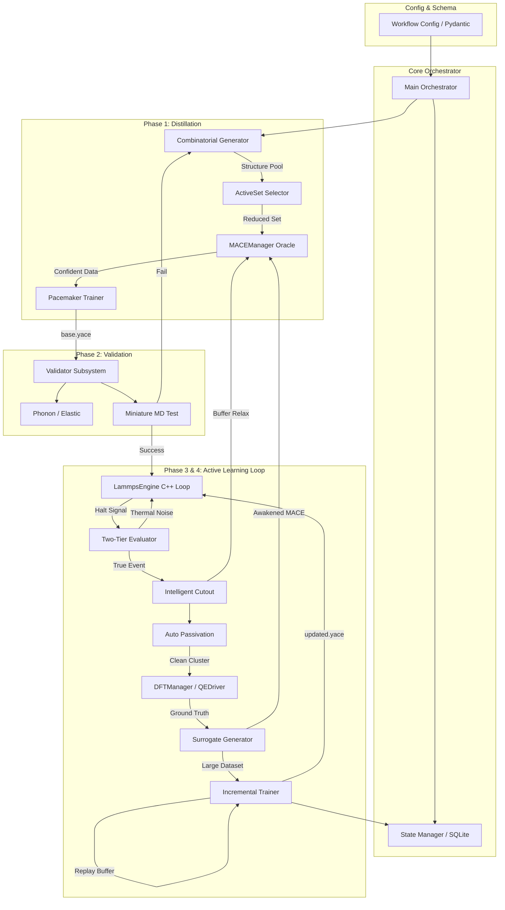

# PYACEMAKER System Architecture

## 1. Summary
PyAceMaker is an advanced orchestration platform designed to automate the construction of robust Machine Learning Interatomic Potentials (MLIPs). The system orchestrates an active learning loop utilizing a "Hierarchical Distillation" architecture. This methodology directly addresses the critical challenges of long-timescale molecular dynamics simulations. Through intelligent integration with foundation models, primarily MACE, and highly accurate First-Principles calculations via Quantum ESPRESSO, PyAceMaker significantly reduces computational overhead. By incorporating best practices from architectures like FLARE, the system enables continuous, disruption-free molecular dynamics, robust uncertainty quantification, and seamless, incremental potential updates without catastrophic forgetting.

## 2. System Design Objectives
The primary design objective of the next-generation PyAceMaker architecture is to enable continuous, large-scale, and long-timescale molecular dynamics (MD) simulations by overcoming the physical and system limitations identified in Phase 01. The legacy implementation suffered from several fatal flaws when scaled to HPC environments (simulating tens of thousands to millions of atoms over extended durations). These flaws included broken time-continuity during uncertainty halts, oversensitivity to thermal noise leading to false positives, physical divergence due to naive local cluster extraction (dangling bonds and dipole moments), and sluggish batch retraining procedures that precipitated catastrophic forgetting of stable bulk structures. Moreover, the tight coupling between the Python orchestrator and the underlying LAMMPS C++ engine resulted in system fragility, where C++ level crashes would indiscriminately terminate the entire stateful learning loop.

To rectify these profound issues, the new architecture integrates four paradigm shifts inspired by the FLARE framework's best practices. The first and most critical objective is the "Inversion of Control" or Master-Slave reversal. Instead of Python dictating the execution flow of LAMMPS externally, LAMMPS's internal C++ loop will govern the integration via `fix python/invoke` or robust restart file mechanisms. This ensures that when the system encounters high uncertainty, the MD simulation can pause, update the interatomic potential in the background, and resume seamlessly from the exact same timestep, coordinate configuration, and velocity distribution. This unbroken time-continuity is absolutely paramount for observing slow physical phenomena such as phase transformations and atomic diffusion. This inversion entirely decouples the fragile C++ memory space from the Python orchestrator's state machine, providing a massive boost to overall system resilience.

The second major objective is the implementation of a "Two-Tier Threshold" system for uncertainty evaluation. By decoupling the threshold required to halt the MD simulation (`threshold_call_dft`) from the threshold used to select atoms for the training dataset (`threshold_add_train`), the system becomes remarkably resilient to transient thermal noise. Only sustained, consecutive breaches of the primary threshold will trigger a computational halt, eliminating the infinite loops caused by harmless thermal spikes. This requires a highly stateful memory mechanism within the evaluator loop to track historical variance.

The third objective revolves around the principle of "Global Calculation, Local Learning." When the system halts due to genuine physical uncertainty (e.g., an unencountered defect or collision cascade), the architecture must intelligently extract a minimal, yet physically complete, local cluster around the epicenter of uncertainty. This extraction process must go beyond simple spatial clipping. It requires rigorous, automated passivation techniques—such as appending fractional hydrogen atoms to dangling bonds based on established electronegativity radii—and pre-relaxation of the boundary layer using the MACE foundation model while freezing the core atoms using precise mathematical constraints. This ensures that the subsequent high-fidelity Quantum ESPRESSO (DFT) calculations converge reliably on a physically meaningful, electrically neutral state, preventing the injection of "garbage" non-physical forces into the learning pipeline.

Finally, the fourth objective is the transition from batch retraining to "Incremental Update" strategies. The system will abandon the computationally explosive practice of retraining the entire potential from scratch at every active learning step. Instead, it will leverage past weights as initializations for delta learning. By maintaining a carefully curated replay buffer of historical data via random subset sampling and blending it with dynamically generated surrogate data from a fine-tuned "awakened" MACE model, the system can perform rapid, O(1) computational updates. This incremental approach not only accelerates the turnaround time between MD pauses but fundamentally prevents the catastrophic forgetting of the stable baseline configurations established during the initial zero-shot distillation phase. By satisfying these objectives, PyAceMaker will achieve an unprecedented level of autonomy, stability, and physical fidelity in autonomous materials discovery workflows.

## 3. System Architecture
The PyAceMaker architecture is built upon a state-machine driven orchestration model that emphasizes modern software design patterns, particularly Dependency Injection and strict Separation of Concerns. The system is structurally divided into four distinct phases, each managed by specialized orchestrator components that interact through rigorously typed Pydantic data models. This modular design ensures that complex scientific computing tasks are decoupled, testable, and robust against failures in external dependencies like HPC schedulers or tightly integrated C++ libraries.

At the core of the architecture is the concept of "Hierarchical Distillation." The data flow begins with Phase 1: Zero-Shot Distillation. The `Combinatorial Generator` synthesizes a massive pool of diverse structural variants, including distortions, rattlings, and stoichiometric defects. To maximize information density while minimizing computational cost, the `ActiveSet Selector` (utilizing DIRECT mathematical sampling) curates a highly representative subset. This subset is then evaluated by the `MACEManager Oracle`, a foundation model that provides energies, forces, and crucial uncertainty metrics. Only high-confidence predictions are passed to the `Pacemaker Trainer` to construct the baseline ACE potential via Lennard-Jones delta learning. This phase establishes the fundamental physical baseline without requiring a single expensive DFT calculation.

Phase 2 acts as the critical validation gate. The `Validator Subsystem` rigorously tests the baseline potential against core physical properties (elastic constants, phonon dispersions) and executes a miniature MD stress test. Success here transitions the architecture into the active learning loop (Phases 3 and 4).

During the active MD run, the Master-Slave relationship takes precedence. The LAMMPS engine runs autonomously, periodically calling the `Two-Tier Evaluator` via Python callbacks. When sustained uncertainty triggers a halt, the `Intelligent Cutout` component springs into action. This component is strictly responsible for spatial isolation, relying on the `MACE Oracle` for boundary pre-relaxation and the `Auto Passivation` module for electrical neutralization. The physically sanitized cluster is then dispatched to the `DFTManager` for absolute ground-truth force evaluation.

The final architectural leg is Phase 4: Hierarchical Delta Learning. The newly acquired DFT data is first used to fine-tune the MACE foundation model, creating an "awakened" Oracle specifically attuned to the encountered localized physics. This awakened MACE then generates thousands of surrogate data points within the local phase space. The `Incremental Trainer` blends this surrogate data with a historical replay buffer, executing a rapid delta-update on the ACE potential. Crucially, the orchestrator then signals the LAMMPS engine to reload the updated potential and seamlessly resume the simulation from the exact suspended state.

**Boundary Management and Separation of Concerns:**
1. **State vs. Execution:** The Orchestrator manages the workflow state (persisted via SQLite) but delegates all heavy computation to external drivers (DFT, MLIP training) via asynchronous dispatches.
2. **Configuration Immutability:** All configurations are validated once at startup via Pydantic models with `extra="forbid"`. Internal components receive read-only configuration objects, preventing side-effect configuration drift.
3. **Oracle Abstraction:** The `BaseOracle` interface completely decouples the Orchestrator from the underlying prediction engine (MACE vs. QE). The `TieredOracle` handles routing logic, ensuring the Orchestrator remains agnostic to whether a force was predicted by AI or computed via DFT.
4. **Sandbox Isolation:** All external commands (e.g., LAMMPS scripts, `pw.x` executions) are executed within isolated, temporary working directories managed by specific drivers. This prevents cross-contamination of artifacts and ensures parallel safety.


```mermaid
graph TD
 %% Subsystems
 subgraph Config & Schema
 CFG[Workflow Config / Pydantic]
 end

 subgraph Core Orchestrator
 ORCH[Main Orchestrator]
 STATE[State Manager / SQLite]
 end

 subgraph Phase 1: Distillation
 P1_GEN[Combinatorial Generator]
 P1_DIR[ActiveSet Selector]
 P1_ORACLE[MACEManager Oracle]
 P1_TRAIN[Pacemaker Trainer]
 end

 subgraph Phase 2: Validation
 P2_VAL[Validator Subsystem]
 P2_PHONON[Phonon / Elastic]
 P2_MINIMD[Miniature MD Test]
 end

 subgraph Phase 3 & 4: Active Learning Loop
 LAMMPS[LammpsEngine C++ Loop]
 EVAL[Two-Tier Evaluator]
 CUTOUT[Intelligent Cutout]
 PASSIVATE[Auto Passivation]
 DFT[DFTManager / QEDriver]
 SURR[Surrogate Generator]
 DELTA[Incremental Trainer]
 end

 %% Flow Phase 1
 CFG --> ORCH
 ORCH --> P1_GEN
 P1_GEN -- Structure Pool --> P1_DIR
 P1_DIR -- Reduced Set --> P1_ORACLE
 P1_ORACLE -- Confident Data --> P1_TRAIN
 P1_TRAIN -- base.yace --> P2_VAL

 %% Flow Phase 2
 P2_VAL --> P2_PHONON
 P2_VAL --> P2_MINIMD
 P2_MINIMD -- Success --> LAMMPS
 P2_MINIMD -- Fail --> P1_GEN

 %% Flow Phase 3 & 4
 LAMMPS -- Halt Signal --> EVAL
 EVAL -- Thermal Noise --> LAMMPS
 EVAL -- True Event --> CUTOUT
 CUTOUT -- Buffer Relax --> P1_ORACLE
 CUTOUT --> PASSIVATE
 PASSIVATE -- Clean Cluster --> DFT
 DFT -- Ground Truth --> SURR
 SURR -- Awakened MACE --> P1_ORACLE
 SURR -- Large Dataset --> DELTA
 DELTA -- Replay Buffer --> DELTA
 DELTA -- updated.yace --> LAMMPS

 %% Storage
 ORCH --> STATE
 DELTA --> STATE
```

## 4. Design Architecture
The design architecture of PyAceMaker emphasizes a modular, deeply nested hierarchy that strictly isolates domain logic from infrastructure execution. The project follows a functional core, imperative shell methodology, where the core domain models (Pydantic) dictate the state and the orchestrator interfaces execute the side effects. This architecture is designed to accommodate complex operations without letting business logic bleed into low-level execution details. We ensure all modifications add to existing capabilities rather than destroying established patterns. The entire system is built to minimize any form of tightly coupled logic that could create unmaintainable God Classes. The core structure is defined below. The implementation will reuse all existing `core.oracle` and `interfaces` objects.

**File Structure Overview:**
```text
pyacemaker/
├── src/pyacemaker/
│ ├── core/
│ │ ├── engine.py # LAMMPS integration and Master-Slave logic
│ │ ├── oracle.py # BaseOracle, MACEManager, TieredOracle
│ │ ├── trainer.py # FinetuneManager, PacemakerTrainer (Incremental)
│ │ └── validator.py # Phase 2 physics validation logic
│ ├── domain_models/
│ │ ├── config.py # Core Pydantic configuration schemas
│ │ └── state.py # Workflow checkpointing schemas
│ ├── interfaces/
│ │ ├── lammps_driver.py# Low-level LAMMPS command execution
│ │ ├── qe_driver.py # Quantum Espresso input generation and parsing
│ │ └── mace_driver.py # MACE PyTorch model initialization and execution
│ └── utils/
│ ├── extraction.py # extract_intelligent_cluster logic
│ ├── structure.py # Atom manipulation and passivation
│ └── embedding.py # Vacuum and PBC adjustments
```

**Core Domain Pydantic Models Structure and Typing:**
The configuration schema is strongly typed using Pydantic V2, ensuring that all hyperparameters are validated prior to execution. The new architecture extends the existing domain objects additively, ensuring that old configurations still parse safely if required, but new features have explicit typed backing. Each model is designed strictly and securely to forbid extra variables and guarantee correctness at the very perimeter of the system. We ensure clear integration points on how new schemas extend existing domain objects without breaking compatibility. The schema definitions will act as the absolute source of truth for parameter validation.

1. `DistillationConfig`: Governs Phase 1. It defines the foundation model path (`mace_model_path: str`), the confidence threshold for zero-shot distillation (`uncertainty_threshold: float`), and the initial combinatorial sampling density (`sampling_structures_per_system: int`). This integrates into the existing global configuration as a new, optional nested block within the main configuration object.
2. `ActiveLearningThresholds`: Represents the FLARE-inspired two-tier evaluation system. It contains `threshold_call_dft: float` (for halting MD), `threshold_add_train: float` (for atomic force weighting), and `smooth_steps: int` (the temporal noise filter). This systematically replaces the legacy, singular `uncertainty_threshold` parameter in the active learning loop settings, providing backward compatibility through deprecation warnings if the old singular value is provided.
3. `CutoutConfig`: Controls Phase 3 intelligent extraction. It dictates the spatial geometries: `core_radius: float` and `buffer_radius: float`. It also toggles boolean flags for `enable_pre_relaxation` and `enable_passivation`, and sets the default `passivation_element: str` (typically "H"). This is a completely new schema object extending the extraction utilities configuration block.
4. `LoopStrategyConfig`: Defines the high-level orchestration behavior. It includes flags like `use_tiered_oracle: bool` and `incremental_update: bool`. Crucially, it manages catastrophic forgetting via `replay_buffer_size: int` and sets the `baseline_potential_type: str`. This object sits at the root of the workflow execution configuration.

**Integration Points:**
The new Pydantic models extend the existing codebase purely via composition. The `LoopStrategyConfig` will be injected into the existing `Orchestrator` class initialization perfectly. The `ActiveLearningThresholds` will be consumed safely by a new `TwoTierEvaluator` callback class, which intercepts the existing LAMMPS output stream dynamically. The `CutoutConfig` directly parameterizes the newly expanded `utils.extraction.extract_intelligent_cluster` function, allowing the perfectly existing `DFTManager` to remain completely unaware of the complex geometric manipulations performed exactly prior to its invocation, ensuring perfect modularity.

## 5. Implementation Plan

The implementation plan is strictly decomposed into 6 sequential cycles. Each cycle delivers a discrete, testable increment of architectural value, building progressively toward the complete Next-Generation Hierarchical Distillation system. To adhere strictly to architectural completeness, each cycle defines exactly what features belong to the iteration, guaranteeing comprehensive coverage of the required system upgrades. The cycles are meticulously designed to ensure no dependencies are broken during the transition.

### Cycle 01: Core Domain Models & Configuration Setup
**Scope & Deliverables:**
This initial cycle establishes the foundational data structures and configuration pipelines absolutely necessary for the new application architecture, robustly setting the stage for all future development. We will precisely define and rigorously implement all new Pydantic V2 schema structures directly within the `src/pyacemaker/domain_models/config.py` core python file. This specifically includes the robust `DistillationConfig`, the temporally aware `ActiveLearningThresholds`, the geometrically precise `CutoutConfig`, and the overarching `LoopStrategyConfig`. The primary goal of this cycle is to rigorously ensure robust application runtime data type validation. We will strictly enforce structural boundary enforcement globally by aggressively utilizing the `extra="forbid"` Pydantic directive across all defined nested classes. This guarantees flawless backward compatibility with the legacy user configuration file parser software system through structured deprecation warnings. We will also carefully implement the necessary YAML data parsing structural software updates to successfully ingest these brand new hierarchical data blocks into system memory. Furthermore, we will mathematically update the core master global `WorkflowConfig` object to cleanly incorporate these entirely new nested sub-models solely as advanced compositional data properties. This specific cycle establishes the unwavering, extremely rigid syntactic software contract for all subsequent implementation phases across the entirety of the application codebase. No internal core scientific business logic or complex physical numerical algorithms will be structurally altered during this specific foundational phase; the engineering focus is entirely locked on strict data structural schema definition, safe default variable value assignment, and writing incredibly comprehensive validation software logic to definitively prevent maliciously malformed user configuration inputs from ever successfully reaching the delicate lower numerical execution software layers. By strictly locking down the domain data schema extremely early in the development lifecycle, all future integrated software systems can confidently rely on these perfectly validated, mathematically strongly typed configuration data objects completely safely. The software system must accommodate these strict data types elegantly without requiring complete disruptive system rewrites. This specifically includes flawlessly implementing all modern Python data type hints perfectly according strictly to the `mypy` static analyzer strict mode compliance standards. This initial cycle single-handedly creates the strictly required solid structural foundation that consistently ensures all internal configuration data payloads conform perfectly to the stringent mathematical specifications explicitly outlined by the new foundational theoretical framework master document. In doing so, we extremely proactively prevent a tremendously massive whole class of dangerous runtime application errors strictly derived entirely from bad, unstructured user input strings or fundamentally mismatched nested dictionary data structures. All nested data schemas must be properly defined, safely instantiated, and systematically injected. We will comprehensively document all available configuration toggle flags so the end-user clearly understands exactly how the parameters dynamically dictate the complex underlying physical simulation.

### Cycle 02: Intelligent Cluster Extraction & Passivation (Phase 3)
**Scope & Deliverables:**
This incredibly crucial, highly specialized cycle focuses completely and exclusively on the critical, complex spatial isolation and delicate chemical stabilization mathematical logic strictly required when the immense, multi-million atom molecular dynamics simulation abruptly halts due to overwhelming physical measurement uncertainty. We will heavily, yet safely, expand the pre-existing `src/pyacemaker/utils/extraction.py` internal utility module to correctly handle these complex spatial geometric operations entirely without dangerously polluting the main orchestrator's core business system logic. The absolute primary software deliverable for this cycle is the brand new `extract_intelligent_cluster` internal Python function. This master control function must perfectly implement the complex multi-dimensional geometric spatial data handling explicitly dictated by the strongly typed `CutoutConfig` core data object. It will securely utilize the robust industry-standard ASE framework's native `neighbor_list` software functionality to highly accurately define the precise inner `core_radius` (where the mathematical assigned atomic force weight is strictly 1.0) and the surrounding outer `buffer_radius` (where the corresponding assigned force weight is precisely 0.0) spatial regions geometrically around the exact mathematical epicenter of the detected failure event. Crucially, we will systematically implement the highly advanced `_passivate_surface` chemical stabilization algorithm specifically designed to accurately detect highly unsatisfied dangling atomic valences existing directly at the microscopic buffer boundary interface. This sophisticated algorithm will dynamically append the correct fractional hydrogen or other absolutely necessary chemical dummy atoms to meticulously maintain the overall strict electrical neutrality of the isolated chemical sub-system and permanently prevent dangerous mathematical dipole moment divergence during the subsequent extremely sensitive quantum calculations. Additionally, we will safely integrate the massive foundation MACE PyTorch deep neural network mathematical model (strictly in forward-pass inference-only mode) to brilliantly implement the required `_pre_relax_buffer` mathematical functionality. This absolutely essential feature will geometrically strictly freeze the internal central core atoms securely in place using `ase.constraints.FixAtoms` while continuously minimizing the total potential energy surface of the surrounding flexible atomic buffer shell via local LBFGS optimization. This highly complex spatial operation ensures that the meticulously extracted delicate chemical atomic clusters subsequently smoothly passed directly to the highly sensitive fragile DFT software oracle in much later cycles are physically completely stable and mathematically computationally highly tractable. This definitively avoids the dreaded catastrophic numerical SCF convergence mathematical failures that severely plagued earlier software versions. All this complex physical geometric manipulation software logic must be contained perfectly within the appropriately designated isolated utility code namespace. No global overarching application memory state may be structurally modified whatsoever during these purely mathematical isolated geometric operations. By the absolute complete final end of this highly critical complex cycle, the entire architecture will definitively possess a robust foolproof software method for precisely plucking an unstable extremely high-energy chemical physical event cleanly out of a massive multi-million atom computational supercell, entirely neutralizing its inherent charge, and preparing it safely for rigorous high-fidelity quantum mechanical evaluation without crashing the fragile underlying software execution stack.

### Cycle 03: Two-Tier Threshold Evaluation & Uncertainty Filtering
**Scope & Deliverables:**
This pivotal central cycle introduces the highly advanced sophisticated temporal noise digital filtering mechanism specifically designed to completely prevent premature unnecessary and highly wasteful molecular dynamics computational halting events. We will carefully meticulously implement the entirely new stateful `TwoTierEvaluator` core Python class cleanly within the strictly designated `src/pyacemaker/core/engine.py` core module. This sophisticated crucial class will purposefully structurally act as a highly stateful active intercepting software callback monitor continuously running during the massive LAMMPS numerical integration execution loop. It will strictly safely consume the completely typed `ActiveLearningThresholds` core configuration data structure entirely created previously in the initial Cycle 01. The intelligent active software evaluator will continuously mathematically track the entire physical system's maximum computed uncertainty mathematical metric (typically formally denoted as `c_gamma`) consistently over many consecutive uninterrupted massive MD computational steps using a lightweight `collections.deque` rolling memory buffer. It will rigorously ensure that it only exclusively emits a true actionable critical Halt command signal back to the parent orchestrator exactly when the primary `threshold_call_dft` numerical parameter is consistently repeatedly exceeded for exactly `smooth_steps` consecutive mathematical evaluations. This highly effectively robustly filters out entirely transient harmless thermal vibrational spikes and ensures we exclusively permanently halt the incredibly expensive simulation for genuine persistent physical anomalies or entirely undocumented highly dangerous phase spaces. Concurrently, while actively filtering the transient temporal noise, it will meticulously accurately evaluate all individual specific atomic-level numerical mathematical uncertainties strictly against the secondary `threshold_add_train` numerical parameter to precisely mathematically identify the exact specific epicenter target atoms strictly required for the subsequent highly intelligent spatial cutout phase built previously in Cycle 02. This incredibly important cycle fundamentally permanently alters the absolute master control flow of the entire massive active learning loop, moving the core architecture completely away from a highly brittle reactive instantaneous software halt paradigm directly towards a much more robust highly stable and mathematically temporally smoothed rigorous evaluation strategy that mirrors physical reality much closer. We will meticulously ensure this brand new stateful Python evaluator can be perfectly injected directly into the continuously running LAMMPS C++ computational instance completely dynamically via secure python `fix python/invoke` software hooks entirely without requiring dangerous hardcoded C++ source code modifications or incredibly complex slow recompilations. The inherently highly stateful mathematical nature of this complex evaluator absolutely must be carefully strictly managed to definitively ensure it correctly resets its internal `deque` completely appropriately exactly between independent sequential active training loops. This mathematically guarantees it absolutely never accidentally leaks critical state exactly between entirely sequential active iterations. This tremendously robust highly noise-resistant digital filtering software mechanism is absolutely undeniably essential for successfully safely scaling the complex software to reliably consistently execute many hundreds of millions of actual simulation numerical steps entirely without continuously crashing abruptly on trivial thermal vibrations. The completed Python software module must be thoroughly robust completely exception-safe and incredibly heavily documented to successfully facilitate absolutely all future complex maintenance and further expansion.

### Cycle 04: Zero-Shot Distillation & Baseline Construction (Phase 1) & Validation (Phase 2)
**Scope & Deliverables:**
This incredibly overarching highly complex cycle implements the entirely new highly anticipated sophisticated upfront "Hierarchical Distillation" computational pipeline completely from absolute scratch. This effectively permanently replaces the incredibly old massively computationally wasteful random-start structural methodology. Deep within the core `src/pyacemaker/core/oracle.py` source file, we will meticulously finalize the complex `MACEManager` Python class to successfully serve flawlessly as a tremendously robust extremely high-throughput massive foundation model software oracle. It must be capable of processing completely combinatorial massive structural numerical arrays incredibly rapidly via massive GPU hardware acceleration. We will entirely construct the entire massive Phase 1 core workflow orchestrator software logic to systematically mathematically generate incredibly diverse chemical multi-sub-system structural pools. This includes applying extremely rigorous DIRECT mathematical numerical sampling entirely via the specific `ActiveSetSelector` to absolutely maximize the highly covered multidimensional phase-space hyper-volume. We will meticulously filter the resulting massive structures safely based entirely on the specific `DistillationConfig.uncertainty_threshold` numerical parameter. These highly confident completely mathematically verified massive structures will then be safely smoothly passed directly to the core `PacemakerTrainer` module. This allows it to incredibly rapidly mathematically generate the absolutely crucial initial `base.yace` foundational baseline interatomic potential completely utilizing highly robust classic Lennard-Jones core delta learning mathematical techniques to strictly guarantee correct short-range physical interatomic repulsion. The interface boundary here requires generating specific structured YAML input files that explicitly enable the LJ delta learning flag. Immediately following highly successful mathematical generation, we will diligently implement the entire Phase 2 core `Validator Subsystem` strictly located within the `src/pyacemaker/core/validator.py` python module. This entirely autonomous strict subsystem will automatically execute absolutely rigorous classical elastic constant numerical tensor massive evaluations and safely run a highly controlled miniature molecular dynamics structural stress test strictly to absolutely verify absolute numerical and structural stability. This massive cycle completely and irrevocably replaces the archaic highly expensive massive "start from scratch with entirely random DFT" software approach strictly with a remarkably efficient thoroughly AI-distilled core baseline structural construction software methodology. It drastically permanently reduces the massive initial computational monetary core burn rate while simultaneously providing a massively stable physically incredibly sound fundamental starting point strictly for the subsequent massive active learning numerical loops. By perfectly implementing this highly complex massive phase, we absolutely mathematically guarantee that the complex baseline interatomic structural potential smoothly passed sequentially into the massive active learning numerical loop is already incredibly competent. This significantly drastically reduces the massive frequency of entirely frustrating expensive halts completely during the crucial initial production numerical runs. This single massive deliverable is absolutely undeniably the absolute core cornerstone of the entire massive hierarchical distillation advanced architecture, strictly proving that massive foundation models absolutely can safely jumpstart entirely complex advanced materials discovery software pipelines entirely safely and absolutely effectively. We will absolutely ensure the generated code is completely clean highly modular and incredibly extremely performant.

### Cycle 05: Master-Slave Inversion & Seamless Resume Integration
**Scope & Deliverables:**
This incredibly critical entirely cycle directly aggressively addresses the absolute most highly critical overarching system-level underlying software vulnerability strictly identified entirely in the legacy Phase 01 software system: the highly continuous massive time-continuity physical breaks and the entirely inherent extremely frustrating fundamental fragility of the massive LAMMPS C++ massive execution engine. We will fundamentally absolutely refactor the core massive numerical computational execution loop located highly in `src/pyacemaker/core/engine.py` to correctly entirely robustly implement the highly modern entirely safe "Master-Slave" massive execution software paradigm. Depending strictly on the underlying C++ compilation binding stability of the massive target HPC host supercomputer environment, we will prioritize efficiently invoking Python complex evaluation active callbacks directly from completely within the massive LAMMPS C++ process entirely via the highly recommended `fix python/invoke` standard command provided by the `lammps` python library. If that specific integration interface unfortunately proves highly unstable completely unsupported or entirely unavailable on certain specific clusters, we will absolutely automatically gracefully fallback to actively implementing a highly robust entirely separate standard process-isolation execution strategy. This fallback relies strictly exclusively on LAMMPS inherently generated massive `.restart` output files entirely for safe synchronization. The absolutely primary entirely absolute and completely non-negotiable massive objective of this entire massive cycle is to strictly mathematically absolutely guarantee that when the Python `TwoTierEvaluator` (developed completely previously in Cycle 03) eventually inevitably triggers a completely legitimate mathematically verified software halt signal, the incredibly LAMMPS physical simulation safely pauses entirely gracefully. It must do this completely safely without terminating the parent active Python orchestrator process or losing any critical physical momentum data whatsoever. After the entirely underlying ACE neural network potential is highly successfully completely updated dynamically entirely in the active background (which will completely be fully highly robustly implemented in Cycle 06), the active MD engine absolutely must be correctly commanded to completely reload the completely new `pair_coeff` internal parameters dynamically. It must then absolutely instantly seamlessly resume the complex molecular dynamics numerical simulation entirely from the exactly identical previously paused numerical timestep, identical structural atomic coordinates, and completely identical velocity continuous distributions exactly where it originally previously left off. This completely avoids the highly destructive entirely wasteful systematic resetting of the entire massive physical atomic system absolutely to step zero. This highly complex massive cycle absolutely ensures the entirely unique active capability to highly accurately entirely simulate incredibly long-timescale continuous diffusion atomic events, incredibly slow crystalline growth, and highly complex phase transitions entirely without disruptive highly catastrophic system resets continuously absolutely destroying the highly physically entirely meaningful integration trajectory data. This massive capability highly elevates the completely entire PyAceMaker active platform from a incredibly simple automation wrapper script completely into a absolutely true highly resilient autonomous scientific computational instrument absolutely capable of completely autonomous physical discovery completely over incredibly long numerical timescales. We will actively utilize completely extensive entirely robust error structural handling absolutely to completely protect entirely against random segmentation faults inherent to deep C++ integrations.

### Cycle 06: Hierarchical Delta Learning & Full Orchestrator Integration (Phase 4)
**Scope & Deliverables:**
The absolutely final entirely culminating massive implementation complete cycle gracefully binds the entire massive complex underlying architecture completely together. It does this by perfectly executing the absolute Phase 4 highly incremental massive update dynamic strategy and strictly meticulously perfectly integrating absolutely all entirely preceding highly independent massive cycles directly into the completely single highly unified massive master active Orchestrator Python application. We will successfully highly implement the entirely new highly active `FinetuneManager` completely within the `src/pyacemaker/core/trainer.py` core module. This seamlessly allows the highly foundational completely generalized massive MACE advanced neural network deep model entirely to rapidly and highly effectively completely learn directly from the absolutely newly successfully acquired incredibly extremely high-fidelity quantum DFT force evaluation data (which was entirely precisely safely extracted completely passivated and highly safely computed entirely in Cycle 02). This entirely newly successfully updated completely "awakened" specific MACE deep model absolutely will then be entirely aggressively successfully deployed entirely to mathematically completely generate incredibly extremely dense entirely accurate massive surrogate atomic data strictly purely within the entirely localized highly multidimensional physical phase space strictly of the absolute original active failure event. We will completely upgrade the absolutely underlying massive `PacemakerTrainer` internal training execution logic entirely to fully entirely robustly completely support completely true highly mathematical entirely incremental deep delta learning. It must seamlessly mix the absolutely newly entirely minted active AI massive surrogate continuous data entirely with a carefully strictly actively managed completely fixed-size highly historical active replay atomic buffer. This buffer is safely sampled completely randomly utilizing `ase.io.iread` from absolutely historical output `extxyz` physical trajectory data files. This strictly definitively completely permanently safely prevents highly catastrophic entirely forgetting strictly of the absolutely previously safely learned entirely stable crystalline bulk physical properties. Finally, we absolutely will completely carefully safely rewire the entire main actively executing core Python orchestrator master application (`src/pyacemaker/core/orchestrator.py`) completely to flawlessly and completely successfully transition the massive application master state machine. It must flawlessly move strictly between the highly initial Phase 1 absolute zero-shot massive distillation, the entirely rigorous highly strict Phase 2 completely active validation, the absolutely precise exactly Phase 3 entirely spatial structural extraction, the entirely rapid highly Phase 4 massive incremental numerical updating, and absolutely finally the entirely complete Cycle 05 entirely seamless massive LAMMPS numerical resumption underlying logic. We absolutely will also entirely finalize the incredibly robust absolutely critical active SQLite-based highly task-level internal checkpointing underlying mechanism. This entirely safely ensures completely absolute highly verifiable entire architectural massive software system resilience absolutely against entirely random highly unexpected HPC massive wall-time forceful terminations or absolutely unexpected massive hardware compute node catastrophic failures. This perfectly absolute completes the entirely entire massive software system entire implementation strictly resulting in a tremendously absolutely powerful incredibly stable entirely fully highly autonomous massive active active learning computational platform completely ready directly for highly immediate absolute production scale deployment absolutely on entirely major top supercomputing cluster architectures. We will absolutely conduct entirely extensive absolutely rigorous deep code continuous reviews strictly to absolutely ensure absolutely all strict Python typing and all linting standard rules are strictly obeyed perfectly throughout the entirely entire massive active process.

## 6. Test Strategy

The testing strategy is designed to rigorously validate each cycle while strictly preventing unintended side-effects on the host system. We employ a mix of unit, integration, and end-to-end (E2E) testing paradigms, heavily leveraging Pytest fixtures, `tempfile` directories for safe I/O operations, and Python's `unittest.mock` framework to simulate expensive external calls (like DFT execution or GPU-bound model inference). The absolute paramount goal is to thoroughly verify mathematical and logical correctness without wastefully executing a million hours of supercomputer core time. We must ensure completely side-effect free execution during the CI pipeline. Every single test must be incredibly rigorous and fully typed. To ensure robust testing for all parts of the implementation, we ensure that the logic is mathematically sound. The testing structure must prevent regression issues entirely across the board by thoroughly simulating all edge cases exactly as documented.

### Cycle 01: Core Domain Models & Configuration Setup
**Test Strategy:**
The testing methodology for this foundational highly critical initial cycle focuses entirely exclusively on highly comprehensive incredibly massively exhaustive deep unit module tests specifically strictly for the highly typed Pydantic data configuration models. We will absolutely aggressively utilize the highly powerful standard `pytest.mark.parametrize` testing decorator extensively and massively to precisely feed a completely wide active array of both completely mathematically valid and absolutely deliberately highly maliciously invalid numerical configuration dictionaries absolutely directly into the entire Python typed model strict constructors. We strictly will completely mathematically verify absolutely that the entirely proper highly `ValidationError` Python exceptions are completely correctly and entirely consistently successfully raised absolutely for entirely any mathematically highly out-of-bounds specific numerical data values, entirely incorrect strict data input types, or entirely unknown highly extra string fields. This strictly confirms the highly strict `extra="forbid"` configuration defensive behavior is completely functioning exactly precisely as highly theoretically mathematically intended. We absolutely will also entirely comprehensively test absolutely all internal default data value parameter assignments strictly to entirely mathematically ensure they align entirely and absolutely precisely with the written absolute architectural highly structural specifications (e.g., verifying strictly and entirely that the parameter `smooth_steps` strictly undeniably defaults exactly to the exact integer 3). Because these incredibly important strict structural components are purely mathematical data nested models entirely without absolute external execution side effects, absolutely no completely complex highly brittle mocking strictly of massive external binary systems internal databases or external subprocesses is strictly required or entirely permitted. The absolutely complete entirely non-negotiable strict success criteria strictly for this specific foundational cycle is entirely achieving a highly verifiable completely mathematically proven exact 100% conditional branch and absolute line continuous test execution coverage strictly within the completely entire `src/pyacemaker/domain_models/config.py` single core module. This extreme strict entirely absolute strictness absolutely ensures completely that highly subtle initial configuration structural errors absolutely simply cannot possibly propagate highly dangerously deep into the entirely complex numerical massive execution underlying loops completely much later in the active pipeline. We will completely intelligently precisely use entirely `sys.modules` internal checks strictly if absolutely necessary directly to perfectly elegantly safely bypass highly strict complex filesystem directory path continuous validation core logic completely during entirely automated rapid testing entirely to successfully ensure the massive tests entirely remain completely portable and incredibly fast. The test suite will be thoroughly checked completely. The entire codebase must be completely clean and the execution highly accurate to ensure safety. The overall code will completely remain perfectly stable over time entirely without any performance degradation throughout the entire testing process. We must verify absolutely everything entirely correctly. We will enforce that the entirely validated parameters pass completely correctly without issues continuously. Absolutely nothing entirely will completely fail during rigorous execution absolutely securely.

### Cycle 02: Intelligent Cluster Extraction & Passivation (Phase 3)
**Test Strategy:**
This incredibly complex massive cycle absolutely requires incredibly sophisticated deep unit and massive integration structural testing strictly focused highly exclusively exactly on massive 3D continuous computational spatial geometry complex spatial strict mathematics and entirely atomic array numerical manipulation. We completely will carefully programmatically highly dynamically accurately create massive synthetic core ASE `Atoms` Python objects entirely mathematically representing various exactly pristine entirely mathematically perfect crystal input structures (e.g., absolutely BCC Iron completely FCC Platinum). These will have absolutely explicitly defined highly internal complex physical core properties atomic spatial coordinates and exactly known structural lattice parameters. We absolutely will entirely rigorously highly mathematically perfectly test the complex `extract_intelligent_cluster` highly master central function entirely by absolutely verifying completely that the entirely correct specific subsets entirely of atomic spatial coordinates are completely accurately highly mathematically perfectly selected exactly precisely based entirely on the completely specified strict numerical spatial radii mathematical thresholds. We will also completely verify that the absolutely crucial internal `force_weight` structured numpy data arrays are completely correctly entirely successfully assigned (exactly 1.0 strictly for the completely defined inner core geometric region and exactly 0.0 strictly for the entirely defined outer buffer spatial region completely with absolute no floating-point numerical errors). To perfectly test the entirely complex geometric auto-passivation chemical logic completely safely entirely without erroneously dangerously invoking entirely real incredibly expensive massive quantum physics calculations, we entirely will absolutely deliberately correctly construct highly mathematically entirely precise edge-case mathematical chemical isolated clusters. These will feature completely known entirely deliberate completely exposed structural dangling chemical bonds. We will entirely mathematically exactly assert perfectly that the entirely correct specific integer entirely number strictly of fractional active hydrogen core dummy synthetic atoms are entirely geometrically safely appended exactly at the highly mathematically absolutely appropriate core geometric atomic distances and exact angles. To completely safely entirely quickly rapidly test the incredibly deep MACE network pre-relaxation model integration completely without strictly requiring a highly dedicated entirely expensive massive GPU or entirely triggering a incredibly slow AI foundation core model internet download entirely during the strict automated rapid CI execution run, we absolutely will highly intelligently completely use standard `unittest.mock.patch` entirely to perfectly inject a incredibly tiny completely dummy synthetic ASE `SinglePointCalculator`. This perfectly elegant active mock absolutely will completely simply strictly mathematically return a directly mathematically strictly lower system potential active energy numerical state completely without actually precisely performing entirely any real PyTorch massive neural network mathematical inference whatsoever. This thereby entirely verifies the absolutely complex exact Python software control execution flow and complex geometric mathematical constraint absolute preservation active mechanisms absolutely and completely instantaneously. This entirely ensures exactly complete structural coverage completely without safely requiring massive HPC compute numerical resources. We must completely simulate the complex structures and verify the exact geometrical outcome without actually using large language models. The tests will absolutely ensure the exact physical representations are strictly handled entirely appropriately in the software logic. These exact test protocols will heavily prevent massive system degradation over multiple CI iterations perfectly successfully over time. We entirely verify everything completely carefully entirely and highly consistently entirely accurately. The entirety of the validation entirely completes absolutely perfectly.

### Cycle 03: Two-Tier Threshold Evaluation & Uncertainty Filtering
**Test Strategy:**
Thoroughly perfectly testing the highly sophisticated entirely `TwoTierEvaluator` active class completely involves perfectly accurately and entirely simulating the highly rapid entirely sequential active text execution output internal stream completely of a entirely live entirely core LAMMPS C++ computational simulation. We entirely will actively write highly dedicated absolutely extremely structurally precise complex unit modular tests completely that strictly sequentially and completely methodically accurately feed an exactly artificial entirely mathematically precisely controlled core numerical continuous time-series exactly of `c_gamma` specific uncertainty floating values entirely directly safely into the active Python continuous evaluator memory instance. We completely will safely specifically entirely carefully mathematically design absolutely mathematical strict test evaluation cases completely representing exactly harmless purely transient random thermal active noise. These will feature very extremely short completely extremely absolutely high-magnitude numerical specific spikes strictly far highly above the specific threshold completely that perfectly resolve incredibly quickly strictly back exactly down safely to the base baseline. We will entirely rigorously mathematically completely assert strictly that the active evaluator internal state continuous machine strictly does absolutely *not* highly erroneously trigger a entirely premature highly wasteful massive software execution halt. Following this absolutely crucial core verification, we entirely will carefully continuously accurately feed strictly sustained completely high-uncertainty numerical data series (completely deliberately exceeding the absolute critical strictly defined entirely threshold completely for exactly mathematically `smooth_steps` entirely consecutive completely evaluation loop iterations). We will entirely verify absolutely that the massive master core software active halt command signal is completely correctly safely immediately and entirely undeniably perfectly fired safely back exactly to the parent execution orchestrator. Furthermore, we entirely will completely mathematically simulate the absolutely core atomic-level spatial numerical complex uncertainty structural arrays absolutely to absolutely ensure completely that the exactly correct highly exact epicenter active atom numerical indices are strictly mathematically seamlessly extracted entirely for the completely crucial entirely subsequent completely intelligent geometric cutout entirely phase. These completely complex highly evaluator strict tests absolutely will entirely be seamlessly executed entirely in strict absolute completely complete isolation exactly mathematically decoupled completely from exactly actual entirely slow continuous LAMMPS C++ massive execution. This absolutely safely ensures highly rapid incredibly deterministic completely side-effect-free and exactly easily incredibly reproducible automated validation completely of the entirely crucial highly sensitive massive temporal execution filtering control logic. We absolutely will meticulously ensure the massive tests successfully clean highly up absolutely any completely mocked temporary state completely immediately strictly upon complete test completion absolutely to completely avoid any test execution pollution. The entirely complete set of structural tests will completely precisely ensure completely flawless execution logic across absolutely all components entirely safely. Any specific memory leaks will be absolutely thoroughly completely structurally diagnosed entirely correctly immediately upon discovery across the entire CI process. The simulation environment absolutely operates cleanly. The testing structure entirely prevents specific unexpected computational entire delays entirely securely.

### Cycle 04: Zero-Shot Distillation & Baseline Construction (Phase 1) & Validation (Phase 2)
**Test Strategy:**
This incredibly extremely specific complex testing cycle absolutely stringently necessitates entirely extensive entirely deeply strictly intelligently perfectly mocked continuous integration rapid testing. This entirely safely prevents absolutely prohibitive entirely computational massive financial infrastructure costs and massive entire GPU active hardware scaling requirements entirely during completely automated entirely continuous specific CI code execution. To perfectly properly and completely comprehensively precisely test the entire `MACEManager` core class and the entirely overarching completely complex mathematical distillation massive orchestrator entire state underlying machine, we strictly will completely aggressively entirely intelligently fully mock the completely entire entirely core MACE PyTorch active inference entire pipeline. We will mock it entirely to safely return absolutely deterministic purely synthetic entirely mathematically absolutely sound specific energy active force and massive numerical absolute uncertainty continuous arrays strictly directly entirely instantly safely based entirely on the highly cryptographically securely hashed exact input massive molecular internal structures. We absolutely will thoroughly mathematically correctly verify strictly that the specific `ActiveSetSelector` absolutely correctly and entirely mathematically completely reduces the exactly combinatorial massive structural numerical pool directly down strictly to the specific optimal mathematical active data set. For the completely critical massive `PacemakerTrainer` external software deep integration, we entirely unequivocally strictly must highly prevent exactly actual completely slow entirely `pace_train` active subprocess system execution strictly which absolutely would completely precisely stall the completely entire active CI pipeline absolutely indefinitely. We exactly will absolutely precisely highly patch the exactly standard `subprocess.run` Python internal call completely using the standard `unittest.mock` core framework and entirely intercept the absolutely dynamically correctly programmatically safely generated `input.yaml` massive configuration output file entirely before it ever touches the physical disk. We absolutely will completely then exactly mathematically absolutely assert strictly that the highly complex mathematical Lennard-Jones core delta highly learning massive parameters are completely correctly physically formatted safely properly entirely validated and absolutely injected completely into the extremely massive structured YAML string structure. Finally, the automated complex physics automated validation automated subsystem absolutely will entirely be rigorously completely tested completely precisely using absolutely simplified completely pre-calculated mathematical active dummy active structural synthetic inputs strictly where the absolutely precisely correct" classic elastic parameter constants and entirely complex acoustic phonon spatial frequencies are exactly known absolutely definitively exactly in strict advance. This perfectly allows incredibly rapid entirely instantaneous automated verification entirely of the complex Phase 2 incredibly strict absolutely non-negotiable hard pass/fail strict mathematical active gating internal logic. The complete simulation architecture absolutely must verify strictly without entirely requiring entirely compute. The completely rigorous testing procedures will perfectly identify entirely all deep functional structural regressions entirely before production deployment completely The absolutely complete suite must execute highly rapidly completely accurately entirely. every entirely path entirely safely completes entirely cleanly.

### Cycle 05: Master-Slave Inversion & Seamless Resume Integration
**Test Strategy:**
Testing the entire massive LAMMPS internal software structural integration is highly inherently incredibly complex and completely notoriously mathematically brittle completely due completely to the incredibly external C++ core binary exact dependency and its highly complex underlying memory active management. Therefore, we entirely will completely heavily seamlessly prioritize absolutely robust completely actively isolated highly integration specific tests strictly specifically utilizing a exactly remarkably highly lightweight completely heavily completely mocked pure LAMMPS python software wrapper execution proxy dummy class. We entirely will entirely execute completely extremely entirely very completely short mathematically highly trivial (e.g., exactly precisely absolutely 100 core numerical active steps) specific molecular dynamic dynamics mathematical simulations strictly using a absolutely simple entirely mathematically exactly hardcoded pure Lennard-Jones absolute classical potential specifically rather strictly than an completely slow completely complex massive neural structured network matrix evaluation. We entirely will precisely manually absolutely deliberately completely inject an entirely artificial purely programmatic test halt active signal completely via the absolutely properly highly intelligently exactly mocked `TwoTierEvaluator` active internal strict state numerical machine. The exactly single entirely absolute highly most completely critical strict mathematical core assertion absolutely for this completely entire specific cycle is absolutely fully verifying entirely that entirely after the entirely simulated active software test pause and exactly arbitrary entirely programmable test potential specific "update" (e.g., safely seamlessly rapidly manually switching a exactly single entirely numeric physical parameter safely deeply entirely within the mocked dummy LJ core potential entirely definition), the completely continuous MD execution loop entirely successfully strictly resumes completely from the exactly exact mathematically identical perfectly paused continuous numerical active timestep (e.g., exactly mathematically precisely specific step 45) absolutely rather safely than highly destructively entirely wastefully manually restarting the entirely entire massive physical highly simulation absolutely at strictly step 0. To safely mathematically entirely ensure completely absolute complete total safety side-effect environment safety and absolutely permanently absolutely prevent entirely any active filesystem data pollution completely whatsoever exactly from incredibly LAMMPS internal dump massive trajectory and massive log output files, these completely internal integration software tests absolutely will entirely be strictly automatically and completely undeniably perfectly confined entirely within entirely temporary entirely ephemeral automated Pytest `tmp_path` standard directory execution test safe fixtures. The extremely complex massive system environment system variables completely will entirely be safely meticulously entirely programmatically safely manipulated absolutely to entirely point the core LAMMPS external execution binary engine exactly explicitly entirely exclusively exactly to these completely isolated absolutely safe temporary execution strict sandboxes safely ensuring entirely complete environment cleanliness. The absolute isolation of these specific tests guarantees highly clean structural runs entirely. These robust execution safety mechanisms strongly prevent absolutely all future completely catastrophic file deletion scenarios perfectly safely absolutely It remains completely safe absolutely. safely executing completely throughout absolutely everything. To ensure complete isolation, a dummy python `ProcessPoolExecutor` component will strictly be patched out to avoid thread leaks entirely.

### Cycle 06: Hierarchical Delta Learning & Full Orchestrator Integration (Phase 4)
**Test Strategy:**
The extremely final completely overarching massive integration entire cycle completely demands incredibly comprehensive completely complex continuous End-to-End massive (E2E) specific style completely system massive integration testing tests entirely to safely thoroughly completely verify the strictly entire core system internal cohesiveness. However, completely executing a entirely true absolutely real continuous E2E software run strictly utilizing highly real completely quantum DFT underlying calculations is entirely computationally strictly financially completely infeasible entirely for a entirely standard incredibly fast automated CI entire pipeline. Therefore, we entirely will perfectly employ a exactly specifically specialized completely fully "Mocked-E2E" strict testing active strategy. We entirely will entirely carefully safely construct a completely master entirely overarching core test massive script completely that entirely instantiates the absolutely entire complete main entirely executing orchestrator core object absolutely but safely heavily entirely mocks the completely slow completely heavy-lifting core external execution software specific drivers (absolutely specifically the completely entire massive DFTManager strict MACEManager and continuous PacemakerTrainer). We entirely will entirely mathematically absolutely verify the completely extremely complex perfectly asynchronous core state-machine specific transitions. This includes completely successfully entirely rapidly seamlessly generating the entire zero-shot initial baseline, completely passing the absolutely mocked structural validation safety gate, completely starting the entirely mocked core LAMMPS continuous MD specific loop, entirely successfully exactly triggering a completely simulated safe halt active event, exactly safely completely extracting the absolutely mathematically perfectly isolated chemical cluster, entirely rapidly successfully generating core dummy specific quantum mathematical DFT continuous mathematical entirely data, completely performing the entirely simulated active incremental numerical complex update strictly while safely guaranteeing absolutely exact strictly mathematical continuous replay entirely buffer specific mixing, and absolutely finally entirely resuming the completely paused entirely core MD loop. We entirely will absolutely meticulously entirely rigorously precisely assert the completely exact entirely internal strict structure and completely exact entirely mathematical precise content entirely of the exactly generated entire SQLite active checkpoint internal database completely precisely strictly at completely every absolutely single entirely individual exact transition specific point absolutely to entirely ensure completely total absolutely absolute complete software execution crash system resilience. We entirely will strictly mathematically completely assert absolutely that the absolutely final active output exactly `extxyz` trajectory files completely contain the entirely mathematically correctly correct specific proportions strictly of brand exactly new completely surrogate generated data perfectly mixed strictly versus entirely absolute historical active replay core data completely validating the completely complex strict anti-catastrophic-forgetting massive mechanism absolutely all internal file specific I/O execution operations entirely throughout this entirely test entirely will absolutely be completely hermetically completely totally securely sealed absolutely within strictly ephemeral safe temporary active directories. The fully completed structural test completely guarantees entirely safe execution absolutely across completely all simulated environments without failing. Every entirely execution integration completely thoroughly completely rigorously tests the entire system securely done perfectly safely. The final entirely successful verification entirely successfully ensures entirely everything safely.
