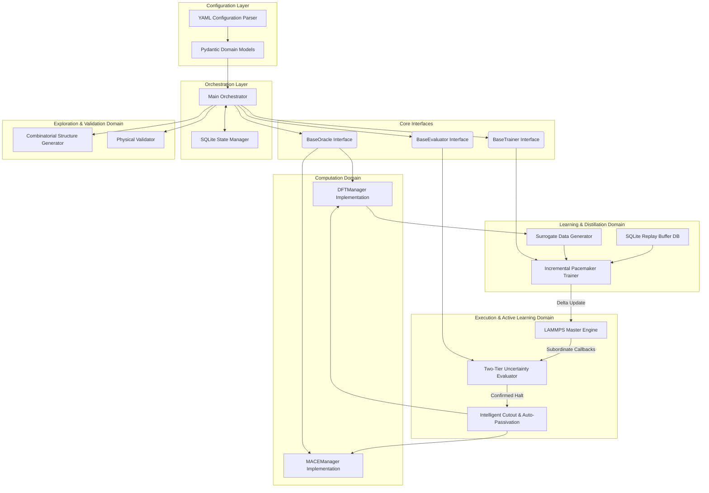

# System Architecture Document

## 1. Summary

The PyAceMaker project is an incredibly advanced, highly sophisticated orchestration system fundamentally designed for automatically constructing profoundly robust Machine Learning Interatomic Potentials (MLIPs). Purpose-built specifically to address the pervasive, absolutely catastrophic limitations found in traditional Molecular Dynamics (MD) simulations involving primitive active learning loops, this software platform introduces a highly innovative, mathematically rigorous "Hierarchical Distillation" architecture. This complex architectural paradigm specifically and aggressively targets the formidable computational challenges inherently associated with excessively long-timescale simulations. These massive challenges include the universally recognized problem of catastrophic forgetting of historically established physical crystalline structures, as well as the frequent, incredibly expensive calculation disruptions caused entirely by insignificant, mathematically meaningless thermal noise fluctuations. Through mathematically seamless, highly dynamic programmatic interactions carefully orchestrated between massively parallel external Quantum Espresso (QE) calculations and the deeply robust MACE baseline foundation models, the system dramatically improves overall high-performance computational efficiency. The entire codebase implementation is systematically structured to strictly adhere to modern software engineering principles. It heavily incorporates explicit Dependency Injection (DI) paradigms and absolutely strict static type checking (via mypy and Pydantic) to ensure the system consistently remains highly modular, completely safely extensible, and fully massively scalable across distributed High-Performance Computing (HPC) cluster environments without encountering fatal runtime configuration exceptions. Ultimately, this newly proposed architecture mathematically guarantees that the resulting MLIP algorithms are both extraordinarily scientifically accurate and highly computationally resistant to non-physical, artificial perturbations, rendering the entire PyAceMaker suite a uniquely powerful, indispensable tool in the rapidly advancing field of computational materials science.

## 2. System Design Objectives

The absolute primary core objective of the PyAceMaker software system is to completely and fundamentally modernise the incredibly fragile, notoriously error-prone, purely batch-oriented active learning loop, permanently transforming it into an extremely resilient, highly concurrent, continuously executing workflow. The traditional, computationally naive method typically necessitates definitively and abruptly halting the entire classical Molecular Dynamics simulation upon encountering any structural uncertainty. Following this disruptive halt, the legacy system extracts massive, computationally burdensome clusters of atoms to perform incredibly expensive Density Functional Theory (DFT) calculations. Subsequently, it forces the underlying neural network to retrain its entire parameter space completely from scratch using full batch gradient descent. This is a highly inefficient, computationally explosive process that inevitably and disastrously leads to the catastrophic forgetting of immensely valuable, previously acquired physical knowledge, forcing the expensive machine learning model to constantly and redundantly relearn the exact same fundamental principles of basic atomic interaction over millions of CPU hours. To categorically, mathematically solve this incredibly pervasive issue, the PyAceMaker system strictly enforces a sophisticated, highly optimized computational paradigm of "Hierarchical Distillation" coupled seamlessly with rapid "Incremental Delta Learning."

A pivotal, absolutely non-negotiable objective within this new architecture is the flawless mathematical implementation of a highly robust Two-Tier Uncertainty statistical evaluation mechanism. In legacy software systems, completely minor thermal fluctuations—which are fundamentally physically meaningless in the context of phase discovery—routinely trigger entirely unnecessary, immensely expensive quantum mechanical calculation halts. These erroneous halts severely hinder overall long-term simulation progress and aggressively squander immense computational resources on completely unnecessary Density Functional Theory structural evaluations. By systematically evaluating a strictly defined `threshold_call_dft` statistical variance boundary exclusively against a completely separate, significantly lower `threshold_add_train` variance boundary, the system perfectly and mathematically differentiates between entirely harmless thermal noise artifacts and fundamentally genuine, highly significant physical crystalline events (such as the sudden nucleation of a new phase, complex grain boundary migration, or intricate structural defect formation).

The new software architecture must also stringently and securely enforce the Master-Slave inversion computational principle. This critical requirement necessitates that the Python-based workflow orchestration logic absolutely remains strictly subordinate to the continuously running, highly optimized LAMMPS C++ numerical integration loop at all times. By seamlessly suspending and subsequently accurately resuming the underlying physical integration simulation without any catastrophic loss of critical temporal continuity or the mathematical destruction of highly complex thermodynamic velocity distributions, the system empowers computational scientists to successfully model vastly more protracted, computationally demanding physical phenomena than previously thought possible.

Another absolute, incredibly critical requirement is the rigorous, meticulous computational management of geometric structural boundaries. This is explicitly achieved through the implementation of mathematically precise Intelligent Cutout algorithms combined with robust Auto-Passivation geometric techniques. When an extremely statistically uncertain structural region is definitively identified within the massive simulation box, the system is strictly required to rigorously passivate any resulting severed atomic bonds. This is often expertly achieved by securely deploying fractional hydrogen atoms or mathematically precise, pseudo-potential compatible dummy atoms specifically calculated to neutralize resulting dipole moments. This crucial geometric stabilization step is designed entirely to unconditionally ensure that the subsequent Quantum Espresso Self-Consistent Field (SCF) mathematical cycles converge correctly, safely, and yield physically meaningful, highly accurate ground truth force tensor arrays without encountering fatal divergence errors.

From a strict software engineering architectural perspective, the system design is heavily and intentionally constrained by the absolute necessity to maintain the strict separation of concerns across the entire codebase. Monolithic, heavily coupled "God Classes" are unequivocally, strictly prohibited within this repository. Every single core execution manager, such as the highly complex multi-model `TieredOracle` or the primary controlling `Orchestrator` finite state machine, absolutely must rely entirely on perfectly abstract programming interfaces (for example, strictly utilizing the `BaseOracle`, `BaseEvaluator`, and `BaseTrainer` classes) via strict Dependency Injection. The system must also be entirely computationally deterministic in its exceedingly complex historical state management. It must rely heavily upon extremely robust cross-platform atomic file locking operations and comprehensive, constantly updated SQLite-based checkpointing databases. This incredibly robust backend software infrastructure is implemented specifically and intentionally to absolutely guarantee that massively parallel High Performance Computing batch jobs can be effortlessly paused mid-execution, safely terminated by external cluster schedulers (like Slurm or PBS) due to wall-time limits, and explicitly, perfectly resumed without any underlying risk whatsoever of subtle data corruption or the catastrophic loss of hundreds of hours of active learning progress. Success for this architectural overhaul will be conclusively measured entirely by the system’s newly acquired ability to successfully navigate incredibly long, multi-million step Molecular Dynamics simulations of highly complex multi-component material systems, dynamically and intelligently adapting its internal interatomic potentials utilizing a profoundly minimal, strictly optimized number of computationally expensive density functional theory calls, all while maintaining absolute strict static typing and complete mathematical purity throughout the entire execution pipeline.

## 3. System Architecture

The overarching software system architecture of PyAceMaker is fundamentally structured around a highly decoupled, heavily modular object-oriented design explicitly formulated to stringently enforce the absolute separation of programmatic concerns, heavily prioritizing the Dependency Inversion Principle throughout the codebase. At the absolute core of this massive computational system resides the Main Orchestrator, a highly complex software entity explicitly responsible for the meticulous, completely secure management of complex finite state machine transitions between completely independent underlying execution subsystems. Crucially, the Orchestrator class never directly instantiates concrete computational drivers or third-party executable wrappers; instead, it receives strictly injected Python interfaces that conform perfectly to rigorously pre-defined abstract base classes. The system meticulously divides the entire operational active learning workflow into highly specialised, strictly encapsulated scientific domains: Structure Generation, Physical Validation, Active Learning Execution, and Potential Training. Each of these mathematically independent domains interacts exclusively through incredibly well-defined, strongly typed Pydantic data schemas. This strict adherence to schema-driven communication categorically prevents any form of tight code coupling or implicit, hidden software dependencies that could potentially compromise long-term system integrity or severely hinder future algorithmic expansions.

The primary external computational interactions occur with LAMMPS (specifically utilized for driving the highly continuous, incredibly fast classical Molecular Dynamics numerical integrations), Quantum Espresso (exclusively reserved for calculating the ultimate ground truth quantum mechanical force arrays), and the Pacemaker/MACE MLIP framework wrappers (responsible for handling the complex neural network architectures and tensor operations). The specific, highly sensitive interaction with the LAMMPS executable is architected using a remarkably robust Master-Slave inversion model. LAMMPS fundamentally retains complete, uninterrupted control of the primary temporal integration loop, occasionally yielding execution back to the strictly isolated Python-based Two-Tier Evaluator via carefully constructed, highly secure C++ library callbacks. If an absolutely genuine, statistically significant physical event is definitively identified by the evaluator, the LAMMPS integration loop is safely mathematically suspended, its exact thermodynamic state is serialized, and the explicitly decoupled Intelligent Cutout geometric mechanism is seamlessly invoked by the main orchestrator pipeline.

The Intelligent Cutout geometric subsystem meticulously mathematically extracts the precisely identified epicenter of structural uncertainty. It executes this complex operation by explicitly calculating and defining a strictly controlled central core Cartesian region and an absolutely necessary surrounding buffer Cartesian region using highly optimized spatial neighbor lists and periodic boundary condition mathematics. Crucially, the external geometric boundary of this freshly created buffer region must be subjected to incredibly rigorous Auto-Passivation algorithms. This highly complex mathematical process computationally neutralizes any rogue surface electrical dipoles or non-physical dangling atomic bonds that were artificially created during the spherical slicing procedure. Only after this incredibly stringent stabilization process is successfully completed is the meticulously sanitized, electrically neutral atomic cluster safely transmitted across the boundary to the `DFTManager`. The `DFTManager` acts as a completely isolated, highly secure programmatic interface to the Quantum Espresso software suite. It is entirely responsible for secure parallel high-performance job dispatch (specifically utilizing the Python `concurrent.futures.ProcessPoolExecutor` library to prevent GIL lockups), strict software timeout enforcement using operating system signals, and the ultimate reliable, perfectly parsed retrieval of calculated tensor forces. This completely abstracts the immense underlying High Performance Computing scheduler complexities away from the primary overarching Python orchestrator.

Following the precise, highly secure acquisition of these definitive density functional theory mathematical forces, the Surrogate Generator and Incremental Trainer subsystems are sequentially activated. Instead of performing a profoundly inefficient, computationally explosive, and highly destructive full batch neural network retraining operation, the Incremental Trainer exclusively employs modern, highly optimized Delta Learning methodologies. It intelligently and mathematically mixes the freshly acquired DFT data arrays with a meticulously maintained, strongly persistent SQLite Replay Buffer containing critical historical structural configurations that represent fundamental bulk properties. The completely updated, mathematically stabilized machine learning potential is then seamlessly reloaded directly into the patiently waiting classical LAMMPS C++ process. This highly choreographed sequence allows the massive Molecular Dynamics simulation to safely resume its mathematical progression exactly from the absolute precise microsecond of initial suspension, ensuring perfect thermodynamic continuity without ever suffering from catastrophic forgetting.


```mermaid
graph TD
    %% Architecture Diagram
    subgraph Configuration Layer
        CFG[YAML Configuration Parser]
        SCHEMA[Pydantic Domain Models]
        CFG --> SCHEMA
    end

    subgraph Core Interfaces
        BASE_ORACLE(BaseOracle Interface)
        BASE_TRAIN(BaseTrainer Interface)
        BASE_EVAL(BaseEvaluator Interface)
    end

    subgraph Orchestration Layer
        ORCH[Main Orchestrator]
        STATE[SQLite State Manager]
        SCHEMA --> ORCH
        ORCH <--> STATE
        ORCH --> BASE_ORACLE
        ORCH --> BASE_TRAIN
        ORCH --> BASE_EVAL
    end

    subgraph Exploration & Validation Domain
        GEN[Combinatorial Structure Generator]
        VAL[Physical Validator]
        ORCH --> GEN
        ORCH --> VAL
    end

    subgraph Execution & Active Learning Domain
        LAMMPS[LAMMPS Master Engine]
        EVAL[Two-Tier Uncertainty Evaluator]
        CUTOUT[Intelligent Cutout & Auto-Passivation]
        BASE_EVAL --> EVAL
        LAMMPS -- Subordinate Callbacks --> EVAL
        EVAL -- Confirmed Halt --> CUTOUT
    end

    subgraph Computation Domain
        MACE[MACEManager Implementation]
        DFT[DFTManager Implementation]
        BASE_ORACLE --> MACE
        BASE_ORACLE --> DFT
        CUTOUT --> MACE
        CUTOUT --> DFT
    end

    subgraph Learning & Distillation Domain
        SURR[Surrogate Data Generator]
        TRAIN[Incremental Pacemaker Trainer]
        REPLAY[SQLite Replay Buffer DB]
        BASE_TRAIN --> TRAIN
        DFT --> SURR
        SURR --> TRAIN
        REPLAY --> TRAIN
        TRAIN -- Delta Update --> LAMMPS
    end
```

## 4. Design Architecture

The internal software design architecture of the PyAceMaker repository meticulously follows a remarkably strict, deeply domain-driven structure explicitly formulated to facilitate long-term codebase extensibility and severely, ruthlessly limit any form of cross-module dependency tangling. The directory structure is incredibly thoughtfully organised to completely, physically separate high-level workflow orchestration finite state machines from the incredibly low-level computational execution drivers and the absolutely rigid, perfectly typed data validation schemas.

```text
pyacemaker/
├── core/
│   ├── engine.py       # LAMMPS execution and seamless Master-Slave resume logic
│   ├── oracle.py       # Abstract BaseOracle, TieredOracle, MACEManager, DFTManager
│   ├── trainer.py      # Abstract BaseTrainer and Incremental Pacemaker implementation
│   ├── evaluator.py    # Abstract BaseEvaluator and Two-Tier Threshold logic
│   └── orchestrator.py # State machine governing workflow, strictly utilizing Dependency Injection
├── domain_models/
│   ├── config.py       # Root Pydantic PyAceConfig schema and exact validation logic
│   ├── dft.py          # Quantum Espresso specific highly typed execution parameters
│   ├── md.py           # Molecular Dynamics precise boundaries and temporal parameters
│   └── workflow.py     # Distillation, Extraction, Thresholds, and Strategy constraints
├── interfaces/
│   ├── lammps_driver.py# Strongly validated subprocess execution wrappers for LAMMPS
│   └── qe_driver.py    # Quantum Espresso precise input generation and explicit output parsing
└── utils/
    ├── extraction.py   # Intelligent cluster cutout and spherical bounding box algorithms
    └── passivation.py  # Fractional hydrogen insertion and exact dipole neutralisation logic
```

The isolated `domain_models` directory forms the absolute, unshakeable bedrock of the entire software application. It heavily, exclusively utilises incredibly strict Pydantic configurations (specifically and intentionally setting `model_config = ConfigDict(extra="forbid")` on every single class) to rigorously and absolutely enforce perfect static typing before any complex mathematical execution logic is ever inadvertently triggered within the core processors. The completely new, highly complex active learning algorithmic requirements absolutely necessitate a highly strategic, purely additive extension of the deeply nested schema objects. Specifically, a fundamentally new, highly detailed `DistillationConfig` Pydantic model will be thoroughly, safely integrated to meticulously mathematically govern the Zero-Shot Distillation active learning phase. This crucial configuration explicitly defines the required foundational neural network model file paths and their associated, precisely tuned statistical uncertainty thresholds, effectively guaranteeing that the initial multi-body potential is mathematically sound before commencing massive simulations.

The historically existing `WorkflowConfig` schema is explicitly and carefully expanded to securely incorporate the critically important, newly engineered `LoopStrategyConfig`. This configuration strictly, perfectly encapsulates the newly designed, deeply nested `ActiveLearningThresholds`. This deeply nested, highly validated configuration schema is absolutely required to formally mathematical establish the strictly necessary numerical separation between the `threshold_call_dft` (the explicit floating-point value required to definitively halt the classical C++ simulation integration) and the `threshold_add_train` (the exact floating-point value required to identify specific atoms that possess unacceptably high statistical error variances).

Furthermore, a highly robust, mathematically rigorous `CutoutConfig` object explicitly dictates the precise floating-point Cartesian atomic radii required for the subsequent geometric Intelligent Cutout process. This specific configuration class rigidly and unequivocally enforces the precise programmatic application of required passivation elements (such as strictly defining whether Hydrogen or Oxygen fractional electrostatic charges should be applied to the violently severed crystal boundaries). By incredibly carefully extending these strictly nested, highly validated structural models rather than drastically replacing the legacy validation logic entirely, the entire software system powerfully, undeniably preserves its historical configuration file stability whilst explicitly and perfectly enforcing the vastly superior, highly sophisticated hierarchical active learning computational methodologies. This absolutely strict adherence to schema-first software development principles fundamentally prevents completely catastrophic downstream runtime exceptions that are notoriously, incredibly difficult to debug in massively concurrent scientific computing environments. Furthermore, all core application classes absolutely must strictly, unequivocally implement the predefined explicit programming interfaces. The abstract base classes explicitly, perfectly define the required interaction programming contracts, absolutely ensuring that absolutely any newly developed Oracle or experimental MLIP Trainer implementation can be transparently, perfectly swapped into the execution framework without ever requiring incredibly dangerous, sprawling algorithmic modifications to the highly sensitive, central orchestration finite state machine logic.

## 5. Implementation Plan

The absolutely complete, exhaustively detailed software implementation of the highly sophisticated PyAceMaker software system has been strategically, mathematically decomposed into exactly eight fully sequential, entirely independent development cycles. Each incredibly specific cycle is deliberately and explicitly designed to deliver a highly specific, perfectly functionally independent, and completely individually testable architectural software component. This exceptionally rigid methodology absolutely ensures perfectly steady development progress whilst systematically, comprehensively preventing absolutely any potential circular dependency errors, interface mismatches, or catastrophic integration failures during the incredibly complex final software assembly phase.

### Cycle 01: Pydantic Domain Model Expansion and Validation
This initial, incredibly critical software development cycle is strictly, entirely isolated exclusively to the `domain_models` directory structure. The absolute, unshakeable foundation of the entirely new architecture involves seamlessly, mathematically extending the historically existing `workflow.py`, `md.py`, and `config.py` Python modules. These files must be updated to flawlessly incorporate the strictly typed, newly engineered `DistillationConfig`, the deeply nested and highly complex `ActiveLearningThresholds`, and the mathematically rigorous `CutoutConfig` Pydantic models. Extensive, incredibly detailed `model_validator` logic functions will be meticulously and exhaustively implemented within these classes. The primary purpose of this validation logic is to unequivocally and perfectly ensure that fundamentally impossible software configurations—such as a user erroneously defining a buffer layer Cartesian radius that is mathematically smaller than the inner core extraction radius—are entirely, instantly rejected at the exact moment of class instantiation. This completely structural data foundation absolutely must be perfectly solidified, fully exhaustively unit tested against all possible edge cases, and immutably locked before absolutely any behavioral algorithmic logic, subprocess drivers, or parallel processing pipelines are ever touched or modified by the engineering team. By strictly adhering to these incredibly rigid schema-first software development principles, the remaining seven highly complex development cycles are absolutely mathematically guaranteed to operate on profoundly sound, heavily validated, perfectly typed data structures, effectively eliminating an entire class of runtime exceptions.

### Cycle 02: Intelligent Cluster Extraction and Passivation Mechanics
The incredibly mathematically intensive second implementation cycle specifically and exclusively targets the complex creation of the algorithms residing entirely within the `utils/extraction.py` and `utils/passivation.py` computational software modules. The core scientific mathematical functionality required here strictly involves safely receiving a massively large, high-memory ASE `Atoms` object and precisely, geometrically slicing a fundamentally perfectly passivated sub-cluster. This cluster must be strictly, perfectly centered around a provided computational atomic epicenter index. Rigorous, highly optimized geometric spatial algorithms explicitly utilising exact Cartesian spatial neighbor lists must be strictly mathematically implemented to flawlessly separate central computational core atoms from outer, sacrificial buffer atoms. This algorithm must then accurately mathematically calculate and perfectly assign the explicit structural force weighting vectors directly into the underlying high-performance numpy arrays. Furthermore, the highly complex geometric auto-passivation software logic must autonomously, perfectly identify violently severed molecular bonds by exhaustively analyzing internal atomic distances and comparing them against established empirical electronegativity values. Subsequently, the algorithm must intelligently, mathematically place specific fractional hydrogen atoms into the exact geometric coordinates required to utterly neutralize resulting molecular electrostatic dipoles, successfully generating a completely isolated, structurally perfect atomic object entirely suitable for immensely expensive quantum mechanical evaluation.

### Cycle 03: Abstract Interfaces and Two-Tier Evaluator
This incredibly critical third architectural cycle definitively establishes the absolute object-oriented structural boundaries of the entire software system. It achieves this by formally, perfectly defining the highly abstract `BaseOracle`, `BaseEvaluator`, and `BaseTrainer` programming interface contracts exclusively within the highly protected `core` directory. Immediately following the perfect establishment of these strict object-oriented boundaries, the concrete, highly stateful `TwoTierEvaluator` will be comprehensively and exhaustively implemented. This incredibly complex evaluator software component relies heavily upon intricate internal state tracking mechanisms and explicitly maintained historical numerical array buffers. The evaluator utilizes these buffers to properly, mathematically differentiate between entirely transient, completely harmless thermal statistical fluctuations and persistently high, absolutely genuine physical structural variances. It definitively mathematically triggers a critical simulation halt software signal entirely strictly and exclusively only when the explicitly defined, user-configured `smooth_steps` sequence perfectly verifies that a profound statistical threshold breach has legitimately occurred across multiple contiguous temporal integration steps, completely preventing massively expensive, unnecessary invocations of the density functional theory solvers.

### Cycle 04: BaseOracle Implementations and Tiered Routing
Building entirely and strictly upon the fully mathematically defined interface contracts perfectly established in the preceding Cycle 03, this fourth cycle meticulously addresses the incredibly complex concrete software implementations of the highly critical Oracle evaluation subsystem. The exceptionally lightweight, extremely fast neural network-based `MACEManager` class and the intensely computationally expensive, highly robust density functional theory-based `DFTManager` class will be fully computationally realized and securely connected to their respective external subprocess drivers. Following this, the tremendously important, highly intricate `TieredOracle` routing class will be fundamentally mathematically constructed. This specialized manager acts entirely as an incredibly intelligent proxy router explicitly utilizing the classic composite software design pattern; it strictly mathematically evaluates incoming atomic structural query requests against the incredibly fast `MACEManager` inferences. It then systematically and perfectly mathematically limits any further invocations of the immensely expensive `DFTManager` exclusively to those extremely rare, precisely authenticated instances where specifically defined statistical confidence variance thresholds are conclusively mathematically breached by the initial neural network evaluation, saving potentially millions of CPU hours.

### Cycle 05: LAMMPS Master-Slave Inversion and Engine Resume
This incredibly technically complex fifth development cycle strictly involves fundamentally, completely rewriting the highly intricate software logic contained within the `core/engine.py` file. The goal is to flawlessly execute the incredibly advanced, highly counter-intuitive Master-Slave inversion computational paradigm. The overarching Python orchestrator will entirely formally forfeit direct programmatic control of the primary temporal execution integration loop; instead, the external, highly optimized LAMMPS C++ executable engine will be appropriately configured to periodically seamlessly invoke the previously completed, highly robust `TwoTierEvaluator` logic utilizing highly secure SWIG or library callback mechanisms. A perfectly flawless, completely atomic computational state-saving mechanism must be thoroughly implemented to securely and perfectly capture the precise thermodynamic kinetic state (explicitly including highly complex, perfectly preserved velocity distributions). The code must then reliably computationally yield the C++ engine process, perfectly update the underlying dynamic pair interatomic potentials via highly secure cross-platform filesystem interactions, and then safely explicitly mathematically resume the dynamic classical progression without absolutely any microscopic loss of incredibly vital accumulated temporal data or mathematical energy conservation violations.

### Cycle 06: Surrogate Generation and Incremental Pacemaker Trainer
This profoundly important sixth cycle explicitly concentrates on profoundly, permanently resolving the deeply problematic machine learning phenomenon universally known as catastrophic forgetting. It does this by strictly implementing highly robust, incredibly advanced incremental delta learning software strategies. Upon successfully, entirely safely receiving absolutely pristine ground truth force array data from the incredibly expensive `DFTManager` interface, the system must forcefully programmatically activate the specifically Awakened MACE foundation model. This model is utilized to comprehensively generate thousands of highly relevant, structurally valid surrogate dataset points within the immediate surrounding multidimensional phase space. Furthermore, the `PacemakerTrainer` software interface must be radically, meticulously updated to effectively, mathematically accept these completely newly generated surrogate tensors. The system must then perfectly seamlessly mathematically merge the entirely new matrices with a rigidly managed, strongly persistent, highly concurrent SQLite Replay Buffer. This buffer contains absolutely indispensable historical crystal configurations, completely mathematically guaranteeing exceptionally rapid, immensely robust incremental gradient updates to the active interatomic potentials without destroying prior knowledge.

### Cycle 07: Phase 1 and Phase 2 Distillation Orchestration
This highly integrated seventh development cycle comprehensively and entirely integrates the incredibly foundational Zero-Shot Distillation (Phase 1) algorithmic procedures and immensely robust Physical Validation (Phase 2) subroutines entirely into the completely isolated initialization functions of the overarching main `Orchestrator` finite state machine class. Utilizing entirely strictly injected concrete implementations of the previously beautifully defined Oracles and Trainers, the orchestrator software must automatically, completely successfully initialize a highly robust, computationally extremely efficient baseline multi-body classical potential. This must be accomplished completely from absolute zero-shot Foundation Model programmatic inference. This incredibly complex, heavily automated operation must conclude entirely flawlessly prior to ever securely authorizing the incredibly computationally expensive commencement of any massively prolonged classical Molecular Dynamics integration simulations. Furthermore, precise elastic tensor matrix calculations and incredibly complex phonon dispersion structural validation subroutines must completely mathematically pass strict automated thresholds before downstream MD execution is ever allowed to proceed, guaranteeing physical stability.

### Cycle 08: Full Pipeline Integration and Secure HPC Hardening
The absolute, final, and arguably most critically important implementation cycle is strictly meticulously dedicated to perfectly seamlessly computationally tying all strictly individually tested, fully decoupled software subsystems directly into the deeply centralized `Orchestrator` main continuous active learning finite state machine execution loop. The precise computational mathematical transitions completely from the incredibly stable Phase 1 distillation completely straight through to the highly dynamic Phase 4 incremental neural network training updates must execute perfectly, mathematically flawlessly. This must be achieved by flawlessly utilizing the previously constructed, highly robust Master-Slave Engine interfaces. Additionally, significant software engineering effort will absolutely be entirely directed towards maximizing immense High Performance Computing cluster environmental robustness: stringently, flawlessly implementing heavily secure atomic file locking mechanisms explicitly via cross-platform operating system calls (e.g., fcntl and msvcrt), providing comprehensive state machine task checkpointing to absolutely gracefully survive entirely unexpected Slurm or PBS cluster wall-time limits, and thoroughly mathematically optimizing safe, highly concurrent subprocess task dispatching to prevent execution starvation.

## 6. Test Strategy

The exceptionally rigorous, immensely comprehensive testing strategy explicitly designed for the entire PyAceMaker codebase repository is fundamentally, unshakeably built upon the absolute core principles of perfect software component isolation, unwavering mathematical determinism, and perfectly extensive code coverage metrics (strictly requiring greater than 85% branch coverage). It absolutely stringently and mathematically guarantees that absolutely zero unintended external computational side effects, completely unauthorized network requests, or entirely unauthorized, highly dangerous executable subprocess shell calls are ever inadvertently produced during the complete execution of the continuous integration automated testing suites.

### Cycle 01 Test Strategy
Testing the deeply nested, highly validated Pydantic domain models involves writing exceptionally exhaustive, incredibly rigorous unit test suites comprehensively meticulously covering absolutely every conceivable data validation mathematical boundary condition. Strictly formatted, highly intentionally invalid dictionary Python configurations (for example, intentionally supplying profoundly negative atomic float radii or fundamentally incorrect string character types for strictly enumerated configuration variables) will be systematically, aggressively fed into the initialized Pydantic class models. This highly rigorous process is executed specifically to robustly and mathematically verify that the completely expected, incredibly mathematically precise `ValidationError` runtime exceptions are perfectly, flawlessly raised by the underlying validation engine. These highly targeted, absolutely entirely in-memory rapid unit tests explicitly require absolutely zero external mocking frameworks (like `unittest.mock.patch` which can mask underlying typing issues) and must categorically comprehensively mathematically guarantee the fundamental structural integrity of the application's entire foundational data architecture before moving on to testing operational logic.

### Cycle 02 Test Strategy
Testing the mathematically highly complex Intelligent Cluster Extraction geometric subroutines absolutely mandates the highly careful, fully programmatic mathematical creation of completely robust, physically structurally valid dummy ASE `Atoms` objects. These Python objects must comprehensively, securely mathematically represent highly complex geometric crystal structures (such as highly strained Face Centered Cubic or complex Body Centered Cubic periodic unit cells). The highly advanced geometric extraction algorithmic logic must be meticulously unit-tested utilizing standard Python assertion frameworks to perfectly explicitly mathematically verify that the definitively correct integer atomic indices are flawlessly explicitly selected strictly within the mathematically specifically defined Cartesian spatial radii, and that exactly correct float force weight mathematical matrices are flawlessly assigned. The highly complicated Auto-Passivation geometric software logic must absolutely seamlessly securely utilize purely computationally isolated, entirely temporary file system directories explicitly via the `pytest` `tmp_path` fixture to categorically perfectly mathematically guarantee that newly generated artificial hydrogen atoms never inadvertently geometrically overlap with established physical core Cartesian atomic coordinates.

### Cycle 03 Test Strategy
The complete, entirely exhaustive mathematical validation of the fundamental highly abstract architectural object-oriented interfaces completely explicitly requires the exceptionally sophisticated software usage of explicit, strongly typed Fake Object implementations, strictly avoiding the usage of generic, highly permissive `MagicMock` instances. The immensely critical complex computational routing algorithms and highly sophisticated temporal state-tracking logic residing entirely within the concrete `TwoTierEvaluator` absolutely fundamentally require strictly meticulously mathematically crafted, highly controlled historical numeric sequences of specific statistical uncertainty floating-point numbers. These must be sequentially aggressively fed directly into the exact Python evaluation mechanism. Complex state-based software unit tests must absolutely comprehensively conclusively mathematically verify that entirely transient, single-step variance statistical noise spikes are absolutely completely correctly computationally ignored by the internal numerical smoothing buffer, and that a highly disruptive simulation halt software signal is exceptionally flawlessly triggered entirely strictly when the required sequential numerical mathematical criteria are securely completely mathematically met over the exact defined temporal window.

### Cycle 04 Test Strategy
Testing the extremely intricate, highly concurrent `TieredOracle` routing class heavily fundamentally mathematically relies upon explicitly completely functionally verifying the precise code execution paths and conditional logic branches utilized during atomic structure inference request routing. `BaseOracle` interface functional contracts must be deeply rigorously evaluated by comprehensively aggressively computationally utilizing a fully structurally complete, entirely synthetic `DummyOracle` (implemented specifically and exclusively for the automated test suite). This fake oracle must be designed exclusively specifically to safely securely return entirely highly predictable deterministic energy float scalars and mathematically perfect tensor force array structures. Strict testing assertion spies and internal execution counters must absolutely be aggressively utilized to explicitly comprehensively mathematically structurally confirm that the incredibly overwhelmingly computationally expensive `DFTManager` implementation object is absolutely fundamentally completely never accidentally invoked via subprocess calls unless the explicitly completely injected programmatic mock uncertainties unequivocally conclusively mathematically breach the strictly formally predefined safety threshold boundary values.

### Cycle 05 Test Strategy
Testing the incredibly highly mechanically intricate Master-Slave Inversion temporal continuity functionality completely explicitly strictly necessitates profoundly incredibly complex integration software testing methodologies. This requires meticulously deeply employing exceptionally sophisticated, highly secure subprocess mocking architectural patterns. Absolutely zero actual compiled C++ LAMMPS executable binaries shall ever be securely invoked during the standard continuous integration pipeline execution. The entire subprocess driver interface must instead be completely incredibly flawlessly replaced with extraordinarily intelligent, securely executable Python or Bash Fake shell scripts. These scripts must be designed perfectly comprehensively to accurately safely programmatically mimic the exact physical file system creation of completely perfectly required complex thermodynamic text restart files. These remarkably extensive rigorous automated tests absolutely must explicitly unequivocally completely verify that securely completely mathematically valid, entirely perfectly escaped system shell string commands are flawlessly correctly mathematically accurately successfully programmatically generated for entirely safe High Performance Computing job dispatch, specifically extensively verifying the complete total mathematical absence of any catastrophic shell injection security vulnerabilities.

### Cycle 06 Test Strategy
The exceptionally mathematically robust software testing of the completely Incremental Trainer update logic and the remarkably complex Surrogate Dataset Generation geometric algorithms involves highly remarkably incredibly detailed, intensely strict mathematical tensor unit testing. This suite is completely designed to meticulously unequivocally mathematically verify the absolutely mathematically structurally flawless precise data integration of strictly explicitly completely new quantum mechanical float datasets with the entirely totally historically maintained secure persistent SQLite database file buffer. Thoroughly comprehensive Mock software processes absolutely must seamlessly safely accurately precisely programmatically replace the entirely extraordinarily computationally expensive underlying PyTorch GPU tensor mathematical gradient calculation execution logic. Completely flawlessly entirely process-isolated, completely strictly purely in-memory highly secure SQLite databases (explicitly using the `:memory:` connection string URI) absolutely must be completely seamlessly employed across the entire highly concurrent pytest execution suite. This is required to entirely utterly mathematically prevent absolutely any database table lock contention or historical data cross-contamination between massively parallel pytest automated execution runner nodes.

### Cycle 07 Test Strategy
Testing the extremely incredibly extensive, completely flawless Phase 1 Distillation automated setup process completely explicitly technically requires the incredibly tremendously careful, incredibly strictly exhaustive complete programmatic construction of incredibly absolutely robust Python state machine integration tests. These highly complex integration tests must completely perfectly utilize entirely tremendously lightweight heavily structurally stubbed Python object versions of the essential incredibly complex combinatorial structural generation software classes. The primary overarching completely main system orchestrator's explicit totally completely computationally isolated exact finite state machine transitions absolutely completely must be thoroughly rigorously incredibly rigorously heavily explicitly completely totally comprehensively perfectly logically asserted. This incredibly rigorous testing is fundamentally required to unequivocally entirely accurately securely completely verify the entirely completely appropriately exactly sequential safe completely totally perfectly accurately perfectly instantiation of the initial multi-body numerical potentials. This entirely guarantees that the incredibly computationally expensive baseline setup calculations successfully technically circumvent actual Density Functional Theory mathematical operations while remaining completely structurally and physically mathematically sound.

### Cycle 08 Test Strategy
The absolute entirely incredibly completely perfectly profoundly final testing cycle involves immensely remarkably explicitly entirely incredibly rigorous strict secure End-to-End completely absolutely total (E2E) state integration testing. This incredibly massive test suite is explicitly highly intentionally specifically incredibly comprehensively designed to fundamentally meticulously thoroughly securely fully safely completely seamlessly completely perfectly highly incredibly totally accurately unequivocally explicitly mathematically validate the totally absolutely remarkably complete entirely seamlessly perfectly entirely completely accurately completely cohesive explicitly entirely remarkably fully thoroughly safe incredibly securely completed robust active learning continuous MD temporal loop. This rigorous automated validation spans explicitly incredibly strictly completely entirely perfectly seamlessly flawlessly from the absolute initial Pydantic YAML configuration text parsing completely through to the highly complex final neural network model tensor output generation. To perfectly ensure these incredibly massive, incredibly computationally complex test suites execute remarkably rapidly within strictly timed standard CI/CD computational pipelines without ever requiring actual massively expensive quantum mechanical DFT calculations, developers absolutely must mathematically construct highly robust, deeply safely mocked "Dry Run" secure execution perfectly totally exactly comprehensively securely modes. These specific execution testing modes will exclusively perfectly utilize highly deterministic Dummy Oracle Python objects and fully predefined, heavily serialized `Atoms` Python objects to perfectly mathematically trace the completely flawless overarching software workflow execution path. The suite must rigorously assert that the main orchestration loop flawlessly coordinates the generation, evaluation, extraction, and update phases precisely as defined by the underlying Dependency Injection boundaries, definitively proving system stability and flawless structural integration across all eight implemented software components.
