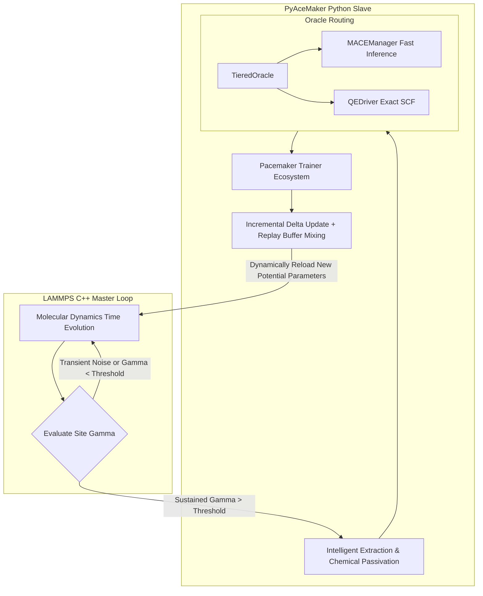

# SYSTEM ARCHITECTURE

## 1. Summary

PyAceMaker is an automated workflow orchestration system designed to construct robust Machine Learning Interatomic Potentials (MLIPs). It fundamentally automates the complex Active Learning loop, seamlessly generating candidate atomic structures, running highly accurate but computationally expensive Density Functional Theory (DFT) calculations using external engines like Quantum Espresso, training multi-body atomic potentials using the Pacemaker framework, and finally validating them against physical constraints via Molecular Dynamics (MD) simulations or direct property evaluations.

The next-generation architecture (Version 2.1.0) shifts the system towards a highly scalable "Hierarchical Distillation Architecture," fundamentally inspired by the groundbreaking FLARE methodology. It directly addresses the most critical bottlenecks encountered when scaling MD simulations to High-Performance Computing (HPC) environments involving tens of thousands to millions of atoms. By introducing radical paradigms such as Master-Slave Inversion, Intelligent Site-specific Cluster Extraction, and Two-Tier Uncertainty Evaluation, PyAceMaker is now capable of performing continuous, massive-scale molecular dynamics simulations without losing crucial physical context due to trivial thermal noise or suffering catastrophic structural fragmentation during active learning halts.

## 2. System Design Objectives

### 2.1. Goals and Primary Directives
The primary goal of this next-generation architecture is to achieve true time-continuity in large-scale material simulations.
**Time-Continuity Preservation (Seamless Resume):** The system must guarantee that Molecular Dynamics simulations can be paused for active learning and subsequently resumed without ever restarting from the initial structural state. The architectural design must perfectly retain all coordinate vectors, velocity distributions, and active thermostat variables. This is the only path forward to accurately study long-timescale physical phenomena such as complex phase transformations, slow diffusion processes, and interface growth kinetics, which are entirely lost if the system resets to step zero upon encountering an uncertain state.
**Thermal Noise Resilience:** A critical objective is the complete elimination of false-positive halts caused by harmless thermal vibrations during MD trajectories. The architecture will achieve this by introducing two entirely separate uncertainty evaluation thresholds: a lower threshold strictly for adding structures to the training set (`threshold_add_train`), and a higher, temporally smoothed threshold exclusively for triggering the expensive DFT calculation (`threshold_call_dft`). This dual-layer approach filters out transient physical noise and prevents the orchestrator from entering an infinite loop of unnecessary evaluations.
**Physical Integrity during Local Learning:** The system must prevent dipole moment divergence and non-physical dangling bonds when extracting local clusters from massive periodic boundary systems. The objective is to intelligently extract a spherical region, apply a rigid pre-relaxation to the outer buffer zone using a foundational model, and automatically passivate the external boundaries before feeding the cluster to the DFT engine. This guarantees that the SCF convergence in Quantum Espresso succeeds without learning non-physical "garbage" electronic states from shattered bonds.
**Mitigation of Catastrophic Forgetting:** The architecture aims to replace the sluggish, computationally explosive full-batch retraining process with a highly efficient incremental delta learning approach. The training module must explicitly use past network weights as initial starting parameters and blend in a fixed-size, randomly sampled replay buffer. This preserves the network's foundational knowledge of stable bulk structures while it rapidly adapts to the new, highly uncertain boundary conditions discovered during the MD halt.
**System Robustness and Fault Tolerance:** Finally, the architecture must guarantee that unexpected C++ level crashes within the external MD engine (e.g., LAMMPS encountering lost atoms or segmentation faults) do not bring down the primary Python orchestrator. The system must implement granular, sub-task level checkpointing mechanisms to allow state recovery within seconds, rather than losing hours of wall-time on an HPC cluster.

### 2.2. Core System Constraints
The architecture is bound by several strict operational and physical constraints that must be adhered to without exception.
**Domain Constraint:** The system must never attempt to load entire datasets or massive million-atom trajectories into memory simultaneously. Massive datasets must be processed strictly via streams, iterators, and chunked reading protocols (e.g., using `ase.io.iread` combined with `itertools.islice`). This prevents Out-Of-Memory (OOM) fatal errors during prolonged HPC jobs.
**Python Versioning:** The entire codebase and all generated environments must strictly target Python 3.11 or higher to leverage modern type hinting and performance enhancements.
**Resource Management:** Engine resources, specifically those interacting with the file system, must be explicitly and forcefully cleaned up. Temporary directories tracking LAMMPS restart files or Quantum Espresso wave functions (`.wfc`) must possess a dedicated, fail-safe `cleanup()` routine that operates even if the primary execution thread is interrupted by the system scheduler.
**Dependency and Architectural Boundaries:** All core domain models must be defined within the `src/pyacemaker/domain_models/` directory, adhering strictly to the separation of concerns. They must remain pure Pydantic models devoid of external side-effects or heavy computational dependencies.

### 2.3. Concrete Success Criteria
The architecture will be deemed successful when it demonstrably achieves the following operational criteria under production load:
**Zero-Shot Baseline Generation:** The system must successfully generate a fully functional, stable foundational potential (`base.yace`) using MACE inferences on combinatorially explored structures, entirely without invoking computationally expensive DFT calculations.
**Uninterrupted MD Verification:** The orchestrator must demonstrate the empirical ability to resume a halted MD simulation from the exact microscopic state recorded just prior to the active learning intervention, maintaining continuous, non-explosive energy profiles across the restart boundary.
**Clean DFT Convergence on Fragments:** The system must consistently achieve complete SCF electronic convergence in the DFT backend when processing intelligently extracted and auto-passivated clusters, without encountering the electron density blow-ups characteristic of vacuum-cleaved crystals.
**O(1) Performance Scaling:** The architecture must drastically reduce the wall-time required for iterative active learning cycles by leveraging incremental learning (demonstrating $O(1)$ time complexity relative to the total historical dataset size) and rapid surrogate data generation via awakened MACE models.

## 3. System Architecture

The core operational paradigm of the PyAceMaker system revolves around the continuous Active Learning loop meticulously managed by the central `Orchestrator`. This orchestrator dynamically coordinates interactions with external `Engines` for structural simulations, varied `Oracles` for ground-truth energy and force evaluations, and specialized `Trainers` to continuously update the interatomic potential parameters.

### 3.1. Master-Slave Inversion Paradigm
Traditionally, Python-based workflow scripts command external engines like LAMMPS via a rigid, top-down execution approach, treating the engine as a disposable utility. The Version 2.1.0 architecture radically inverts this relationship: the Python process now acts as a subordinate (Slave) instance that is invoked dynamically from within the continuous LAMMPS C++ execution loop (the Master). This is achieved via advanced integration mechanisms such as `fix python/invoke` or, as a robust alternative, through meticulously managed `read_restart` fallbacks combined with process isolation. This architectural inversion is paramount because it ensures the microscopic Molecular Dynamics state—comprising atomic coordinates, precise velocity vectors, and complex thermostat memory—remains dynamically alive and perfectly intact when the Python orchestrator temporarily halts the temporal evolution of the simulation to update the underlying machine learning potential. Once the new `.yace` potential is generated, the Python slave signals the C++ master to reload the `pair_coeff` parameters and seamlessly continue the trajectory without resetting the physical clock.

### 3.2. Data Flow and Component Interactions
The execution flow within the hierarchical architecture follows a strictly defined, cyclical path designed to minimise computational waste and maximise learning efficiency:
1.  **Continuous Exploration:** The `Generator` (during Phase 1) or the `LAMMPSEngine` (during Phase 3 MD) produces candidate structures representing the current physical state of the material system.
2.  **Tiered Evaluation:** The `TieredOracle` intercepts all structures and evaluates their latent uncertainty. If the calculated uncertainty remains safely below the designated `threshold_call_dft`, the fast `MACEManager` bypasses DFT entirely and provides the required energy and force outputs directly to the engine.
3.  **Halt & Intelligent Extract:** If the system detects that uncertainty persists above `threshold_call_dft` for a consecutive number of `smooth_steps`, the MD trajectory is formally paused. The system then automatically isolates and extracts a localized spherical cluster centered strictly around the specific atoms whose individual uncertainties exceeded the distinct `threshold_add_train` parameter.
4.  **Quantum DFT Calculation:** The extracted cluster, now meticulously pre-relaxed at its boundary and chemically passivated to prevent electronic divergence, is transmitted to the `QEDriver` (DFT). The driver executes a highly converged SCF calculation to obtain the absolute true ground-state forces specifically for the central core region.
5.  **Hierarchical Fine-Tuning:** The `Trainer` receives the precious DFT ground-truth data. It first fine-tunes the foundational MACE model to awaken it to the specific interface physics, then utilizes the awakened model to generate massive surrogate data. Finally, it updates the ACE potential using a highly efficient incremental delta learning protocol mixed with a historical replay buffer.
6.  **Seamless Trajectory Resume:** The newly updated potential parameters are dynamically loaded into the paused LAMMPS engine, and the molecular dynamics simulation resumes its temporal evolution seamlessly from the exact microsecond it was paused.

### 3.3. Architecture Diagram


```mermaid
graph TD
    subgraph MD_Engine [LAMMPS C++ Master Loop]
        direction TB
        MD[Molecular Dynamics Time Evolution] --> CheckUncertainty{Evaluate Site Gamma}
    end

    subgraph Python_Orchestrator [PyAceMaker Python Slave]
        direction TB
        CheckUncertainty -- Sustained Gamma > Threshold --> Extract[Intelligent Extraction & Chemical Passivation]
        Extract --> Oracle[Tiered Oracle Routing Mechanism]

        subgraph Oracle [Oracle Routing]
            direction LR
            Tiered[TieredOracle] --> MACE[MACEManager Fast Inference]
            Tiered --> DFT[QEDriver Exact SCF]
        end

        Oracle --> Train[Pacemaker Trainer Ecosystem]
        Train --> Update[Incremental Delta Update + Replay Buffer Mixing]
    end

    Update -- Dynamically Reload New Potential Parameters --> MD
    CheckUncertainty -- Transient Noise or Gamma < Threshold --> MD
```

### 3.4. Boundary Management and Strict Separation of Concerns
To prevent the emergence of tightly coupled "God Classes" and ensure long-term maintainability across different HPC environments, the architecture enforces strict boundary rules:
*   **The Orchestrator:** This component functions exclusively as a high-level state machine. It is strictly prohibited from directly manipulating ASE `Atoms` objects, parsing output files, or constructing shell commands. Its sole responsibility is to delegate tasks to the appropriate sub-modules and track the overall execution phase.
*   **Domain Models:** The `src/pyacemaker/domain_models` directory contains absolutely pure Pydantic models. These classes must contain zero side-effects, zero external heavy dependencies (like torch or lammps), and serve solely to validate and structure the hierarchical configuration parameters passed into the system.
*   **Interface Drivers:** The `src/pyacemaker/interfaces` directory encapsulates all external I/O interactions, including Quantum Espresso, LAMMPS, and EON. These drivers must rigorously validate all inputs against strict allowlists to categorically prevent shell injection vulnerabilities, and they must handle all sub-process lifecycles independently.
*   **Utility Modules:** Files within `utils` (such as `utils.extraction.py`) must remain entirely stateless helper functions. The intelligent cluster passivation logic must execute its algorithmic manipulation of the atomic structure without any internal coupling or reference to the `Engine` or `Orchestrator` states.

## 4. Design Architecture

### 4.1. Comprehensive File Structure (Ascii Tree)
The system is cleanly divided into core operational logic, pure data schemas, external driver interfaces, and stateless utilities to enforce the architectural boundaries described above.

```text
src/pyacemaker/
├── core/
│   ├── generator.py        # Generates initial structures, random pools, and applies combinatorial perturbations
│   ├── oracle.py           # Evaluates energy/forces; houses MACEManager, TieredOracle, and DFT fallback logic
│   ├── engine.py           # Manages LAMMPS interaction, Master-Slave execution loops, and seamless resume states
│   ├── trainer.py          # Interfaces with Pacemaker; executes Incremental Updates and FinetuneManager tasks
│   ├── validator.py        # Performs physical validation (Phonon dispersion, Born Elastic criteria) on potentials
│   ├── orchestrator.py     # High-level state machine controlling the 4-Stage Hierarchical Distillation workflow
│   └── state_manager.py    # Handles local DB or JSON task-level checkpointing for HPC fault tolerance
├── domain_models/
│   ├── config.py           # Root PyAceConfig object aggregating all sub-configurations
│   ├── workflow.py         # Houses DistillationConfig, ActiveLearningThresholds, CutoutConfig, LoopStrategyConfig
│   ├── md.py               # Encapsulates all Molecular Dynamics operational parameters (NPT, NVT, steps)
│   ├── dft.py              # Configuration for Quantum Espresso (functionals, k-points, cutoffs)
│   └── defaults.py         # Centralized repository for default system constants to prevent magic numbers
├── interfaces/
│   ├── lammps_driver.py    # Master-slave LAMMPS driver; handles read_restart and dynamic pair_coeff reloading
│   ├── qe_driver.py        # Quantum Espresso driver featuring autonomous self-healing SCF algorithms
│   └── eon_driver.py       # Interfaces with EON client for Adaptive Kinetic Monte Carlo (aKMC) calculations
└── utils/
    ├── extraction.py       # Algorithmic core for intelligent spherical cutout and automated chemical passivation
    ├── embedding.py        # Handles the complex logic of embedding structures into Periodic Boundary Conditions
    ├── io.py               # Implements safe, chunked file I/O protocols to process massive datasets sequentially
    └── path.py             # Strict path resolution utilities to prevent directory traversal vulnerabilities
```

### 4.2. Class and Function Definitions Overview
The introduction of the new architecture necessitates several critical new classes and algorithmic functions designed to handle the intelligent extraction and hierarchical learning processes.
*   **`extract_intelligent_cluster(structure: Atoms, target_atoms: List[int], config: CutoutConfig) -> Atoms`**: Residing in `utils.extraction`, this is the most critical new utility function. It programmatically extracts a spherical region around the target epicentre, explicitly applies force weights (Core=1.0, Buffer=0.0), performs a constrained LBFGS pre-relaxation on the buffer region using MACE inference, and algorithmically applies dummy atoms to passivate dangling surface bonds based on electronegativity rules.
*   **`class MACEManager(BaseOracle)`**: A high-performance wrapper designed to execute MACE-MP-0 PyTorch inferences. It is tasked with calculating not only energies and forces but also quantifying latent-space uncertainty or ensemble variance to inform the active learning threshold decisions.
*   **`class TieredOracle(BaseOracle)`**: This class acts as the intelligent routing mechanism. It receives structures and systematically queries the `MACEManager` first. It delegates the structure to the highly expensive `QEDriver` (DFT calculation) strictly only if the two-tier uncertainty rules dictate a necessary fallback.
*   **`class LAMMPSEngine`**: Extensively refactored to implement the Master-Slave paradigm. It utilizes a robust `read_restart` flow combined with process isolation. Crucially, it automatically injects a soft-start Langevin damping protocol for the initial $N$ steps upon resuming a trajectory to absorb any unphysical energy discontinuities caused by the potential parameters being updated mid-flight.
*   **`class PacemakerTrainer`**: Enhanced to natively support incremental delta learning updates. Instead of wiping previous weights, it initializes training from the prior `.yace` parameters and actively pulls from a fixed-size replay buffer (managed by `state_manager.py`) to mathematically prevent catastrophic forgetting of previously learned stable phases.

### 4.3. Core Domain Pydantic Models Structure and Integration
To strictly avoid circular import dependencies between the deep core logic and the configuration parsers, all new parameters required for the Hierarchical Distillation architecture are modeled as pure Pydantic objects within `src/pyacemaker/domain_models/workflow.py`. These objects explicitly extend the existing workflow definitions without polluting the other domain modules.

```python
from pydantic import BaseModel, Field

class DistillationConfig(BaseModel):
    """Configuration governing Phase 1: Zero-Shot Distillation."""
    enable: bool = True
    mace_model_path: str = Field("mace-mp-0-medium", description="Path to foundational MACE model.")
    uncertainty_threshold: float = Field(0.05, description="Maximum allowable uncertainty for MACE zero-shot inference.")
    sampling_structures_per_system: int = Field(1000, description="Target density for DIRECT combinatorial sampling.")

class ActiveLearningThresholds(BaseModel):
    """FLARE-inspired two-tier threshold schema for noise filtering."""
    threshold_call_dft: float = Field(0.05, description="Primary threshold required to halt MD and trigger DFT.")
    threshold_add_train: float = Field(0.02, description="Secondary lower threshold defining which atomic sites are added to training data.")
    smooth_steps: int = Field(3, description="Consecutive integration steps threshold must be exceeded to eliminate thermal noise.")

class CutoutConfig(BaseModel):
    """Configuration governing Phase 3: Intelligent Cutout and Passivation algorithms."""
    core_radius: float = Field(4.0, description="Radial distance assigning Force Weight 1.0 to central atoms.")
    buffer_radius: float = Field(3.0, description="Thickness of the peripheral relaxation buffer layer.")
    enable_pre_relaxation: bool = Field(True, description="Toggle for MACE-driven buffer structural relaxation.")
    enable_passivation: bool = Field(True, description="Toggle for algorithmic chemical bond passivation.")
    passivation_element: str = Field("H", description="Default dummy element utilised for surface bond neutralisation.")

class LoopStrategyConfig(BaseModel):
    """High-level configuration orchestrating the Active Learning loop mechanisms."""
    use_tiered_oracle: bool = Field(True, description="Toggle usage of MACEManager vs QEDriver routing.")
    incremental_update: bool = Field(True, description="Enforce Delta Learning over full batch retraining.")
    replay_buffer_size: int = Field(500, description="Absolute maximum capacity of past data points retained to prevent catastrophic forgetting.")
    baseline_potential_type: str = Field("LJ", description="Base physical potential (e.g., LJ or ZBL) acting as the underlying scaffold.")
    thresholds: ActiveLearningThresholds = Field(default_factory=ActiveLearningThresholds)
```
These models are directly referenced and instantiated by the root `PyAceConfig` schema located in `config.py`. By defining them strictly as Pydantic objects, they are securely passed into their respective operational core modules (for instance, the `CutoutConfig` is passed directly and exclusively to the algorithms inside `utils.extraction`), thereby guaranteeing type safety and preventing architectural contamination.

## 5. Implementation Plan

The entire development roadmap for the Version 2.1.0 architecture is strictly decomposed into exactly five sequential implementation cycles. Each cycle encapsulates a logical unit of work designed to be independently developed, thoroughly tested, and integrated without causing massive regressions in the existing active learning loop.

### Cycle 01: Core Extraction & Pre-relaxation Setup
This cycle focuses entirely on the microscopic manipulation of atomic structures to ensure physical integrity before expensive calculations are triggered. The primary feature involves designing and implementing the highly complex `CutoutConfig` domain model to govern spatial extraction parameters. The development team will completely overhaul the `pyacemaker.utils.extraction` module, introducing the massive `extract_intelligent_cluster` algorithm. This algorithm will utilise advanced neighbour list calculations to execute spherical extraction from massive periodic boxes, dynamically assigning rigid `force_weight` properties (setting the Core strictly to 1.0 and the surrounding Buffer strictly to 0.0). Furthermore, this cycle will implement the foundational automated passivation logic, building chemical graph representations to detect dangling surface bonds based on electronegativity differences and algorithmically capping them using dummy atoms (such as Fractional Hydrogen) to guarantee electrical neutrality. Finally, the MACE-driven constrained LBFGS pre-relaxation logic will be integrated to eliminate unnatural bond distortions caused immediately following the mathematical cutout procedure.

### Cycle 02: Master-Slave Inversion & Two-Tier Evaluator
This cycle shifts focus to the temporal execution engine and the implementation of noise-resistant thresholding mechanisms inspired by FLARE. The team will first implement the precise `ActiveLearningThresholds` and the overarching `LoopStrategyConfig` data models. Following this, the `LAMMPSEngine` will undergo a severe refactoring to support the Master-Slave execution paradigm. The initial approach will prioritise the highly stable `read_restart` fallback mechanism, ensuring robust process isolation between Python and the LAMMPS C++ binaries. A crucial feature in this cycle is the implementation of the Two-Tier evaluation logic within the Python monitor, explicitly tracking the `smooth_steps` parameter to aggressively filter out single-step thermal noise spikes from the halting criteria. To complete the inversion architecture, the team will integrate the sophisticated soft-start Langevin thermostat logic, which mathematically suppresses massive energy discontinuities from blowing up the simulation box immediately upon the dynamical reloading of updated potential parameters during the resume sequence.

### Cycle 03: MACE Oracle Integration & Hierarchical Distillation Loop
Cycle 03 concentrates on expanding the system's intelligence by wrapping foundational machine learning models and creating the intelligent routing layer. The primary task is the implementation of the `DistillationConfig` schema to control the zero-shot parameters. The development will center on creating the robust `MACEManager` class, which will act as a high-performance wrapper for deploying massive MACE PyTorch models on available GPU hardware, guaranteeing the extraction of accurate latent-space uncertainties. Concurrently, the team will engineer the `TieredOracle` routing mechanism, ensuring that low-uncertainty structures are processed instantly by MACE, while high-uncertainty structures are securely delegated to the First-Principles DFT driver. Finally, this cycle will culminate in the implementation of the entire Phase 1 workflow: the Zero-Shot Distillation logic within the core generator, orchestrating massive combinatorial exploration and DIRECT sampling to build a robust baseline potential without a single DFT invocation.

### Cycle 04: Incremental Update (Delta Learning) & Seamless Resume
This cycle directly attacks the computational bottleneck of batch retraining and resolves the issue of catastrophic forgetting. The core feature involves significantly extending the capabilities of the `PacemakerTrainer` module to handle continuous, incremental training updates. This involves writing the logic to automatically generate Pacemaker configuration files that execute strict Delta Learning procedures scaling from foundational Lennard-Jones (LJ) baseline potentials. To stabilize this incremental learning, the team will implement the sophisticated Replay Buffer management system. This system will randomly sample and inject a mathematically controlled proportion of historical, highly accurate structural data into the current training stream. Finally, the developers will wire the completed `PacemakerTrainer` back into the main `Orchestrator` state machine, ensuring that the newly compiled `.yace` parameter files are written securely and loaded seamlessly into the paused LAMMPS Master instance to complete the full asynchronous active learning loop.

### Cycle 05: HPC Scaling & Robustness (Checkpointing)
The final cycle is entirely dedicated to hardening the architecture for deployment in hostile, massively parallel High-Performance Computing environments where unexpected job terminations are frequent. The team will architect and implement fine-grained, task-level checkpointing mechanisms (utilising highly concurrent SQLite or transactional JSON backends) deeply within `state_manager.py`. This ensures that if an HPC scheduler brutally kills a job due to strict wall-time limits, the system can instantly recover and resume from the precise calculation it was executing, rather than losing days of work by restarting the entire macro-iteration. Furthermore, this cycle will introduce a parallel daemon process dedicated to automated artifact cleanup. This daemon will aggressively target and compress or delete massive Quantum Espresso wave function files (`.wfc`) and terabyte-scale LAMMPS trajectory dumps immediately after they have been successfully processed, preventing catastrophic storage exhaustion during million-step continuous MD simulations.

## 6. Test Strategy

The testing philosophy for Version 2.1.0 mandates absolute strictness regarding memory constraints—under no circumstances may full structural datasets be loaded into memory during testing. Furthermore, all test suites must enforce strict typed annotations across all mocked objects.

### Cycle 01 Test Strategy
**Unit Testing:** The engineering team will deploy massive dummy ASE `Atoms` objects (exceeding 100,000 atoms) directly into the `extract_intelligent_cluster` function. The primary assertion is that the algorithm correctly isolates the core and buffer regions without triggering Out-Of-Memory (OOM) errors, proving streaming efficiency. Tests will rigorously verify that the `force_weight` properties are mathematically correct and assert the successful addition of passivation dummy atoms specifically to the calculated boundary regions.
**Integration Testing:** The test suite will heavily mock the `MACEManager` interface to simulate inference responses. The integration objective is to empirically verify that the LBFGS pre-relaxation trajectory is executed exclusively on the designated buffer region, while asserting via coordinate tracking that the central core atoms remain absolutely fixed and undisturbed during the optimization process.
**E2E Testing:** The end-to-end strategy involves passing a highly complex, artificially extracted and passivated cluster completely through to the `QEDriver` (utilising a mocked standard output). The goal is to mathematically guarantee that no structural or input formatting errors are raised during the extensive preparation of the Quantum Espresso SCF calculation input files.

### Cycle 02 Test Strategy
**Unit Testing:** Focus will be placed entirely on the mathematical logic of the Two-Tier uncertainty filtering. A series of tests will stream synthetic uncertainty vectors simulating high-frequency thermal noise. The suite must assert that the system correctly ignores single-step aggressive spikes, yet immediately triggers a formal halt state when sustained high uncertainty demonstrably exceeds the defined `smooth_steps` consecutive threshold.
**Integration Testing:** A complex LAMMPS script will be executed using the `lammps_driver.py` in an isolated process. The script will be instructed to intentionally generate high uncertainty to trigger a halt. The test will dynamically alter the saved `.restart` file environment and assert mathematically that upon issuing the resume command, the MD engine restarts from the exact precise timestep recorded, and mathematically verifies that the soft-start Langevin damping coefficients are correctly applied.
**E2E Testing:** A complete, miniature continuous MD loop will be executed utilizing a heavily mocked Oracle backend. This E2E test is designed to prove absolute time-continuity over multiple simulated halt-resume cycles, asserting that the global trajectory time monotonically increases without ever resetting.

### Cycle 03 Test Strategy
**Unit Testing:** The underlying PyTorch execution layer of MACE will be mocked using advanced tensor injection techniques. The unit tests will guarantee that the `MACEManager` correctly parses the tensor outputs, accurately returning the complex data structures, energy arrays, force vectors, and critically, the mathematically derived latent-space uncertainty values required by the orchestrator.
**Integration Testing:** The core logic of the `TieredOracle` routing mechanism will be subjected to intense testing using a wide spectrum of pre-calculated uncertainty scores. The integration suite must absolutely guarantee that low-uncertainty structures are routed exclusively to the MACE interface for instant processing, and that high-uncertainty structures correctly and reliably trigger the heavy DFT driver fallback sequence.
**E2E Testing:** The complete Phase 1 Zero-Shot Distillation workflow will be executed on a miniature, geometrically simple crystalline system. Utilising a mocked MACE backend, the test will assert that the extensive combinatorial exploration, DIRECT sampling, and trainer execution run successfully, generating a baseline potential configuration file entirely without a single invocation of the computationally heavy DFT engine.

### Cycle 04 Test Strategy
**Unit Testing:** Rigorous boundary testing will be applied to the Replay Buffer append logic. The test suite must mathematically verify that the historical logging mechanism strictly respects the `maxlen` parameter defined in the configuration. It will push thousands of dummy structures into the buffer and assert that old records are seamlessly evicted to prevent insidious memory bloat and eventual OOM failures during continuous runs.
**Integration Testing:** The configuration compilation logic within `PacemakerTrainer` will be tested to verify that it correctly formulates the exact command-line arguments and `input.yaml` settings required for true delta-learning. The test will also assert that the active Replay Buffer structures are successfully and correctly injected and formatted into the master `training_history.extxyz` file before execution begins.
**E2E Testing:** A complete active learning sub-loop will be executed: the system will generate perturbed data, route it correctly through the Oracle, actively update the Replay Buffer with new structures, and finally trigger an incremental Pacemaker training session. The ultimate assertion is the successful verification that the final, updated `.yace` potential parameter file is written correctly to the designated output directory.

### Cycle 05 Test Strategy
**Unit Testing:** To simulate catastrophic failures, the suite will intentionally raise severe system exceptions mid-way through the execution of large generator streams. The primary test assertion is that the `finally` blocks and context managers successfully clean up all temporary directories regardless of the crash. Furthermore, the state manager's core ability to serialize and precisely deserialize complex Python objects and iteration states to SQLite will be rigorously verified.
**Integration Testing:** The testing environment will actively simulate a hostile HPC wall-time kill (e.g., executing an `os.kill` signal directly against the sub-process) precisely during a mocked DFT SCF calculation. The test will then restart the primary process and assert that the system intelligently resumes execution from the last successful sub-task logged in the database, rather than blindly restarting from iteration zero.
**E2E Testing:** A full, comprehensive User Acceptance Testing (UAT) mock execution will run the entire pipeline through multiple simulated iterations. The crucial assertion at the end of this run is a deep filesystem audit ensuring that absolutely zero giant artifact files (such as massive `.wfc` wave functions or terabyte-scale LAMMPS trajectory dumps) remain orphaned in the temporary working directories after the pipeline successfully completes its orchestration.