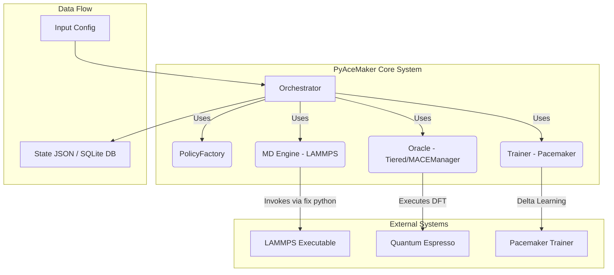

# System Architecture Document

## 1. Summary
This document outlines the system architecture for PyAceMaker Version 2.1.0, codenamed NextGen Hierarchical Distillation Architecture with FLARE Best Practices. The system aims to orchestrate the automated construction of Machine Learning Interatomic Potentials (MLIPs) by coordinating Active Learning loops, Quantum Espresso DFT calculations, and LAMMPS Molecular Dynamics simulations.

The most significant updates in this version include the implementation of Master-Slave inversion, Two-Tier Thresholds, Local Learning via Intelligent Cutouts, and Incremental Updates. These enhancements are designed to resolve the continuity issues, noise sensitivity, and scalability bottlenecks of previous generation systems. The existing architecture is safely extended via Dependency Injection and isolated domain model expansions, ensuring backward compatibility while unlocking new capabilities for high-performance computing environments.

## 2. System Design Objectives
The primary objective of the Next-Generation PyAceMaker architecture is to enable robust, long-term Molecular Dynamics (MD) simulations involving tens of thousands to millions of atoms in practical High-Performance Computing (HPC) environments. In the previous phase of development, the system suffered from a critical flaw known as time-continuity breaks. Whenever the model's extrapolation grade or uncertainty threshold was reached during an active learning run, the simulation was forced to halt. Following the generation of new training data and the subsequent retraining of the potential, the MD simulation invariably restarted from the initial structural configuration. This fundamental design limitation prevented the simulation from ever reaching or observing long-term physical phenomena, such as complex phase transformations, extended diffusion processes, or deep structural relaxation. To overcome this, a core and uncompromising objective of this new architecture is achieving true Master-Slave inversion. The Python orchestration logic must be strictly subordinated to the LAMMPS C++ execution loop, primarily utilizing the `fix python/invoke` mechanism. This paradigm shift allows the simulation to pause precisely at the moment of high uncertainty, trigger the necessary potential updates in the background, and seamlessly resume from the exact same timestep, coordinates, and velocities without rewinding the simulation clock.

Another major design objective is establishing definitive resilience against thermal noise, a common source of false positives in active learning MD. Molecular dynamics simulations inherently produce stochastic thermal vibrations that routinely trigger single-threshold uncertainty halts, even when the underlying physical configuration is entirely safe and well-represented by the current potential. This oversensitivity leads to infinite loops of unnecessary, computationally expensive density functional theory calculations. The new design mandates the introduction of a sophisticated Two-Tier Threshold system. This system delineates a lower, more sensitive threshold specifically for identifying and tagging atomic environments to be added to the training set, and a higher, stricter threshold equipped with step-smoothing logic for actually pausing the MD simulation and invoking the DFT oracle.

Furthermore, the system must definitively address the physical and numerical failures caused by naive local cutouts. Historically, extracting a small cluster of atoms exhibiting high uncertainty and placing it directly into a vacuum creates severe physical artifacts, most notably a massive proliferation of dangling bonds at the cut surfaces. These unpassivated bonds cause extreme charge imbalances and dipole moment divergences, which frequently prevent the Quantum Espresso self-consistent field (SCF) loop from converging or cause the model to learn unphysical electronic states. Therefore, the new architecture dictates an Intelligent Cutout approach. The system will employ spherical extraction to define a core region of interest and a surrounding buffer region. It will then freeze the core atoms, structurally relax the buffer atoms using a fast foundation model like MACE to alleviate artificial strain, and automatically passivate the dangling surface bonds with dummy atoms (such as fractional hydrogen) before executing the DFT calculation.

Scalability and computational efficiency form another critical design pillar. The previous approach of batch retraining the machine learning potential from scratch using the entirety of the accumulated dataset at every active learning step is computationally explosive, scaling at $O(N)$. Moreover, continuously flooding the training set with error-prone structures causes catastrophic forgetting, severely degrading the potential's accuracy on stable, well-understood bulk structures. The system must transition to an Incremental Delta Learning paradigm. This involves utilizing a fixed-size replay buffer of historical, high-quality data mixed with newly generated, highly targeted surrogate data. By performing fast, localized updates of the Atomic Cluster Expansion (ACE) potential in $O(1)$ time complexity, the system can maintain both efficiency and accuracy. Finally, the system must be exceptionally robust for HPC environments, featuring task-level SQLite or JSON checkpointing to recover instantly from wall-time job terminations, alongside automated artifact cleanup daemons to continuously compress or purge massive wavefunction and dump files, preventing catastrophic storage exhaustion during extended production campaigns.

## 3. System Architecture
The system architecture of PyAceMaker is conceptualized as a highly resilient, closed-loop active learning orchestrator that seamlessly integrates several specialized, physically motivated components. The Orchestrator acts as the central state machine and nervous system, dynamically directing the flow of data, control signals, and physical structures between the generative exploration modules, the numerical simulation engines, the quantum mechanical oracles, and the machine learning trainers. The architectural philosophy heavily emphasizes a strict separation of concerns, ensuring that complex physical logic is encapsulated within specific domains and does not leak into the general orchestration flow.

The generative aspect of the architecture is handled by the `PolicyFactory`, which synthesizes diverse initial candidate structures by applying various physically realistic perturbation policies. In this next-generation iteration, these generative capabilities are significantly enhanced by the introduction of automated spatial decomposition and DIRECT sampling algorithms. These additions are designed specifically for information maximization, ensuring that the initial structure pool represents the broadest possible chemical space with the fewest possible redundancies, thereby drastically reducing the downstream computational burden.

The dynamic simulation component is driven by the `LammpsEngine`, which manages the molecular dynamics trajectories. However, in a stark departure from previous designs, the new Master-Slave paradigm dictates that LAMMPS is no longer merely a subservient subprocess spawned and terminated by Python. Instead, LAMMPS takes the lead role in the temporal evolution of the system, actively calling back to the Python orchestrator using the `fix python/invoke` command. This critical architectural inversion allows the system to evaluate uncertainty on the fly, directly within the C++ loop, maintaining the unbroken continuity of the simulation state while still leveraging Python's advanced machine learning libraries.

The Oracle component, responsible for evaluating structural energies and providing ground truth atomic forces, has been fundamentally re-architected into a multi-tiered hierarchy. It now includes a `MACEManager`, which serves as the primary, high-speed inference engine utilizing the MACE foundation model. This allows for rapid evaluation and filtering of structures based on the model's inherent generalization capabilities. The `DFTManager`, utilizing the robust `QEDriver` interface to Quantum Espresso, is retained but relegated to a secondary fallback role, invoked only when the `MACEManager` reports unacceptably high uncertainty that requires strict, first-principles accuracy.

The learning and potential construction phase is managed by the `Trainer` component, which primarily utilizes the Pacemaker framework for constructing highly accurate Atomic Cluster Expansion (ACE) potentials. The new architecture integrates a novel `FinetuneManager` designed to briefly train the foundation model's readout layers on the sparse, precious DFT data acquired during a halt. This "awakened" model then explosively generates vast quantities of targeted surrogate data. The ACE model is subsequently updated incrementally using an advanced Delta Learning strategy over a fundamental Lennard-Jones baseline, meticulously combining the new surrogate data with a curated historical replay buffer to effectively prevent catastrophic forgetting of previously learned stable states. All data flowing between these highly specialized components is strictly governed by strongly typed Pydantic models, guaranteeing runtime validation of complex physical, logical, and structural constraints. Furthermore, boundary management is strictly enforced: external computational tools like LAMMPS and Quantum Espresso are accessed solely through isolated, standardized interface drivers, completely insulating the core PyAceMaker business logic from the volatility of third-party API changes or environmental idiosyncrasies.


```mermaid
graph TD
    subgraph PyAceMaker Core System
        A[Orchestrator] -->|Uses| B(PolicyFactory)
        A -->|Uses| C(Trainer - Pacemaker)
        A -->|Uses| D(MD Engine - LAMMPS)
        A -->|Uses| E(Oracle - Tiered/MACEManager)
    end

    subgraph External Systems
        D -->|Invokes via fix python| F[LAMMPS Executable]
        E -->|Executes DFT| G[Quantum Espresso]
        C -->|Delta Learning| H[Pacemaker Trainer]
    end

    subgraph Data Flow
        I[Input Config] --> A
        A --> J[State JSON / SQLite DB]
    end
```

## 4. Design Architecture
The underlying design architecture of PyAceMaker relies heavily on leveraging modern Python features to create a robust, maintainable, and highly scalable codebase. Specifically, the system utilizes strict Dependency Injection patterns, pure functional interfaces where possible, and comprehensive type hinting validated at runtime via Pydantic models. This approach ensures that the complex physical and structural requirements of the domain are explicitly codified and enforced throughout the software lifecycle. The file and directory structure is rigorously organized by domain boundaries to avoid the creation of unmaintainable God Classes and to systematically decouple the diverse simulation logic from the core orchestration and data routing mechanisms.

```text
src/pyacemaker/
├── core/
│   ├── engine.py
│   ├── oracle.py
│   └── trainer.py
├── domain_models/
│   ├── config.py
│   └── workflow.py
├── interfaces/
│   ├── qe_driver.py
│   └── lammps_driver.py
├── utils/
│   └── extraction.py
└── orchestrator.py
```

The Core Domain Models define the exact shape, constraints, and relationships of the data passing between the various computational modules. These schemas are defined primarily in `domain_models/workflow.py` and `domain_models/config.py` using Pydantic's powerful validation engine. A critical design constraint of this architectural update is that the integration points for all new requirements must strictly extend the existing domain objects rather than replacing them or forcing complete rewrites of legacy components. This additive mindset ensures backward compatibility while seamlessly introducing the advanced capabilities required by the FLARE-inspired workflow. The schema objects are crucial for ensuring that the entire codebase remains type-safe and resilient against structural anomalies. The use of rigorous validation methods significantly reduces runtime errors and enhances the overall reliability of the PyAceMaker platform.

```python
class DistillationConfig(BaseModel):
    enable: bool = True
    mace_model_path: str = "mace-mp-0-medium"
    uncertainty_threshold: float = Field(0.05, description="Safe MACE threshold")
    sampling_structures_per_system: int = 1000

class ActiveLearningThresholds(BaseModel):
    threshold_call_dft: float = Field(0.05, description="Halt criteria")
    threshold_add_train: float = Field(0.02, description="Target atom selection criteria")
    smooth_steps: int = Field(3, description="Consecutive steps for noise filtering")

class CutoutConfig(BaseModel):
    core_radius: float = Field(4.0, description="Force Weight 1.0 radius")
    buffer_radius: float = Field(3.0, description="Buffer layer radius")
    enable_pre_relaxation: bool = True
    enable_passivation: bool = True
    passivation_element: str = "H"

class LoopStrategyConfig(BaseModel):
    use_tiered_oracle: bool = True
    incremental_update: bool = True
    replay_buffer_size: int = Field(500, description="Replay buffer size")
    baseline_potential_type: str = Field("LJ", description="Base physics potential")
    thresholds: ActiveLearningThresholds = Field(default_factory=ActiveLearningThresholds)
```

The newly introduced `LoopStrategyConfig` serves as the master orchestration toggle for the Phase 2.1.0 feature set. The `ActiveLearningThresholds` model explicitly defines the Two-Tier Threshold mechanism, safely replacing the previous scalar threshold approach with a highly configurable, noise-resistant logic block. The `CutoutConfig` model governs the intricate physics of the intelligent extraction process, dictating the precise radial boundaries for the core and buffer zones while enabling the crucial passivation and pre-relaxation flags. These sophisticated configuration models are injected directly into the core managers upon instantiation. For instance, the `extract_intelligent_cluster` utility function in `utils.extraction.py` will now accept a massive, raw `Atoms` object along with a complete `CutoutConfig` instance, utilizing the specified parameters to automatically handle the complex spherical extraction and surface passivation routines. Similarly, the `TieredOracle` will dynamically route requests based on the MACE confidence levels inferred via the injected `DistillationConfig`, ensuring that the architectural upgrades are deeply integrated yet neatly isolated within the existing structural framework. The strict adherence to these Pydantic models prevents invalid data from entering the critical execution pathways, safeguarding the integrity of the quantum mechanical and molecular dynamics calculations. The modular nature of these configurations allows for unprecedented flexibility, enabling researchers to precisely tailor the active learning loop to their specific scientific objectives without modifying the underlying core logic.

## 5. Implementation Plan

### Cycle 01: Zero-Shot Distillation and Phase 1 Baseline Construction
The primary objective of Cycle 01 is to establish the foundation of the Zero-Shot Distillation phase, extracting the broad generalization capabilities of foundation models without ever invoking computationally expensive DFT calculations. The implementation will begin by creating the automated spatial decomposition module, which will systematically define subsystems for all unary species and binary pairs derived from the input elemental composition. A comprehensive structure generation pipeline will then be constructed to produce a massive pool of candidate structures encompassing random configurations, various applied strains, thermal rattles, high-temperature snapshots, and a wide array of stoichiometric variations and defects. Following this, the existing `ActiveSetSelector` will be heavily leveraged and optimized to extract the most information-dense subset of structures using DIRECT sampling algorithms, ensuring maximum diversity with minimum redundancy. The next crucial step is the implementation of the `MACEManager`, a high-performance inference wrapper for the MACE foundation model. The generated structure pool will be passed through this manager, which will compute energies, forces, and critically, a reliable uncertainty metric. A rigorous confidence filtering mechanism will be implemented to selectively retain only those structures where the MACE model exhibits exceptionally high confidence, effectively discarding any extrapolative or physically questionable configurations. Finally, the `PacemakerTrainer` will be significantly upgraded to support automated Delta Learning configuration. It will utilize the cleanly filtered dataset to perform an initial, robust training run over a fundamental Lennard-Jones baseline potential. This complex orchestration will culminate in the generation of a highly stable `base.yace` initial potential, fully prepared for the rigors of the subsequent physical validation phases without a single Quantum Espresso execution. This entire process must be carefully monitored to ensure that the initial data structures strictly conform to the expected schemas, providing a solid foundation for the remainder of the active learning cycles.

### Cycle 02: Validation Framework and Miniature MD Stress Tests (Phase 2)
Cycle 02 focuses entirely on ensuring that the baseline potential constructed in the preceding cycle guarantees a minimum threshold of physical stability before being deployed into production environments. The implementation will center around the development of the `Validator` component, a highly specialized module designed to independently calculate and assess critical physical properties of the stable crystalline phases for each defined subsystem. This will involve implementing robust interfaces to external analysis tools capable of computing elastic constants to verify Born stability criteria, generating phonon dispersion relations to ensure the strict absence of imaginary vibrational frequencies, and calculating highly accurate equations of state. A critical component of this cycle is the implementation of the automated self-healing feedback loop. If the `Validator` determines that any of the calculated properties fail to meet the stringent acceptance criteria, the system must automatically trigger a precise reconfiguration event. This event will systematically increase the structural sampling density or expand the generative perturbation boundaries in Phase 1, automatically initiating a complete retraining cycle until the physical criteria are definitively satisfied. Concurrently, the implementation will involve developing a miniature MD stress testing framework. This framework will automatically construct a scaled-down representative slab model of the target system and execute a rapid molecular dynamics simulation using the newly validated potential. The primary goal of this stress test is to rigorously profile the model's behavior under thermal load, specifically mapping out the temperature ranges at which the structural uncertainty begins to escalate unacceptably. This "Uncertainty Map" will be crucial for defining the safe operating limits of the potential during full-scale deployment. The validation algorithms must be exceptionally precise to guarantee the physical viability of the generated machine learning potential.

### Cycle 03: Intelligent Cutout and Physical Passivation (Phase 3 Core)
Cycle 03 addresses the core physical failures historically caused by naive local cutouts by implementing the highly sophisticated Intelligent Cutout mechanism. The implementation will begin by deeply integrating the Two-Tier Threshold logic into the active learning evaluation loop. This involves developing a robust temporal smoothing algorithm that definitively filters out transient thermal noise by requiring the structural uncertainty to exceed the defined threshold for a specific, configurable number of consecutive simulation steps before triggering a halt sequence. Once a valid halt is triggered, the system will identify the specific subset of atoms that exceeded the lower training threshold, designating this localized group as the epicenter of the anomaly. The most complex implementation task in this cycle involves completely rewriting the `utils.extraction` module. Using the `extract_local_region` logic as a foundation, the system must be capable of spherically extracting both a tightly defined core region and an expansive buffer region, accurately assigning the appropriate `force_weight` arrays to distinguish between the two zones. The critical innovation to be implemented here is the automated pre-relaxation sequence. The system must rigorously freeze the coordinates of the core atoms using ASE constraints, and then utilize the MACE foundation model to perform a rapid local optimization of the buffer atoms, effectively alleviating any artificial structural strain induced by the cutout process. Following this, an intelligent auto-passivation algorithm must be developed to detect all uncoordinated dangling bonds at the buffer's outer boundary and automatically attach appropriate dummy atoms, ensuring that the resulting isolated cluster is both physically relaxed and completely electrically neutral before being passed to Quantum Espresso for a clean, stable SCF convergence. This meticulous preparation is absolutely essential to prevent the catastrophic failure of the quantum mechanical solver.

### Cycle 04: Hierarchical Delta Learning and MACE Finetuning (Phase 4)
Cycle 04 is dedicated to implementing the sequential, hierarchical updating mechanisms for both the foundation model and the ACE potential, utilizing the sparse, highly valuable DFT data obtained during Cycle 03. The primary implementation task is the development of a novel `FinetuneManager`. This component will be engineered to execute highly accelerated, localized fine-tuning of the terminal readout layers of the MACE foundation model using PyTorch. This process will create a highly specialized, "Awakened MACE" model that inherently understands the specific, complex interface physics of the newly encountered target structure. Once the foundation model is awakened, the implementation will focus on developing a high-throughput inference pipeline designed to explosively generate thousands of targeted surrogate data points. This pipeline will explore the immediate, localized phase space surrounding the halted epicenter using rapid random displacements and micro-molecular dynamics trajectories, leveraging the awakened MACE model as an exceptionally fast, high-accuracy oracle. The final major implementation effort will involve significantly upgrading the `PacemakerTrainer` to seamlessly support true Incremental Delta Learning. This requires engineering a sophisticated data management system capable of securely maintaining a fixed-size replay buffer of historical training data. The trainer must be modified to meticulously mix the newly generated surrogate data with a curated sample from the replay buffer, subsequently executing a rapid, localized update of the ACE potential in $O(1)$ computational time. This complex sequence of operations will ensure that the system rapidly assimilates new physical phenomena while effectively preventing the catastrophic forgetting of previously learned stable bulk configurations. The synchronization of these multi-tiered learning processes is critical for maintaining computational efficiency.

### Cycle 05: Master-Slave Inversion, HPC Resilience, and Final Integration
The final implementation cycle tackles the significant operational robustness challenges required for long-term deployment in High-Performance Computing (HPC) environments, alongside the critical Master-Slave inversion necessary for seamless molecular dynamics continuation. The most technically demanding implementation will be the Master-Slave inversion itself, which requires subordinating the Python Orchestrator completely to the LAMMPS C++ execution loop using the advanced `fix python/invoke` mechanism. This complex integration will allow the LAMMPS simulation to independently pause upon detecting sustained high uncertainty, automatically invoke the sophisticated extraction and training pipelines built in Cycles 03 and 04, dynamically reload the updated potential coefficients, and seamlessly resume execution from the exact halted computational step without ever requiring a disruptive temporal rewind. Furthermore, the implementation must finalize a highly robust, task-level checkpointing system utilizing embedded SQLite or JSON databases. This system must be engineered to securely preserve the entire orchestration state down to the granular level of individual DFT calculations and surrogate data generation events, ensuring that any workflow terminated by an HPC wall-time limit can be instantly and perfectly resumed without the loss of critical computational progress. Finally, the cycle requires the development and integration of automated, background artifact cleanup daemons. These continuous processes will be rigorously programmed to systematically locate, compress, or definitively delete the massive `.wfc` wavefunction files and expansive trajectory dump files immediately following a definitively successful pipeline execution, guaranteeing highly efficient storage utilization during month-long production campaigns and preventing catastrophic node failure due to local storage exhaustion. This final integration step ensures the system is fully prepared for rigorous, large-scale scientific discovery.

## 6. Test Strategy

### Cycle 01: Zero-Shot Distillation and Phase 1 Baseline Construction
The testing strategy for Cycle 01 will rely heavily on an extensive suite of unit tests specifically designed to validate the intricate logic of the new Pydantic models and the complex combinatorial structure generation algorithms. We will meticulously mock the `MACEManager` inference interface to return highly predictable arrays of energy and uncertainty values. This will allow us to rigorously verify that the confidence filtering mechanism correctly and consistently discards structural configurations that exceed the defined safety thresholds, while accurately retaining those within the acceptable bounds. Furthermore, we will comprehensively mock the `PacemakerTrainer` to ensure that it correctly synthesizes an `input.yaml` configuration file that is flawlessly optimized for Delta Learning over a Lennard-Jones baseline, verifying the complex string formatting and file generation logic without ever requiring the actual execution of the computationally expensive training process. Finally, rigorous integration tests will be constructed to verify that the entire Phase 1 pipeline, from initial spatial decomposition to final baseline potential generation, executes completely end-to-end without ever inadvertently invoking the Quantum Espresso driver, ensuring that the critical Zero-Shot Distillation architectural constraint is strictly and permanently maintained. These rigorous tests are essential for ensuring that the generative exploration module functions exactly as specified, producing high-quality datasets that will drive the rest of the active learning pipeline. Continuous integration servers will run these tests automatically on every commit to prevent regressions.

### Cycle 02: Validation Framework and Miniature MD Stress Tests (Phase 2)
Testing Cycle 02 involves validating the complex, automated self-healing feedback loop that forms the core of the physical validation framework. To achieve this, we will construct sophisticated mock instances of the external elastic and phonon calculation interfaces. These mocks will be intentionally programmed to periodically return definitive failures, such as calculating physically impossible imaginary vibrational frequencies or reporting elastic constants that blatantly violate Born stability criteria. The test suite will meticulously assert that the `Validator` component correctly identifies and catches these induced failures, and subsequently automatically triggers the precise configuration update required to increase the structural sampling density within the Phase 1 generation loop. For the miniature MD stress test component, we will utilize a highly instrumented, mocked LAMMPS driver designed to deliberately simulate an early, unexpected halt condition. The tests will rigorously verify that the sophisticated Uncertainty Map, detailing the precise temperature ranges associated with the structural instability, is correctly generated, formatted, and logged to the appropriate diagnostic directories. Isolated temporary directory contexts will be used extensively throughout these tests to definitively prevent the complex file I/O operations generated by the validation routines from corrupting the surrounding testing environment. This strict isolation ensures that the test suite remains deterministic and reliable across different execution platforms.

### Cycle 03: Intelligent Cutout and Physical Passivation (Phase 3 Core)
Cycle 03 requires the development of exceptionally robust unit tests designed to validate the highly complex geometrical operations encapsulated within the extensively rewritten `utils.extraction` module. We will programmatically construct a massive, synthetic ASE `Atoms` object specifically designed to represent a highly defective, asymmetrical slab surface. We will then manually inject extremely high uncertainty flags onto a specific subset of central atoms to simulate a localized failure event. The test suite will rigorously verify that the `extract_intelligent_cluster` function correctly and autonomously identifies the precise epicenter of the anomaly, accurately applies the geometrically appropriate spherical core and expansive buffer radii, and flawlessly assigns the critical `force_weight` arrays to distinguish the distinct learning zones. Crucially, we will comprehensively verify the sophisticated auto-passivation logic by meticulously counting the absolute number of dummy atoms automatically added to the structure, and confirming through strict assertion that the resulting isolated cluster maintains perfect electrical neutrality. The complex pre-relaxation sequence will be validated by heavily mocking the MACE structural optimizer, allowing the tests to definitively assert that the coordinates of the core atoms remain strictly immutable and fixed, while the positions of the buffer atoms are successfully updated to alleviate the induced geometric strain. These tests form the bedrock of confidence in the system's ability to automatically repair unphysical artifacts before they can trigger catastrophic failures in the downstream quantum mechanical calculations.

### Cycle 04: Hierarchical Delta Learning and MACE Finetuning (Phase 4)
The comprehensive testing of Cycle 04 focuses specifically on ensuring that the advanced incremental update mechanisms function flawlessly and stably without inadvertently triggering explosive computational cost scaling or memory leaks. We will heavily mock the complex `FinetuneManager` to accurately simulate the rapid fine-tuning of the MACE foundation model's terminal layers, and the subsequent high-volume generation of targeted surrogate data points. The intricate `PacemakerTrainer` interface will be subjected to rigorous testing designed to confirm that it correctly locates and loads the previously generated `base.yace` baseline potential, accurately and randomly samples an appropriate subset of historical structures from the defined replay buffer, and successfully initiates the sophisticated Delta Learning training process utilizing the newly combined dataset. A critical assertion within this test suite will definitively verify that the total absolute size of the training dataset passed to the external Pacemaker executable strictly adheres to the mathematical limits defined by the specific `replay_buffer_size` parameter combined with the exact surrogate data count, thereby absolutely guaranteeing that the $O(1)$ computational scaling constraint is maintained under all conceivable conditions. The rigorous validation of these memory management and data sampling routines is absolutely essential for the long-term stability of the active learning orchestrator, preventing out-of-memory errors and performance degradation over extended simulation periods.

### Cycle 05: Master-Slave Inversion, HPC Resilience, and Final Integration
The final cycle's testing strategy will uniquely combine deep, granular unit tests for the highly critical state management systems with complex, multi-process integration tests designed specifically for the LAMMPS interface. We will rigorously test the task-level SQLite checkpointing architecture by intentionally raising severe, uncatchable exceptions directly in the middle of a simulated, highly complex workflow execution. The subsequent test assertions will meticulously verify that the Orchestrator can cleanly and instantly resume execution from the exact, granular computational step securely recorded in the database, without any loss of intermediate data or progression. The background artifact cleanup daemon will be aggressively tested by programmatically generating hundreds of massive, dummy `.wfc` files and gigabyte-scale trajectory dumps. The test suite will conclusively verify the definitive deletion or appropriate compression of these artifacts immediately following a mocked, successful execution of the core learning pipeline. Because the critical Master-Slave inversion paradigm is notoriously difficult to test purely within an isolated Python context, we will heavily rely on advanced integration tests utilizing the `lammps` Python module. These specialized tests will rigorously validate that the absolute simulation state—specifically the exact timestep integer, the precise atomic coordinate arrays, and the full velocity distributions—is perfectly and completely preserved across a simulated, multi-stage pause, potential reload, and resume event, proving the fundamental viability of the entire next-generation architecture. The successful execution of this final test suite will mark the definitive completion of the structural upgrades.
