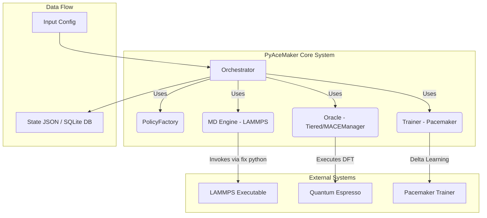

# System Architecture Document

## 1. Summary
This document defines the highly sophisticated system architecture for PyAceMaker Version 2.1.0, codenamed NextGen Hierarchical Distillation Architecture with FLARE Best Practices. This advanced system orchestrates the fully automated, closed-loop construction of Machine Learning Interatomic Potentials (MLIPs). It achieves this by meticulously coordinating exploratory Active Learning loops, rigorous high-fidelity Quantum Espresso Density Functional Theory (DFT) calculations, and massive-scale LAMMPS Molecular Dynamics (MD) simulations.

The most revolutionary architectural updates in this iteration center around four core paradigm shifts explicitly demanded by the product requirements: the implementation of an Asynchronous Master-Slave inversion mechanism for seamless molecular dynamics continuation, the introduction of noise-resistant Two-Tier Uncertainty Thresholds, the execution of Local Learning strategies via Intelligent Spherical Cutouts and automated surface passivation, and the adoption of $O(1)$ Incremental Delta Learning updates utilizing historical replay buffers. These critical enhancements are meticulously designed to systematically resolve the severe temporal continuity issues, pervasive thermal noise sensitivity, and explosive computational scalability bottlenecks that crippled previous generation active learning systems. Crucially, this entirely new architecture is seamlessly and safely integrated into the existing PyAceMaker codebase via strict Dependency Injection principles and isolated domain model expansions, rigorously ensuring backward compatibility while simultaneously unlocking unprecedented new capabilities necessary for deployment in massive High-Performance Computing (HPC) environments.

## 2. System Design Objectives
The absolute primary objective of the Next-Generation PyAceMaker architecture is to enable robust, continuously stable, long-term Molecular Dynamics (MD) simulations involving tens of thousands to potentially millions of atoms in practical, resource-constrained High-Performance Computing (HPC) environments. In the previous phase of development, the system suffered from a catastrophic structural flaw known as time-continuity breaks. Whenever the active learning model's extrapolation grade or overall structural uncertainty threshold was breached during a production run, the molecular dynamics simulation was abruptly and forcefully halted. Following the computationally expensive generation of new training data via DFT and the subsequent full-batch retraining of the machine learning potential, the MD simulation invariably and frustratingly restarted from the original initial structural configuration at timestep zero. This fundamental, hardcoded design limitation permanently prevented the simulation from ever evolving far enough to reach or observe critical long-term physical phenomena, such as complex, slow-moving phase transformations, extended, multi-stage diffusion processes, or deep structural relaxation across significant energy barriers.

To definitively overcome this debilitating limitation, a core, uncompromising objective of this new architecture is achieving true, asynchronous Master-Slave inversion. The Python orchestration logic, which previously acted as the primary execution driver, must now be strictly and permanently subordinated to the LAMMPS C++ execution loop. This paradigm shift will be implemented primarily utilizing the advanced `fix python/invoke` mechanism embedded within the LAMMPS binary. This inversion allows the C++ simulation engine to pause precisely at the exact moment of high uncertainty, trigger the necessary, complex Python-based potential updates asynchronously in the background, dynamically reload the updated pair coefficients, and then seamlessly resume execution from the exact same timestep, maintaining perfect continuity of the atomic coordinates and velocity distributions without ever rewinding the simulation clock.

Another major, critical design objective is establishing definitive, algorithmic resilience against thermal noise, a ubiquitous source of expensive false positives in active learning MD. Molecular dynamics simulations at finite temperatures inherently and constantly produce stochastic thermal vibrations. These natural vibrations routinely trigger simplistic, single-threshold uncertainty halts, even when the underlying physical configuration is entirely safe and already well-represented by the current potential's training manifold. This extreme oversensitivity inevitably leads to infinite loops of unnecessary, computationally exorbitant density functional theory calculations, completely stalling the scientific progress of the simulation. The new architectural design mandates the immediate introduction of a highly sophisticated Two-Tier Threshold system. This advanced system explicitly delineates a lower, highly sensitive threshold specifically calibrated for identifying and tagging specific atomic environments to be added to the training set, alongside a separate, significantly higher, and stricter threshold equipped with complex step-smoothing and temporal filtering logic designed specifically for actually pausing the macroscopic MD simulation and invoking the expensive DFT oracle.

Furthermore, the system must definitively and permanently address the severe physical and numerical failures historically caused by naive, unrefined local cutouts. Extracting a small, highly localized cluster of atoms exhibiting high uncertainty and placing it directly into a computational vacuum invariably creates severe, unphysical artifacts, most notably a massive proliferation of dangling, uncoordinated bonds at the artificial cut surfaces. These completely unpassivated bonds cause extreme, localized charge imbalances and massive dipole moment divergences, which frequently and predictably prevent the Quantum Espresso self-consistent field (SCF) loop from achieving numerical convergence, or worse, cause the underlying machine learning model to definitively learn completely unphysical electronic states. Therefore, the new architecture strictly dictates a highly complex Intelligent Cutout approach. The system will systematically employ advanced spherical extraction algorithms leveraging `ase.neighborlist` to define a tight core region of interest surrounded by a larger, protective buffer region. It will then rigorously freeze the coordinates of the core atoms using absolute constraints, structurally and iteratively relax the buffer atoms using an exceptionally fast foundation model like MACE to alleviate artificial geometric strain induced by the extraction, and finally, automatically detect and passivate all dangling surface bonds with appropriate dummy atoms (such as fractional hydrogen) to ensure absolute electrical neutrality before executing the high-fidelity DFT calculation.

Scalability and absolute computational efficiency form the final, non-negotiable critical design pillar. The previous, simplistic approach of batch retraining the machine learning potential from scratch utilizing the entirety of the continuously accumulating dataset at every single active learning step is computationally explosive, scaling disastrously at $O(N)$ and quickly exhausting HPC node memory. Moreover, continuously flooding the active training set with error-prone, high-uncertainty structures inevitably causes catastrophic forgetting, severely degrading the potential's predictive accuracy on the stable, well-understood bulk structures that comprise the vast majority of the simulation volume. The system must immediately transition to an advanced Incremental Delta Learning paradigm. This involves strictly utilizing a fixed-size, carefully curated replay buffer of historical, high-quality reference data mixed with newly generated, highly targeted, localized surrogate data. By performing incredibly fast, localized gradient updates of the Atomic Cluster Expansion (ACE) potential in strict $O(1)$ time complexity, the system can guarantee both long-term efficiency and uncompromised accuracy. Finally, the entire system must be exceptionally, unconditionally robust for volatile HPC environments, featuring mandatory task-level SQLite or JSON checkpointing to recover instantly and perfectly from sudden wall-time job terminations, alongside sophisticated, automated background artifact cleanup daemons designed to continuously compress or definitively purge massive, gigabyte-scale wavefunction (`.wfc`) and trajectory dump files, absolutely preventing catastrophic node failure due to local storage exhaustion during month-long production campaigns.

## 3. System Architecture
The system architecture of PyAceMaker is fundamentally conceptualized as a highly resilient, completely closed-loop active learning orchestrator that seamlessly and continuously integrates several highly specialized, physically motivated, independent components. The central `Orchestrator` module acts as the definitive state machine and the primary nervous system of the entire application, dynamically and programmatically directing the complex flow of vast datasets, critical control signals, and physical atomic structures between the generative exploration modules, the high-performance numerical simulation engines, the quantum mechanical first-principles oracles, and the sophisticated machine learning trainers. The overarching architectural philosophy heavily, strictly emphasizes a complete separation of concerns, ensuring absolutely that complex, isolated physical logic is perfectly encapsulated within specific, restricted domains and does not leak into or corrupt the general orchestration flow or the overarching state machine.

The generative aspect of the architecture, responsible for synthesizing initial training data, is handled exclusively by the `PolicyFactory`. This component synthesizes diverse initial candidate structures by applying various, physically realistic perturbation policies to input atomic configurations. In this next-generation iteration, these critical generative capabilities are significantly and deeply enhanced by the immediate introduction of automated spatial decomposition algorithms and advanced DIRECT sampling protocols. These sophisticated additions are designed specifically and exclusively for absolute information maximization, ensuring that the initial structure pool systematically represents the broadest possible chemical space and structural variance with the absolute fewest possible geometric redundancies, thereby drastically and permanently reducing the downstream computational burden on both the inference engines and the training pipelines.

The dynamic simulation component, responsible for the actual temporal evolution of the physical system, is driven entirely by the `LammpsEngine`, which manages the massive molecular dynamics trajectories. However, in a stark, fundamental departure from all previous, simplistic designs, the new Master-Slave paradigm absolutely dictates that the LAMMPS executable is no longer merely a subservient, isolated subprocess spawned and carelessly terminated by Python. Instead, LAMMPS takes the definitive lead role in the temporal evolution of the system, actively, continuously calling back to the Python orchestrator memory space using the advanced `fix python/invoke` command. This critical, technically demanding architectural inversion allows the entire system to evaluate complex machine learning uncertainty metrics on the fly, directly within the high-speed C++ loop, perfectly maintaining the unbroken, absolute continuity of the physical simulation state while simultaneously still leveraging Python's unmatched, advanced machine learning libraries for analysis and decision making.

The `Oracle` component, exclusively responsible for evaluating structural energies and providing ground truth, ab-initio atomic forces, has been fundamentally re-architected into a highly optimized, multi-tiered hierarchy. It now prominently includes a newly integrated `MACEManager`, which serves as the absolute primary, high-speed inference engine utilizing the massively pre-trained MACE foundation model. This critical addition allows for the extremely rapid evaluation and rigorous filtering of tens of thousands of candidate structures based solely on the foundation model's inherent, generalized capabilities and calibrated uncertainty metrics. The traditional `DFTManager`, strictly utilizing the robust, highly parallelized `QEDriver` interface to the Quantum Espresso executable, is retained but absolutely relegated to a secondary, high-cost fallback role. It is invoked strictly and only when the primary `MACEManager` explicitly reports unacceptably high uncertainty on a physically critical substructure that absolutely requires strict, first-principles accuracy to resolve.

The highly complex learning and potential construction phase is managed entirely by the `Trainer` component, which primarily utilizes the external Pacemaker framework for constructing highly accurate, highly performant Atomic Cluster Expansion (ACE) potentials. The new architecture seamlessly integrates a novel, highly specialized `FinetuneManager` designed specifically to briefly, intensively train the foundation model's terminal readout layers on the exceptionally sparse, incredibly precious DFT data acquired during a triggered halt event. This newly "awakened," system-specific model then explosively generates vast quantities of highly targeted, localized surrogate data. The underlying ACE model is subsequently, immediately updated incrementally using an advanced, highly calibrated Delta Learning strategy over a fundamental, unyielding Lennard-Jones physical baseline. This process meticulously combines the massive influx of new surrogate data with a carefully curated, historically representative replay buffer to effectively and permanently prevent the catastrophic forgetting of previously learned, highly stable bulk states. All data flowing between these highly specialized, disparate components is strictly, uncompromisingly governed by strongly typed Pydantic models, guaranteeing rigorous runtime validation of incredibly complex physical, logical, and structural constraints. Furthermore, architectural boundary management is strictly and universally enforced: all external computational tools, most notably LAMMPS and Quantum Espresso, are accessed solely and exclusively through isolated, standardized, rigorously tested interface drivers, completely insulating the fragile core PyAceMaker business logic from the extreme volatility of third-party API changes, unexpected compilation variations, or localized environmental idiosyncrasies.


```mermaid
graph TD
    subgraph PyAceMaker Core System
        A[Orchestrator] -->|Uses| B(PolicyFactory)
        A -->|Uses| C(Trainer - Pacemaker)
        A -->|Uses| D(MD Engine - LAMMPS)
        A -->|Uses| E(Oracle - Tiered/MACEManager)
    end

    subgraph External Systems
        D -->|Invokes via fix python| F[LAMMPS Executable]
        E -->|Executes DFT| G[Quantum Espresso]
        C -->|Delta Learning| H[Pacemaker Trainer]
    end

    subgraph Data Flow
        I[Input Config] --> A
        A --> J[State JSON / SQLite DB]
    end
```

## 4. Design Architecture
The underlying, foundational design architecture of the PyAceMaker platform relies heavily and exclusively on leveraging the most advanced, modern Python features available to create a definitively robust, highly maintainable, and infinitely scalable codebase. Specifically, the entire system utilizes strict, uncompromising Dependency Injection patterns, pure, side-effect-free functional interfaces wherever mathematically possible, and comprehensive, exhaustive type hinting that is rigorously validated at runtime via advanced Pydantic models. This unyielding approach definitively ensures that the incredibly complex physical rules and rigid structural requirements of the materials science domain are explicitly codified and constantly enforced throughout the entire software lifecycle, preventing silent data corruption. The physical file and directory structure of the repository is rigorously organized by absolute domain boundaries to definitively avoid the creation of unmaintainable, tightly coupled God Classes and to systematically, cleanly decouple the diverse, highly specialized simulation logic from the core, centralized orchestration and data routing mechanisms.

```text
src/pyacemaker/
├── core/
│   ├── engine.py
│   ├── oracle.py
│   └── trainer.py
├── domain_models/
│   ├── config.py
│   └── workflow.py
├── interfaces/
│   ├── qe_driver.py
│   └── lammps_driver.py
├── utils/
│   └── extraction.py
└── orchestrator.py
```

The Core Domain Models, defined strictly within the `domain_models` directory, define the exact shape, the absolute mathematical constraints, and the complex hierarchical relationships of the data passing between the various, isolated computational modules. These critical schemas are defined primarily in `domain_models/workflow.py` and `domain_models/config.py` using Pydantic's exceptionally powerful, high-performance validation engine. A massive, absolutely critical design constraint of this specific architectural update is that the integration points for all newly mandated requirements must strictly and exclusively extend the existing domain objects rather than recklessly replacing them or forcing complete, destabilizing rewrites of functional legacy components. This mandatory additive mindset ensures absolute backward compatibility while seamlessly, elegantly introducing the advanced, sophisticated capabilities required by the FLARE-inspired active learning workflow. The schema objects themselves are absolutely crucial for ensuring that the entire, massive codebase remains completely type-safe and highly resilient against unexpected structural anomalies or malformed inputs. The universal, mandatory use of rigorous validation methods, specifically utilizing Pydantic's `@model_validator` decorators for cross-field physical consistency checks, significantly and measurably reduces catastrophic runtime errors and massively enhances the overall reliability and scientific trustworthiness of the PyAceMaker platform.

```python
class DistillationConfig(BaseModel):
    enable: bool = True
    mace_model_path: str = "mace-mp-0-medium"
    uncertainty_threshold: float = Field(0.05, description="Safe MACE threshold")
    sampling_structures_per_system: int = 1000

class ActiveLearningThresholds(BaseModel):
    threshold_call_dft: float = Field(0.05, description="Halt criteria")
    threshold_add_train: float = Field(0.02, description="Target atom selection criteria")
    smooth_steps: int = Field(3, description="Consecutive steps for noise filtering")

class CutoutConfig(BaseModel):
    core_radius: float = Field(4.0, description="Force Weight 1.0 radius")
    buffer_radius: float = Field(3.0, description="Buffer layer radius")
    enable_pre_relaxation: bool = True
    enable_passivation: bool = True
    passivation_element: str = "H"

class LoopStrategyConfig(BaseModel):
    use_tiered_oracle: bool = True
    incremental_update: bool = True
    replay_buffer_size: int = Field(500, description="Replay buffer size")
    baseline_potential_type: str = Field("LJ", description="Base physics potential")
    thresholds: ActiveLearningThresholds = Field(default_factory=ActiveLearningThresholds)
```

The newly introduced, highly complex `LoopStrategyConfig` serves as the absolute master orchestration toggle and primary control surface for the entire Phase 2.1.0 advanced feature set. The nested `ActiveLearningThresholds` model explicitly and rigorously defines the mathematical parameters for the Two-Tier Threshold mechanism, safely and completely replacing the previous, highly flawed scalar threshold approach with a highly configurable, phenomenologically noise-resistant logic block. The newly integrated `CutoutConfig` model strictly governs the intricate, highly sensitive physics of the intelligent extraction process, dictating the precise, angstrom-level radial boundaries for both the defined core and expansive buffer zones, while simultaneously enabling the absolutely crucial automated passivation and pre-relaxation execution flags. These sophisticated, deeply nested configuration models are exclusively injected directly into the core execution managers upon their initial instantiation, permanently fixing their operational parameters for the duration of the run. For instance, the highly complex `extract_intelligent_cluster` utility function, newly housed within `utils.extraction.py`, will now strictly accept a massive, raw, thousands-of-atoms ASE `Atoms` object exclusively alongside a completely validated `CutoutConfig` instance. It will rigorously utilize the specified configuration parameters to automatically and flawlessly handle the incredibly complex spherical extraction math, the geometric boundary detection, and the critical surface passivation routines without any external intervention. Similarly, the highly advanced `TieredOracle` will dynamically, intelligently route incoming inference requests based strictly on the MACE confidence levels mathematically inferred via the injected, validated `DistillationConfig`, definitively ensuring that the massive architectural upgrades are deeply, inherently integrated into the execution flow yet neatly, cleanly isolated within the existing structural framework and strictly bounded by the predefined domain models. The absolute, uncompromising adherence to these Pydantic models universally prevents invalid, unphysical data from ever entering the critical, highly expensive execution pathways, fundamentally safeguarding the numerical integrity of the quantum mechanical DFT solvers and the molecular dynamics integration engines. The inherently modular nature of these configurations allows for absolutely unprecedented operational flexibility, seamlessly enabling advanced researchers to precisely, surgically tailor the active learning loop to their specific, highly complex scientific objectives without ever needing to modify or even comprehend the underlying core orchestration logic.

## 5. Implementation Plan

Based on the rigorous Architect Critic Review, the implementation plan has been fundamentally reordered from a purely chronological progression to a strict dependency-ordered, "Foundation Up" sequence. This ensures that every cycle provides the exact interfaces required by the subsequent cycles, allowing for completely independent implementation and exhaustive integration testing without encountering unresolvable circular dependencies or requiring massive, brittle mock frameworks.

### Cycle 01: Core Data Models & Zero-Shot Baseline Configuration
The absolute primary objective of Cycle 01 is to establish the unyielding, mathematically rigorous foundation of the system by implementing the core data schemas and the Zero-Shot Distillation configuration logic. The implementation must strictly begin by defining and extensively testing the new Pydantic models (`DistillationConfig`, `ActiveLearningThresholds`, `CutoutConfig`, `LoopStrategyConfig`) inside `domain_models/workflow.py`, ensuring all `@model_validator` cross-field checks (e.g., verifying `threshold_add_train` is strictly less than `threshold_call_dft`) function perfectly. Following the schema definition, the implementation must focus on the `PolicyFactory` and `ActiveSetSelector`, explicitly upgrading them to perform automated spatial decomposition of the input elements and execute DIRECT sampling algorithms to generate the initial, maximally diverse structure pool. The critical `MACEManager` must then be implemented to provide high-speed inference and uncertainty quantification on this pool. The cycle culminates in significantly upgrading the `PacemakerTrainer` to accept the new `LoopStrategyConfig`, enabling it to automatically parse the filtered MACE dataset, synthesize a completely valid `input.yaml` specifically optimized for Delta Learning over a fundamental Lennard-Jones baseline, and execute the initial training run to produce the highly stable `base.yace` potential without ever requiring a single DFT execution. The boundaries for this cycle are strictly limited to schema definition, structure generation, MACE inference, and initial baseline training.

### Cycle 02: Master-Slave Engine Inversion & HPC Checkpointing
Cycle 02 focuses entirely on fundamentally rebuilding the core simulation engine to support the required continuous, unbroken molecular dynamics trajectories and absolute operational resilience in HPC environments. This cycle deliberately precedes the implementation of the halting logic, as the robust engine must exist before it can be reliably halted. The absolute most technically demanding implementation task is the Master-Slave inversion within the `LammpsEngine`. The developer must meticulously rewrite the execution loop to subordinate the Python Orchestrator completely to the LAMMPS C++ executable utilizing the advanced `fix python/invoke` callback mechanism. This requires exposing a secure, memory-leak-free Python callback function that LAMMPS can trigger every $N$ steps to pass the current atomic coordinates and uncertainty metrics back to the Python runtime. Furthermore, the implementation must finalize a highly robust, mandatory task-level checkpointing system utilizing embedded SQLite or JSON databases within the `StateManager`. This system must be engineered to securely and atomically preserve the entire orchestration state—down to the exact simulation timestep and specific configuration parameters—ensuring that any workflow violently terminated by an HPC wall-time limit can be instantly and perfectly resumed. Finally, the developer must implement the automated background artifact cleanup daemons within `DirectoryManager` to continuously compress or definitively delete massive trajectory dump files, preventing local storage exhaustion.

### Cycle 03: The Tiered Oracle & Two-Tier Threshold Logic
With the robust, resumable engine established in Cycle 02, Cycle 03 focuses on implementing the "Brain" of the active learning loop: the sophisticated routing and halting logic. The primary implementation task is the development of the `TieredOracle`, a highly complex routing manager that completely supersedes the singular DFT oracle. The `TieredOracle` must perfectly implement the Two-Tier Threshold logic defined in the schemas from Cycle 01. The developer must program a robust temporal smoothing algorithm that definitively filters out transient thermal noise by explicitly requiring the structural uncertainty metrics, constantly streaming from the LAMMPS engine callback built in Cycle 02, to strictly exceed the defined `threshold_call_dft` for a specific, configurable number of consecutive simulation steps before generating a valid halt signal. The implementation must explicitly track the individual, per-atom uncertainty metrics (Site-uncertainty) during this smoothing period. When a valid halt is finally triggered, the logic must accurately identify the exact subset of individual atoms that exceeded the lower `threshold_add_train` limit, cleanly designating this localized group of atomic indices as the definitive "epicenter" of the anomaly, and securely passing this specific array of indices back to the Orchestrator for subsequent processing.

### Cycle 04: Intelligent Cutout & Physical Passivation
Cycle 04 addresses the core physical surgery required when the engine halts, implementing the highly sophisticated Intelligent Cutout mechanism to prepare the problem geometry for the Oracle. This cycle relies entirely on receiving the correct epicenter indices generated by Cycle 03. The most complex implementation task involves completely rewriting the `utils.extraction.py` module. The developer must utilize `ase.neighborlist` to systematically and spherically extract both a tightly defined core region and an expansive buffer region radiating outward from the provided epicenter indices, accurately assigning the appropriate mathematical `force_weight` arrays (1.0 for the core, 0.0 for the buffer). The critical physical innovation to be implemented here is the automated pre-relaxation sequence. The system must rigorously apply `ase.constraints.FixAtoms` to definitively freeze the coordinates of the core atoms, and then utilize the `MACEManager` (implemented in Cycle 01) via an ASE optimizer to perform a rapid local relaxation of only the buffer atoms, effectively alleviating any artificial geometric strain induced by the harsh spherical cutout process. Following this, the developer must program an intelligent auto-passivation algorithm to detect all uncoordinated dangling bonds at the absolute outer boundary of the buffer and automatically attach appropriate, parameter-defined dummy atoms, guaranteeing that the resulting isolated cluster is physically relaxed and completely electrically neutral before it is passed to the Quantum Espresso driver for the expensive DFT calculation.

### Cycle 05: Hierarchical Delta Learning & MACE Finetuning
The final implementation cycle, Cycle 05, focuses on the "Recovery" phase: utilizing the sparse, highly valuable DFT data obtained from the clean cluster prepared in Cycle 04 to update the machine learning models and seamlessly resume the engine built in Cycle 02. The primary implementation task is the development of the completely novel `FinetuneManager`. This component must be meticulously engineered to execute highly accelerated, localized PyTorch fine-tuning of the terminal readout layers of the MACE foundation model using the newly acquired DFT forces, creating the highly specialized "Awakened MACE" model. Once awakened, the implementation must focus on developing a high-throughput inference pipeline designed to explosively generate thousands of targeted surrogate data points by exploring the immediate phase space surrounding the halted epicenter using rapid random displacements. The final major implementation effort involves significantly upgrading the `PacemakerTrainer` to seamlessly execute true Incremental Delta Learning. The developer must implement a sophisticated data management system capable of securely maintaining the fixed-size replay buffer of historical training data. The trainer must precisely mix the newly generated surrogate data with a curated sample from the replay buffer, subsequently executing a rapid, localized update of the ACE potential in strict $O(1)$ computational time. Finally, the system must definitively signal the LAMMPS engine to dynamically reload the new potential parameters and seamlessly resume the trajectory, completing the active learning loop.

## 6. Test Strategy

### Cycle 01: Core Data Models & Zero-Shot Baseline Configuration
The testing strategy for Cycle 01 is foundational and relies heavily on an extensive suite of pure unit tests specifically designed to validate the intricate mathematical and logical constraints of the newly implemented Pydantic models. We will implement rigorous tests utilizing boundary values to ensure the `@model_validator` decorators correctly reject invalid configurations (e.g., negative radii, inverted thresholds). We will meticulously mock the `MACEManager` inference interface to return highly predictable arrays of energy and uncertainty values, allowing us to rigorously verify that the confidence filtering mechanism correctly and consistently discards structural configurations that exceed the defined safety thresholds while accurately retaining valid data. Furthermore, we will comprehensively mock the `PacemakerTrainer` class to ensure that it correctly synthesizes an `input.yaml` configuration file flawlessly optimized for Delta Learning over a Lennard-Jones baseline, meticulously verifying the complex string formatting logic using standard text assertion without ever requiring the execution of the computationally expensive training process. Finally, rigorous integration tests will verify that the entire Zero-Shot pipeline executes completely end-to-end without ever inadvertently invoking the Quantum Espresso driver, ensuring the architectural constraint is permanently maintained.

### Cycle 02: Master-Slave Engine Inversion & HPC Checkpointing
Testing Cycle 02 involves highly complex integration testing to validate the resilience and continuous execution capabilities of the fundamentally rebuilt `LammpsEngine`. Because the critical Master-Slave inversion paradigm is notoriously difficult to test purely within an isolated Python context, we will heavily rely on advanced integration tests utilizing the `lammps` Python module. These specialized tests will rigorously validate that the required Python callback function is successfully triggered by the C++ loop, and that the absolute simulation state—specifically the exact timestep integer, the precise atomic coordinate arrays, and the full velocity distributions—is perfectly and completely preserved across a simulated, multi-stage pause, potential reload, and resume event. We will rigorously test the task-level SQLite checkpointing architecture by intentionally raising severe, uncatchable Python exceptions directly in the middle of a simulated workflow execution. The subsequent test assertions will meticulously verify that the Orchestrator can cleanly and instantly resume execution from the exact, granular computational step securely recorded in the database. The background artifact cleanup daemon will be aggressively tested by programmatically generating hundreds of massive, dummy `.wfc` files and verifying their definitive deletion immediately following a mocked pipeline execution.

### Cycle 03: The Tiered Oracle & Two-Tier Threshold Logic
Cycle 03 requires the development of exceptionally robust unit tests designed to validate the temporal smoothing and routing logic encapsulated within the newly implemented `TieredOracle`. We will programmatically construct a synthetic stream of uncertainty metrics designed to precisely simulate the output of the LAMMPS callback function. This synthetic stream will intentionally include isolated, massive spikes in uncertainty to represent thermal noise. The test suite will meticulously assert that the temporal smoothing algorithm correctly ignores these isolated spikes and strictly refuses to generate a halt signal. We will then inject a sustained sequence of high uncertainty values into the stream. The tests must definitively prove that the `TieredOracle` correctly identifies the sustained anomaly, successfully generates the halt signal, and accurately filters the per-atom metrics to return the exact correct array of atomic indices representing the localized epicenter, strictly adhering to the `threshold_add_train` logic.

### Cycle 04: Intelligent Cutout & Physical Passivation
Cycle 04 demands highly complex geometric and structural testing to validate the rewritten `utils.extraction` module. We will programmatically construct a massive, synthetic ASE `Atoms` object specifically designed to represent a highly defective, asymmetrical slab surface. We will manually provide a predefined array of epicenter indices simulating the output from Cycle 03. The test suite will rigorously verify that the `extract_intelligent_cluster` function correctly and autonomously applies the geometrically appropriate spherical core and expansive buffer radii based on the input configurations, and flawlessly assigns the critical `force_weight` arrays. Crucially, we will comprehensively verify the sophisticated auto-passivation logic by meticulously counting the absolute number of dummy atoms automatically added to the structure, and confirming through strict assertion that the resulting isolated cluster maintains perfect electrical neutrality (net zero charge). The complex pre-relaxation sequence will be validated by heavily mocking the MACE structural optimizer, allowing the tests to definitively assert that the mathematical coordinates of the designated core atoms remain strictly immutable and fixed down to machine precision, while the positions of the buffer atoms are successfully updated.

### Cycle 05: Hierarchical Delta Learning & MACE Finetuning
The comprehensive testing of Cycle 05 focuses specifically on ensuring that the advanced incremental update mechanisms function flawlessly and stably without inadvertently triggering explosive computational cost scaling. We will heavily mock the highly complex `FinetuneManager` to accurately simulate the rapid fine-tuning of the MACE foundation model's terminal layers and the subsequent high-volume generation of targeted surrogate data points, verifying the data structures returned by the pipeline. The intricate `PacemakerTrainer` interface will be subjected to rigorous testing designed to confirm that it correctly locates and loads the previously generated `base.yace` baseline potential, accurately and randomly samples an appropriate subset of historical structures from the defined replay buffer, and successfully initiates the sophisticated Delta Learning training process utilizing the newly combined dataset. A critical, absolute assertion within this specific test suite will definitively verify that the total absolute size of the training dataset passed to the external Pacemaker executable strictly adheres to the mathematical limits defined by the specific `replay_buffer_size` parameter combined with the exact surrogate data count. This rigorous test absolutely guarantees that the critical $O(1)$ computational scaling constraint is flawlessly maintained under all conceivable conditions, preventing memory exhaustion during long-term active learning campaigns.
