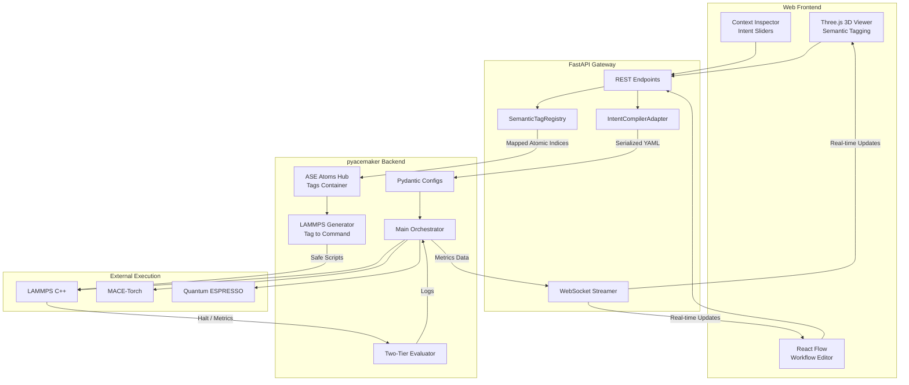

# System Architecture: Adaptive-MLIP GUI Integration

## 1. Summary

The Adaptive Machine Learning Interatomic Potentials (adaptive-mlip) project is evolving from a strictly backend orchestrator into a next-generation materials informatics platform featuring a cutting-edge Graphical User Interface (GUI). This new interface transforms complex Command Line Interface (CLI) scripts and highly technical Python programming paradigms into an intuitive, web-based visual experience. The primary goal is to empower non-expert engineers and experimental researchers to successfully execute highly advanced Molecular Dynamics (MD), Density Functional Theory (DFT), and Machine Learning Interatomic Potential (MLIP) workflows—specifically MACE, CHGNet, and M3GNet fine-tuning—without requiring deep domain knowledge of simulation syntax, hyperparameter tuning, or computational environment management. This document meticulously outlines the architectural strategy required to seamlessly integrate this modern React/Three.js-based GUI with the existing highly robust Python backend orchestrator. This architecture guarantees strict backward compatibility, ensuring existing CLI workflows remain entirely unaffected while seamlessly expanding accessibility to a significantly broader audience.

## 2. System Design Objectives

The architectural design of the adaptive-mlip GUI integration is strictly governed by a set of highly specific objectives intended to solve the "Leaky Abstractions" problem frequently encountered in existing computational materials science software. The core philosophy is to transition from a syntax-driven workflow to an intent-driven (Domain-Driven Design) experience. The primary method for achieving this is to protect the existing high-performance numerical engines and instead build a strict translation gateway layer between the user inputs and the system configuration.

**2.1 Intent-Driven Configuration Abstraction**
The primary objective is to absolutely eliminate the necessity for the user to directly interact with low-level simulation parameters, such as specific LAMMPS `fix` commands, exact timestep intervals for output dumps, or machine learning optimizer `learning_rate` settings. The GUI must translate high-level user intents—for example, a user requesting "Simulate gas diffusion on a Pt-Ni surface at 500K with moderate precision"—into strictly valid, highly optimized Pydantic configuration schemas (`MDConfig`) that the existing `pyacemaker` backend can natively consume. This requires the development of an intelligent compiler layer. This layer will act as a strict firewall; it takes simple JSON payloads defining the user's intent, validates the types, mathematically computes the necessary low-level parameters, and outputs a complete configuration object. This ensures the backend engine never processes arbitrary or malicious string inputs from the frontend.

**2.2 Smart Trade-Off Management via Single-Axis Control**
Active learning workflows inherently involve complex, often counter-intuitive trade-offs between computational speed and physical accuracy. For example, determining exactly how frequently to trigger expensive Density Functional Theory (DFT) recalculations involves setting specific MACE uncertainty thresholds and sampling intervals. Exposing these individual mathematical thresholds directly to the user leads to extreme cognitive load, improper configurations, and frequent simulation failures. The architecture must introduce a unified "Accuracy vs. Speed" slider on the frontend. The backend must map this single continuous variable (e.g., a float from 1.0 to 10.0) to appropriate nonlinear combinations of thresholds using predefined, strictly validated empirical functions embedded within the core logic. By condensing a dozen distinct variables into a single semantic axis, the system empowers the user to manage their computational budget without needing a Ph.D. in Bayesian statistics.

**2.3 Visual Semantic State Management and Spatial Tagging**
Traditional text-based region definitions (e.g., utilizing LAMMPS `region` and `group` commands) are highly error-prone, particularly for complex topological structures like metal slabs with fixed bottom layers, intermediate thermostats, and dynamic surface interactions. The GUI will provide a sophisticated Three.js 3D viewer allowing users to visually select, slice, and tag specific atomic layers (e.g., painting atoms with the label "FREEZE" or "THERMOSTAT"). The architecture must reliably capture these visual selections, transmit them via the API, and seamlessly map them to the `tags` array within the underlying ASE (Atomic Simulation Environment) `Atoms` object. The backend's LAMMPS generator module will then strictly interpret these semantic tags to automatically construct mathematically perfect, conflict-free boundary conditions and region groups, preventing the runtime crashes typically associated with manual scripting errors.

**2.4 Real-Time Telemetry and Predictive Diagnostics**
Long-running active learning simulations require continuous, insightful monitoring to ensure convergence. The architecture must implement a high-performance, bidirectional WebSocket communication protocol to stream real-time metrics (e.g., neural network training loss, potential energy surfaces, and atomic uncertainty heatmaps) directly from the running simulation back to the GUI without causing synchronous blocking in the computational loop. Furthermore, the system must incorporate a critical "Preflight Check" (Run 0 Validation) mechanism. Before submitting an expensive, multi-hour job to a High-Performance Computing (HPC) cluster, the backend will perform an instantaneous, zero-step dry-run. This preflight checks for extreme geometry collisions (overlapping atoms generating infinite forces), missing forcefield parameters, and basic parsing errors. If anomalies are detected, it preemptively halts the submission and highlights the specific problematic atoms in the GUI, saving significant compute costs and user frustration.

**2.5 Strict Decoupling and API-First Design**
To ensure the long-term maintainability, testability, and scalability of the project, the frontend GUI must be strictly decoupled from the Python backend. The GUI will never directly manipulate internal Python state or execute shell commands. Instead, it will communicate exclusively via a robust REST API (FastAPI) utilizing serialized configuration payloads that are strictly validated via Pydantic. This API-first approach guarantees that the core orchestration engine (`pyacemaker`) remains entirely agnostic to the presentation layer. It can continue functioning flawlessly in headless HPC environments driven by YAML files, while simultaneously supporting rich interactive sessions via the web interface. This separation of concerns is non-negotiable for system security and stability.

## 3. System Architecture

The augmented adaptive-mlip architecture utilizes a modern, strictly layered Client-Server pattern. The system is designed to seamlessly integrate the new web-based frontend with the existing powerful Python orchestration engine, ensuring clear separation of concerns, robust data flow, and complete security against injection attacks. The core numerical engine remains pure and untouched, with all new functionality placed in isolated adapter and gateway modules.

### 3.1 Component Breakdown

1.  **Frontend Presentation Layer (React.js + Three.js / React Flow):**
    This layer provides the interactive visual interface and manages the user's intent state.
    *   **3D Interactive Viewer (Left Pane):** Built using Three.js (or NGLView), this component renders atomic structures, handles semantic spatial tagging (e.g., selecting fixed layers via bounding boxes), and displays real-time uncertainty heatmaps during On-The-Fly (OTF) execution.
    *   **Workflow Editor (Bottom Pane):** Built using React Flow, this component allows users to visually construct execution Directed Acyclic Graphs (DAGs) (e.g., chaining [Initial Structure] -> [Base MLIP] -> [Active Learning Loop]).
    *   **Context Inspector (Right Pane):** Provides intent-based controls, specifically the critical "Accuracy vs. Speed" slider and material selection dropdowns, abstracting away the complex numerical parameters required by the backend.

2.  **API Gateway & Translation Layer (FastAPI):**
    This new critical component acts as the secure, type-checked bridge between the frontend and the core orchestrator.
    *   **Intent Compiler Adapter:** Receives high-level JSON intent payloads from the GUI and precisely translates them into strictly typed `MDConfig` or `WorkflowConfig` Pydantic schemas using defined mathematical mapping functions.
    *   **State Manager Adapter:** Exposes RESTful endpoints for saving, loading, and modifying serialized YAML configuration files, acting as the centralized Single Source of Truth for the current simulation state.
    *   **WebSocket Streamer:** Interfaces with the existing `IoManager` or execution callbacks to asynchronously push real-time telemetry (energy metrics, loss curves, updated atomic trajectories) to the frontend clients without blocking the main event loop.

3.  **Core Orchestration Engine (Existing `pyacemaker` Backend):**
    The highly robust, existing numerical execution engine remains largely unchanged but receives the perfectly validated outputs from the API gateway.
    *   **Configuration Schemas (Pydantic):** The existing strict schemas (e.g., `MDConfig`) remain the definitive source of truth for the execution loop.
    *   **ASE Data Hub:** The central data structure (`ase.Atoms`) is utilized, specifically leveraging the `tags` property to carry the semantic integer values assigned by the GUI mapping.
    *   **LAMMPS Script Generator:** A newly enhanced compiler module, the `SemanticTagRegistry`, that reads the ASE `tags` to automatically and safely generate complex LAMMPS `region`, `group`, and `fix` commands without any manual user intervention or text parsing.
    *   **Execution Drivers:** The existing `LammpsDriver`, `QEDriver`, and `MaceManager` execute the underlying C++ computational workloads precisely as before.

### 3.2 Data Flow and Boundary Management

1.  **Configuration Flow:** The user interacts with the GUI components (sliders, toggles). The GUI generates a simplified JSON intent payload (e.g., `GuiIntentConfig`). The FastAPI Gateway receives this payload. The `IntentCompilerAdapter` translates the simple intents into a complex, strictly validated Pydantic `MDConfig` model. This model is serialized to a `config.yaml` state file, and the Orchestrator initializes based on this file.
2.  **Structural Tagging Flow:** The user visually selects a group of atoms in the Three.js viewer. The GUI sends the list of atomic indices and a string semantic label (e.g., "FREEZE") to the API. The `SemanticTagRegistry` maps the string to a specific integer and updates the ASE `Atoms` object in memory. When the simulation starts, the LAMMPS Generator transpiles these integer tags into safe, conflict-free text commands, which the `LammpsDriver` then executes.
3.  **Telemetry Flow:** As the `LammpsEngine` steps forward, a Python callback (triggered via `fix python/invoke`) retrieves forces and uncertainty metrics. The Core engine logs these to the SQLite database. The WebSocket Streamer detects the update and asynchronously pushes a tiny JSON metric payload to the React Frontend, which updates the Loss Curve graphs and the Three.js visual heatmap.

### 3.3 Mermaid Diagram



## 4. Design Architecture

To cleanly support the GUI requirements without polluting the core logic, the codebase will be extended with clear boundary definitions. The existing `src/pyacemaker/` structure will incorporate new API and semantic compilation modules. The core numerical execution engine is preserved entirely intact, guaranteeing that the highly sensitive molecular dynamics loops are isolated from web request handling.

### 4.1 File Structure

```ascii
pyacemaker/
├── src/pyacemaker/
│   ├── api/                   # NEW: FastAPI interface for the GUI
│   │   ├── app.py             # Main FastAPI application and routing
│   │   ├── routers/           # Endpoint definitions (config, structure, execution)
│   │   └── websockets.py      # Real-time telemetry streaming architecture
│   ├── compilers/             # NEW: Translates intents to backend structures
│   │   ├── intent_mapper.py   # Contains `IntentCompilerAdapter` (Maps UI sliders to Pydantic thresholds)
│   │   └── lammps_tag_gen.py  # Contains `SemanticTagRegistry` (Translates ASE tags to LAMMPS region/group syntax)
│   ├── core/                  # EXISTING: Core orchestration
│   ├── domain_models/         # EXISTING/EXTENDED: Pydantic schemas
│   │   ├── gui_intents.py     # NEW: Schemas representing frontend UI states (`GuiIntentConfig`)
│   │   ├── config.py          # EXTENDED: Core config updated to accept mapped values
│   ├── interfaces/            # EXISTING: Software drivers (LAMMPS, QE)
│   ├── utils/                 # EXISTING: Utilities
│   └── main.py                # EXISTING: CLI entrypoint (remains intact)
├── tests/                     # Test suites
│   ├── api/                   # NEW: API endpoint tests
│   └── compilers/             # NEW: Intent mapping tests
├── pyproject.toml
└── README.md
```

### 4.2 Core Domain Pydantic Models and Extension Strategy

The critical design principle is to never force the frontend to understand the complex backend `MDConfig` directly. Instead, we introduce intermediary `Intent` schemas. This heavily protects the core domain models from being compromised by incomplete or improperly formatted JSON requests from the client.

**New Schema: `GuiIntentConfig`**
This schema strictly represents the user's high-level selections from the web interface. It acts as the Data Transfer Object (DTO) for the API.

```python
from pydantic import BaseModel, Field

class SimulationIntent(BaseModel):
    target_material: str = Field(..., description="System identifier, e.g., 'Pt-Ni'")
    accuracy_speed_ratio: float = Field(..., ge=1.0, le=10.0, description="1=Speed, 10=Accuracy")
    target_temperature: float = Field(..., gt=0.0)

class TaggedRegion(BaseModel):
    indices: list[int]
    semantic_label: str # e.g., "FREEZE", "THERMOSTAT", "ACTIVE"
```

**Integration with Existing Schemas**
The `IntentCompilerAdapter` class acts as a Factory. It ingests the `GuiIntentConfig` and outputs the strictly typed existing backend models (e.g., `MDConfig`).

```python
# Pseudo-code for IntentCompilerAdapter
class IntentCompilerAdapter:
    @staticmethod
    def compile_intent_to_config(intent: SimulationIntent) -> MDConfig:
        # Non-linear mapping logic to map the 1-10 slider to MACE thresholds
        # Example: A higher accuracy ratio results in a exponentially tighter threshold
        mace_threshold = base_threshold * (11.0 - intent.accuracy_speed_ratio) * 0.1
        sampling_interval = max(1, int(100 / intent.accuracy_speed_ratio))

        # Construct and return the strictly-validated MDConfig
        return MDConfig(
            mace_uncertainty_threshold=mace_threshold,
            dft_sampling_steps=sampling_interval,
            temperature=intent.target_temperature
        )
```
This guarantees that the existing backend models are never compromised by weak frontend types, maintaining complete backwards compatibility. The explicit translation effectively prevents arbitrary parameter injection, ensuring that even if the API receives unexpected data, it will fail at the Pydantic validation boundary before ever reaching the LAMMPS or MACE execution engines.

## 5. Implementation Plan

The project is strictly decomposed into exactly 6 sequential implementation cycles. This ensures a stable progression from foundation building to full feature delivery. These cycles are designed to be implemented sequentially, with clear interface boundaries that prevent circular dependencies.

1.  **Cycle 01: API Foundation & Intent Schemas**
    *   **Objective:** Establish the secure FastAPI gateway and the data transfer objects.
    *   **Tasks:** Initialize the FastAPI application skeleton within `src/pyacemaker/api/`. Define the highly strict Pydantic models for frontend interaction (`GuiIntentConfig`, `SimulationIntent`, `TaggedRegion`) in `src/pyacemaker/domain_models/gui_intents.py`. Implement basic REST endpoints (e.g., `POST /api/v1/intents/compile`) for validating and accepting these intent payloads without executing them (Dry-Run API).
    *   **Deliverable:** A running FastAPI server that can receive JSON intent payloads and validate them against the `GuiIntentConfig` schema, returning 422 Unprocessable Entity errors for invalid data.

2.  **Cycle 02: Intent Compiler Engine**
    *   **Objective:** Build the translation logic connecting user intents to physical simulation parameters.
    *   **Tasks:** Develop the `IntentCompilerAdapter` class in `src/pyacemaker/compilers/intent_mapper.py`. Implement the mathematical non-linear mapping functions that convert the 1-10 "Accuracy vs Speed" slider into precise backend thresholds (e.g., MACE uncertainty cutoffs, soft-start steps, DFT sampling frequencies). Ensure the compiler accurately instantiates existing core `MDConfig` objects strictly from intent payloads.
    *   **Deliverable:** The `compile_intent_to_config` method that reliably outputs complex, valid `MDConfig` instances based purely on simple slider inputs.

3.  **Cycle 03: Semantic Spatial Tagging System**
    *   **Objective:** Automate the generation of LAMMPS spatial constraints.
    *   **Tasks:** Develop the `SemanticTagRegistry` within the `lammps_tag_gen.py` compiler. Implement the logic to map semantic strings (e.g., "FREEZE" -> tag `1`, "THERMOSTAT" -> tag `2`) and securely inject these integer tags into the ASE `Atoms.tags` property. Implement the automated translation engine that reads these ASE tags and safely generates complex LAMMPS `region`, `group`, and `fix setforce 0.0` commands, strictly validating against shell injection vulnerabilities.
    *   **Deliverable:** A generator function that consumes an ASE `Atoms` object with integer tags and returns a perfectly formatted block of LAMMPS scripting code.

4.  **Cycle 04: Preflight Validation (Run 0 Diagnostics)**
    *   **Objective:** Implement the zero-step safety check endpoint to prevent expensive crashes.
    *   **Tasks:** Implement the "Run 0" preflight diagnostic endpoint (e.g., `POST /api/v1/execute/preflight`) in the API. Develop a fast initialization pathway within the core orchestrator that explicitly executes `LammpsDriver.run_preflight()` using a temporary directory. This run will execute exactly zero steps to evaluate initial forces and check for missing forcefield parameters or extreme geometry collisions. Format diagnostic outputs (warnings, errors) into a structured JSON payload suitable for rendering in the GUI's right pane.
    *   **Deliverable:** An API endpoint that can catch an overlapping structure and return an "Atomic Collision Detected" JSON response without hanging the server.

5.  **Cycle 05: WebSocket Telemetry Streaming**
    *   **Objective:** Enable real-time, non-blocking monitoring of the simulation via the web GUI.
    *   **Tasks:** Integrate the `websockets` library into the FastAPI application (`src/pyacemaker/api/websockets.py`). Define the strict streaming data schema (e.g., `{"step": int, "energy": float, "mace_uncertainty_max": float}`). Modify the existing `IoManager` or LAMMPS execution callbacks within the core engine to safely broadcast tiny JSON metric packets asynchronously during long-running tasks. Establish a robust broadcast/subscription model ensuring no memory leaks occur when clients disconnect.
    *   **Deliverable:** A WebSocket endpoint that continuously streams the current simulation step and energy metrics while the backend LAMMPS engine is running.

6.  **Cycle 06: Interactive Tutorial & Final Integration**
    *   **Objective:** Validate the entire end-to-end user experience and provide executable documentation.
    *   **Tasks:** Finalize the end-to-end integration by connecting the API endpoints to a mock frontend environment. Develop the comprehensive `tutorials/UAT_AND_TUTORIAL.py` Marimo notebook to interactively execute and strictly validate the complete GUI-backend workflow (Tagging, Intent Compilation, and Preflight Execution). Ensure that the notebook uses mocked computational drivers so that no external HPC compute is required to pass the CI pipeline.
    *   **Deliverable:** A fully executable Marimo notebook that demonstrates the spatial tagging and intent slider workflows, verifying that the generated LAMMPS scripts and configuration objects are perfectly correct.

## 6. Test Strategy

Testing must ensure the new API layer and semantic compilers operate flawlessly without introducing regressions into the core numerical engine. Tests will heavily rely on dependency injection, mock classes, and isolated execution environments to guarantee rapid, deterministic feedback during CI runs.

1.  **Cycle 01 (API Foundation):**
    *   **Unit Tests:** Use `FastAPI.TestClient` to test route accessibility and HTTP response codes. Verify that valid JSON payloads return 200 OK, while invalid payloads (e.g., missing fields, negative temperatures) are strictly rejected by Pydantic validation, returning 422 Unprocessable Entity. These tests confirm the secure boundary of the API gateway.
2.  **Cycle 02 (Intent Compiler):**
    *   **Unit Tests:** Create extensive parameter-sweep tests to verify the non-linear mathematical mapping. Input a range of slider values from 1.0 to 10.0 and assert that the output MACE thresholds exactly match the expected mathematical curves encoded within the `IntentCompilerAdapter`. Because this is purely mathematical logic, no external services, file I/O, or database connections are required for these tests.
3.  **Cycle 03 (Semantic Tagging):**
    *   **Integration Tests:** Feed mock GUI tag definitions (lists of indices and semantic strings) into the `SemanticTagRegistry` to tag a dummy ASE `Atoms` object. Pass this object to the LAMMPS generator and assert that the resulting script string precisely contains the correct `group` and `fix` syntaxes associated with those tags. Utilize regex matching to verify the command generation safely avoids injection vulnerabilities, such as ensuring no semicolons or shell variables are accidentally injected into the group names.
4.  **Cycle 04 (Preflight Validation):**
    *   **Integration Tests:** Construct an intentionally malformed configuration containing two atoms overlapping at a distance of 0.1 Angstroms. Execute the Preflight endpoint via the `TestClient`. Assert that the endpoint accurately catches the high-energy state and returns a structured diagnostic failure payload (e.g., `{"status": "error", "message": "Atomic Collision Detected"}`) rather than crashing the Python process or hanging indefinitely in a failed execution loop.
5.  **Cycle 05 (Telemetry Streaming):**
    *   **Unit/Integration Tests:** Use the `pytest-asyncio` library to connect a mock asynchronous client to the WebSocket endpoint. Programmatically trigger a mocked LAMMPS step event within the backend orchestration loop. Assert that the mock client successfully receives the precisely formatted JSON metric payload within a strict 1-second timeout limit. Ensure the connection can be closed safely without leaving zombie connections on the server.
6.  **Cycle 06 (Interactive Tutorial):**
    *   **E2E Tests:** Execute the `tutorials/UAT_AND_TUTORIAL.py` Marimo file strictly in headless mode via `uv run python`. Assert that the script successfully completes from end-to-end—simulating a user submitting a GUI intent, the API compiling it, and a successful preflight initialization—without throwing any unhandled exceptions. To guarantee zero side-effects on the host system, ensure that the execution environment uses temporary directories (via `pytest`'s `tmp_path` fixture) for all file I/O operations, such as configuration serialization and mock log writing.